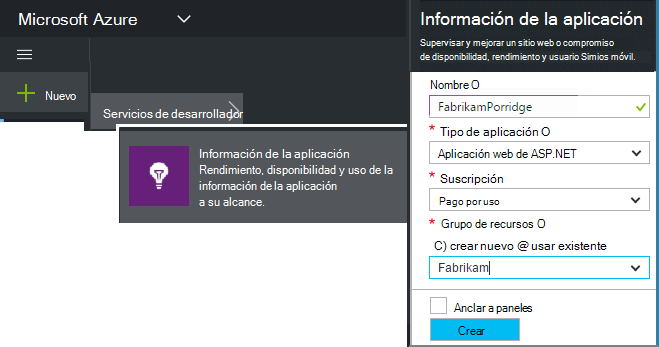
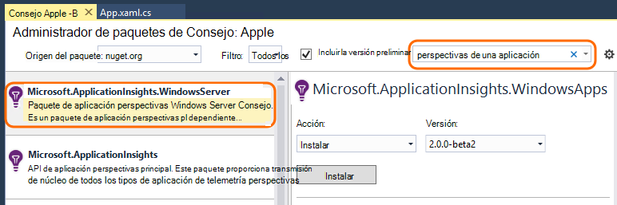
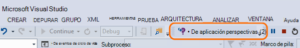
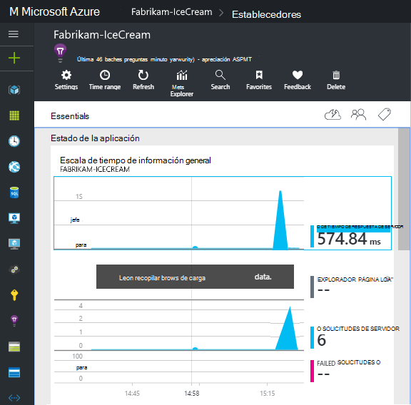
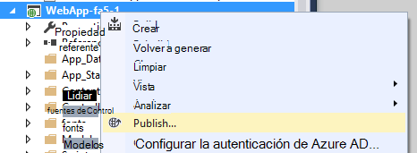

<properties
    pageTitle="Servicios de aplicación perspectivas para Windows y roles de trabajo | Microsoft Azure"
    description="Agregar manualmente el SDK de perspectivas de aplicación a la aplicación de ASP.NET para analizar el rendimiento, la disponibilidad y el uso."
    services="application-insights"
    documentationCenter=".net"
    authors="alancameronwills"
    manager="douge"/>

<tags
    ms.service="application-insights"
    ms.workload="tbd"
    ms.tgt_pltfrm="ibiza"
    ms.devlang="na"
    ms.topic="get-started-article"
    ms.date="08/30/2016"
    ms.author="awills"/>

# Configurar manualmente las perspectivas de aplicación para las aplicaciones de ASP.NET 4

*Información de la aplicación está en vista previa.*

[AZURE.INCLUDE [app-insights-selector-get-started](../../includes/app-insights-selector-get-started.md)]

Puede configurar manualmente las [Perspectivas de aplicación de Visual Studio](app-insights-overview.md) para supervisar servicios de Windows, los roles de trabajo y otras aplicaciones de ASP.NET. Para las aplicaciones web, configuración manual es una alternativa a la [configuración automática](app-insights-asp-net.md) ofrecidas por Visual Studio.

Información de la aplicación le ayuda a diagnosticar problemas y supervisar el rendimiento y el uso de la aplicación activa.

#### Antes de empezar

Te hace falta:

* Una suscripción a [Microsoft Azure](http://azure.com). Si su equipo o la organización tiene una suscripción de Azure, el propietario puede agregar, con su [cuenta de Microsoft](http://live.com).
* Visual Studio 2013 o posterior.

## 1. crear un recurso de aplicación perspectivas

Inicie sesión en el [portal de Azure](https://portal.azure.com/)y crear un nuevo recurso de información de la aplicación. Elija ASP.NET como el tipo de aplicación.

Un [recurso](app-insights-resources-roles-access-control.md) en Azure es una instancia de un servicio. Este recurso es donde se analizan y le presenta telemetría desde la aplicación.

La opción de tipo de aplicación establece el contenido predeterminado de los módulos de recursos y las propiedades visibles en el [Explorador de métricas](app-insights-metrics-explorer.md).

#### Copie la clave de instrumentación

La clave identifica el recurso y, a continuación, deberá instalar pronto en el SDK para dirigir los datos al recurso.

Los pasos que acaba de realizar para crear un nuevo recurso son una buena manera de iniciar la supervisión de cualquier aplicación. Ahora puede enviar datos a ella.

## 2. instalar el SDK de la aplicación

Instalar y configurar el SDK de perspectivas aplicación varían dependiendo de la plataforma que está trabajando. Para las aplicaciones ASP.NET, es fácil.

1. En Visual Studio, edite los paquetes de NuGet de su proyecto de aplicación web.

    

2. Instalar aplicación perspectivas SDK para aplicaciones Web.

    

    *¿Puedo usar otros paquetes?*

    Sí. Elija la API de núcleo (Microsoft.ApplicationInsights) si desea usar la API para enviar su propio telemetría. El paquete de Windows Server incluye automáticamente la API principal de más de un número de otros paquetes como colección de contador de rendimiento y la supervisión de dependencia. 

#### Actualizar a futuras versiones SDK

Lanzamiento de vez en cuando una nueva versión del SDK.

Para actualizar a una [nueva versión del SDK](https://github.com/Microsoft/ApplicationInsights-dotnet-server/releases/), abra el nuevo administrador de paquetes de NuGet y filtro de paquetes instalados. Seleccione **Microsoft.ApplicationInsights.Web** y elija **Actualizar**.

Si ha realizado personalizaciones en ApplicationInsights.config, guardar una copia antes de actualizar y después combinar los cambios en la nueva versión.

## 3. enviar telemetría

**Si ha instalado el paquete de la API principal:**

* Establecer la clave de instrumentación en el código, por ejemplo en `main()`: 

    `TelemetryConfiguration.Active.InstrumentationKey = "`*la clave*`";` 

* [Escribir su propio con la API de telemetría](app-insights-api-custom-events-metrics.md#ikey).

**Si ha instalado otros paquetes perspectivas de aplicación,** puede, si lo prefiere, utilice el archivo de configuración para establecer la clave de instrumentación:

* Editar ApplicationInsights.config (que se agregó por la instalación de NuGet). Insertar este justo antes de la etiqueta de cierre:

    `<InstrumentationKey>`*la clave de instrumentación que copió*`</InstrumentationKey>`

* Asegúrese de que las propiedades de ApplicationInsights.config en el Explorador de soluciones **Generar acción = contenido, copiar en el directorio de salida = copia**.

## Ejecute el proyecto

Utilice la **F5** para ejecutar la aplicación y probar: abrir páginas diferentes para generar algunos telemetría.

En Visual Studio, verá un recuento de los eventos que se han enviado.

## Ver la telemetría

Vuelva al [portal de Azure](https://portal.azure.com/) y busque el recurso de información de la aplicación.

Buscar datos en los gráficos de información general. En primer lugar, solo verá uno o dos puntos. Por ejemplo:

Haga clic en cualquier gráfico para ver más métricas. [Más información sobre cómo métricas.](app-insights-web-monitor-performance.md)

#### ¿Sin datos?

* Usar la aplicación, abrir páginas diferentes para que genera algunos telemetría.
* Abra la ventana de [búsqueda](app-insights-diagnostic-search.md) para ver los eventos individuales. A veces tarda eventos algo de tiempo ya para obtener a través de la canalización de métricas.
* Espere unos segundos y haga clic en **Actualizar**. Gráficos propios actualización periódicamente, pero puede actualizar manualmente si está esperando algunos datos para mostrarse.
* Vea [solución de problemas](app-insights-troubleshoot-faq.md).

## Publicar su aplicación

Ahora implementar la aplicación en el servidor o en Azure y ver los datos se acumulan.

Cuando se ejecuta en modo de depuración, telemetría se ha agilizado a través de la canalización, por lo que debería ver los datos que aparecen en pocos segundos. Cuando se implementa la aplicación de la configuración de lanzamiento, se acumulan más despacio.

#### ¿Sin datos después de publicar en el servidor?

Abrir estos puertos para el tráfico saliente de firewall del servidor:

+ `dc.services.visualstudio.com:443`
+ `f5.services.visualstudio.com:443`

#### ¿Problemas en el servidor de generación?

Consulte [este artículo de solución de problemas](app-insights-asp-net-troubleshoot-no-data.md#NuGetBuild).

> [AZURE.NOTE]Si su aplicación genera una gran cantidad de telemetría (y el uso de la 2.0.0-beta3 de la versión de ASP.NET SDK o posterior), el módulo de muestreo adaptación reducirá automáticamente el volumen que se envía al portal enviando sólo una fracción representante de eventos. Sin embargo, los eventos relacionados con la misma solicitud se activarse o desactivarse como un grupo, para que pueda desplazarse entre los eventos relacionados. 
> [Obtenga información sobre muestreo](app-insights-sampling.md).

## Pasos siguientes

* [Agregar más de telemetría](app-insights-asp-net-more.md) para obtener la vista de 360 grados completa de la aplicación.

