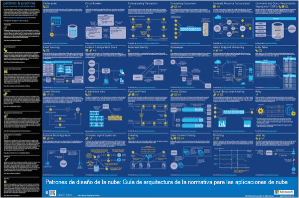
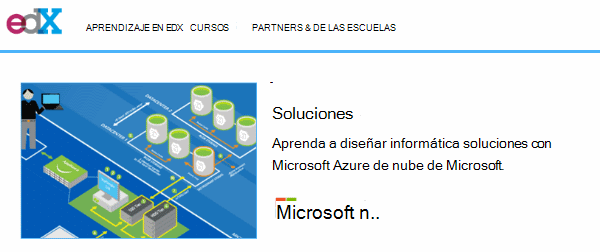
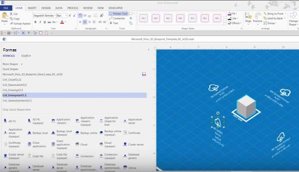
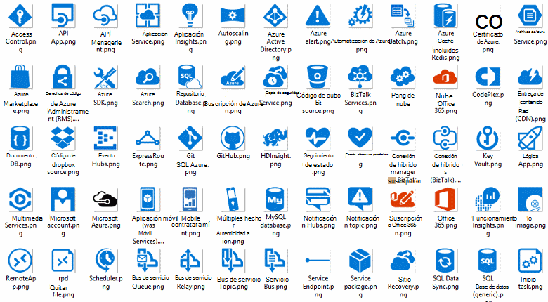
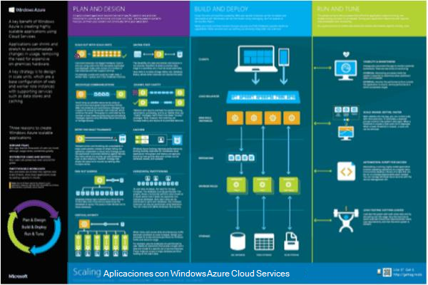

<properties 
    pageTitle="Arquitectura de la aplicación en Microsoft Azure | Microsoft Azure" 
    description="Introducción a la arquitectura que cubre los patrones de diseño comunes" 
    services="" 
    documentationCenter="" 
    authors="Rboucher" 
    manager="jwhit" 
    editor="mattshel"/>

<tags 
    ms.service="multiple" 
    ms.workload="na" 
    ms.tgt_pltfrm="na" 
    ms.devlang="na" 
    ms.topic="article" 
    ms.date="09/13/2016" 
    ms.author="robb"/>

#Arquitectura de la aplicación en Microsoft Azure
Recursos para crear aplicaciones que usen Microsoft Azure. Esto incluye herramientas para ayudarle a dibujar diagramas para describir visualmente los sistemas de software. 

##Póster de patrones de diseño

Prácticas y patrones de Microsoft ha publicado la libreta de [Patrones de diseño de la nube](http://msdn.microsoft.com/library/dn568099.aspx) que se encuentra disponible en MSDN y en descarga PDF. También es un póster de formato grande que enumera todos los patrones. 

##Curso de certificación de arquitectura de Microsoft

Un curso de arquitectura auxiliares Microsoft examen de certificación 70-534 había creado por Microsoft. Está [disponible de forma gratuita en EDX.ORG](https://www.edx.org/course/architecting-microsoft-azure-solutions-microsoft-dev205x).  Utiliza la [Plantilla de Visio plano 3D](#3d-blueprint-visio-template). 

##Soluciones de Microsoft

Microsoft publica un conjunto de alto nivel [arquitecturas de solución](http://aka.ms/azblueprints) que muestra cómo crear tipos específicos de sistemas con productos de Microsoft. 

Anteriormente, Microsoft publica un conjunto de proyectos que muestra arquitecturas de ejemplo. Los que se han reemplazado por las arquitecturas de solución mencionadas anteriormente y el vínculo de la guía se ha redirigido que apunte a ellas. Si necesita acceso a los materiales de planos anterior por algún motivo, correo electrónico [CnESymbols@microsoft.com](mailto:CnESymbols@microsoft.com) con su solicitud.   

Los planos y diagramas de arquitecturas de solución utilizan partes de la [nube y Enterprise símbolo establecido](#Drawing-symbol-and-icon-sets).   

##Plantilla de Visio plano 3D

Las versiones 3D de la ahora inactivo [Planos de arquitectura de Microsoft](http://aka.ms/azblueprints) inicialmente se crearon en una herramienta. Una plantilla de Visio 2013 (y posterior) que se incluye en el 5 de agosto de 2015 como parte de un [curso de certificación de arquitectura de Microsoft distribuidas en EDX.ORG](#microsoft-architecture-certification-course).

La plantilla también está disponible fuera del curso. 

- [Ver el vídeo de formación](http://aka.ms/3dBlueprintTemplateVideo) primero para que sepa lo que puede hacer   
- Descargar el [Microsoft 3d plantilla de Visio guía](http://aka.ms/3DBlueprintTemplate)
- Descargue la [nube y símbolos de la empresa](#drawing-symbol-and-icon-sets) para utilizar con la plantilla 3D. 

Un correo electrónico a [CnESymbols@microsoft.com](mailto:CnESymbols@microsoft.com) para preguntas específicas no respondidas por los materiales de formación o para proporcionar comentarios. La plantilla ya no está en desarrollo activo, pero es todavía útil y relevante porque puede utilizar cualquier PNG o la [nube y símbolos de empresa](#drawing-symbol-and-icon-sets), que se actualizan.  

##Conjuntos de símbolo e icono de dibujo 

[Ver la Visio y símbolos de vídeo de aprendizaje](http://aka.ms/CnESymbolsVideo) y, a continuación, [Descargue la nube y establecer el símbolo de la empresa](http://aka.ms/CnESymbols) para facilitar la creación de materiales técnicos describen Azure, Windows Server, SQL Server y mucho más. Puede usar los símbolos de diagramas de arquitectura, materiales de aprendizaje, presentaciones, hojas de datos, infographics, notas del producto y libros de terceros 3er incluso si el libro forma personas para productos de Microsoft. Sin embargo, no están diseñados para su uso en interfaces de usuario.

Los símbolos de CnE están en formato de Visio, SVG y PNG. Para obtener más instrucciones sobre cómo usar fácilmente utilizan los símbolos de PowerPoint se incluyen en el conjunto. 

El conjunto de símbolo incluye trimestral y se actualiza cuando se publican nuevos servicios. 

Símbolos adicionales para Microsoft Office y tecnologías relacionadas están disponibles en la [Galería de símbolos de Microsoft Office Visio](http://www.microsoft.com/en-us/download/details.aspx?id=35772), aunque no están optimizados para diagramas de arquitectura como el conjunto de CnE.   

**Comentarios:** Si ha usado los símbolos de CnE, rellene la 5 pregunta breve [encuesta](http://aka.ms/azuresymbolssurveyv2) o un correo electrónico a [CnESymbols@microsoft.com](mailto:CnESymbols@microsoft.com) para preguntas y problemas. Nos gustaría conocer su opinión, incluidos positivo comentarios para saber para continuar invertir el tiempo en ellos. 

##Arquitectura Infographics

Microsoft publica varias arquitectura relacionados carteles o infographics. Incluyen [Aplicaciones de nube de creación reales](https://azure.microsoft.com/documentation/infographics/building-real-world-cloud-apps/) y [escala con los servicios en la nube](https://azure.microsoft.com/documentation/infographics/cloud-services/) . 

