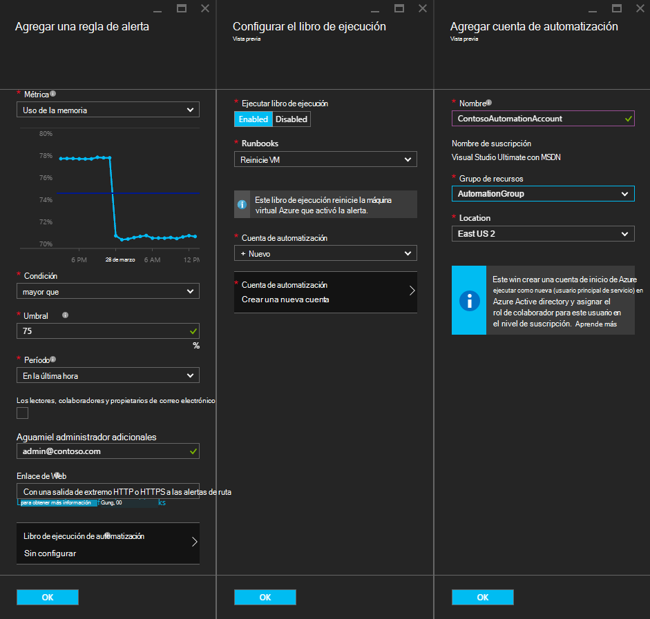
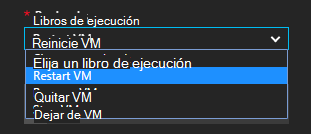
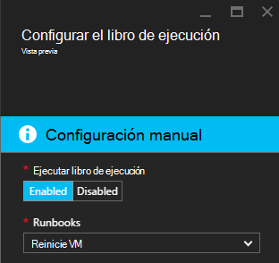
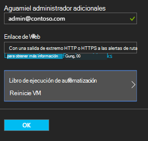

<properties
    pageTitle=" Corregir las alertas de Azure VM con automatización Runbooks | Microsoft Azure"
    description="Este artículo explica cómo integrar alertas de máquina Virtual de Azure con automatización de Azure runbooks y problemas de corrección automática"
    services="automation"
    documentationCenter=""
    authors="mgoedtel"
    manager="jwhit"
    editor="tysonn" />    
<tags
    ms.service="automation"
    ms.devlang="na"
    ms.topic="article"
    ms.tgt_pltfrm="na"
    ms.workload="infrastructure-services"
    ms.date="06/14/2016"
    ms.author="csand;magoedte" />

# <a name="azure-automation-scenario---remediate-azure-vm-alerts"></a>Escenario de automatización de Azure - corregir las alertas de Azure VM

Automatización de Azure y máquinas virtuales de Azure ha publicado una nueva característica de lo que le permite configurar alertas de máquina Virtual (VM) para ejecutar runbooks de automatización. Esta nueva capacidad permite realizar automáticamente la corrección estándar en respuesta a las alertas VM, como reiniciar o detener la máquina virtual.

Anteriormente, durante la creación de la regla de alerta de VM podía para [especificar un webhook de automatización](https://azure.microsoft.com/blog/using-azure-automation-to-take-actions-on-azure-alerts/) a un runbook para poder ejecutar runbook cada vez que se activa la alerta. Sin embargo, esto necesario realizar el trabajo de crear runbook, crear la webhook para runbook y, a continuación, copiar y pegar el webhook durante la creación de la regla de alerta. Con esta nueva versión, el proceso es mucho más fácil, porque puede elegir un runbook directamente desde una lista durante la creación de la regla de alerta, y puede elegir una cuenta de automatización que se ejecuten runbook o crear fácilmente una cuenta.

En este artículo, le mostraremos lo fácil que es una alerta de Azure VM y configurar un runbook de automatización para que se ejecute cada vez que se activa la alerta. Escenarios de ejemplo incluyen reiniciar una máquina virtual cuando el uso de la memoria supera algunas umbral debido a una aplicación en la máquina virtual con una pérdida de memoria o detener una máquina virtual cuando el tiempo de usuario de CPU ha sido inferior al 1% de última hora y no está en uso. Explicaremos cómo la creación automática de un servicio principal en su cuenta de automatización simplifica el uso de runbooks en Azure corrección de alerta.

## <a name="create-an-alert-on-a-vm"></a>Crear una alerta en una máquina virtual

Siga estos pasos para configurar una alerta para iniciar un runbook cuando se ha alcanzado el límite.

>[AZURE.NOTE] Con esta versión, sólo se admiten máquinas virtuales de V2 y soporte técnico para clásica que próximamente se agregarán máquinas virtuales.  

1. Inicie sesión en el portal de Azure y haga clic en **máquinas virtuales de Windows**.  
2. Seleccione una de sus máquinas virtuales.  Aparecerá el módulo de paneles de la máquina virtual y el módulo de **configuración** a su derecha.  
3. En el módulo de **configuración** , en la sección supervisión seleccione **reglas de alerta**.
4. En el módulo de **reglas de alertas** , haga clic en **Agregar aviso**.

Esto abrirá la placa **Agregar una regla de alerta** , donde puede configurar las condiciones de la alerta y elegir entre una o todas estas opciones: enviar correo electrónico a alguien, use una webhook para reenviar el aviso a otro sistema o ejecutar un runbook de automatización en intento de respuesta para corregir el problema.

## <a name="configure-a-runbook"></a>Configurar un runbook

Para configurar un runbook para que se ejecute cuando se cumpla el umbral de alerta de VM, seleccione **Runbook de automatización**. En el módulo **runbook de configurar** , puede seleccionar runbook para ejecutar y la cuenta de automatización para ejecutar runbook.



>[AZURE.NOTE] En esta versión puede elegir entre tres runbooks que proporciona el servicio: reiniciar VM, VM detener o quitar VM (eliminar).  La capacidad para seleccionar otras runbooks o uno de sus propios runbooks estará disponible en una versión futura.



Después de seleccionar uno de los tres runbooks disponibles, aparece la lista desplegable de **cuenta de automatización** y puede seleccionar una cuenta de automatización que runbook se ejecutará como. Runbooks debe ejecutar en el contexto de una [cuenta de automatización](automation-security-overview.md) que está en su suscripción de Azure. Puede seleccionar una cuenta de automatización que ya ha creado, o puede tener una cuenta nueva de automatización creada para usted.

Autenticar la runbooks que se proporcionan en Azure con una entidad de seguridad del servicio. Si elige ejecutar runbook en uno de sus cuentas de automatización existentes, se creará automáticamente el servicio principal para usted. Si elige crear una nueva cuenta de automatización, a continuación, se creará automáticamente la cuenta y el servicio principal. En ambos casos, dos activos también se creará en la cuenta de automatización, un activo de certificado denominado **AzureRunAsCertificate** y un activo de conexión denominado **AzureRunAsConnection**. La runbooks usará **AzureRunAsConnection** para autenticar con Azure para realizar la acción de administración en la máquina virtual.

>[AZURE.NOTE] Servicio principal se crea en el ámbito de la suscripción y se ha asignado el rol de colaborador. Esta función es necesaria para la cuenta que tiene permiso para ejecutar la automatización runbooks para administrar máquinas virtuales de Azure.  La creación de una cuenta de autómata o principal del servicio es un evento único. Una vez que se creen, puede usar esa cuenta para ejecutar runbooks otras alertas de Azure VM.

Al hacer clic en **Aceptar** se configura la alerta y si ha seleccionado la opción para crear una nueva cuenta de automatización, se crea junto con el servicio principal.  Esto puede tardar algunos segundos en completarse.  



Una vez completada la configuración se muestra el nombre del runbook aparecen en el módulo de **Agregar una regla de alerta** .



Haga clic en **Aceptar** en **Agregar una regla de alerta** módulo y la regla de alerta, se creará y activar si la máquina virtual está en un estado de ejecución.

### <a name="enable-or-disable-a-runbook"></a>Habilitar o deshabilitar un runbook

Si tiene un runbook configurado para recibir una alerta, puede deshabilitar sin eliminar la configuración de runbook. Esto le permite conservar la alerta ejecutando y tal vez probar algunas de las reglas de alertas y, a continuación, volver a habilitar runbook.

## <a name="create-a-runbook-that-works-with-an-azure-alert"></a>Crear un runbook que funciona con una alerta de Azure

Al elegir un runbook como parte de una regla de alerta de Azure, runbook debe tener lógica en él para administrar los datos de alerta que se pasan a ella.  Cuando se configura un runbook en una regla de alerta, se crea un webhook para runbook; esa webhook se utiliza para iniciar runbook cada vez que se activa la alerta.  La llamada real para iniciar runbook es una solicitud de HTTP POST a la dirección URL de webhook. El cuerpo de la solicitud POST contiene un objeto con formato JSON que contiene propiedades útiles relacionados con la alerta.  Como puede ver a continuación, los datos de alerta contienen detalles como subscriptionID, resourceGroupName, resourceName y tipo de recurso.

### <a name="example-of-alert-data"></a>Ejemplo de datos de alerta
```
{
    "WebhookName": "AzureAlertTest",
    "RequestBody": "{
    \"status\":\"Activated\",
    \"context\": {
        \"id\":\"/subscriptions/<subscriptionId>/resourceGroups/MyResourceGroup/providers/microsoft.insights/alertrules/AlertTest\",
        \"name\":\"AlertTest\",
        \"description\":\"\",
        \"condition\": {
            \"metricName\":\"CPU percentage guest OS\",
            \"metricUnit\":\"Percent\",
            \"metricValue\":\"4.26337916666667\",
            \"threshold\":\"1\",
            \"windowSize\":\"60\",
            \"timeAggregation\":\"Average\",
            \"operator\":\"GreaterThan\"},
        \"subscriptionId\":\<subscriptionID> \",
        \"resourceGroupName\":\"TestResourceGroup\",
        \"timestamp\":\"2016-04-24T23:19:50.1440170Z\",
        \"resourceName\":\"TestVM\",
        \"resourceType\":\"microsoft.compute/virtualmachines\",
        \"resourceRegion\":\"westus\",
        \"resourceId\":\"/subscriptions/<subscriptionId>/resourceGroups/TestResourceGroup/providers/Microsoft.Compute/virtualMachines/TestVM\",
        \"portalLink\":\"https://portal.azure.com/#resource/subscriptions/<subscriptionId>/resourceGroups/TestResourceGroup/providers/Microsoft.Compute/virtualMachines/TestVM\"
        },
    \"properties\":{}
    }",
    "RequestHeader": {
        "Connection": "Keep-Alive",
        "Host": "<webhookURL>"
    }
}
```

Cuando el servicio de webhook de automatización recibe HTTP POST extrae los datos de alerta y pasa a runbook en el parámetro de entrada del runbook WebhookData.  A continuación se muestra un runbook de muestra que muestra cómo usar el parámetro WebhookData y extraer los datos de alerta y usarlo para administrar el recurso de Azure que activó la alerta.

### <a name="example-runbook"></a>Runbook de ejemplo

```
#  This runbook will restart an ARM (V2) VM in response to an Azure VM alert.

[OutputType("PSAzureOperationResponse")]

param ( [object] $WebhookData )

if ($WebhookData)
{
    # Get the data object from WebhookData
    $WebhookBody = (ConvertFrom-Json -InputObject $WebhookData.RequestBody)

    # Assure that the alert status is 'Activated' (alert condition went from false to true)
    # and not 'Resolved' (alert condition went from true to false)
    if ($WebhookBody.status -eq "Activated")
    {
        # Get the info needed to identify the VM
        $AlertContext = [object] $WebhookBody.context
        $ResourceName = $AlertContext.resourceName
        $ResourceType = $AlertContext.resourceType
        $ResourceGroupName = $AlertContext.resourceGroupName
        $SubId = $AlertContext.subscriptionId

        # Assure that this is the expected resource type
        Write-Verbose "ResourceType: $ResourceType"
        if ($ResourceType -eq "microsoft.compute/virtualmachines")
        {
            # This is an ARM (V2) VM

            # Authenticate to Azure with service principal and certificate
            $ConnectionAssetName = "AzureRunAsConnection"
            $Conn = Get-AutomationConnection -Name $ConnectionAssetName
            if ($Conn -eq $null) {
                throw "Could not retrieve connection asset: $ConnectionAssetName. Check that this asset exists in the Automation account."
            }
            Add-AzureRMAccount -ServicePrincipal -Tenant $Conn.TenantID -ApplicationId $Conn.ApplicationID -CertificateThumbprint $Conn.CertificateThumbprint | Write-Verbose
            Set-AzureRmContext -SubscriptionId $SubId -ErrorAction Stop | Write-Verbose

            # Restart the VM
            Restart-AzureRmVM -Name $ResourceName -ResourceGroupName $ResourceGroupName
        } else {
            Write-Error "$ResourceType is not a supported resource type for this runbook."
        }
    } else {
        # The alert status was not 'Activated' so no action taken
        Write-Verbose ("No action taken. Alert status: " + $WebhookBody.status)
    }
} else {
    Write-Error "This runbook is meant to be started from an Azure alert only."
}
```

## <a name="summary"></a>Resumen

Al configurar una alerta en una máquina virtual de Azure, ahora tienen la capacidad de configurar fácilmente un runbook de automatización para realizar automáticamente acciones de corrección cuando activa la alerta. En esta versión, puede elegir desde runbooks reiniciar, detener o eliminar una máquina virtual dependiendo de su situación alerta. Esto es solo el comienzo de la habilitación de escenarios donde puede controlar las acciones (notificación, solución de problemas, corrección) que irá automáticamente cuando se activa una alerta.

## <a name="next-steps"></a>Pasos siguientes

- Para empezar con runbooks gráfica, consulte [Mi primera runbook gráfica](automation-first-runbook-graphical.md)
- Para empezar con PowerShell runbooks de flujo de trabajo, consulte [Mi primera runbook de flujo de trabajo de PowerShell](automation-first-runbook-textual.md)
- Para obtener más información sobre tipos de runbook, sus ventajas y limitaciones, vea [tipos de runbook de automatización de Azure](automation-runbook-types.md)
