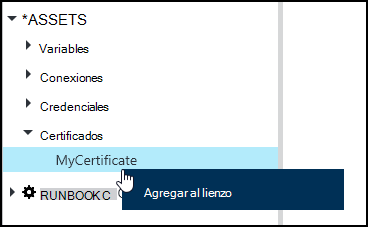
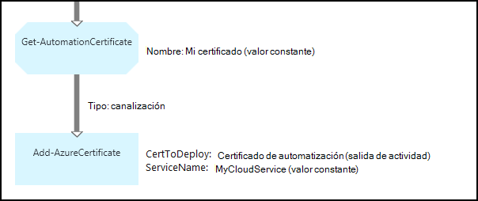

<properties 
   pageTitle="Certificado de activos en la automatización de Azure | Microsoft Azure"
   description="Se pueden almacenar certificados de forma segura en automatización de Azure para que sean accesibles por runbooks o configuraciones DSC autenticarse en Azure y recursos de terceros.  En este artículo se explica los detalles de los certificados y cómo trabajar con ellos en la creación de texto y gráficos."
   services="automation"
   documentationCenter=""
   authors="mgoedtel"
   manager="stevenka"
   editor="tysonn" />
<tags 
   ms.service="automation"
   ms.devlang="na"
   ms.topic="article"
   ms.tgt_pltfrm="na"
   ms.workload="infrastructure-services"
   ms.date="02/23/2016"
   ms.author="magoedte;bwren" />

# Certificado de activos en la automatización de Azure

Se pueden almacenar certificados segura en Azure automatización para que sean accesibles por runbooks o configuraciones DSC mediante la actividad de **Get-AutomationCertificate** . Esto le permite crear runbooks y configuraciones DSC que utilizan certificados para la autenticación o las agrega a recursos de Azure o de terceros.

>[AZURE.NOTE] Proteger los activos de automatización de Azure incluyen credenciales, certificados, conexiones y variables de cifrado. Estos activos se cifran y se almacenan en la automatización de Azure con una clave única que se genera para cada cuenta de automatización. Esta clave se cifra un certificado patrón y almacenada en automatización de Azure. Antes de almacenar un activo seguro, la clave para la cuenta de automatización se descifra con el certificado de patrón y, a continuación, se utiliza para cifrar el activo.

## Cmdlets de Windows PowerShell

Los cmdlets en la siguiente tabla se usan para crear y administrar activos de certificado de automatización con Windows PowerShell. Se envían como parte del [módulo de PowerShell de Azure](../powershell-install-configure.md) que está disponible para su uso en configuraciones de DSC y runbooks de automatización.

|Cmdlets de|Descripción|
|:---|:---|
|[Get-AzureAutomationCertificate](http://msdn.microsoft.com/library/dn913765.aspx)|Recupera información sobre un certificado. Sólo puede recuperar el propio certificado de actividad de Get-AutomationCertificate.|
|[Nueva AzureAutomationCertificate](http://msdn.microsoft.com/library/dn913764.aspx)|Importa un certificado nuevo en automatización de Azure.|
|[Quitar - AzureAutomationCertificate](http://msdn.microsoft.com/library/dn913773.aspx)|Quita un certificado de automatización de Azure.|
|[Set - AzureAutomationCertificate](http://msdn.microsoft.com/library/dn913763.aspx)|Establece las propiedades de un certificado existente como cargar el archivo de certificado y establezca la contraseña de un .pfx.|

## Actividades de acceso a los certificados

Las actividades en la siguiente tabla se usan para tener acceso a los certificados en una configuración de DLC o runbook.

|Actividades|Descripción|
|:---|:---|
|Get-AutomationCertificate|Obtiene un certificado para utilizarlo en una configuración de DLC o runbook.|

>[AZURE.NOTE] Evitar el uso de variables en el parámetro – nombre de Get-AutomationCertificate ya que esto puede dificultar descubrir dependencias entre runbooks o configuraciones DSC y activos de certificados en tiempo de diseño.

## Crear un nuevo certificado

Cuando se crea un nuevo certificado, cargue un archivo .cer o .pfx automatización de Azure. Si marca el certificado como puede exportar, puede transferir fuera del almacén de certificados de automatización de Azure. Si no está puede exportar, a continuación, solo se sirve para iniciar sesión en la configuración de DLC o runbook.

### Para crear un certificado nuevo con el portal de clásico de Azure

1. Desde su cuenta de automatización, haga clic en **activos** en la parte superior de la ventana.
1. En la parte inferior de la ventana, haga clic en **Agregar**.
1. Haga clic en **Agregar credenciales**.
2. En la lista desplegable **Tipo de credenciales** , seleccione el **certificado**.
3. Escriba un nombre para el certificado en el cuadro **nombre** y haga clic en la flecha derecha.
4. Buscar un archivo .cer o .pfx.  Si selecciona un archivo .pfx, especifique una contraseña y si se debe permitir que se va a exportar.
1. Haga clic en la marca de verificación para cargar el archivo de certificado y guardar el nuevo certificado.

### Para crear un certificado nuevo con el portal de Azure

1. Desde su cuenta de automatización, haga clic en el elemento de **activos** para abrir el módulo de **activos** .
1. Haga clic en el elemento de **certificados** para abrir el módulo de **certificados** .
1. Haga clic en **Agregar un certificado** en la parte superior de la hoja.
2. En el cuadro **nombre** , escriba un nombre para el certificado.
2. Haga clic en **Seleccionar un archivo** en **cargar un archivo de certificado** para buscar un archivo .cer o .pfx.  Si selecciona un archivo .pfx, especifique una contraseña y si se debe permitir que se va a exportar.
1. Haga clic en **crear** para guardar el nuevo certificado.

### Para crear un nuevo certificado con Windows PowerShell

Los comandos de ejemplo siguientes muestran cómo crear un nuevo certificado de automatización y marca puede exportar. Esto importa un archivo .pfx existente.

    $certName = 'MyCertificate'
    $certPath = '.\MyCert.pfx'
    $certPwd = ConvertTo-SecureString -String 'P@$$w0rd' -AsPlainText -Force
    
    New-AzureAutomationCertificate -AutomationAccountName "MyAutomationAccount" -Name $certName -Path $certPath –Password $certPwd -Exportable

## Usar un certificado

Debe usar la actividad de **Get-AutomationCertificate** para usar un certificado. No puede usar el cmdlet [Get-AzureAutomationCertificate](http://msdn.microsoft.com/library/dn913765.aspx) puesto que devuelve información acerca de los activos de certificado pero no el propio certificado.

### Ejemplo de runbook textual

El código de ejemplo siguiente muestra cómo agregar un certificado a un servicio de nube en un runbook. En este ejemplo, se recupera la contraseña de una variable de automatización cifrados.

    $serviceName = 'MyCloudService'
    $cert = Get-AutomationCertificate -Name 'MyCertificate'
    $certPwd = Get-AutomationVariable –Name 'MyCertPassword'
    Add-AzureCertificate -ServiceName $serviceName -CertToDeploy $cert

### Ejemplo de gráfico runbook

Agregar un **Get-AutomationCertificate** a un gráfico runbook haciendo doble clic en el certificado en el panel de la biblioteca del editor de gráficos y seleccionando **Agregar al lienzo**.

La imagen siguiente muestra un ejemplo del uso de un certificado en un runbook gráfica.  Este es el mismo ejemplo mostrado arriba para agregar un certificado a un servicio de nube desde un runbook textual.  

Este ejemplo usa el parámetro de **UseConnectionObject** establecido para la actividad de **Envío TwilioSMS** que utiliza un objeto de conexión para que el servicio de autenticación.  Un [vínculo de canalización](automation-graphical-authoring-intro.md#links-and-workflow) debe usarse aquí desde un vínculo de secuencia devolverá una colección que contiene un objeto único que no se esperaba el parámetro de conexión.

## Vea también

- [Vínculos de edición gráfica](automation-graphical-authoring-intro.md#links-and-workflow) 
