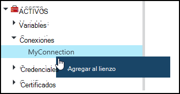
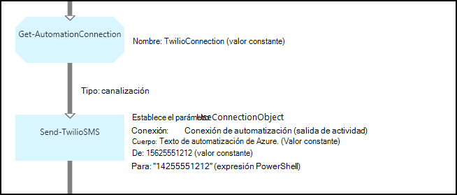
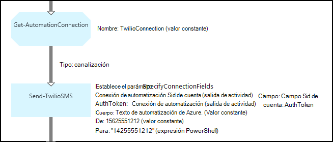

<properties 
   pageTitle="Los activos de conexión en la automatización de Azure | Microsoft Azure"
   description="Los activos de conexión en la automatización de Azure contienen la información necesaria para conectarse a una aplicación o servicio externo desde una configuración de DLC o runbook. En este artículo se explica los detalles de las conexiones y cómo trabajar con ellos en la creación de texto y gráficos."
   services="automation"
   documentationCenter=""
   authors="bwren"
   manager="stevenka"
   editor="tysonn" />
<tags 
   ms.service="automation"
   ms.devlang="na"
   ms.topic="article"
   ms.tgt_pltfrm="na"
   ms.workload="infrastructure-services"
   ms.date="01/27/2016"
   ms.author="bwren" />

# Activos de conexión en la automatización de Azure

Un activo de conexión de automatización contiene la información necesaria para conectarse a una aplicación o servicio externo desde una configuración de DLC o runbook. Esto puede incluir información necesaria para la autenticación como nombre de usuario y la contraseña, además de la información de conexión, como una dirección URL o un puerto. El valor de una conexión es mantener todas las propiedades para la conexión a una aplicación concreta en un activo en lugar de crear varias variables. El usuario puede editar los valores de una conexión en un solo lugar, y puede pasar el nombre de una conexión a un runbook o configuración de DLC en un único parámetro. Pueden tener acceso a las propiedades de una conexión en la configuración de DSC con la actividad de **Get-AutomationConnection** o runbook.

Cuando se crea una conexión, debe especificar un *tipo de conexión*. El tipo de conexión es una plantilla que define un conjunto de propiedades. La conexión define los valores para cada propiedad definida en su tipo de conexión. Tipos de conexiones se agregan automatización de Azure en módulos de integración o creados con la [API de automatización de Azure](http://msdn.microsoft.com/library/azure/mt163818.aspx). Los tipos de conexión solo están disponibles cuando se crea una conexión son los instalados en su cuenta de automatización.

>[AZURE.NOTE] Proteger los activos de automatización de Azure incluyen credenciales, certificados, conexiones y variables de cifrado. Estos activos se cifran y se almacenan en la automatización de Azure con una clave única que se genera para cada cuenta de automatización. Esta clave se cifra un certificado patrón y almacenada en automatización de Azure. Antes de almacenar un activo seguro, la clave para la cuenta de automatización se descifra con el certificado de patrón y, a continuación, se utiliza para cifrar el activo.

## Cmdlets de Windows PowerShell

Los cmdlets en la siguiente tabla se usan para crear y administrar conexiones de automatización con Windows PowerShell. Se envían como parte del [módulo de PowerShell de Azure](../powershell-install-configure.md) que está disponible para su uso en configuraciones de DSC y runbooks de automatización.

|Cmdlet|Descripción|
|:---|:---|
|[Get-AzureAutomationConnection](http://msdn.microsoft.com/library/dn921828.aspx)|Recupera una conexión. Incluye una tabla hash con los valores de los campos de la conexión.|
|[Nueva AzureAutomationConnection](http://msdn.microsoft.com/library/dn921825.aspx)|Crea una nueva conexión.|
|[Quitar AzureAutomationConnection](http://msdn.microsoft.com/library/dn921827.aspx)|Quitar una conexión existente.|
|[Establecer AzureAutomationConnectionFieldValue](http://msdn.microsoft.com/library/dn921826.aspx)|Establece el valor de un campo concreto de una conexión existente.|

## Actividades

Las actividades en la siguiente tabla se usan para tener acceso a las conexiones en un runbook o configuración de DSC.

|Actividades|Descripción|
|---|---|
|Get-AutomationConnection|Obtiene una conexión a usar. Devuelve una tabla hash con las propiedades de la conexión.|

>[AZURE.NOTE] Evitar el uso de variables en el parámetro – nombre de **Get-AutomationConnection** ya que esto puede dificultar descubrir dependencias entre runbooks o configuraciones DSC y activos de conexión en tiempo de diseño.

## Crear una nueva conexión

### Para crear una nueva conexión con el portal de clásico de Azure

1. Desde su cuenta de automatización, haga clic en **activos** en la parte superior de la ventana.
1. En la parte inferior de la ventana, haga clic en **Agregar**.
1. Haga clic en **Agregar conexión**.
2. En la lista desplegable **Tipo de conexión** , seleccione el tipo de conexión que desea crear.  El asistente presentará las propiedades para ese tipo.
1. Complete el asistente y haga clic en la casilla de verificación para guardar la nueva conexión.

### Para crear una nueva conexión con el portal de Azure

1. Desde su cuenta de automatización, haga clic en el elemento de **activos** para abrir el módulo de **activos** .
1. Haga clic en el elemento de **conexiones** para abrir el módulo de **conexiones** .
1. Haga clic en **Agregar una conexión de** la parte superior de la hoja.
2. En la lista desplegable **tipo** , seleccione el tipo de conexión que desea crear. El formulario presenta las propiedades para ese tipo.
1. Complete el formulario y haga clic en **crear** para guardar la nueva conexión.

### Para crear una nueva conexión con Windows PowerShell

Crear una nueva conexión con Windows PowerShell mediante el cmdlet [AzureAutomationConnection de nuevo](http://msdn.microsoft.com/library/dn921825.aspx) . Este cmdlet tiene un parámetro denominado **ConnectionFieldValues** que espera una [tabla hash](http://technet.microsoft.com/library/hh847780.aspx) definir valores para cada una de las propiedades definidas por el tipo de conexión.

Los siguientes comandos de ejemplo crean una nueva conexión para [Twilio](http://www.twilio.com) , que es un servicio de telefonía que le permite enviar y recibir mensajes de texto.  Un módulo de integración de ejemplo que incluye un tipo de conexión de Twilio está disponible en el [Centro de secuencia de comandos](http://gallery.technet.microsoft.com/scriptcenter/Twilio-PowerShell-Module-8a8bfef8).  Este tipo de conexión define propiedades para SID de la cuenta y el Token de autorización, que son necesarios para validar su cuenta al conectarse a Twilio.  Debe [descargar este módulo](http://gallery.technet.microsoft.com/scriptcenter/Twilio-PowerShell-Module-8a8bfef8) e instálelo en su cuenta de automatización para este código de ejemplo para que funcione.

    $AccountSid = "DAf5fed830c6f8fac3235c5b9d58ed7ac5"
    $AuthToken  = "17d4dadfce74153d5853725143c52fd1"
    $FieldValues = @{"AccountSid" = $AccountSid;"AuthToken"=$AuthToken}

    New-AzureAutomationConnection -AutomationAccountName "MyAutomationAccount" -Name "TwilioConnection" -ConnectionTypeName "Twilio" -ConnectionFieldValues $FieldValues

## Mediante una conexión en una configuración de DLC o runbook

Recuperar una conexión en una configuración de DSC con el cmdlet **Get-AutomationConnection** o runbook.  Esta actividad recupera los valores de los distintos campos en la conexión y devuelve como una [tabla hash](http://go.microsoft.com/fwlink/?LinkID=324844) que puede usarse con los comandos correspondientes en la configuración de DLC o runbook.

### Ejemplo de runbook textual
Los comandos de ejemplo siguientes muestran cómo utilizar la conexión de Twilio en el ejemplo anterior para enviar un mensaje de texto de un runbook.  La actividad de envío TwilioSMS utiliza aquí tiene dos conjuntos de parámetro entre utiliza un método diferente para autenticar al servicio Twilio.  Una utiliza un objeto de conexión y otra usa parámetros individuales para el SID de la cuenta y el Token de autorización.  En este ejemplo se muestran ambos métodos.

    $Con = Get-AutomationConnection -Name "TwilioConnection"
    $NumTo = "14255551212"
    $NumFrom = "15625551212"
    $Body = "Text from Azure Automation."

    #Send text with connection object.
    Send-TwilioSMS -Connection $Con -From $NumFrom -To $NumTo -Body $Body

    #Send text with connection properties.
    Send-TwilioSMS -AccountSid $Con.AccountSid -AuthToken $Con.AuthToken -From $NumFrom -To $NumTo -Body $Body

### Ejemplos de runbook gráfica

Agregar una actividad de **Get-AutomationConnection** a un gráfico runbook haciendo doble clic en la conexión en el panel de la biblioteca del editor de gráficos y seleccionando **Agregar al lienzo**.

La imagen siguiente muestra un ejemplo del uso de una conexión en un gráfico runbook.  Este es el mismo ejemplo mostrado arriba para enviar un mensaje de texto con Twilio desde un runbook textual.  Este ejemplo usa el parámetro de **UseConnectionObject** establecido para la actividad de **Envío TwilioSMS** que utiliza un objeto de conexión para que el servicio de autenticación.  Un [vínculo de canalización](automation-graphical-authoring-intro.md#links-and-workflow) se utiliza aquí ya que el parámetro de conexión espera un solo objeto.

El motivo por el que una expresión se utiliza para el valor del parámetro **a** en lugar de un valor constante de PowerShell es que este parámetro espera un tipo de valor de la matriz de cadena para que pueda enviar a varios números.  Una expresión de PowerShell le permite proporcionar un valor único o una matriz.

La imagen siguiente muestra el mismo ejemplo como anterior, pero utiliza el parámetro **SpecifyConnectionFields** establece que espera los parámetros AccountSid y AuthToken especificarlo de forma individual en lugar de usar un objeto de conexión para la autenticación.  En este caso, los campos de la conexión se especifican en lugar de en el propio objeto.  

## Artículos relacionados

- [Vínculos de edición gráfica](automation-graphical-authoring-intro.md#links-and-workflow)
 
