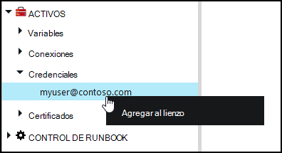
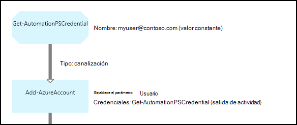

<properties 
   pageTitle="Credenciales activos en la automatización de Azure | Microsoft Azure"
   description="Activos de credenciales en la automatización de Azure contengan credenciales de seguridad que se pueden usar para autenticar a los recursos que se tiene acceso a la configuración de DLC o runbook. En este artículo se describe cómo crear activos de credenciales y usarlos en una configuración de DLC o runbook."
   services="automation"
   documentationCenter=""
   authors="mgoedtel"
   manager="jwhit"
   editor="tysonn" />
<tags 
   ms.service="automation"
   ms.devlang="na"
   ms.topic="article"
   ms.tgt_pltfrm="na"
   ms.workload="infrastructure-services"
   ms.date="06/09/2016"
   ms.author="bwren" />

# Activos de credenciales en la automatización de Azure

Un activo de credenciales de automatización contiene un objeto [PSCredential](http://msdn.microsoft.com/library/system.management.automation.pscredential) que contiene las credenciales de seguridad como nombre de usuario y contraseña. Configuraciones runbooks y DSC pueden usar cmdlets que aceptan un objeto PSCredential para la autenticación o pueden extraer el nombre de usuario y la contraseña del objeto PSCredential para proporcionar a algunos aplicación o servicio que requiere autenticación. Las propiedades de una credencial se almacenan de forma segura en Azure automatización y se pueden acceder en la configuración de DSC con la actividad de [Get-AutomationPSCredential](http://msdn.microsoft.com/library/system.management.automation.pscredential.aspx) o runbook.

>[AZURE.NOTE] Proteger los activos de automatización de Azure incluyen credenciales, certificados, conexiones y variables de cifrado. Estos activos se cifran y se almacenan en la automatización de Azure con una clave única que se genera para cada cuenta de automatización. Esta clave se cifra un certificado patrón y almacenada en automatización de Azure. Antes de almacenar un activo seguro, la clave para la cuenta de automatización se descifra con el certificado de patrón y, a continuación, se utiliza para cifrar el activo. 

## Cmdlets de Windows PowerShell

Los cmdlets en la siguiente tabla se usan para crear y administrar activos de credenciales de automatización con Windows PowerShell.  Se envían como parte del [módulo de PowerShell de Azure](../powershell-install-configure.md) que está disponible para su uso en configuraciones de DSC y runbooks de automatización.

|Cmdlets de|Descripción|
|:---|:---|
|[Get-AzureAutomationCredential](http://msdn.microsoft.com/library/dn913781.aspx)|Recupera información acerca de un activo de credenciales. Sólo puede recuperar la credencial propia de la actividad de **Get-AutomationPSCredential** .|
|[Nueva AzureAutomationCredential](http://msdn.microsoft.com/library/azure/jj554330.aspx)|Crea una nueva credencial de automatización.|
|[Quitar - AzureAutomationCredential](http://msdn.microsoft.com/library/azure/jj554330.aspx)|Quita una credencial de automatización.|
|[Set - AzureAutomationCredential](http://msdn.microsoft.com/library/azure/jj554330.aspx)|Establece las propiedades para una credencial de automatización existente.|

## Actividades de runbook

Las actividades en la siguiente tabla se usan para tener acceso a las credenciales en un runbook y configuraciones DSC.

|Actividades|Descripción|
|:---|:---|
|Get-AutomationPSCredential|Obtiene una credencial para usar en una configuración de DLC o runbook. Devuelve un objeto [System.Management.Automation.PSCredential](http://msdn.microsoft.com/library/system.management.automation.pscredential) .|

>[AZURE.NOTE] Evitar el uso de variables en el parámetro – nombre de Get-AutomationPSCredential ya que esto puede dificultar descubrir dependencias entre runbooks o configuraciones DSC y activos de credenciales en tiempo de diseño.

## Crear un nuevo activo de credenciales

### Para crear un nuevo activo de credenciales con el portal de clásico de Azure

1. Desde su cuenta de automatización, haga clic en **activos** en la parte superior de la ventana.
1. En la parte inferior de la ventana, haga clic en **Agregar**.
1. Haga clic en **Agregar credenciales**.
2. En la lista desplegable **Tipo de credenciales** , seleccione **PowerShell credenciales**.
1. Complete el asistente y haga clic en la casilla de verificación para guardar las credenciales nueva.

### Para crear un nuevo activo de credenciales con el portal de Azure

1. Desde su cuenta de automatización, haga clic en el elemento de **activos** para abrir el módulo de **activos** .
1. Haga clic en el elemento de **credenciales** para abrir el módulo de **credenciales** .
1. Haga clic en **Agregar una credencial** en la parte superior de la hoja.
1. Complete el formulario y haga clic en **crear** para guardar las credenciales nueva.

### Para crear un nuevo activo de credenciales con Windows PowerShell

Los comandos de ejemplo siguientes muestran cómo crear una nueva credencial de automatización. Un objeto PSCredential se crea por primera vez con el nombre y contraseña y, a continuación, se utiliza para crear los activos de credenciales. Como alternativa, podría usar el cmdlet **Get-Credential** para pedirá que escriba un nombre y contraseña.

    $user = "MyDomain\MyUser"
    $pw = ConvertTo-SecureString "PassWord!" -AsPlainText -Force
    $cred = New-Object –TypeName System.Management.Automation.PSCredential –ArgumentList $user, $pw
    New-AzureAutomationCredential -AutomationAccountName "MyAutomationAccount" -Name "MyCredential" -Value $cred

## Usar una credencial de PowerShell

Recuperar un activo de credenciales en una configuración de DSC con la actividad de **Get-AutomationPSCredential** o runbook. Devuelve un [objeto PSCredential](http://msdn.microsoft.com/library/system.management.automation.pscredential.aspx) que puede utilizar con una actividad o cmdlet que requiere un parámetro PSCredential. También puede recuperar las propiedades del objeto de credencial para usar individualmente. El objeto tiene una propiedad para el nombre de usuario y la contraseña segura, o puede usar el método **GetNetworkCredential** para devolver un objeto [NetworkCredential](http://msdn.microsoft.com/library/system.net.networkcredential.aspx) que proporcione una versión no segura de la contraseña.

### Ejemplo de runbook textual

Los siguientes comandos de ejemplo muestran cómo usar una credencial de PowerShell en un runbook. En este ejemplo, se recupera la credencial y su nombre de usuario y contraseña asignan a las variables.

    $myCredential = Get-AutomationPSCredential -Name 'MyCredential'
    $userName = $myCredential.UserName
    $securePassword = $myCredential.Password
    $password = $myCredential.GetNetworkCredential().Password

### Ejemplo de gráfico runbook

Agregar una actividad de **Get-AutomationPSCredential** a un gráfico runbook haciendo doble clic en la credencial en el panel de la biblioteca del editor de gráficos y seleccionando **Agregar al lienzo**.

La imagen siguiente muestra un ejemplo del uso de una credencial en un runbook gráfica.  En este caso, se que se usa para proporcionar la autenticación para un runbook a recursos de Azure como se describe en [Runbooks autenticar con la cuenta de usuario de Azure AD](automation-sec-configure-aduser-account.md).  La primera actividad recupera la credencial que tiene acceso a la suscripción de Azure.  La actividad de **Agregar AzureAccount** entonces utiliza esta credencial para proporcionar autenticación para las actividades posteriores.  Un [vínculo de canalización](automation-graphical-authoring-intro.md#links-and-workflow) está aquí puesto que **Get-AutomationPSCredential** espera un solo objeto.  

## Usar una credencial de PowerShell en DSC
Mientras configuraciones DSC en automatización de Azure pueden hacer referencia a activos de credenciales mediante **Get-AutomationPSCredential**, credencial activos pueden también se pueden pasar en a través de los parámetros, si lo desea. Para obtener más información, vea [configuraciones de compilación en DSC de automatización de Azure](automation-dsc-compile.md#credential-assets).

## Pasos siguientes

- Para obtener más información acerca de los vínculos en la creación de gráficos, vea [los vínculos de edición gráfica](automation-graphical-authoring-intro.md#links-and-workflow)
- Para conocer los distintos métodos de autenticación con la automatización, vea [Seguridad de automatización de Azure](automation-security-overview.md)
- Para empezar con runbooks gráfica, consulte [Mi primera runbook gráfica](automation-first-runbook-graphical.md)
- Para empezar con PowerShell runbooks de flujo de trabajo, consulte [Mi primera runbook de flujo de trabajo de PowerShell](automation-first-runbook-textual.md) 

 
