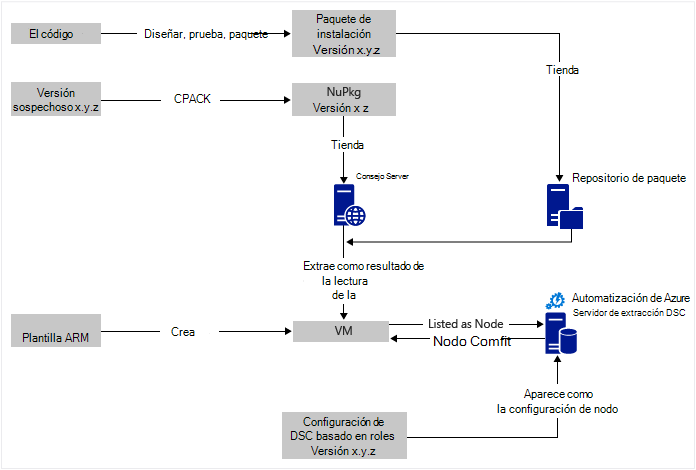
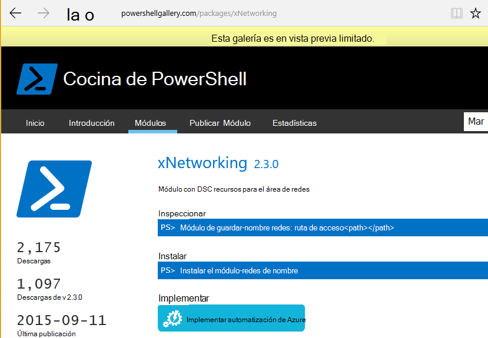

<properties
   pageTitle="Automatización de Azure DSC implementación continuo con Chocolatey | Microsoft Azure"
   description="DevOps implementación continua con Azure automatización DSC y el Administrador de paquete Chocolatey.  Ejemplo con plantilla JSON ARM completa y origen de PowerShell."
   services="automation"
   documentationCenter=""
   authors="sebastus"
   manager="stevenka"
   editor=""/>

<tags
   ms.service="automation"
   ms.devlang="na"
   ms.topic="article"
   ms.tgt_pltfrm="vm-windows"
   ms.workload="na"
   ms.date="08/08/2016"
   ms.author="golive"/>

# Ejemplo de uso: Implementación continua a máquinas virtuales con automatización DSC y Chocolatey

En un mundo DevOps hay muchas herramientas para ayudarle con varios puntos de la canalización de integración continua.  Configuración de estado de Azure automatización deseado (DSC) es un Bienvenido a las opciones que pueden emplear DevOps equipos.  En este artículo se muestra cómo establecer una implementación continua (CD) para un equipo Windows.  Puede extender fácilmente la técnica para incluir todos los equipos Windows según sea necesario de la función (por ejemplo, un sitio web) y desde ahí a funciones adicionales.

## En un nivel alto

Hay mucha pasando aquí, pero Afortunadamente se puede dividir en dos procesos principales: 

  - Escribir código y probarlo, crear y publicar paquetes de instalación de versiones principales y secundarias del sistema. 
  - Crear y administrar máquinas virtuales que instalar y ejecutar el código en los paquetes.  

Una vez que ambos de estos procesos principales en su lugar, es un corto paso para actualizar automáticamente el paquete que se ejecuten en cualquier VM particular como crear e implementar nuevas versiones.

## Introducción a los componentes

Los jefes de paquete como [apt get](https://en.wikipedia.org/wiki/Advanced_Packaging_Tool) son bastante bien conocido en el mundo de Linux, pero no con tanto en el mundo de Windows.  [Chocolatey](https://chocolatey.org/) es y de Scott Hanselman [blog](http://www.hanselman.com/blog/IsTheWindowsUserReadyForAptget.aspx) en el tema es una excelente introducción.  En resumen, Chocolatey le permite instalar paquetes de un repositorio central de paquetes en un sistema de Windows mediante la línea de comandos.  Puede crear y administrar su propios repositorio y Chocolatey puede instalar paquetes de cualquier número de repositorios que designe.

Configuración de estado que desee (DSC) ([información general](https://technet.microsoft.com/library/dn249912.aspx)) es una herramienta de PowerShell que permite declarar la configuración que desee para un equipo.  Por ejemplo, puede decir "quiero Chocolatey instalado, quiero IIS instalado, quiero abierto el puerto 80, quiero versión 1.0.0 de Mi sitio Web instalada."  El Administrador de configuración Local (LCM) de DSC implementa esa configuración. Un servidor de extracción DSC contiene un repositorio de configuraciones para sus equipos. El LCM en cada equipo comprueba periódicamente para ver si su configuración coincide con la configuración almacenada. Puede informar del estado o intenta poner el equipo en alineación con la configuración almacenada. Puede editar la configuración almacenada en el servidor de extracción para hacer que un equipo o un conjunto de equipos en alineación con la configuración modificada.

Automatización de Azure es un servicio administrado en Microsoft Azure que le permite automatizar varias tareas utilizando runbooks, nodos, credenciales, recursos y activos como programaciones y variables globales. DSC de automatización Azure extiende esta capacidad de automatización que incluye herramientas de PowerShell DSC.  Aquí es una excelente [Introducción](automation-dsc-overview.md).

Un recurso DSC es un módulo de código que tiene capacidades específicas, como la administración de redes, Active Directory o SQL Server.  El recurso DSC Chocolatey sabe cómo obtener acceso a un servidor NuGet (entre otras), descargar paquetes, instalar paquetes y así sucesivamente.  Hay muchos otros recursos de DSC en la [Galería de PowerShell](http://www.powershellgallery.com/packages?q=dsc+resources&prerelease=&sortOrder=package-title).  Estos módulos están instalados en su servidor de extracción de Azure automatización DSC (por) para que se puedan utilizar por las configuraciones.

Plantillas ARM proporcionan una manera descriptiva de generar la infraestructura - cosas como redes, subredes, la seguridad de la red y enrutamiento, cargue equilibradores, NIC, máquinas virtuales y así sucesivamente.  Aquí tiene un [artículo](../resource-manager-deployment-model.md) que compara el modelo de implementación de ARM (descriptiva) con la administración del servicio de Azure (ASM o clásico) modelo de implementación (imprescindible).  Y otro [artículo](../virtual-machines/virtual-machines-windows-compare-deployment-models.md) acerca de los proveedores de recursos principales, cálculo, almacenamiento y red.

Una característica clave de una plantilla ARM es su capacidad para instalar una extensión de máquina virtual en la máquina virtual mientras se está configurado.  Una extensión de VM tiene capacidades específicas, como ejecutar un script personalizado, instalar software antivirus o ejecutar una secuencia de comandos de configuración de DLC.  Hay muchos otros tipos de extensiones de máquina virtual.

## Viaje rápido alrededor del diagrama

Comenzando en la parte superior, escribir código, crear y probar, crear un paquete de instalación.  Chocolatey puede controlar los distintos tipos de paquetes de instalación, como MSI, MSU, ZIP.  Y tiene toda la potencia de PowerShell para realizar la instalación real si no se encuentran las capacidades nativas de Chocolatey bastante hasta ella.  Coloque el paquete en un lugar accesible: un repositorio de paquete.  Este ejemplo de uso usa una carpeta pública en una cuenta de almacenamiento de blobs de Windows Azure, pero puede ser cualquier lugar.  Chocolatey nativa funciona con servidores de NuGet y algunos otros usuarios para la administración de metadatos de paquete.  [En este artículo](https://github.com/chocolatey/choco/wiki/How-To-Host-Feed) se describen las opciones.  Este ejemplo de uso usa NuGet.  Un Nuspec es metadatos acerca de los paquetes.  El Nuspec es "compilan" en del NuPkg y almacenado en un servidor NuGet.  Cuando la configuración solicita un paquete por su nombre y hace referencia a un servidor NuGet, el recurso de DSC Chocolatey (ahora en la máquina virtual) toma el paquete y se instala automáticamente.  También puede solicitar una versión específica de un paquete.

En la parte inferior izquierda de la imagen, hay una plantilla de Azure Resource Manager (ARM).  En este ejemplo de uso, la extensión VM registra la máquina virtual con el servidor de extracción de Azure automatización DSC (es decir, un servidor de extracción) como un nodo.  La configuración se almacena en el servidor de extracción.  En realidad, se almacena dos veces: una vez como texto sin formato y una vez que se compila como un archivo MOF (para los que saber sobre, entre otras cosas.)  En el portal, MOF es una configuración de nodo de"" (en lugar de simplemente "configuración").  Es la muestra que está asociada a un nodo para que el nodo sepa su configuración.  Los detalles de mostrar cómo asignar la configuración de nodos al nodo.

Probablemente ya está haciendo bit en la parte superior o la mayor parte de ella.  Crear el nuspec, compilar y almacenar en un servidor NuGet están algo pequeña.  Y ya están administrando máquinas virtuales.  Tomar el siguiente paso a implementación continua requiere la configuración del servidor de extracción (una vez), registrar los nodos con él (una vez) y crear y almacenar la configuración que hay (inicialmente).  A continuación, como se ha actualizado e implementados en el repositorio paquetes actualizar la configuración y la configuración de nodos en el servidor de extracción (repetición según sea necesario).

Si no está empezando con una plantilla ARM, es correcto.  Hay diseñados para ayudarle a registrar sus máquinas virtuales con el servidor de extracción y el resto de todas los cmdlets de PowerShell. Para obtener más detalles, consulte este artículo: [máquinas integrado para la administración de DSC de automatización de Azure](automation-dsc-onboarding.md)

## Paso 1: Configurar la cuenta de servidor y automatización de extracción

En una línea de comandos de PowerShell (agregar AzureRmAccount) autenticado: (puede tardar unos minutos mientras está configurado el servidor de extracción)

    New-AzureRmResourceGroup –Name MY-AUTOMATION-RG –Location MY-RG-LOCATION-IN-QUOTES
    New-AzureRmAutomationAccount –ResourceGroupName MY-AUTOMATION-RG –Location MY-RG-LOCATION-IN-QUOTES –Name MY-AUTOMATION-ACCOUNT 

Puede colocar su cuenta de automatización en cualquiera de las siguientes regiones (también conocido como ubicación): US oriental 2, sur Central de EE, nos Gov Virginia, Europa occidental, sudeste asiático, Japón Oriente, India Central y Australia sureste.

## Paso 2: Ajustes VM extensión a la plantilla ARM

Detalles de registro de máquina virtual (con la extensión de PowerShell DSC VM) proporcionados en esta [Plantilla de Azure tutorial rápido](https://github.com/Azure/azure-quickstart-templates/tree/master/dsc-extension-azure-automation-pullserver).  Este paso registra su nueva máquina virtual con el servidor de extracción en la lista de nodos de DSC.  Parte de este registro es especificar la configuración de nodos que se aplique el nodo.  Esta configuración de nodo no tiene que todavía existe en el servidor de extracción, por lo que es aceptar que paso 4 es donde esto se hace por primera vez.  Pero aquí en el paso 2 debe decidir el nombre del nodo y el nombre de la configuración.  En este ejemplo de uso, el nodo se 'isvbox' y la configuración es 'ISVBoxConfig'.  Para que el nombre de la configuración de nodo (que se especifique en DeploymentTemplate.json) es 'ISVBoxConfig.isvbox'.  

## Paso 3: Agregar recursos DSC necesarios en el servidor de extracción

La Galería de PowerShell está instrumentada para instalar recursos DSC en su cuenta de automatización de Azure.  Desplácese hasta el recurso que desee y haga clic en el botón "Implementar a Azure automatización".

Otra técnica agregado recientemente en el Portal de Azure le permite extraer nuevos módulos o actualizar los módulos existentes. Haga clic en el recurso de la cuenta de automatización, el mosaico de activos y, finalmente, el mosaico de módulos.  El icono de la Galería de Examinar le permite ver la lista de módulos en la galería, profundizar en los detalles y finalmente importar en su cuenta de automatización. Esta es una excelente manera de mantener los módulos actualizados de vez en cuando. Y la característica de importación comprueba dependencias con otros módulos para asegurarse de que no hay nada obtiene sincronizado.

O bien, hay el enfoque manual.  La estructura de carpetas de un módulo de integración de PowerShell para un equipo Windows es algo diferente de la estructura de carpetas esperada por la automatización de Azure.  Esto requiere un pequeño ajuste por su parte.  Pero no es difícil, y se realiza una sola vez por recurso (a menos que desee actualizarlo en un futuro.)  Para obtener más información sobre la creación de módulos de integración de PowerShell, consulte este artículo: [Creación de módulos de integración de automatización de Azure](https://azure.microsoft.com/blog/authoring-integration-modules-for-azure-automation/)

-   Instalar el módulo que necesita en su estación de trabajo, como sigue:
    -   Instale [Windows Management Framework, v5](http://aka.ms/wmf5latest) (no es necesario para Windows 10)
    -   `Install-Module –Name MODULE-NAME`<: toma el módulo de la Galería de PowerShell 
-   Copie la carpeta del módulo de `c:\Program Files\WindowsPowerShell\Modules\MODULE-NAME` a una carpeta temporal 
-   Eliminar documentación y ejemplos de la carpeta principal 
-   Comprima la carpeta principal, el archivo ZIP de nomenclatura exactamente igual que la carpeta 
-   Coloque el archivo ZIP en una ubicación de HTTP accesible, como el almacenamiento de blobs de una cuenta de almacenamiento de Azure.
-   Ejecute esta PowerShell:

        New-AzureRmAutomationModule `
            -ResourceGroupName MY-AUTOMATION-RG -AutomationAccountName MY-AUTOMATION-ACCOUNT `
            -Name MODULE-NAME –ContentLink "https://STORAGE-URI/CONTAINERNAME/MODULE-NAME.zip"
        

El ejemplo incluye realiza estos pasos para cChoco y xNetworking. Vea las [notas](#notes) para un tratamiento especial para cChoco.

## Paso 4: Agregar la configuración de nodos en el servidor de extracción

No hay nada especial acerca de la primera vez que se importa su configuración en el servidor de extracción y la compilación.  Todas las posteriores importar/compila la misma configuración exactamente el mismo aspecto.  Cada vez que el paquete de actualización y necesita enviarlo a producción realizar este paso después de asegurarse de que el archivo de configuración es correcto, incluidas la nueva versión del paquete.  Aquí tiene el archivo de configuración de PowerShell:

ISVBoxConfig.ps1:

    Configuration ISVBoxConfig 
    { 
        Import-DscResource -ModuleName cChoco 
        Import-DscResource -ModuleName xNetworking
    
        Node "isvbox" {   
    
            cChocoInstaller installChoco 
            { 
                InstallDir = "C:\choco" 
            }
    
            WindowsFeature installIIS 
            { 
                Ensure="Present" 
                Name="Web-Server" 
            }
    
            xFirewall WebFirewallRule 
            { 
                Direction = "Inbound" 
                Name = "Web-Server-TCP-In" 
                DisplayName = "Web Server (TCP-In)" 
                Description = "IIS allow incoming web site traffic." 
                DisplayGroup = "IIS Incoming Traffic" 
                State = "Enabled" 
                Access = "Allow" 
                Protocol = "TCP" 
                LocalPort = "80" 
                Ensure = "Present" 
            }
    
            cChocoPackageInstaller trivialWeb 
            {            
                Name = "trivialweb" 
                Version = "1.0.0" 
                Source = “MY-NUGET-V2-SERVER-ADDRESS” 
                DependsOn = "[cChocoInstaller]installChoco", 
                "[WindowsFeature]installIIS" 
            } 
        }    
    }

New-ConfigurationScript.ps1:

    Import-AzureRmAutomationDscConfiguration ` 
        -ResourceGroupName MY-AUTOMATION-RG –AutomationAccountName MY-AUTOMATION-ACCOUNT ` 
        -SourcePath C:\temp\AzureAutomationDsc\ISVBoxConfig.ps1 ` 
        -Published –Force
    
    $jobData = Start-AzureRmAutomationDscCompilationJob ` 
        -ResourceGroupName MY-AUTOMATION-RG –AutomationAccountName MY-AUTOMATION-ACCOUNT ` 
        -ConfigurationName ISVBoxConfig 
    
    $compilationJobId = $jobData.Id
    
    Get-AzureRmAutomationDscCompilationJob ` 
        -ResourceGroupName MY-AUTOMATION-RG –AutomationAccountName MY-AUTOMATION-ACCOUNT ` 
        -Id $compilationJobId

Estos resultados de pasos en una nueva configuración de nodo denominan "ISVBoxConfig.isvbox" que se encuentra en el servidor de extracción.  El nombre de la configuración de nodo integrado como "configurationName.nodeName".

## Paso 5: Crear y mantener los metadatos de paquete

Para cada paquete que se coloca en el repositorio de paquete, necesita una nuspec que lo describe.  Debe ser compilado y almacenado en su servidor NuGet que nuspec. Este proceso se describe [a continuación](http://docs.nuget.org/create/creating-and-publishing-a-package).  Puede usar MyGet.org como un servidor NuGet.  Se vende este servicio, pero tiene un SKU que es gratuita de inicio.  En NuGet.org encontrará instrucciones sobre cómo instalar a su propio servidor NuGet para sus paquetes privados.

## Paso 6: Todos los unen

Cada vez que una versión pasa q & a y se ha aprobado para su implementación, se crea el paquete, nuspec y nupkg actualiza y se implementa en el servidor NuGet.  Además, se debe actualizar la configuración (paso 4 anteriores) para que coincidan con el nuevo número de versión.  Debe enviar al servidor de extracción y compilado.  A partir de ese momento, depende de las VM que dependen de que la configuración para extraer la actualización y volver a instalarlo.  Cada una de estas actualizaciones son sencillos - solo una o dos líneas de PowerShell.  En el caso de los servicios de equipo de Visual Studio, algunos de ellos están encapsulados en las tareas de compilación que se pueden encadenar en una versión.  En este [artículo](https://www.visualstudio.com/en-us/docs/alm-devops-feature-index#continuous-delivery) proporciona más detalles.  Este [GitHub repo](https://github.com/Microsoft/vso-agent-tasks) detalla las distintas tareas de compilación disponible.

## Notas

Este ejemplo de uso se inicia con una máquina virtual desde una imagen de Windows Server 2012 R2 genérica desde la Galería de Azure.  Puede empezar desde cualquier imagen almacenada y ajustar desde allí con la configuración de DSC.  Sin embargo, el cambio de configuración que está preparado en una imagen es mucho más difícil de actualización dinámica de la configuración con DSC.

No debe usar una plantilla de BRAZO y la extensión de máquina virtual para usar esta técnica con sus máquinas virtuales.  Y sus máquinas virtuales no tienen que estar en Azure bajo administración de CD.  Todo lo que es necesario es que Chocolatey esté instalado y configurado LCM en la máquina virtual para que sepa dónde está el servidor de extracción.  

Por supuesto, cuando se actualiza un paquete en una máquina virtual que se encuentra en producción, debe realizar máquina fuera de la rotación mientras se instala la actualización.  Cómo hacerlo varía.  Por ejemplo, con una máquina virtual detrás de un equilibrador de carga de Azure, puede agregar un sondeo personalizada.  Al actualizar la máquina virtual, tiene el extremo de sondeo devolver un 400.  La modificación es necesario para hacer este cambio puede ser dentro de la configuración, como la modificación para cambiar a devolver un 200 una vez completada la actualización.

Código fuente completo de este ejemplo de uso está en [este proyecto de Visual Studio](https://github.com/sebastus/ARM/tree/master/CDIaaSVM) en GitHub.

##Artículos relacionados##

- [Introducción a azure automatización DSC] (automatización-dsc-overview.md)
- [Cmdlets de azure DSC de automatización] (https://msdn.microsoft.com/library/mt244122.aspx)
- [Máquinas integrado para la administración de Azure automatización DSC] (automatización-dsc-onboarding.md)
