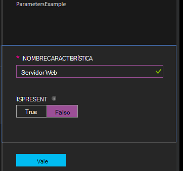

<properties 
   pageTitle="Compilar las configuraciones de Azure automatización DSC | Microsoft Azure" 
   description="Información general de dos maneras para compilar las configuraciones de configuración de estado deseado (DSC): en el portal de Azure y con Windows PowerShell. " 
   services="automation" 
   documentationCenter="na" 
   authors="coreyp-at-msft" 
   manager="stevenka" 
   editor="tysonn"/>

<tags
   ms.service="automation"
   ms.devlang="na"
   ms.topic="article"
   ms.tgt_pltfrm="powershell"
   ms.workload="na" 
   ms.date="01/25/2016"
   ms.author="coreyp"/>
   
#Configuraciones de compilación en DSC de automatización de Azure#

Puede compilar las configuraciones de configuración de estado deseado (DSC) de dos formas con la automatización de Azure: en el portal de Azure y con Windows PowerShell. La siguiente tabla le ayudará a determinar cuándo usar el método basado en las características de cada uno: 

###Portal de vista previa de Azure###
- Método más sencillo con la interfaz de usuario interactiva
- Formulario para proporcionar los valores de parámetros simple
- Realizar fácilmente el seguimiento de estado del trabajo
- Acceso autenticado con inicio de sesión de Azure

###Windows PowerShell###
- Llamar desde la línea de comandos con los cmdlets de Windows PowerShell
- Se puede incluir en la solución automatizada con varios pasos
- Proporcionar los valores de parámetro sencillos y complejos
- Seguimiento del estado de trabajo
- Cliente necesario para admitir los cmdlets de PowerShell
- Pasar ConfigurationData
- Compilar las configuraciones que utilizan credenciales

Una vez que haya decidido un método de compilación, puede seguir los procedimientos respectivos siguientes para iniciar la compilación.

##Compilar una configuración de DSC con el portal de Azure##

1.  Desde su cuenta de automatización, haga clic en **configuración**.
2.  Haga clic en una configuración para abrir su hoja.
3.  Haga clic en **compilar**.
4.  Si la configuración no tiene parámetros, se le pedirá que confirme si desea compilar. Si la configuración tiene parámetros, se abrirá el módulo de **Configuración de compilación** para que puedan proporcionar los valores de parámetro. Vea la sección de <a href="#basic-parameters">**Parámetros básicos**</a> debajo para obtener más información acerca de los parámetros.
5.  Se abre la hoja de **Trabajo de compilación** para que puede realizar un seguimiento de estado del trabajo de compilación y las configuraciones de nodo (documentos de configuración de MOF) que se ha originado colocar en el servidor de extracción de Azure automatización DSC.

##Compilar una configuración de DLC con Windows PowerShell##

Puede usar [`Start-AzureRmAutomationDscCompilationJob`](https://msdn.microsoft.com/library/mt244118.aspx) para iniciar la compilación de Windows PowerShell. El siguiente código de ejemplo inicia la compilación de una configuración de DSC denominada **SampleConfig**.

    Start-AzureRmAutomationDscCompilationJob -ResourceGroupName "MyResourceGroup" -AutomationAccountName "MyAutomationAccount" -ConfigurationName "SampleConfig" 
 
`Start-AzureRmAutomationDscCompilationJob`Devuelve un objeto de trabajo de compilación que puede usar para realizar un seguimiento de su estado. A continuación, puede usar este objeto de trabajo de compilación con [`Get-AzureRmAutomationDscCompilationJob`](https://msdn.microsoft.com/library/mt244120.aspx) para determinar el estado de la tarea de compilación, y [`Get-AzureRmAutomationDscCompilationJobOutput`](https://msdn.microsoft.com/library/mt244103.aspx) para ver sus flujos (resultado). El siguiente código de ejemplo se inicia la compilación de la configuración de **SampleConfig** , espera hasta que ha finalizado y, a continuación, muestra sus flujos.
    
    $CompilationJob = Start-AzureRmAutomationDscCompilationJob -ResourceGroupName "MyResourceGroup" -AutomationAccountName "MyAutomationAccount" -ConfigurationName "SampleConfig"
    
    while($CompilationJob.EndTime –eq $null -and $CompilationJob.Exception –eq $null)           
    {
        $CompilationJob = $CompilationJob | Get-AzureRmAutomationDscCompilationJob
        Start-Sleep -Seconds 3
    }
    
    $CompilationJob | Get-AzureRmAutomationDscCompilationJobOutput –Stream Any 

##Parámetros básicos##

Declaración de parámetros en las configuraciones de DSC, incluidos los tipos de parámetros y propiedades, funciona los mismos que runbooks automatización de Azure. Consulte [iniciar un runbook de automatización de Azure](automation-starting-a-runbook.md) para obtener más información acerca de los parámetros de runbook.

El ejemplo siguiente utiliza dos parámetros denominados **NombreCaracterística** y **IsPresent**, para determinar los valores de las propiedades de la configuración de nodos **ParametersExample.sample** generados durante la compilación.

    Configuration ParametersExample
    {
        param(
            [Parameter(Mandatory=$true)]
    
            [string] $FeatureName,
    
            [Parameter(Mandatory=$true)]
            [boolean] $IsPresent
        )
    
        $EnsureString = "Present"
        if($IsPresent -eq $false)
        {
            $EnsureString = "Absent"
        }
    
        Node "sample"
        {
            WindowsFeature ($FeatureName + "Feature")
            {
                Ensure = $EnsureString
                Name = $FeatureName
            }
        }
    }

Puede compilar las configuraciones de DSC que utilizan parámetros básicos en el portal de Azure automatización DSC o con Azure PowerShell:

###Portal###

En el portal, puede especificar valores de parámetro tras hacer clic en **compilar**.

###PowerShell###

PowerShell requiere parámetros en una [tabla hash](http://technet.microsoft.com/library/hh847780.aspx) donde la clave coincide con el nombre del parámetro y el valor es igual al valor del parámetro.

    $Parameters = @{
            "FeatureName" = "Web-Server"
            "IsPresent" = $False
    }
    
    
    Start-AzureRmAutomationDscCompilationJob -ResourceGroupName "MyResourceGroup" -AutomationAccountName "MyAutomationAccount" -ConfigurationName "ParametersExample" -Parameters $Parameters 
    

Para obtener información sobre cómo pasar PSCredentials como parámetros, vea <a href="#credential-assets">**Activos de credenciales**</a> .

##ConfigurationData##

**ConfigurationData** le permite separar estructural configuración desde cualquier configuración específica del entorno al usar PowerShell DSC. Consulte [separar "Qué" de "Donde" en DSC de PowerShell](http://blogs.msdn.com/b/powershell/archive/2014/01/09/continuous-deployment-using-dsc-with-minimal-change.aspx) para obtener más información sobre **ConfigurationData**.

>[AZURE.NOTE] Puede usar **ConfigurationData** durante la compilación en DSC de automatización de Azure con PowerShell de Azure, pero no en el portal de Azure.

El siguiente ejemplo de configuración de DLC usa **ConfigurationData** a través de las palabras clave **$ConfigurationData** y **$AllNodes** . En este ejemplo, también deberá [ **xWebAdministration** módulo](https://www.powershellgallery.com/packages/xWebAdministration/) :

     Configuration ConfigurationDataSample
     {
        Import-DscResource -ModuleName xWebAdministration -Name MSFT_xWebsite
    
        Write-Verbose $ConfigurationData.NonNodeData.SomeMessage 
    
        Node $AllNodes.Where{$_.Role -eq "WebServer"}.NodeName
        {
            xWebsite Site
            {
                Name = $Node.SiteName
                PhysicalPath = $Node.SiteContents
                Ensure   = "Present"
            }
        }
    }

Puede compilar la configuración de DSC encima con PowerShell. La debajo de PowerShell agrega dos configuraciones de nodos en el servidor de extracción de Azure automatización DSC: **ConfigurationDataSample.MyVM1** y **ConfigurationDataSample.MyVM3**:

    $ConfigData = @{
        AllNodes = @(
            @{
                NodeName = "MyVM1"
                Role = "WebServer"
            },
            @{
                NodeName = "MyVM2"
                Role = "SQLServer"
            },
            @{
                NodeName = "MyVM3"
                Role = "WebServer"
    
            }
    
        )
    
        NonNodeData = @{
            SomeMessage = "I love Azure Automation DSC!"
    
        }
    
    } 
    
    Start-AzureRmAutomationDscCompilationJob -ResourceGroupName "MyResourceGroup" -AutomationAccountName "MyAutomationAccount" -ConfigurationName "ConfigurationDataSample" -ConfigurationData $ConfigData

##Activos##

Referencias de activos son los mismos en runbooks y configuraciones de Azure automatización DSC. Para obtener más información, vea:

- [Certificados](automation-certificates.md)
- [Conexiones](automation-connections.md)
- [Credenciales](automation-credentials.md)
- [Variables](automation-variables.md)

###Activos de credenciales###
Mientras configuraciones DSC en automatización de Azure pueden hacer referencia a activos de credenciales mediante **Get-AzureRmAutomationCredential**, credencial activos pueden también se pueden pasar en a través de los parámetros, si lo desea. Si una configuración de toma un parámetro de tipo **PSCredential** , debe pasar el nombre de un activo de credenciales de automatización de Azure cadena como valor del parámetro, en lugar de un objeto PSCredential. En segundo plano, se recuperará y pasa a la configuración de los activos de credenciales de automatización de Azure con ese nombre.

Mantener las credenciales segura en configuraciones de nodo (documentos de configuración de MOF) requiere cifrar las credenciales en el archivo MOF de configuración de nodo. Automatización de Azure lleva esto un paso más y cifra todo el archivo MOF. Sin embargo, actualmente debe indicar PowerShell DSC es correcto de credenciales que se van a texto sin formato durante la generación de nodo Configuración MOF, porque no sabe DSC de PowerShell que automatización de Azure se cifrar todo el archivo MOF después de su generación a través de un trabajo de compilación.

Puede distinguir DSC de PowerShell que está listo para credenciales que se van a texto sin formato en la configuración de nodos generado MOFs usando <a href="#configurationdata">**ConfigurationData**</a>. Se debe pasar `PSDscAllowPlainTextPassword = $true` a través de **ConfigurationData** para el nombre de cada bloque de nodo que aparece en la configuración de DSC y usa las credenciales.

En el ejemplo siguiente se muestra una configuración de DSC que usa un activo de credenciales de automatización.

    Configuration CredentialSample
    {
       $Cred = Get-AzureRmAutomationCredential -Name "SomeCredentialAsset"
    
        Node $AllNodes.NodeName
        { 
            File ExampleFile
            { 
                SourcePath = "\\Server\share\path\file.ext" 
                DestinationPath = "C:\destinationPath" 
                Credential = $Cred 
            }
        }
    }

Puede compilar la configuración de DSC encima con PowerShell. La debajo de PowerShell agrega dos configuraciones de nodos en el servidor de extracción de Azure automatización DSC: **CredentialSample.MyVM1** y **CredentialSample.MyVM2**.

    $ConfigData = @{
        AllNodes = @(
            @{
                NodeName = "*"
                PSDscAllowPlainTextPassword = $True
            },
            @{
                NodeName = "MyVM1"
            },
            @{
                NodeName = "MyVM2"
            }
        )
    }
    
    Start-AzureRmAutomationDscCompilationJob -ResourceGroupName "MyResourceGroup" -AutomationAccountName "MyAutomationAccount" -ConfigurationName "CredentialSample" -ConfigurationData $ConfigData
