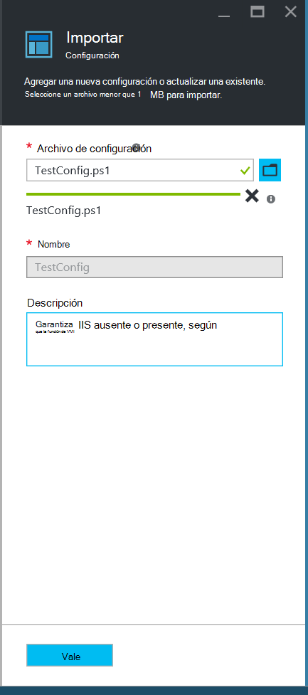
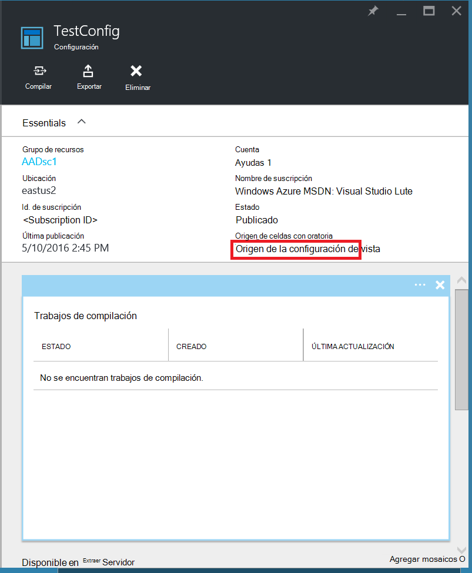
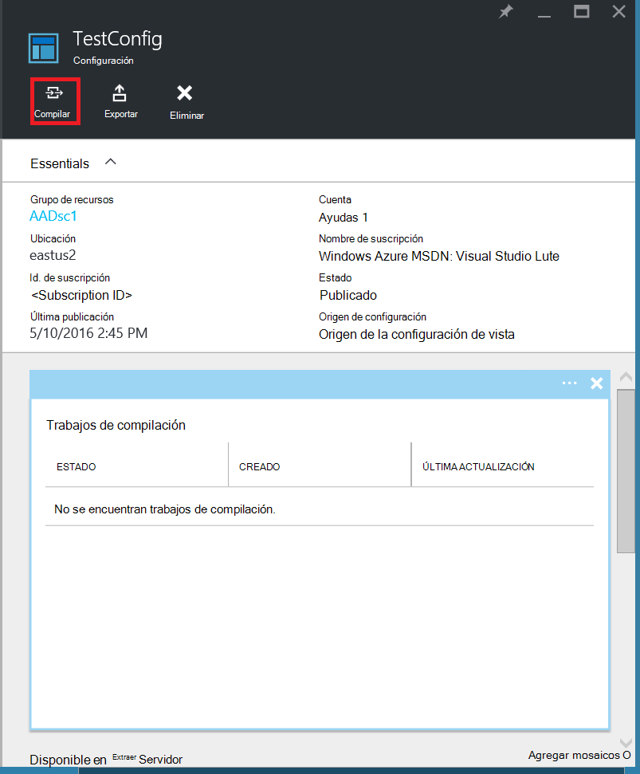
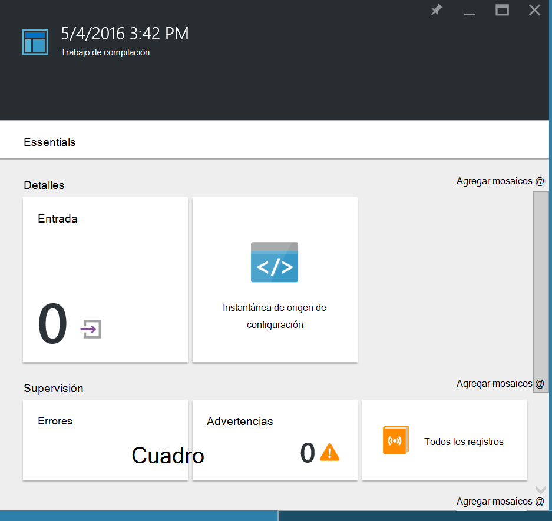
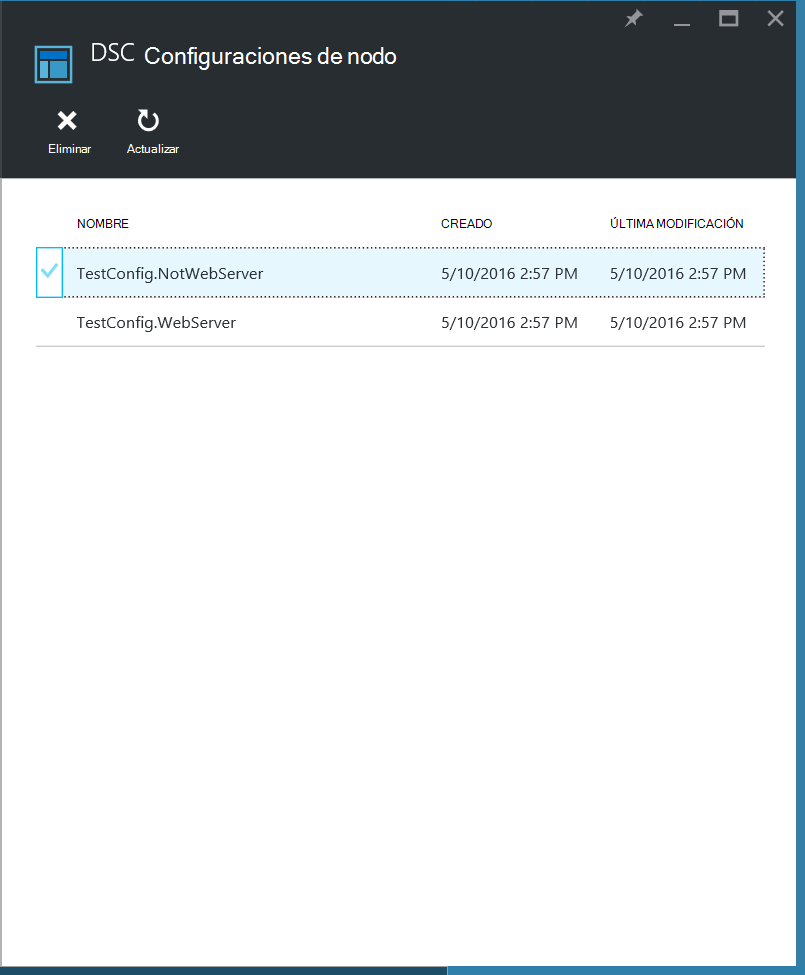
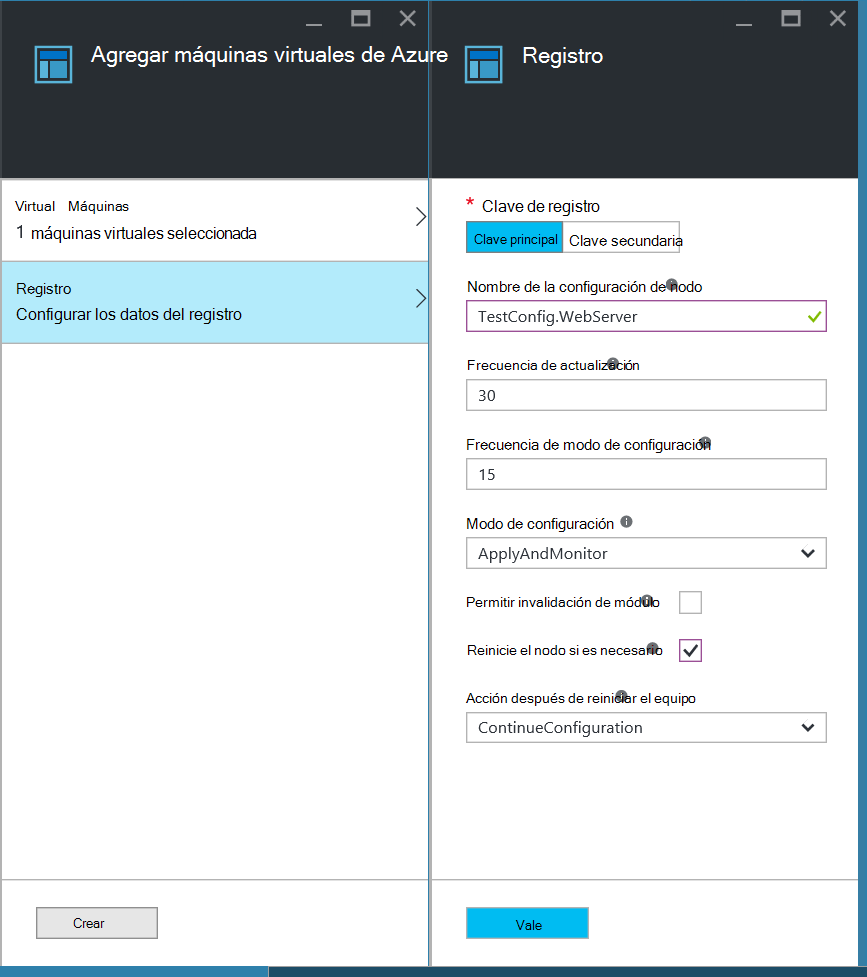
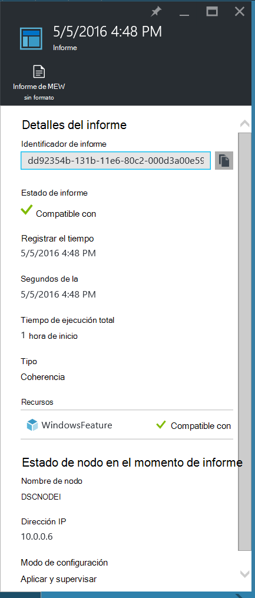
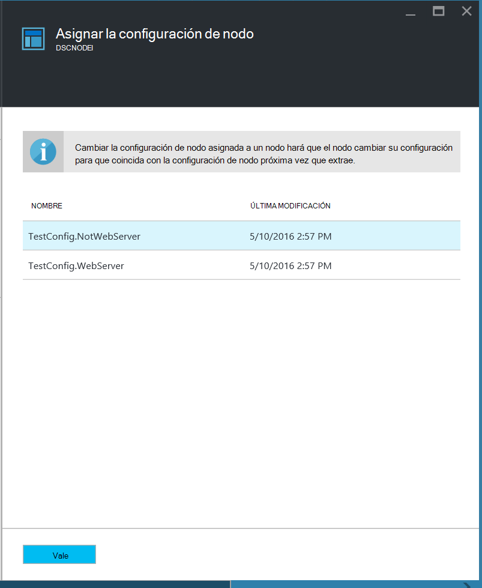
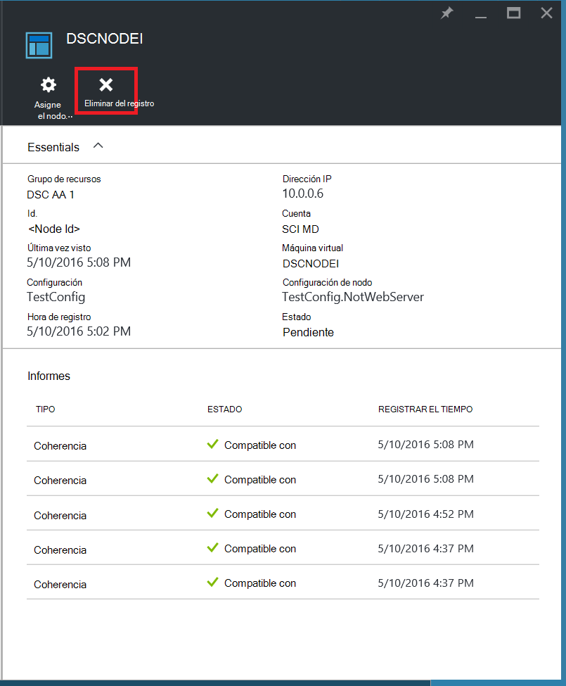

<properties
   pageTitle="Introducción a Azure automatización DSC"
   description="Explicación y ejemplos de las tareas más comunes de automatización deseado estado configuración (DSC) de Azure"
   services="automation" 
   documentationCenter="na" 
   authors="eslesar" 
   manager="dongill" 
   editor="tysonn"/>

<tags
   ms.service="automation"
   ms.devlang="na"
   ms.topic="article"
   ms.tgt_pltfrm="powershell"
   ms.workload="na" 
   ms.date="06/06/2016"
   ms.author="magoedte;eslesar"/>
   

# <a name="getting-started-with-azure-automation-dsc"></a>Introducción a Azure automatización DSC

En este tema se explica cómo realizar las tareas más comunes con Azure automatización deseado estado configuración (DSC), como crear, importar y compilar configuraciones, integrado equipos a administrar y ver informes. Para obtener información general de lo que se DSC de automatización de Azure, consulte [Introducción a Azure automatización DSC](automation-dsc-overview.md). Documentación de DSC, vea [Introducción a Windows PowerShell deseado estado configuración](https://msdn.microsoft.com/PowerShell/dsc/overview).

Este tema proporciona a una guía paso a paso para utilizar DSC de automatización de Azure. Si desea que un entorno de muestra configurar sin seguir los pasos descritos en este tema, puede usar [la siguiente plantilla ARM](https://github.com/azureautomation/automation-packs/tree/master/102-sample-automation-setup). Esta plantilla se configura un entorno de Azure automatización DSC completado, incluyendo una máquina virtual de Azure administrado por DSC de automatización de Azure.
 
## <a name="prerequisites"></a>Requisitos previos

Para completar los ejemplos de este tema, se requiere lo siguiente:

- Una cuenta de Azure automatización. Para obtener instrucciones sobre cómo crear una cuenta de Azure automatización ejecutar como, vea [Ejecutar como cuenta de Azure](automation-sec-configure-azure-runas-account.md).
- Un administrador de recursos VM Azure (no clásico) ejecutan Windows Server 2008 R2 o posterior. Para obtener instrucciones sobre cómo crear una máquina virtual, vea [crear su primera máquina virtual de Windows en el portal de Azure](../virtual-machines/virtual-machines-windows-hero-tutorial.md)

## <a name="creating-a-dsc-configuration"></a>Crear una configuración de DSC

Vamos a crear una sencilla [configuración DSC](https://msdn.microsoft.com/powershell/dsc/configurations) que garantiza la presencia o ausencia de **Servidor Web** Windows característica (IIS), dependiendo de cómo se asigne nodos.

1. Inicie Windows PowerShell ISE (o cualquier editor de texto).

2. Escriba el texto siguiente:

    ```powershell
    configuration TestConfig
    {
        Node WebServer
        {
            WindowsFeature IIS
            {
                Ensure               = 'Present'
                Name                 = 'Web-Server'
                IncludeAllSubFeature = $true

            }
        }

        Node NotWebServer
        {
            WindowsFeature IIS
            {
                Ensure               = 'Absent'
                Name                 = 'Web-Server'

            }
        }
        }
    ```
3. Guarde el archivo como `TestConfig.ps1`.

Esta configuración llama a un recurso en cada bloque de nodo [WindowsFeature recursos](https://msdn.microsoft.com/powershell/dsc/windowsfeatureresource), que garantiza la presencia o ausencia de la característica de **Servidor Web** .

## <a name="importing-a-configuration-into-azure-automation"></a>Importar una configuración a automatización de Azure

A continuación, se deberá importar la configuración de la cuenta de automatización.

1. Inicie sesión en el [portal de Azure](https://portal.azure.com).

2. En el menú de concentrador, haga clic en **todos los recursos** y, a continuación, en el nombre de su cuenta de automatización.

3. En el módulo de la **cuenta de automatización** , haga clic en **Las configuraciones de DSC**.

4. En el módulo **DSC configuraciones** , haga clic en **Agregar una configuración**.

5. En el módulo de **Configuración de importación** , vaya a la `TestConfig.ps1` archivo en su equipo.
    
    
    

6. Haga clic en **Aceptar**.

## <a name="viewing-a-configuration-in-azure-automation"></a>Visualización de una configuración de automatización de Azure

Después de importar una configuración, puede ver en el portal de Azure.

1. Inicie sesión en el [portal de Azure](https://portal.azure.com).

2. En el menú de concentrador, haga clic en **todos los recursos** y, a continuación, en el nombre de su cuenta de automatización.

3. En el módulo de la **cuenta de automatización** , haga clic en **Las configuraciones de DSC**

4. En el módulo **DSC configuraciones** , haga clic en **TestConfig** (este es el nombre de la configuración que se importan en el procedimiento anterior).

5. En el módulo **TestConfig configuración** , haga clic en **Ver código fuente de configuración**.

    
    
    Un módulo de **configuración de TestConfig origen** se abrirá el código de PowerShell para la configuración.
    
## <a name="compiling-a-configuration-in-azure-automation"></a>Compilar una configuración de automatización de Azure

Antes de aplicar un estado deseado a un nodo, una configuración de DSC definir ese estado debe compila en una o más configuraciones de nodo (documento MOF) y colocada en el servidor de automatización DSC extraer. Para obtener una descripción más detallada de compilación de configuraciones en Azure automatización DSC, vea [compilar configuraciones en Azure automatización DSC](automation-dsc-compile.md). Para obtener más información sobre la compilación de configuraciones, vea [Configuraciones de DSC](https://msdn.microsoft.com/PowerShell/DSC/configurations).

1. Inicie sesión en el [portal de Azure](https://portal.azure.com).

2. En el menú de concentrador, haga clic en **todos los recursos** y, a continuación, en el nombre de su cuenta de automatización.

3. En el módulo de la **cuenta de automatización** , haga clic en **Las configuraciones de DSC**

4. En el módulo **DSC configuraciones** , haga clic en **TestConfig** (el nombre de la configuración importada anteriormente).

5. En el módulo **TestConfig configuración** , haga clic en **compilar**y, a continuación, haga clic en **Sí**. Esto inicia un trabajo de compilación.
    
    
    
> [AZURE.NOTE] Cuando se compila una configuración de automatización de Azure, implementa automáticamente cualquier configuración de nodo creado MOFs en el servidor de extracción.

## <a name="viewing-a-compilation-job"></a>Ver un trabajo de compilación

Después de iniciar una compilación, puede ver en el mosaico de **trabajos de compilación** en el módulo de **configuración** . El mosaico de **trabajos de compilación** muestra se están ejecutando, completado y no pudo trabajos. Al abrir una hoja de trabajo de compilación, muestra información sobre ese trabajo incluidos los errores o advertencias que puedan surgir, utilizan parámetros de entrada en la configuración y compilación registros.

1. Inicie sesión en el [portal de Azure](https://portal.azure.com).

2. En el menú de concentrador, haga clic en **todos los recursos** y, a continuación, en el nombre de su cuenta de automatización.

3. En el módulo de la **cuenta de automatización** , haga clic en **Las configuraciones de DSC**.

4. En el módulo **DSC configuraciones** , haga clic en **TestConfig** (el nombre de la configuración importada anteriormente).

5. En el mosaico de **trabajos de compilación** del módulo **TestConfig configuración** , haga clic en cualquiera de los trabajos enumerados. Se abre una hoja de **Trabajo de compilación** , etiquetada con la fecha que se ha iniciado el trabajo de compilación.

    
  
6. Haga clic en cualquier icono en la hoja de **Trabajo de compilación** para ver más detalles sobre el trabajo.

## <a name="viewing-node-configurations"></a>Visualización de las configuraciones de nodo

Finalización satisfactoria de un proyecto de compilación crea una o más configuraciones de nodo nuevo. Una configuración de nodo es un documento MOF que se implementa en el servidor de extracción y listo para ser colocados y aplicar uno o más nodos. Puede ver las configuraciones de nodo en su cuenta de automatización en el módulo de **Configuraciones de nodo DSC** . Una configuración de nodo tiene un nombre con el formulario *ConfigurationName*. *NodeName*.

1. Inicie sesión en el [portal de Azure](https://portal.azure.com).

2. En el menú de concentrador, haga clic en **todos los recursos** y, a continuación, en el nombre de su cuenta de automatización.

3. En el módulo de la **cuenta de automatización** , haga clic en **Configuraciones de nodo DSC**.

    
    
## <a name="onboarding-an-azure-vm-for-management-with-azure-automation-dsc"></a>Integrado una máquina virtual de Azure para administración con DSC de automatización de Azure

Puede usar DSC de automatización de Azure para administrar máquinas virtuales de Azure (clásico y el Administrador de recursos), máquinas virtuales de local, máquinas Linux, máquinas virtuales de AWS y equipos físicos de local. En este tema, trataremos cómo incorporado máquinas virtuales de administrador de recursos Azure solo. Para obtener información sobre integrado otros tipos de equipos, vea [máquinas integrado para la administración de Azure automatización DSC](automation-dsc-onboarding.md).

### <a name="to-onboard-an-azure-resource-manager-vm-for-management-by-azure-automation-dsc"></a>Integrado a un administrador de recursos VM Azure para la administración de DSC de automatización de Azure

1. Inicie sesión en el [portal de Azure](https://portal.azure.com).

2. En el menú de concentrador, haga clic en **todos los recursos** y, a continuación, en el nombre de su cuenta de automatización.

3. En el módulo de la **cuenta de automatización** , haga clic en **Los nodos DSC**.

4. En el módulo de **Nodos DSC** , haga clic en **Agregar VM de Azure**.

    

5. En el módulo de **Agregar máquinas virtuales de Azure** , haga clic en **Seleccionar máquinas virtuales integrado**.

6. En el módulo **Seleccione VM** , seleccione la máquina virtual que desea integrada y haga clic en **Aceptar**.

    >[AZURE.IMPORTANT] Debe ser un administrador de recursos VM Azure ejecutan Windows Server 2008 R2 o posterior.
    
7. En el módulo de **Agregar máquinas virtuales de Azure** , haga clic en **Configurar datos de registro**.

8. En el módulo de **registro** , escriba el nombre de la configuración de nodo que desea aplicar a la máquina virtual en el cuadro **Nombre de la configuración de nodo** . Debe coincidir exactamente con el nombre de una configuración de nodos en la cuenta de automatización. Proporcionar un nombre en este momento es opcional. Puede cambiar la configuración de nodo asignada después integrado el nodo.
Comprobar **Nodo reiniciar si es necesario**y, a continuación, haga clic en **Aceptar**.
    
    
    
    La configuración de nodo especificada se aplicará a la máquina virtual en intervalos especificados por la **Frecuencia de modo de configuración**y la máquina virtual buscará las actualizaciones a la configuración de nodos en intervalos especificados por la **Frecuencia de actualización**. Para obtener más información acerca de cómo se usan estos valores, vea [Configurar el Administrador de configuración Local](https://msdn.microsoft.com/PowerShell/DSC/metaConfig).
    
9. En el módulo de **Agregar máquinas virtuales de Azure** , haga clic en **crear**.

Azure iniciará el proceso de incorporación de la máquina virtual. Cuando esté completa, la máquina virtual aparecerá en el módulo **DSC nodos** en la cuenta de automatización.

## <a name="viewing-the-list-of-dsc-nodes"></a>Ver la lista de nodos de DSC

Puede ver la lista de todos los equipos que se han onboarded para la administración de su cuenta de automatización en el módulo de **Nodos DSC** .

1. Inicie sesión en el [portal de Azure](https://portal.azure.com).

2. En el menú de concentrador, haga clic en **todos los recursos** y, a continuación, en el nombre de su cuenta de automatización.

3. En el módulo de la **cuenta de automatización** , haga clic en **Los nodos DSC**.

## <a name="viewing-reports-for-dsc-nodes"></a>Visualización de informes de nodos de DSC

Cada vez que Azure automatización DSC realiza una comprobación de coherencia en un nodo gestionado, el nodo envía un informe de estado en el servidor de extracción. Puede ver estos informes en el módulo para ese nodo.

1. Inicie sesión en el [portal de Azure](https://portal.azure.com).

2. En el menú de concentrador, haga clic en **todos los recursos** y, a continuación, en el nombre de su cuenta de automatización.

3. En el módulo de la **cuenta de automatización** , haga clic en **Los nodos DSC**.

4. En el mosaico de **informes** , haga clic en cualquiera de los informes en la lista.

    

En el módulo de un informe individual, puede ver la siguiente información de estado de la comprobación de coherencia correspondientes:

- El estado del informe: si el nodo es "Compatible", la configuración de "Error", o "el nodo no es compatible con" (cuando el nodo está en modo de **applyandmonitor** y el equipo no está en el estado deseado).
- Hora de inicio de la comprobación de coherencia.
- Tiempo de ejecución total para la comprobación de coherencia.
- El tipo de comprobación de coherencia.
- Los errores, incluido el código de error y el mensaje de error. 
- Los recursos de DSC utilizados en la configuración y el estado de cada recurso (si el nodo está en el estado de ese recurso deseado), puede hacer clic en cada recurso para obtener información más detallada para ese recurso.
- El nombre, la dirección IP y el modo de configuración del nodo.

También puede hacer clic en **Ver informe sin formato** para ver los datos reales que el nodo envía al servidor. Para obtener más información sobre el uso de datos, vea [usar un servidor de informes de DSC](https://msdn.microsoft.com/powershell/dsc/reportserver).

Puede tardar algún tiempo después de un nodo onboarded antes del primer informe esté disponible. Es posible que deba esperar hasta 30 minutos para el primer informe después de incorporado un nodo.

## <a name="reassigning-a-node-to-a-different-node-configuration"></a>Reasignación de un nodo a una configuración de nodo diferente

Puede asignar un nodo para usar una configuración de nodo diferente a la que se asigna inicialmente.

1. Inicie sesión en el [portal de Azure](https://portal.azure.com).

2. En el menú de concentrador, haga clic en **todos los recursos** y, a continuación, en el nombre de su cuenta de automatización.

3. En el módulo de la **cuenta de automatización** , haga clic en **Los nodos DSC**.

4. En el módulo de **Nodos DSC** , haga clic en el nombre del nodo que desee reasignar.

5. En el módulo para ese nodo, haga clic en **asignar nodo**.

    

6. En el módulo de **Asignar nodo Configuración** , seleccione la configuración de nodo al que desea asignar el nodo y, a continuación, haga clic en **Aceptar**.

    
    
## <a name="unregistering-a-node"></a>Anular el registro de un nodo

Si ya no desea que un nodo administre DSC de automatización de Azure, puede eliminarla.

1. Inicie sesión en el [portal de Azure](https://portal.azure.com).

2. En el menú de concentrador, haga clic en **todos los recursos** y, a continuación, en el nombre de su cuenta de automatización.

3. En el módulo de la **cuenta de automatización** , haga clic en **Los nodos DSC**.

4. En el módulo de **Nodos DSC** , haga clic en el nombre del nodo que desea quitar.

5. En el módulo para ese nodo, haga clic en **Anular registro**.

    

## <a name="related-articles"></a>Artículos relacionados
* [Información general de automatización DSC Azure](automation-dsc-overview.md)
* [Máquinas integrado para la administración de DSC de automatización de Azure](automation-dsc-onboarding.md)
* [Windows PowerShell deseado Introducción a la configuración de estado](https://msdn.microsoft.com/powershell/dsc/overview)
* [Cmdlets de Azure DSC de automatización](https://msdn.microsoft.com/library/mt244122.aspx)
* [Precios de Azure DSC de automatización](https://azure.microsoft.com/pricing/details/automation/)

