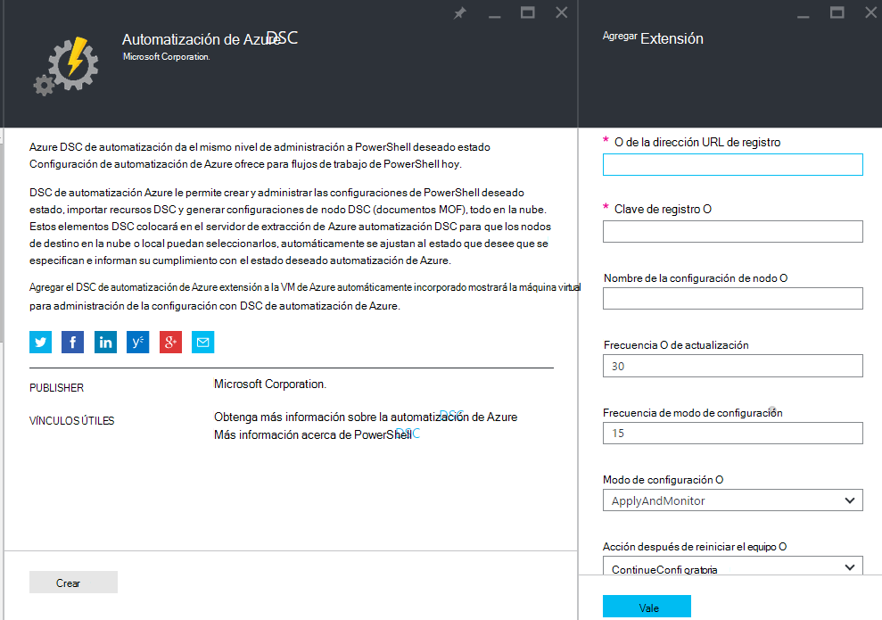
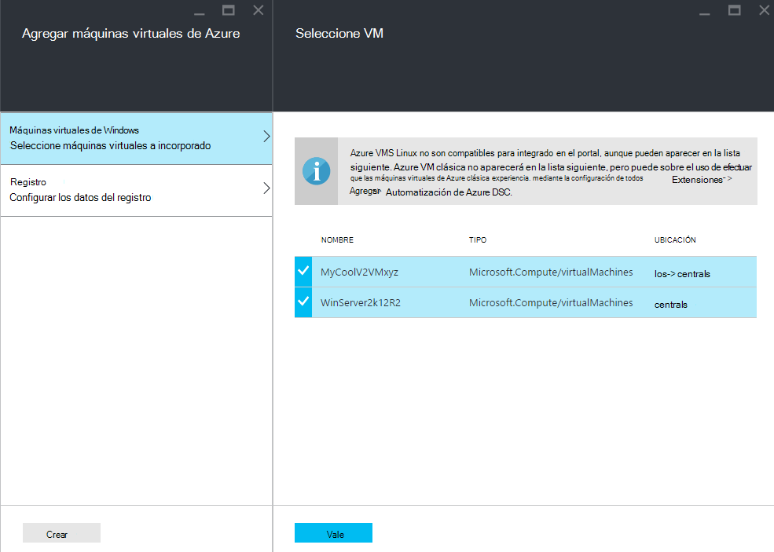
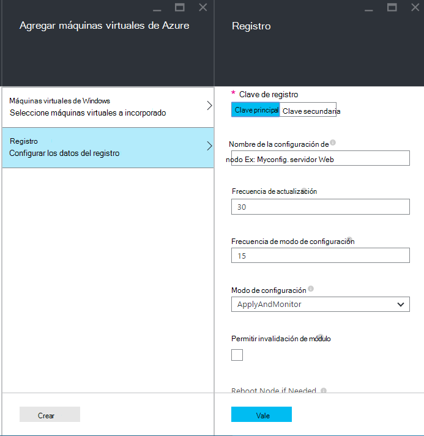
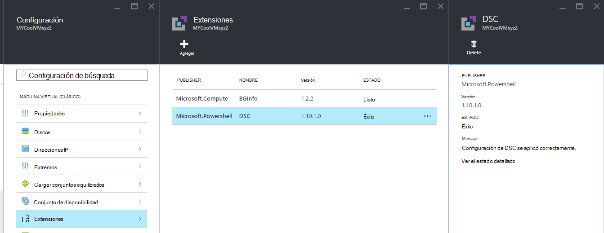

<properties 
   pageTitle="Integrado físicos y máquinas virtuales para la administración de Azure automatización DSC | Microsoft Azure" 
   description="Cómo configurar los equipos de administración con DSC de automatización de Azure" 
   services="automation" 
   documentationCenter="dev-center-name" 
   authors="coreyp-at-msft" 
   manager="stevenka" 
   editor="tysonn"/>

<tags
   ms.service="automation"
   ms.devlang="NA"
   ms.topic="article"
   ms.tgt_pltfrm="powershell"
   ms.workload="TBD" 
   ms.date="04/22/2016"
   ms.author="coreyp"/>

# Máquinas integrado para la administración de DSC de automatización de Azure

## ¿Por qué administrar equipos con DSC de automatización de Azure?

Como la [Configuración de estado de PowerShell deseado](https://technet.microsoft.com/library/dn249912.aspx), la configuración de estado deseado de Azure automatización es un servicio de administración de configuración sencilla pero efectiva, para los nodos de DSC (físicos y máquinas virtuales) en los centros de datos de nube o local. Escalabilidad le permite en miles de equipos rápida y fácilmente desde una ubicación central y segura. Puede fácilmente incorporados máquinas, asignar ellos configuraciones descriptiva y ver informes que muestra cada equipo del cumplimiento el estado deseado especificado. La capa de administración de Azure automatización DSC es DSC ¿cuál es el nivel de administración de automatización de Azure secuencias de comandos de PowerShell. En otras palabras, en la misma manera que la automatización de Azure le ayuda a administrar los scripts de PowerShell, sino también para administrar las configuraciones de DSC. Para obtener más información sobre las ventajas de usar DSC de automatización de Azure, consulte [Introducción a Azure automatización DSC](automation-dsc-overview.md). 

DSC de automatización Azure puede usarse para administrar una gran variedad de equipos:

*    Azure máquinas virtuales de Windows (clásico)
*    Máquinas virtuales de Windows Azure
*    Máquinas virtuales de servicios Web de Amazon (AWS)
*    Windows físico/virtual equipos local, o en una nube que no sea de Azure/AWS
*    Físico/virtual Linux equipos local, en Azure o en una nube que no sea de Azure

Además, si no está listo para administrar la configuración del equipo de la nube, Azure automatización DSC puede utilizarse también como un punto final de informe. Esto le permite establecer configuración deseada de (push) a través de DSC local y ver los detalles de generación de informes enriquecidos de cumplimiento de nodo con el estado deseado en la automatización de Azure.

Las siguientes secciones describen cómo puede bordo cada tipo de máquina a Azure automatización DSC.

## Azure máquinas virtuales de Windows (clásico)

Con DSC de automatización de Azure, puede fácilmente incorporado Azure máquinas virtuales de Windows (clásico) para la administración de la configuración con el portal de Azure o PowerShell. Mostrar opciones avanzadas y sin tener que remoto en la máquina virtual de administrador, la extensión de configuración de estado deseado de Azure VM registra la máquina virtual con DSC de automatización de Azure. Dado que la extensión de configuración de estado deseado de Azure VM asincrónica, ejecuta pasos para realizar un seguimiento de su progreso o solución de problemas se proporcionan en la sección de [**solución de problemas de Azure máquina virtual integrado**](#troubleshooting-azure-virtual-machine-onboarding) .

### Portal de Azure

En el [portal de Azure](http://portal.azure.com/), haga clic en **Examinar** -> **máquinas virtuales de Windows (clásico)**. Seleccione la máquina virtual de Windows que desea integrado. En el módulo de paneles de la máquina virtual, haga clic en **configuración de todos los** -> **extensiones** -> **Agregar** -> **Azure automatización DSC** -> **crear**. Escriba los [valores del Administrador de configuración de PowerShell DSC Local](https://msdn.microsoft.com/powershell/dsc/metaconfig4) necesaria para que el caso de uso, clave de registro de la cuenta de automatización y URL de registro y, opcionalmente, una configuración de nodo para asignar a la máquina virtual.

Para encontrar el registro dirección URL y clave para la automatización de la cuenta a bordo el equipo para, vea la sección [**proteger el registro**](#secure-registration) .

### PowerShell

    # log in to both Azure Service Management and Azure Resource Manager
    Add-AzureAccount
    Add-AzureRmAccount
    
    # fill in correct values for your VM/Automation account here
    $VMName = ""
    $ServiceName = ""
    $AutomationAccountName = ""
    $AutomationAccountResourceGroup = ""

    # fill in the name of a Node Configuration in Azure Automation DSC, for this VM to conform to
    $NodeConfigName = ""

    # get Azure Automation DSC registration info
    $Account = Get-AzureRmAutomationAccount -ResourceGroupName $AutomationAccountResourceGroup -Name $AutomationAccountName
    $RegistrationInfo = $Account | Get-AzureRmAutomationRegistrationInfo

    # use the DSC extension to onboard the VM for management with Azure Automation DSC
    $VM = Get-AzureVM -Name $VMName -ServiceName $ServiceName
    
    $PublicConfiguration = ConvertTo-Json -Depth 8 @{
      SasToken = ""
      ModulesUrl = "https://eus2oaasibizamarketprod1.blob.core.windows.net/automationdscpreview/RegistrationMetaConfigV2.zip"
      ConfigurationFunction = "RegistrationMetaConfigV2.ps1\RegistrationMetaConfigV2"

    # update these PowerShell DSC Local Configuration Manager defaults if they do not match your use case.
    # See https://technet.microsoft.com/library/dn249922.aspx?f=255&MSPPError=-2147217396 for more details
     Properties = @{
        RegistrationKey = @{
          UserName = 'notused'
          Password = 'PrivateSettingsRef:RegistrationKey'
        }
        RegistrationUrl = $RegistrationInfo.Endpoint
        NodeConfigurationName = $NodeConfigName
        ConfigurationMode = "ApplyAndMonitor"
        ConfigurationModeFrequencyMins = 15
        RefreshFrequencyMins = 30
        RebootNodeIfNeeded = $False
        ActionAfterReboot = "ContinueConfiguration"
        AllowModuleOverwrite = $False
      }
    }

    $PrivateConfiguration = ConvertTo-Json -Depth 8 @{
      Items = @{
         RegistrationKey = $RegistrationInfo.PrimaryKey
      }
    }
    
    $VM = Set-AzureVMExtension `
     -VM $vm `
     -Publisher Microsoft.Powershell `
     -ExtensionName DSC `
     -Version 2.19 `
     -PublicConfiguration $PublicConfiguration `
     -PrivateConfiguration $PrivateConfiguration `
     -ForceUpdate

    $VM | Update-AzureVM

## Máquinas virtuales de Windows Azure

DSC de automatización Azure le permite fácilmente incorporado Azure máquinas virtuales de Windows para la administración de configuración, con el portal de Azure, plantillas de administrador de recursos de Azure o PowerShell. Mostrar opciones avanzadas y sin tener que remoto en la máquina virtual de administrador, la extensión de configuración de estado deseado de Azure VM registra la máquina virtual con DSC de automatización de Azure. Dado que la extensión de configuración de estado deseado de Azure VM asincrónica, ejecuta pasos para realizar un seguimiento de su progreso o solución de problemas se proporcionan en la sección de [**solución de problemas de Azure máquina virtual integrado**](#troubleshooting-azure-virtual-machine-onboarding) .

### Portal de Azure

En el [portal de Azure](https://portal.azure.com/), vaya a la cuenta de Azure automatización donde desea incorporado máquinas virtuales de Windows. En el panel de la cuenta con la automatización, haga clic en **Los nodos de DSC** -> **Agregar VM de Azure**.

En **Seleccione máquinas virtuales integrado**, seleccione uno o varios equipos virtuales Azure a incorporado.

En **Configurar datos de registro**, escriba los [valores del Administrador de configuración de PowerShell DSC Local](https://msdn.microsoft.com/powershell/dsc/metaconfig4) necesarios para que el uso de mayúsculas y minúsculas y, opcionalmente, una configuración de nodo para asignar a la máquina virtual.

 
### Plantillas de administrador de recursos de Azure

Puede implementar máquinas virtuales de Windows Azure y onboarded a Azure automatización DSC a través de plantillas de administrador de recursos de Azure. Vea [Configurar una máquina virtual a través de extensión DSC y Azure automatización DSC](https://azure.microsoft.com/documentation/templates/dsc-extension-azure-automation-pullserver/) para un ejemplo de plantilla que onboards una máquina virtual existente a Azure automatización DSC. Para buscar la clave de registro y la dirección URL de registro toma como entrada en esta plantilla, consulte la sección [**proteger el registro**](#secure-registration) siguiente.

### PowerShell

El cmdlet [Registrar AzureRmAutomationDscNode](https://msdn.microsoft.com/library/mt603833.aspx) puede usarse para incorporado máquinas virtuales de Windows en el portal de Azure a través de PowerShell.

## Máquinas virtuales de servicios Web de Amazon (AWS)

Puede fácilmente incorporados máquinas virtuales de servicios Web de Amazon para administración de la configuración por Azure automatización DSC utilizando el Kit de herramientas de DSC AWS. Puede obtener más información sobre el Kit de herramientas [aquí](https://blogs.msdn.microsoft.com/powershell/2016/04/20/aws-dsc-toolkit/).

## Windows físico/virtual equipos local, o en una nube que no sea de Azure/AWS

Equipos con Windows local y equipos de Windows Azure no nubes (por ejemplo, servicios Web de Amazon) también pueden ser onboarded a Azure automatización DSC, siempre y cuando tengan acceso de salida a internet, mediante unos sencillos pasos:

1. Asegúrese de que la última versión de [WMF 5](http://aka.ms/wmf5latest) está instalada en los equipos que desea incorporados a Azure automatización DSC.
2. Siga las instrucciones en la sección [**Generar DSC metaconfigurations**](#generating-dsc-metaconfigurations) siguiente para generar una carpeta que contenga la metaconfigurations DSC necesarios.
3. Aplicar la metaconfiguration PowerShell DSC de forma remota a los equipos que desea incorporado. **El equipo de que se ejecuta este comando debe tener la última versión de [5 WMF](http://aka.ms/wmf5latest) instalado**:

    `Set-DscLocalConfigurationManager -Path C:\Users\joe\Desktop\DscMetaConfigs -ComputerName MyServer1, MyServer2`

4. Si no puede aplicar la metaconfigurations DSC de PowerShell de forma remota, copie la carpeta de metaconfigurations desde el paso 2 en cada equipo a incorporado. A continuación, llame a **DscLocalConfigurationManager conjunto** localmente en cada equipo para integrado.
5. Usar los cmdlets o el portal de Azure, compruebe que los equipos a incorporado ahora se muestran como nodos DSC registrados en la cuenta de automatización de Azure.

## Físico/virtual Linux equipos local, en Azure o en una nube que no sea de Azure

Equipos de Linux local, equipos de Linux en Azure y equipos Linux en Azure no nubes también pueden ser onboarded a Azure automatización DSC, siempre y cuando tengan acceso de salida a internet, mediante unos sencillos pasos:

1. Asegúrese de que la versión más reciente del [agente de DSC Linux](http://www.microsoft.com/download/details.aspx?id=49150) está instalada en los equipos que desea incorporados a Azure automatización DSC.

2. Si los [valores predeterminados del Administrador de configuración de PowerShell DSC Local](https://msdn.microsoft.com/powershell/dsc/metaconfig4) que coincida con el uso de mayúsculas y minúsculas y desea a incorporado máquinas tal que **tanto extraer de Azure automatización DSC de informe** :

    *    En cada equipo Linux a incorporado a Azure automatización DSC, use Register.py para integrada con los valores predeterminados del Administrador de configuración de PowerShell DSC Local:

        `/opt/microsoft/dsc/Scripts/Register.py <Automation account registration key> <Automation account registration URL>`

    *    Para buscar la clave de registro y la dirección URL de registro para su cuenta de automatización, vea la sección [**proteger el registro**](#secure-registration) siguiente.

    Si el Administrador de configuración de PowerShell DSC Local predeterminado es **hacer** **coinciden con el uso de mayúsculas y minúsculas, o desea máquinas incorporados tal que solo de informe DSC de automatización de Azure** , pero no la configuración de extracción no o módulos de PowerShell de él, siga los pasos 3 a 6. De lo contrario, vaya directamente al paso 6.

3.  Siga las instrucciones de la sección [**Generar DSC metaconfigurations**](#generating-dsc-metaconfigurations) para generar una carpeta que contenga la metaconfigurations DSC necesarios.
4.  Aplicar la metaconfiguration PowerShell DSC de forma remota a los equipos que desea incorporado:
        
        $SecurePass = ConvertTo-SecureString -String "<root password>" -AsPlainText -Force
        $Cred = New-Object System.Management.Automation.PSCredential "root", $SecurePass
        $Opt = New-CimSessionOption -UseSsl -SkipCACheck -SkipCNCheck -SkipRevocationCheck

        # need a CimSession for each Linux machine to onboard
        
        $Session = New-CimSession -Credential $Cred -ComputerName <your Linux machine> -Port 5986 -Authentication basic -SessionOption $Opt
        
        Set-DscLocalConfigurationManager -CimSession $Session –Path C:\Users\joe\Desktop\DscMetaConfigs
    
El equipo de que se ejecuta este comando debe tener la última versión de [WMF 5](http://aka.ms/wmf5latest) instalado.

5.  Si no puede aplicar la metaconfigurations DSC de PowerShell de forma remota, para cada equipo Linux incorporado, copie la metaconfiguration correspondiente a ese equipo desde la carpeta en el paso 5 en el equipo de Linux. A continuación, llame a `SetDscLocalConfigurationManager.py` localmente en cada equipo Linux que desee a incorporado a Azure automatización DSC:

    `/opt/microsoft/dsc/Scripts/SetDscLocalConfigurationManager.py –configurationmof <path to metaconfiguration file>`

6.  Usar los cmdlets o el portal de Azure, compruebe que los equipos a incorporado ahora se muestran como nodos DSC registrados en la cuenta de automatización de Azure.

##Generar DSC metaconfigurations
Para genérica incorporado cualquier equipo para Azure automatización DSC, que puede ser un metaconfiguration DSC genera que, cuando se aplica, indica el agente de DSC en el equipo para extraer de o informe a Azure automatización DSC. DSC metaconfigurations para Azure automatización DSC se pueden generar mediante una configuración de PowerShell DSC o los cmdlets de PowerShell de automatización de Azure.

**Nota:** DSC metaconfigurations contienen la información confidencial es necesario a incorporado una máquina de una automatización de la cuenta para la administración. Asegúrese de proteger correctamente cualquier metaconfigurations DSC que crea o eliminarlos después de su uso.

###Usar una configuración de DSC
1.  Abra el PowerShell ISE como administrador en un equipo en su entorno local. El equipo debe tener la última versión de [WMF 5](http://aka.ms/wmf5latest) instalado.

2.  Copie la siguiente secuencia de comandos localmente. Esta secuencia de comandos contiene una configuración de PowerShell DSC para crear metaconfigurations y un comando para empezar la creación de metaconfiguration.
    
        # The DSC configuration that will generate metaconfigurations
        [DscLocalConfigurationManager()]
        Configuration DscMetaConfigs 
        { 
            param 
            ( 
                [Parameter(Mandatory=$True)] 
                [String]$RegistrationUrl,
         
                [Parameter(Mandatory=$True)] 
                [String]$RegistrationKey,

                [Parameter(Mandatory=$True)] 
                [String[]]$ComputerName,

                [Int]$RefreshFrequencyMins = 30, 
            
                [Int]$ConfigurationModeFrequencyMins = 15, 
            
                [String]$ConfigurationMode = "ApplyAndMonitor", 
            
                [String]$NodeConfigurationName,

                [Boolean]$RebootNodeIfNeeded= $False,

                [String]$ActionAfterReboot = "ContinueConfiguration",

                [Boolean]$AllowModuleOverwrite = $False,

                [Boolean]$ReportOnly
            )

    
            if(!$NodeConfigurationName -or $NodeConfigurationName -eq "") 
            { 
                $ConfigurationNames = $null 
            } 
            else 
            { 
                $ConfigurationNames = @($NodeConfigurationName) 
            }

            if($ReportOnly)
            {
               $RefreshMode = "PUSH"
            }
            else
            {
               $RefreshMode = "PULL"
            }

            Node $ComputerName
            {

                Settings 
                { 
                    RefreshFrequencyMins = $RefreshFrequencyMins 
                    RefreshMode = $RefreshMode 
                    ConfigurationMode = $ConfigurationMode 
                    AllowModuleOverwrite = $AllowModuleOverwrite 
                    RebootNodeIfNeeded = $RebootNodeIfNeeded 
                    ActionAfterReboot = $ActionAfterReboot 
                    ConfigurationModeFrequencyMins = $ConfigurationModeFrequencyMins 
                }

                if(!$ReportOnly)
                {
                   ConfigurationRepositoryWeb AzureAutomationDSC 
                    { 
                        ServerUrl = $RegistrationUrl 
                        RegistrationKey = $RegistrationKey 
                        ConfigurationNames = $ConfigurationNames 
                    }

                    ResourceRepositoryWeb AzureAutomationDSC 
                    { 
                       ServerUrl = $RegistrationUrl 
                       RegistrationKey = $RegistrationKey 
                    }
                }

                ReportServerWeb AzureAutomationDSC 
                { 
                    ServerUrl = $RegistrationUrl 
                    RegistrationKey = $RegistrationKey 
                }
            } 
        }
        
        # Create the metaconfigurations
        # TODO: edit the below as needed for your use case
        $Params = @{
             RegistrationUrl = '<fill me in>';
             RegistrationKey = '<fill me in>';
             ComputerName = @('<some VM to onboard>', '<some other VM to onboard>');
             NodeConfigurationName = 'SimpleConfig.webserver';
             RefreshFrequencyMins = 30;
             ConfigurationModeFrequencyMins = 15;
             RebootNodeIfNeeded = $False;
             AllowModuleOverwrite = $False;
             ConfigurationMode = 'ApplyAndMonitor';
             ActionAfterReboot = 'ContinueConfiguration';
             ReportOnly = $False;  # Set to $True to have machines only report to AA DSC but not pull from it
        }
        
        # Use PowerShell splatting to pass parameters to the DSC configuration being invoked
        # For more info about splatting, run: Get-Help -Name about_Splatting
        DscMetaConfigs @Params

3.  Escriba la clave de registro y la dirección URL para su cuenta de automatización, así como los nombres de los equipos a incorporado. Todos los demás parámetros son opcionales. Para buscar la clave de registro y la dirección URL de registro para su cuenta de automatización, vea la sección [**proteger el registro**](#secure-registration) siguiente.

4.  Si desea que los equipos a información de estado de DSC a Azure automatización DSC de informe, pero no extraer configuración o módulos de PowerShell, establezca el parámetro **ReportOnly** en true.

5.  Ejecute la secuencia de comandos. Ahora debería tener una carpeta denominada **DscMetaConfigs** en el directorio de trabajo que contiene el metaconfigurations DSC de PowerShell para los equipos a incorporado.

###Uso de los cmdlets de automatización de Azure
Si los valores predeterminados del Administrador de configuración de PowerShell DSC Local que coincida con el uso de mayúsculas y minúsculas y desea máquinas integradas que extraer de y notificar a Azure automatización DSC, los cmdlets de automatización de Azure proporcionan un método simplificado de generar la metaconfigurations DSC es necesario:

1.  Abra la consola de PowerShell o PowerShell ISE como administrador en un equipo en su entorno local.

2.  Conectarse al administrador del recurso de Azure con **Agregar AzureRmAccount**

3.  Descargar el metaconfigurations DSC de PowerShell para los equipos que desee a incorporado desde la cuenta de automatización al que desea nodos incorporados:

        # Define the parameters for Get-AzureRmAutomationDscOnboardingMetaconfig using PowerShell Splatting
        $Params = @{
            ResourceGroupName = 'ContosoResources'; # The name of the ARM Resource Group that contains your Azure Automation Account
            AutomationAccountName = 'ContosoAutomation'; # The name of the Azure Automation Account where you want a node on-boarded to
            ComputerName = @('web01', 'web02', 'sql01'); # The names of the computers that the meta configuration will be generated for
            OutputFolder = "$env:UserProfile\Desktop\";
        }
        
        # Use PowerShell splatting to pass parameters to the Azure Automation cmdlet being invoked
        # For more info about splatting, run: Get-Help -Name about_Splatting
        Get-AzureRmAutomationDscOnboardingMetaconfig @Params

Ahora debería tener una carpeta denominada ***DscMetaConfigs***, que contiene la metaconfigurations DSC de PowerShell para los equipos a incorporado.

##Proteger el registro

Máquinas pueden segura incorporada a una cuenta de Azure automatización mediante el protocolo de registro WMF 5 DSC, que permite a un nodo DSC autenticar a un servidor de PowerShell DSC V2 extraer o informes (incluyendo Azure automatización DSC). El nodo se registra en el servidor en una **Dirección URL de registro**, autenticar mediante una **clave de registro**. Durante el registro, el nodo DSC y el servidor de extracción y elaboración de informes de DSC negocian un certificado único para este nodo usar para la autenticación en el registro posterior a la del servidor. Este proceso impide que los nodos de onboarded de suplantación uno que otra, por ejemplo, si un nodo está comprometida y comporta malintencionada. Después de registrarse, la clave de registro no se usa para la autenticación de nuevo y se elimina el nodo.

Puede obtener la información necesaria para el protocolo de registro DSC desde el módulo de **Administrar claves** en el portal de vista previa de Azure. Abra este módulo haciendo clic en el icono de llave en el panel de **Essentials** para la cuenta de automatización.

*    Dirección URL de registro es el campo dirección URL en el módulo de administración de claves.
*    Clave de registro es la clave principal de Access o acceso secundario en el módulo de administración de claves. Puede utilizarse cualquier tecla.

Para una mayor seguridad, pueden volver a generar las teclas de acceso principal y secundario de una cuenta de automatización en cualquier momento (en el módulo de **Administración de claves** ) para evitar que los registros de nodo futuras con claves anteriores.

##Solución de problemas de Azure máquina virtual integrado

DSC de automatización Azure le permite fácilmente incorporado máquinas virtuales de Windows Azure para administración de la configuración. Mostrar opciones avanzadas, se usa la extensión de configuración de estado deseado de Azure VM para registrar la máquina virtual con DSC de automatización de Azure. Puesto que la extensión de configuración de estado deseado de Azure VM se ejecuta de forma asincrónica, realizar el seguimiento de su progreso y solución de problemas de su ejecución pueden ser importantes. 

>[AZURE.NOTE] Cualquier método de incorporación de una máquina virtual de Windows Azure a Azure DSC de automatización que usa la extensión de configuración de estado deseado de Azure VM podría tardar hasta una hora para el nodo mostrar hasta registrado en la automatización de Azure. Esto es debido a la instalación de Windows Management Framework 5.0 en la máquina virtual por la extensión de Azure VM DSC, que es necesaria a incorporado la VM DSC de automatización de Azure.

Para solucionar problemas o ver el estado de la extensión de configuración de estado deseado de Azure VM, en la Azure portal vaya a la máquina virtual está onboarded y luego haga clic -> **configuración de todos los** -> **extensiones** -> **DSC**. Para obtener más detalles, haga clic en **Ver el estado detallado**.

## Nuevo registro y expiración de certificado

Después de registrar una máquina como nodo DSC en Azure automatización DSC, hay varios motivos por qué debe volver a registrar ese nodo en el futuro:

* Después de registrar, cada nodo negocia automáticamente un único certificado de autenticación que caduca después de un año. Actualmente, el protocolo de registro de PowerShell DSC no renovará automáticamente certificados cuando se está acercando a expiración, por lo que necesita volver a registrar los nodos después de tiempo de un año. Antes de volver a registrar, asegúrese de que cada nodo está ejecutando Windows Management Framework 5.0 RTM. Si expira el certificado de autenticación de un nodo y no es volver a registrar el nodo, el nodo no puede comunicarse con la automatización de Azure y se marcarán 'Unresponsive'. Nuevo registro realizado 90 días o menos desde la fecha de expiración del certificado, o en cualquier momento después de la fecha de expiración del certificado, se producirá un nuevo certificado que se genera y utiliza.

* Para cambiar los [valores del Administrador de configuración de PowerShell DSC Local](https://msdn.microsoft.com/powershell/dsc/metaconfig4) que se estableció durante el registro inicial del nodo, como ConfigurationMode. Actualmente, estos valores de agente DSC sólo se puede cambiar mediante el nuevo registro. La única excepción es la configuración de nodos asignados al nodo: Esto puede cambiar en Azure automatización DSC directamente.

Puede realizar el nuevo registro de la misma manera que haya registrado el nodo inicialmente, con cualquiera de los métodos de integrado descritos en este documento. No es necesario anular el registro de un nodo de Azure DSC de automatización antes de volver a registrar él.

## Artículos relacionados
* [Información general de automatización DSC Azure](automation-dsc-overview.md)
* [Cmdlets de Azure DSC de automatización](https://msdn.microsoft.com/library/mt244122.aspx)
* [Precios de Azure DSC de automatización](https://azure.microsoft.com/pricing/details/automation/)

