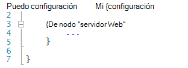
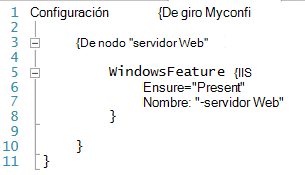
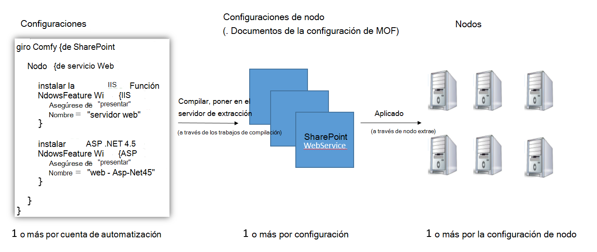
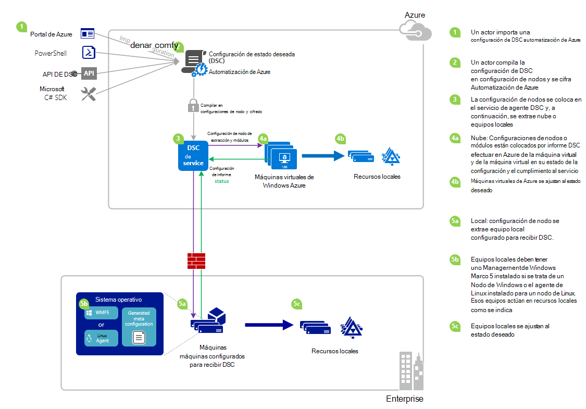

<properties 
   pageTitle="Información general de automatización Azure DSC | Microsoft Azure" 
   description="Una descripción general de Azure automatización deseado estado configuración (DSC), sus términos y problemas conocidos" 
   services="automation" 
   documentationCenter="dev-center-name" 
   authors="coreyp-at-msft" 
   manager="stevenka" 
   editor="tysonn"
   keywords="PowerShell dsc, la configuración de estado deseado, azure dsc de powershell"/>

<tags
   ms.service="automation"
   ms.devlang="NA"
   ms.topic="article"
   ms.tgt_pltfrm="powershell"
   ms.workload="TBD" 
   ms.date="05/10/2016"
   ms.author="magoedte;coreyp"/>

# Información general de DSC de automatización de Azure #

##¿Qué es DSC de automatización de Azure?##
Implementar y mantener el estado de los servidores y recursos de la aplicación que quiera pueden ser pesados llevar a errores. Con Azure automatización deseado estado configuración (DSC), puede implementar de forma uniforme, confiable supervisar y actualizar automáticamente el estado de todos los recursos de TI a escala de la nube deseado. Basado en DSC de PowerShell, automatización DSC puede alinear configuración del equipo con un estado específico a través de físicos y máquinas virtuales (VM), con Windows o Linux y en la nube o local. Puede habilitar la entrega de servicios de TI continuo con control coherente y administrar rápidos cambios en su entorno de TI de heterogéneo híbrido con facilidad.

DSC de automatización Azure se basa en los conceptos básicos que introdujo en DSC de PowerShell para proporcionar una experiencia de administración de configuración aún más fácil. Azure DSC de automatización lleva el mismo nivel de administración [Configuración de estado deseado PowerShell](https://msdn.microsoft.com/powershell/dsc/overview) ofrece automatización de Azure para scripts de PowerShell hoy.

DSC de automatización Azure le permite [crear y administrar las configuraciones de PowerShell deseado estado](https://technet.microsoft.com/library/dn249918.aspx), importar [Recursos DSC](https://technet.microsoft.com/library/dn282125.aspx)y generar configuraciones de nodo de DSC (documentos MOF), todo en la nube. Estos elementos de DSC se colocarán en la automatización de Azure [DSC extraer server](https://technet.microsoft.com/library/dn249913.aspx) para que los nodos de destino (por ejemplo, físicos y máquinas virtuales) en la nube o local puedan seleccionarlos, automáticamente se ajustan al estado que desee que se especifican e informan su cumplimiento con el estado deseado automatización de Azure.

¿Prefiere ver para lectura? Eche un vistazo a la debajo de vídeo de mayo de 2015, se presentó por primera vez cuando DSC de automatización de Azure. **Nota:** Aunque los conceptos y el ciclo de vida analizados en este vídeo son correctos, Azure automatización DSC progreso mucho puesto que se registra en este vídeo. Ahora está disponible de forma general, tiene una interfaz de usuario mucho más amplio en el portal de Azure y admite muchas funciones adicionales.

> [AZURE.VIDEO microsoft-ignite-2015-heterogeneous-configuration-management-using-microsoft-azure-automation]

## Términos de automatización Azure DSC ##
### Configuración ###
DSC de PowerShell presentó un nuevo concepto denominado configuraciones. Configuraciones permiten definir a través de la sintaxis de PowerShell, el estado deseado del entorno. Para usar DSC para configurar su entorno, definir un bloque de secuencia de comandos de Windows PowerShell con la clave de configuración y siga con un identificador, a continuación, con las llaves ({}) para delimitar el bloque.

Puede definir bloques de configuración de nodo que especifican la configuración deseada para un conjunto de nodos (equipos) en su entorno que debe ser exactamente la misma configuración dentro del bloque de configuración. De este modo, una configuración de nodo representa una "función" para uno o más nodos asumir. Un bloque de configuración de nodo comienza con la palabra clave de nodo. Siga esta palabra clave con el nombre de la función, que puede ser una variable o expresión. Después del nombre de la función, utilice llaves {} para delimitar el bloque de nodo de configuración.

 
Dentro del bloque de configuración de nodo, puede definir bloques de recursos para configurar recursos DSC específicos. Inicia un bloque de recursos con el nombre del recurso, seguido por el identificador que desea especificar para ese bloque y llaves {} para delimitar el bloque.

Para obtener más información sobre la palabra clave de configuración, consulte: [Descripción palabras clave de configuración en la configuración de estado deseado](http://blogs.msdn.com/b/powershell/archive/2013/11/05/understanding-configuration-keyword-in-desired-state-configuration.aspx "Palabra clave de configuración de descripción en configuración de estado deseado")

Ejecutar (compilación) una configuración de DSC generarán uno o más DSC nodo configuraciones (documentos MOF), que son qué nodos DSC aplicarán para cumplir con el estado que desee.

DSC de automatización Azure le permite importar, autor, y configuraciones de compilación DSC en Azure automatización, similar a cómo se pueden importar runbooks, editada e inician en automatización de Azure.

>[AZURE.IMPORTANT] Una configuración debe contener solo un bloque de configuración, con el mismo nombre que la configuración de Azure automatización DSC. 

###Configuración de nodo###

Cuando se compila una configuración DSC, una o más configuraciones de nodo se fabrican según los bloques de nodo de la configuración. Una configuración de nodo es el mismo que un "configuración documento" o "MOF" (si está familiarizado con los términos de PS DSC) y representa un rol de"", como el servidor Web o de trabajo, que desea estado deben asumir o comprobar compatibilidad con uno o más nodos. Nombres de las configuraciones de nodos en Azure automatización DSC toman la forma de "Configuración Name.NodeConfigurationBlockName".

PS Nodos DSC conocer las configuraciones de nodo que debería activar a través de inserción DSC o métodos de extracción. DSC de automatización Azure se basa en el método de extracción DSC, donde el servidor de la extracción de configuraciones de nodos de solicitud de nodos deben aplicar desde el DSC de automatización de Azure. Debido a los nodos hacer la solicitud a Azure automatización DSC, los nodos pueden ser detrás de los firewalls, complete puertos cerrados, etcetera de entrada. Solo necesitan acceso de salida a Internet (directamente o a través de un servidor proxy).

###Nodo###

Un nodo de DSC es cualquier equipo que tenga su configuración administrada por DSC. Esto podría ser un Windows o Linux Azure VM, VM local / físico host o equipo en otro nube pública. Los nodos adoptar las configuraciones de nodo para convertirse en y mantener la compatibilidad con el estado que desee que se definen y también pueden notificar a un servidor de informes en su estado de la configuración y cumplimiento en comparación con el estado que desee.

DSC de automatización Azure facilita integrado de nodos para la administración de Azure automatización DSC y permite cambiar de la configuración de nodo asignada a cada servidor nodo, de modo que la próxima vez que un nodo comprueba el servidor para obtener instrucciones se asume un rol diferente y cambiar la configuración y el estado de cumplimiento debe indicar contra para que coincidan con.

###Recursos###
Recursos de DSC son los bloques de creación que puede usar para definir una configuración de la configuración de estado deseado de Windows PowerShell (DSC). DSC viene con un conjunto de recursos integrados como los archivos y carpetas, características de servidor y roles, configuración del registro, variables de entorno y servicios y procesos. Para obtener información sobre la lista completa de los recursos de DSC integrados y cómo usarlas, vea [Integrado Windows PowerShell deseado estado configuración recursos](https://technet.microsoft.com/library/dn249921.aspx).

También se pueden importar recursos DSC como parte de módulos de PowerShell para ampliar el conjunto de recursos de DSC integrados. Recursos predeterminados no se realizará hacia abajo por los nodos de DSC desde el servidor de extracción DSC, si el nodo está pensado para activar una configuración de nodo contiene referencias a los recursos. Para obtener información sobre cómo crear recursos personalizados, vea [Crear Windows PowerShell deseado estado configuración recursos personalizados](https://technet.microsoft.com/library/dn249927.aspx).

Azure DSC de automatización incluye las mismas integrados recursos DSC como PS DSC. Recursos adicionales se pueden agregar a Azure automatización DSC importando módulos de PowerShell que contiene los recursos en automatización de Azure.

###Trabajo de compilación###
Trabajo de compilación en DSC de automatización de Azure es una instancia de compilación de una configuración para crear una o más configuraciones de nodo. Son similares a los trabajos de runbook de automatización de Azure, salvo que realmente no realiza cualquier tarea excepto to crear configuraciones de nodo. Las configuraciones de nodo creadas por una tarea de compilación se colocan automáticamente en el servidor de extracción de Azure automatización DSC y sobrescribirán versiones anteriores de configuraciones de nodo, si estuvieran para esta configuración. El nombre de una configuración de nodo creado mediante una tarea de compilación adopta la forma de "ConfigurationName.NodeConfigurationBlockName". Por ejemplo, compilar el debajo de configuración generará una configuración de nodo único denominada "MyConfiguration.webserver"

>[AZURE.NOTE] Al igual que runbooks, se pueden publicar configuraciones. Esto no está relacionado con colocar elementos DSC en el servidor de extracción DSC de automatización de Azure. Trabajos de compilación que los elementos de DSC colocar en el servidor de extracción DSC de automatización de Azure. Para obtener más información acerca de "publicación" en la automatización de Azure, vea [un Runbook de publicación](https://msdn.microsoft.com/library/dn903765.aspx).

##Ciclo de vida de automatización Azure DSC##
Ir desde una cuenta de automatización vacía a un conjunto de nodos configurados correctamente administrado implica un conjunto de procesos para definir configuraciones, activar estas configuraciones en configuraciones de nodo y los nodos integrado para Azure automatización DSC y las configuraciones de nodo. El siguiente diagrama muestra el ciclo de vida de Azure automatización DSC:

La imagen siguiente muestra el proceso paso a paso detallado del ciclo de vida de DSC. Incluye distintas formas se importa y aplicada a los nodos de automatización de Azure, componentes necesarios para que un equipo local admitir DSC e interacciones entre los distintos componentes de una configuración. 

     

##Trampas o problemas conocidos:##

- Al actualizar a WMF 5 RTM, si el equipo ya está registrado como un nodo en Azure automatización DSC, por favor, anular de Azure automatización DSC y volver a registrar de después de actualizar el 5 de WMF RTM.

- DSC de automatización Azure no admite configuraciones de DSC parciales o compuestas en este momento. Sin embargo, se pueden importar recursos compuestos de DSC y usar en Azure automatización DSC configuraciones como en PowerShell local, lo cual permite reutilizar de configuración.

- La última versión de 5 WMF debe estar instalada para el agente de PowerShell DSC de Windows puedan comunicarse con la automatización de Azure. La versión más reciente del agente DSC de PowerShell para Linux debe estar instalada para que Linux puedan comunicarse con la automatización de Azure.

- El servidor de extracción de PowerShell DSC tradicional espera módulo comprimir para colocar en el servidor de extracción en el formato **ModuleName_Version.zip "**. Automatización de Azure espera módulos de PowerShell que se importarán con nombres en el formulario de **ModuleName.zip**. Consulte [esta entrada de blog](https://azure.microsoft.com/blog/2014/12/15/authoring-integration-modules-for-azure-automation/) para obtener más información sobre el formato de módulo de integración necesario para importar el módulo de automatización de Azure. 

- Módulos de PowerShell importados en automatización de Azure no pueden contener archivos .doc o .docx. Algunos módulos de PowerShell que contiene recursos de DSC contienen estos archivos, con fines de ayuda. Estos archivos se deben quitar de módulos, antes de importar en automatización de Azure.

- Cuando un nodo primero está registrado con una cuenta de Azure automatización o se cambia el nodo para asignarse a un nodo diferente configuración servidor, su estado será 'Compatible', incluso si el estado del nodo no es realmente compatible con la configuración de nodo a que ahora está asignado. Después de que el nodo realiza su primera extracción y envía su primer informe, después de un cambio de asignación de nodo configuración o de registro, el estado de nodo puede ser de confianza.

- Cuando integrado una máquina virtual de Windows Azure para la administración de Azure automatización DSC con cualquiera de nuestros métodos directa integrado, podría tardar hasta una hora para la máquina virtual para mostrarse como un nodo DSC en automatización de Azure. Esto es debido a la instalación de Windows Management Framework 5.0 en la máquina virtual por la extensión de Azure VM DSC, que es necesaria a incorporado la VM DSC de automatización de Azure.

- Después de registrar, cada nodo negocia automáticamente un único certificado de autenticación que caduca después de un año. En este momento, el protocolo de registro de PowerShell DSC no renovará automáticamente certificados cuando se está acercando a expiración, por lo que necesita volver a registrar los nodos después de tiempo de un año. Antes de volver a registrar, asegúrese de que cada nodo está ejecutando Windows Management Framework 5.0 RTM. Si expira el certificado de autenticación de un nodo y no es volver a registrar el nodo, el nodo no puede comunicarse con la automatización de Azure y se marcarán 'Unresponsive'. Nuevo registro se realiza en la misma manera que haya registrado el nodo inicialmente. Nuevo registro realizado 90 días o menos desde la fecha de expiración del certificado, o en cualquier momento después de la fecha de expiración del certificado, se producirá un nuevo certificado que se genera y utiliza.

- Al actualizar a WMF 5 RTM, si el equipo ya está registrado como un nodo en Azure automatización DSC, por favor, anular de Azure automatización DSC y volver a registrar de después de actualizar el 5 de WMF RTM. Antes de volver a registrar, elimine el archivo $env:windir\system32\configuration\DSCEngineCache.mof.

- Cmdlets de PowerShell DSC pueden no funcionar si WMF 5 RTM se instala sobre WMF 5 producción Preview. Para solucionar este problema, ejecute el comando siguiente en una sesión PowerShell elevada (ejecutar como administrador):`mofcomp $env:windir\system32\wbem\DscCoreConfProv.mof`
 

##Artículos relacionados##

- [Máquinas integrado para la administración de Azure automatización DSC] (.. /Automation/Automation-DSC-onboarding.MD)
- [Configuraciones de compilación de Azure automatización DSC] (.. /Automation/Automation-DSC-compile.MD)
- [Cmdlets de azure DSC de automatización] (https://msdn.microsoft.com/library/mt244122.aspx)
- [Precios de azure DSC de automatización] (https://azure.microsoft.com/pricing/details/automation/)
- [Implementación continua en máquinas virtuales de IaaS mediante la automatización de Azure DSC y Chocolatey] (automatización dsc-cd chocolatey.md)
