<properties
    pageTitle="Mi primera runbook gráfica en automatización de Azure | Microsoft Azure"
    description="Tutorial que le guiará a través de la creación, comprobación y publicación de un runbook gráfica simple."
    services="automation"
    documentationCenter=""
    authors="mgoedtel"
    manager="jwhit"
    editor=""
    keywords="runbook, runbook plantilla, runbook automatización, runbook de azure"/>
<tags
    ms.service="automation"
    ms.workload="tbd"
    ms.tgt_pltfrm="na"
    ms.devlang="na"
    ms.topic="get-started-article"
    ms.date="07/06/2016"
    ms.author="magoedte;bwren"/>

# <a name="my-first-graphical-runbook"></a>Mi primera runbook gráfica

> [AZURE.SELECTOR] - [Gráfico](automation-first-runbook-graphical.md) - [PowerShell](automation-first-runbook-textual-PowerShell.md) - [Flujo de trabajo de PowerShell](automation-first-runbook-textual.md)

Este tutorial le guiará a través de la creación de un [gráfico runbook](automation-runbook-types.md#graphical-runbooks) de automatización de Azure.  Comenzaremos con una simple runbook que deberá probar y publicar mientras se explica cómo realizar un seguimiento del estado del trabajo runbook.  A continuación, deberá modificar runbook para administrar realmente recursos Azure, comenzando en este caso una máquina virtual Azure.  A continuación, haremos runbook más rigurosa agregando parámetros runbook y vínculos condicional.

## <a name="prerequisites"></a>Requisitos previos

Para completar este tutorial, necesita lo siguiente.

-   Suscripción de Azure.  Si todavía no tiene una, puede [activar las ventajas de suscriptor MSDN](https://azure.microsoft.com/pricing/member-offers/msdn-benefits-details/) o <a href="/pricing/free-account/" target="_blank"> [suscribirse a una cuenta gratuita](https://azure.microsoft.com/free/).
-   [Ejecutar como cuenta de azure](automation-sec-configure-azure-runas-account.md) mantenga runbook y autenticar a recursos de Azure.  Esta cuenta debe tener permiso para iniciar y detener la máquina virtual.
-   Una máquina virtual Azure.  Detendrá e iniciar este equipo, por lo que no debería producción.


## <a name="step-1---create-new-runbook"></a>Paso 1: crear nueva runbook

Comenzaremos creando un runbook simple que genera el texto *Hola a todos*.

1.  En el Portal de Azure, abra su cuenta de automatización.  
    La página de la cuenta de automatización ofrece una vista rápida de los recursos de esta cuenta.  Ya debería tener algunos activos.  La mayoría de los son los módulos que se incluyen automáticamente en una nueva cuenta de automatización.  También debe tener el activo de credenciales que se menciona en los [requisitos previos](#prerequisites).
2.  Haga clic en el mosaico **Runbooks** para abrir la lista de runbooks.<br> 
3.  Crear un nuevo runbook haciendo clic en el botón **Agregar un runbook** y, a continuación, **crear una nueva runbook**.
4.  Asigne el nombre *MyFirstRunbook gráfica*a runbook.
5.  En este caso, vamos a crear un [gráfico runbook](automation-graphical-authoring-intro.md) así que seleccione **gráfica** **Runbook**tipo.<br> 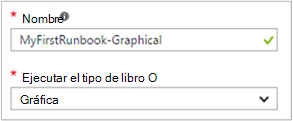<br>
6.  Haga clic en **crear** para crear runbook y abra el editor de gráficos.

## <a name="step-2---add-activities-to-the-runbook"></a>Paso 2: agregar actividades a runbook

El control de la biblioteca en el lado izquierdo del editor le permite seleccionar actividades para agregar a su runbook.  Vamos a agregar un cmdlet de **Salida de escritura** para texto de runbook de salida.

1.  En el control de la biblioteca, haga clic en el cuadro de texto de búsqueda y escriba la **Salida de escritura**.  A continuación, se mostrarán los resultados de búsqueda. <br> 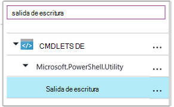
2.  Desplácese a la parte inferior de la lista.  Puede haga clic con el botón secundario del mouse en **Salida de escritura** y seleccione **Agregar al lienzo** o bien, haga clic en la elipse junto al cmdlet y, a continuación, seleccione **Agregar al lienzo**.
3.  Haga clic en la actividad de **Salida de escritura** en el lienzo.  Se abrirá el módulo de control de configuración que le permite configurar la actividad.
4.  La **etiqueta** predeterminada será el nombre del cmdlet, pero se puede cambiar a algo más descriptivo. Cambiar a *Escribir Hola a todos a la salida*.
5.  Haga clic en **parámetros** para proporcionar los valores para los parámetros del cmdlet.  
    Algunos cmdlets tiene varios conjuntos de parámetros y debe seleccionar que usará. En este caso, **Salida de escritura** tiene solo un conjunto de parámetros, por lo que no es necesario seleccionar uno. <br> 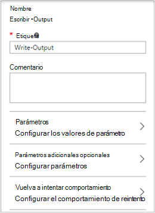
6.  Seleccione el parámetro **InputObject** .  Este es el parámetro donde se especifica el texto para enviar a la secuencia de salida.
7.  En la lista desplegable **origen de datos** , seleccione la **expresión de PowerShell**.  La lista desplegable **origen de datos** proporciona fuentes diferentes que utiliza para rellenar el valor del parámetro.  
    Puede usar salida desde orígenes como otra actividad, un activo de automatización o una expresión de PowerShell.  En este caso, queremos generar el texto *Hola a todos*. Podemos usar una expresión de PowerShell y especificar una cadena.
8.  En el cuadro **expresión** , escriba *"Hola a todos"* y, a continuación, haga clic en **Aceptar** dos veces para volver al lienzo.<br> 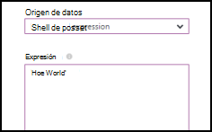
9.  Guardar runbook haciendo clic en **Guardar**.<br> 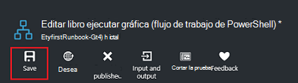

## <a name="step-3---test-the-runbook"></a>Paso 3: probar runbook

Antes de que se publica runbook para que esté disponible en producción, queremos probar para asegurarse de que funciona correctamente.  Cuando se prueba un runbook, ejecuta su versión de **Borrador** y ver los resultados de forma interactiva.

1.  Haga clic en **panel de prueba** para abrir el módulo de prueba.<br> 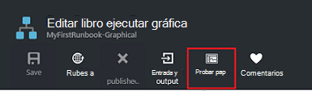
2.  Haga clic en **Iniciar** para iniciar la prueba.  Debe ser la única opción habilitada.
3.  Se crea un [trabajo runbook](automation-runbook-execution.md) y su estado se muestra en el panel.  
    El estado del trabajo se iniciará como *en cola* que indica que está esperando un trabajo runbook en la nube esté disponible.  A continuación, mover a *Iniciar* cuando un trabajador de reclamaciones la tarea y, a continuación, *ejecute* cuando en realidad runbook comienza a ejecutarse.  
4.  Cuando finalice el trabajo runbook, se muestra el resultado. En este caso, debemos recibimos *Hola a todos*.<br> 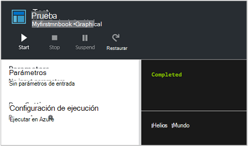
5.  Cierre el módulo de prueba para volver al lienzo.

## <a name="step-4---publish-and-start-the-runbook"></a>Paso 4: publicar e iniciar runbook

Runbook que acaba de crear aún está en modo borrador. Es necesario publicar para que podamos ejecutarlo en producción.  Cuando se publica un runbook, sobrescribir la versión publicada existente con la versión de borrador.  En este caso, no tenemos una versión publicada todavía porque hemos creado runbook.

1.  Haga clic en **Publicar** para publicar runbook y, a continuación, en **Sí** cuando se le solicite.<br> 
2.  Si desplazarse hacia la izquierda para ver runbook en el módulo **Runbooks** , se muestran un **Estado de creación de** **publicado**.
3.  Desplácese hacia la derecha para ver el módulo de **MyFirstRunbook**.  
    Las opciones en la parte superior nos permiten iniciar runbook prográmelo para iniciar en algún momento en el futuro o cree una [webhook](automation-webhooks.md) para que se puede iniciar una llamada HTTP.
4.  Queremos iniciar runbook, haga clic en **Inicio** y, a continuación, **Sí** cuando se le solicite.<br> 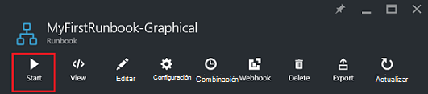
5.  Se abre una hoja de trabajo para el trabajo de runbook que acaba de crear.  Podemos cerrar esta hoja, pero en este caso, deberá déjela abierta para que nos podemos ver el progreso de la tarea.
6.  El estado del trabajo se muestra en **Resumen de tareas** y coincide con los Estados que hemos visto cuando hemos probado runbook.<br> 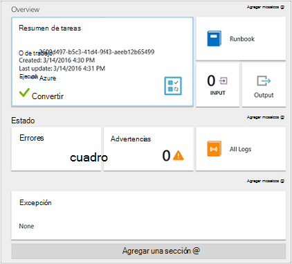
7.  Una vez que el estado de runbook muestra *completada*, haga clic en **resultados**. Se abre el módulo de **salida** y podemos ver nuestro *Hola a todos* en el panel.<br> 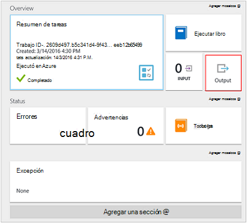  
8.  Cierre el módulo de salida.
9.  Haga clic en **Todos los registros** para abrir el módulo de secuencias para el trabajo runbook.  Sólo deberíamos ver *Hola a todos* en la secuencia de salida, pero esto puede mostrar otras secuencias para un trabajo runbook como detallado y Error si escribe runbook a ellos.<br> 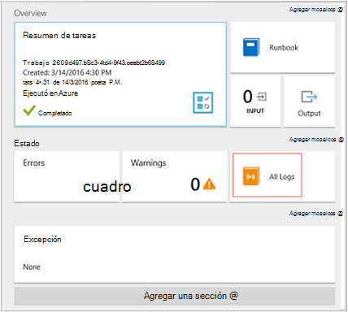
10. Cierre el módulo de todos los registros y la hoja de trabajo para volver a la hoja de MyFirstRunbook.
11. Haga clic en **tareas** para abrir la hoja de tareas para este runbook.  Enumera todas las tareas creadas por este runbook. Sólo deberíamos vemos un trabajo aparece ya que nos hemos solo encontrado el trabajo de una vez.<br> 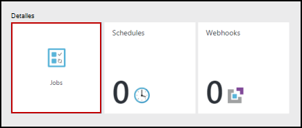
12. Puede hacer clic en esta tarea para abrir el mismo panel de trabajo que se ve cuando se inicia runbook.  Esto le permite volver atrás en el tiempo y ver los detalles de cualquier tarea que se creó para una determinada runbook.

## <a name="step-5---create-variable-assets"></a>Paso 5: crear activos variable

Hemos probado y publicado nuestra runbook, pero hasta ahora no hace nada útil. Queremos que administrar recursos de Azure.  Antes de configurar la runbook autenticar, creamos una variable que contenga el identificador de suscripción y hacer referencia a él una vez que configurar la actividad para autenticar en el paso 6 a continuación.  Incluir una referencia al contexto de la suscripción le permite trabajar fácilmente entre varias suscripciones.  Antes de continuar, copie el identificador de la suscripción de la opción de suscripciones en el panel de navegación.  

1. En el módulo de automatización cuentas, haga clic en el mosaico de **activos** y se abre el módulo de **activos** .
2. En el módulo de activos, haga clic en el mosaico de **Variables** .
3. En el módulo de Variables, haga clic en **Agregar una variable**.<br>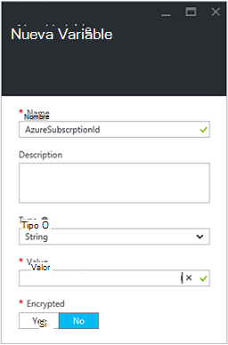
4. En el nuevo módulo variable, en el cuadro **nombre** , escriba **AzureSubscriptionId** y en el cuadro **valor** , escriba su identificador de suscripción.  Mantener la *cadena* para el **tipo** y el valor predeterminado para el **cifrado**.  
5. Haga clic en **crear** para crear la variable.  


## <a name="step-6---add-authentication-to-manage-azure-resources"></a>Paso 6: agregar autenticación para administrar los recursos de Azure

Ahora que tenemos una variable que contenga el identificador de la suscripción, podemos configurar nuestro runbook para autenticar con las credenciales de ejecutar como que se hace referencia en los [requisitos previos](#prerequisites).  Para hacerlo agregando el Azure ejecutar como conexión **activo** y **Agregar AzureRMAccount** cmdlet al lienzo.  

1.  Abra el editor gráfico haciendo clic en **Editar** en el módulo MyFirstRunbook.<br> 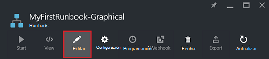
2.  Así que ya no necesitamos **Escribir Hola a todos a salida** derecho haga clic en y seleccione **Eliminar**.
3.  En el control de la biblioteca, expanda **conexiones** y agregue **AzureRunAsConnection** al lienzo seleccionando **Agregar al lienzo**.
4.  En el lienzo, seleccione **AzureRunAsConnection** y en el panel de control de configuración, escriba **Obtener ejecutar como conexión** en el cuadro de texto de **etiqueta** .  Esta es la conexión 
5.  En el control de la biblioteca, escriba **AzureRmAccount agregar** en el cuadro de texto de búsqueda.
6.  Agregar **AzureRmAccount agregar** al lienzo.<br> 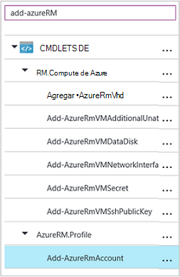
7.  Desplace el puntero sobre **Obtener ejecutar como conexión** hasta que aparezca un círculo en la parte inferior de la forma. Haga clic en el círculo y arrastre la flecha para **Agregar AzureRmAccount**.  La flecha que acaba de crear es un *vínculo*.  Runbook se iniciará con **Obtener ejecutar como conexión** y vuelva a ejecutar **AzureRmAccount de agregar**.<br> 
8.  En el lienzo, seleccione **Agregar AzureRmAccount** y en la configuración de controlar el tipo de panel **Inicio de sesión de Azure** en el cuadro de texto de **etiqueta** .
9.  Haga clic en **parámetros** y la configuración de parámetros de actividad aparece módulo. 
10.  **Agregar AzureRmAccount** tiene varios conjuntos de parámetros, por lo que necesitamos seleccionar uno antes de que podemos proporcionar valores de parámetro.  Haga clic en **Establecer parámetros** y, a continuación, seleccione el conjunto de parámetros de **ServicePrincipalCertificate** . 
11.  Una vez seleccionado el conjunto de parámetros, los parámetros se muestran en el módulo de configuración de parámetros de actividad.  Haga clic en **APPLICATIONID**.<br> 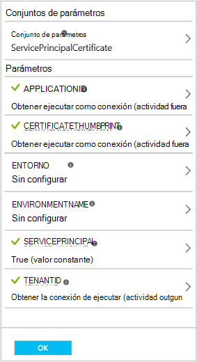
12.  En el módulo el valor del parámetro, seleccione el **resultado de actividad** para el **origen de datos** , seleccione **Obtener ejecutar como conexión** en la lista, en el cuadro de texto de **ruta de acceso del campo** , escriba **ApplicationId**y, a continuación, haga clic en **Aceptar**.  Nos estamos que especifica el nombre de la propiedad de la ruta de acceso del campo porque la actividad envía un objeto con varias propiedades.
13.  Haga clic en **CERTIFICATETHUMBPRINT**y, en el módulo el valor del parámetro, seleccione el **resultado de la actividad** para el **origen de datos**.  Seleccione **Obtener ejecutar como conexión** de la lista, en el cuadro de texto de **ruta de acceso del campo** , escriba **CertificateThumbprint**y, a continuación, haga clic en **Aceptar**. 
14.  Haga clic en **SERVICEPRINCIPAL**, en el módulo el valor del parámetro, seleccione **ConstantValue** para el **origen de datos**, haga clic en la opción **True**y, a continuación, haga clic en **Aceptar**.
15.  Haga clic en **TENANTID**y en el módulo el valor del parámetro, seleccione el **resultado de la actividad** para el **origen de datos**.  Seleccione **Obtener ejecutar como conexión** de la lista, en el cuadro de texto de **ruta de acceso del campo** , escriba **TenantId**y, a continuación, haga clic en **Aceptar** dos veces.  
16.  En el control de la biblioteca, escriba **Conjunto AzureRmContext** en el cuadro de texto de búsqueda.
17.  Agregar **Conjunto AzureRmContext** al lienzo.
18.  En el lienzo, seleccione **Conjunto AzureRmContext** y en la configuración de controlar el tipo de panel **Especificar el identificador de suscripción** en el cuadro de texto de **etiqueta** .
19.  Haga clic en **parámetros** y la configuración de parámetros de actividad aparece módulo. 
20. **Establecer AzureRmContext** tiene varios conjuntos de parámetros para debemos seleccionar uno antes de que podemos proporcionar valores de parámetro.  Haga clic en **Establecer parámetros** y, a continuación, seleccione el conjunto de parámetros de **SubscriptionId** .  
21.  Una vez seleccionado el conjunto de parámetros, los parámetros se muestran en el módulo de configuración de parámetros de actividad.  Haga clic en **SubscriptionID**
22.  En el módulo el valor del parámetro, seleccione **Variable activo** para el **origen de datos** y seleccione **AzureSubscriptionId** de la lista y, a continuación, haga clic en **Aceptar** dos veces.   
23.  Desplace el puntero sobre el **Inicio de sesión en Azure** hasta que aparezca un círculo en la parte inferior de la forma. Haga clic en el círculo y arrastre la flecha para **Especificar el identificador de suscripción**.


Su runbook en este momento debería ser similar al siguiente: <br>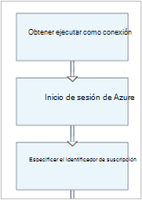

## <a name="step-7---add-activity-to-start-a-virtual-machine"></a>Paso 7: agregar actividad para iniciar una máquina virtual

Ahora, agregaremos una actividad de **Inicio AzureRmVM** para iniciar una máquina virtual.  Puede seleccionar cualquier máquina virtual en su suscripción de Azure y por ahora vamos a ser codificar que asigne un nombre al cmdlet.

1. En el control de la biblioteca, escriba **AzureRm de inicio** en el cuadro de texto de búsqueda.
2. Agregar **Inicio AzureRmVM** al lienzo y, a continuación, haga clic en y arrástrelo debajo de **Especificar el identificador de suscripción**.
3. Mantenga el mouse sobre el **Identificador de suscripción especificar** hasta que aparezca un círculo en la parte inferior de la forma.  Haga clic en el círculo y arrastre la flecha para **Iniciar AzureRmVM**. 
4.  Seleccione **Inicio AzureRmVM**.  Haga clic en **parámetros** y, a continuación, en **Establecer parámetros** para ver los conjuntos de **AzureRmVM de inicio**.  Seleccione el conjunto de parámetro **ResourceGroupNameParameterSetName** . Tenga en cuenta que **ResourceGroupName** y el **nombre** tienen signos de exclamación siguiente ellos.  Esto indica que son parámetros requeridos.  Tenga en cuenta que ambos esperan valores de cadena.
5.  Seleccione el **nombre**.  Seleccione la **expresión de PowerShell** para el **origen de datos** y escriba el nombre de la máquina virtual entre comillas dobles que comenzaremos con este runbook.  Haga clic en **Aceptar**.<br>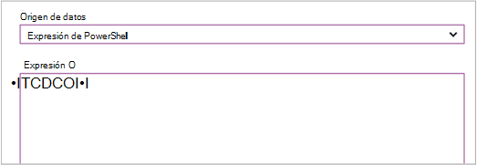
6.  Seleccione **ResourceGroupName**. Usar **PowerShell expresión** del **origen de datos** y escriba el nombre del grupo de recursos entre comillas dobles.  Haga clic en **Aceptar**.<br> 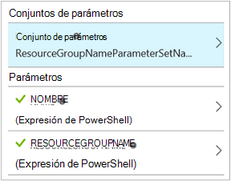
8.  Haga clic en panel de prueba probemos runbook.
9.  Haga clic en **Iniciar** para iniciar la prueba.  Cuando haya terminado, compruebe que se ha iniciado la máquina virtual.

Su runbook en este momento debería ser similar al siguiente: <br>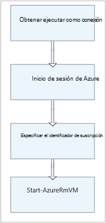

## <a name="step-8---add-additional-input-parameters-to-the-runbook"></a>Paso 8: agregar parámetros de entrada adicionales a runbook

Nuestra runbook actualmente inicia la máquina virtual en el grupo de recursos que se hayan especificado en el cmdlet **AzureRmVM de inicio** , pero nuestra runbook sería más útil si podríamos especificar ambos cuando se inicia runbook.  Ahora agregaremos parámetros de entrada a runbook para proporcionar esa funcionalidad.

1. Abra el editor gráfico haciendo clic en **Editar** en el panel de **MyFirstRunbook** .
2. Haga clic en **entrada y salida** y, a continuación, **Agregar la entrada** para abrir el panel Runbook parámetro de entrada.<br> 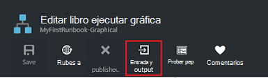
3. Especifique el **nombre** *VMName* .  Mantener la *cadena* para el **tipo**, pero cambie **obligatorio** a *Sí*.  Haga clic en **Aceptar**.
4. Crear un segundo parámetro de entrada obligatorio denominado *ResourceGroupName* y, a continuación, haga clic en **Aceptar** para cerrar el panel de **entrada y salida** .<br> 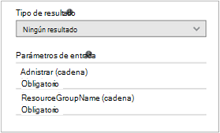
5. Seleccionar la actividad **AzureRmVM de inicio** y, a continuación, haga clic en **parámetros**.
6. Cambiar el **origen de datos** por **nombre** **Runbook** entrada y, a continuación, seleccione **VMName**.<br>
7. Cambiar el **origen de datos** para **ResourceGroupName** **Runbook** entrada y, a continuación, seleccione **ResourceGroupName**.<br> 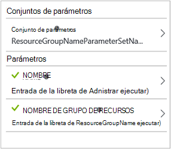
8. Guardar runbook y abra el panel de prueba.  Observe que ahora puede proporcionar valores para las dos variables de entrada que se utilizará en la prueba.
9. Cierre el panel de prueba.
10. Haga clic en **Publicar** para publicar la nueva versión del runbook.
11. Detener la máquina virtual que inició en el paso anterior.
12. Haga clic en **Iniciar** para iniciar runbook.  Escriba en **VMName** y **ResourceGroupName** para la máquina virtual que va a iniciar.<br> 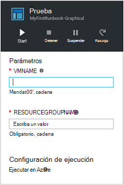
13. Cuando finalice la runbook, compruebe que se ha iniciado la máquina virtual.

## <a name="step-9---create-a-conditional-link"></a>Paso 9: crear un vínculo condicional

Ahora se modificará runbook para que solo intente iniciar la máquina virtual si aún no lo ha hecho.  Deberá hacer esto agregando un cmdlet **Get-AzureRmVM** a runbook que obtendrá el estado de nivel de instancia de la máquina virtual. A continuación, agregaremos un módulo de código de flujo de trabajo de PowerShell denominado **Get Status** con un fragmento de código de PowerShell para determinar si el estado de la máquina virtual se está ejecutando o ha dejado.  Un vínculo desde el módulo de **Estado de obtener** condicional sólo ejecutará **Inicio AzureRmVM** si se detiene el estado de ejecución actual.  Por último, se mostrará un mensaje para informar que si la máquina virtual se inició correctamente o no usar el cmdlet de PowerShell escritura de salida.

1. Abra **MyFirstRunbook** en el editor de gráficos.
2. Quitar el vínculo entre **Especificar el identificador de suscripción** y **AzureRmVM inicio** haciendo clic en él y, a continuación, presione la tecla *SUPR* .
3. En el control de la biblioteca, escriba **Get-AzureRm** en el cuadro de texto de búsqueda.
4. Agregar **AzureRmVM Get** al lienzo.
5. Seleccione **Get-AzureRmVM** y **Establecer parámetros** para ver los conjuntos de **Get-AzureRmVM**.  Seleccione el conjunto de parámetro **GetVirtualMachineInResourceGroupNameParamSet** .  Tenga en cuenta que **ResourceGroupName** y el **nombre** tienen signos de exclamación siguiente ellos.  Esto indica que son parámetros requeridos.  Tenga en cuenta que ambos esperan valores de cadena.
6. En el **origen de datos** para el **nombre**, seleccione **Runbook entrada** y, a continuación, seleccione **VMName**.  Haga clic en **Aceptar**.
7. En el **origen de datos** para **ResourceGroupName**, seleccione **Runbook entrada** y, a continuación, seleccione **ResourceGroupName**.  Haga clic en **Aceptar**.
8. En el **origen de datos** de **estado**, seleccione **valor constante** y, a continuación, haga clic en **True**.  Haga clic en **Aceptar**.  
9. Crear un vínculo de **Especificar el identificador de suscripción** a **Get-AzureRmVM**.
10. En el control de la biblioteca, expanda **Runbook Control** y agregar **código** al lienzo.  
11. Crear un vínculo desde **Get-AzureRmVM** al **código**.  
12. Haga clic en **código** y en el panel de configuración, cambie la etiqueta al **Obtener estado**.
13. Aparece el parámetro Select de **código** y el **Editor de código** .  
14. En el editor de código, pegue el siguiente fragmento de código:

     ```
     $StatusesJson = $ActivityOutput['Get-AzureRmVM'].StatusesText 
     $Statuses = ConvertFrom-Json $StatusesJson 
     $StatusOut ="" 
     foreach ($Status in $Statuses){ 
     if($Status.Code -eq "Powerstate/running"){$StatusOut = "running"} 
     elseif ($Status.Code -eq "Powerstate/deallocated") {$StatusOut = "stopped"} 
     } 
     $StatusOut 
     ```

15. Crear un vínculo de **Estado obtener** a **AzureRmVM de inicio**.<br> 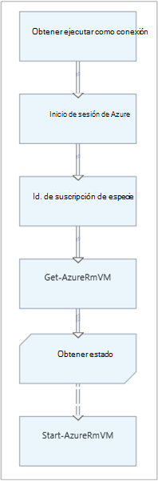  
16. Seleccione el vínculo y en el panel de configuración, cambie la **condición de aplicar** a **Sí**.   Tenga en cuenta el vínculo se convierte en una línea discontinua que indica que la actividad de destino sólo se ejecutará si la condición es true.  
17. En la **expresión de condición**, escriba *$ActivityOutput [' obtener estado '] - EC "Detenido"*.  **Inicio AzureRmVM** ahora se ejecutará solo si se detiene la máquina virtual.
18. En el control de la biblioteca, expanda **Cmdlets** y **Microsoft.PowerShell.Utility**.
19. Agregue dos veces **Salida de escritura** en el lienzo.<br> 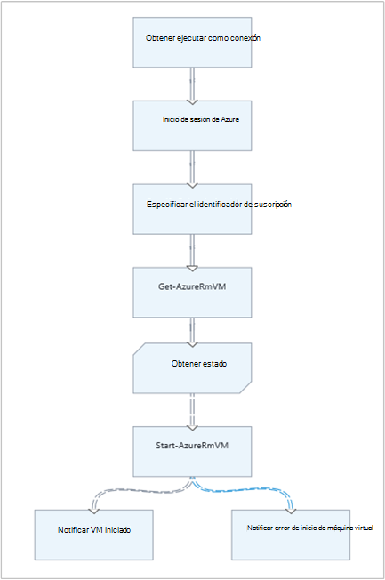
20. En el primer control de **Salida de escritura** , haga clic en **parámetros** y cambie el valor de **etiqueta** para *Notificar a VM iniciado*.
21. Para **InputObject**, cambiar **origen de datos** a la **expresión de PowerShell** y escriba la expresión *"$VMName iniciado correctamente."*.
22. En el segundo control de **Salida de escritura** , haga clic en **parámetros** y cambie el valor de la **etiqueta** a *Notificar VM Error al iniciar*
23. Para **InputObject**, cambiar **origen de datos** a la **expresión de PowerShell** y escriba la expresión *"$VMName no se pudo iniciar."*.
24. Crear un vínculo de **Inicio AzureRmVM** a **Notificar VM iniciado** y **Notificar VM iniciar ha fallado**.
25. Seleccione el vínculo que **Le notifique VM iniciar** y cambie la **condición de aplicar** **Verdadero**.
26. En la **expresión de condición**, escriba *$ActivityOutput ['inicio-AzureRmVM']. IsSuccessStatusCode - EC $true*.  Este control de salida de escritura ahora se ejecutará solo si la máquina virtual se inicia correctamente.
27. Seleccione el vínculo para **Notificar a VM Error al iniciar** y cambie la **condición de aplicar** **Verdadero**.
28. En la **expresión de condición**, escriba *$ActivityOutput ['inicio-AzureRmVM']. IsSuccessStatusCode - ne $true*.  Este control de salida de escritura se ejecutará ahora solo si la máquina virtual no se inicia correctamente.
29. Guardar runbook y abra el panel de prueba.
30. Iniciar runbook con la máquina virtual detenida y debe empezar.

## <a name="next-steps"></a>Pasos siguientes

-   Para obtener más información sobre la creación de gráficos, consulte [creación de gráficos en la automatización de Azure](automation-graphical-authoring-intro.md)
-   Para empezar con PowerShell runbooks, consulte [Mi primera runbook de PowerShell](automation-first-runbook-textual-powershell.md)
-   Para empezar con PowerShell runbooks de flujo de trabajo, consulte [Mi primera runbook de flujo de trabajo de PowerShell](automation-first-runbook-textual.md)
