<properties
    pageTitle="Mi primera runbook de PowerShell en automatización de Azure | Microsoft Azure"
    description="Tutorial que le guiará a través de la creación, comprobación y publicación de un simple runbook de PowerShell."
    services="automation"
    documentationCenter=""
    authors="mgoedtel"
    manager="jwhit"
    editor=""
    keywords="powershell Azure, tutorial de secuencia de comandos de powershell, automatización de powershell"/>
<tags
    ms.service="automation"
    ms.workload="tbd"
    ms.tgt_pltfrm="na"
    ms.devlang="na"
    ms.topic="get-started-article"
    ms.date="07/19/2016"
    ms.author="magoedte;sngun"/>

# <a name="my-first-powershell-runbook"></a>Mi primera runbook de PowerShell

> [AZURE.SELECTOR] - [Gráfico](automation-first-runbook-graphical.md) - [PowerShell](automation-first-runbook-textual-PowerShell.md) - [Flujo de trabajo de PowerShell](automation-first-runbook-textual.md)  

Este tutorial le guiará a través de la creación de un [runbook de PowerShell](automation-runbook-types.md#powershell-runbooks) en automatización de Azure. Comenzaremos con una simple runbook que deberá probar y publicar mientras se explica cómo realizar un seguimiento del estado del trabajo runbook. A continuación, deberá modificar runbook para administrar realmente recursos Azure, comenzando en este caso una máquina virtual Azure. A continuación, haremos runbook más rigurosa agregando parámetros runbook.

## <a name="prerequisites"></a>Requisitos previos

Para completar este tutorial, necesita lo siguiente.

-   Suscripción de Azure. Si todavía no tiene una, puede [activar las ventajas de suscriptor MSDN](https://azure.microsoft.com/pricing/member-offers/msdn-benefits-details/) o <a href="/pricing/free-account/" target="_blank"> [suscribirse a una cuenta gratuita](https://azure.microsoft.com/free/).
-   [Cuenta de automatización](automation-security-overview.md) mantenga runbook y autenticar a recursos de Azure.  Esta cuenta debe tener permiso para iniciar y detener la máquina virtual.
-   Una máquina virtual Azure. Detendrá e iniciar este equipo, por lo que no debería producción.

## <a name="step-1---create-new-runbook"></a>Paso 1: crear nueva runbook

Comenzaremos creando un runbook simple que genera el texto *Hola a todos*.

1.  En el Portal de Azure, abra su cuenta de automatización.  
    La página de la cuenta de automatización ofrece una vista rápida de los recursos de esta cuenta. Ya debería tener algunos activos. La mayoría de los son los módulos que se incluyen automáticamente en una nueva cuenta de automatización. También debe tener el activo de credenciales que se menciona en los [requisitos previos](#prerequisites).
2.  Haga clic en el mosaico **Runbooks** para abrir la lista de runbooks.  
      
3.  Crear un nuevo runbook haciendo clic en el botón **Agregar un runbook** y, a continuación, **crear una nueva runbook**.
4.  Asigne el nombre *MyFirstRunbook PowerShell*a runbook.
5.  En este caso, vamos a crear un [runbook de PowerShell](automation-runbook-types.md#powershell-runbooks) así que seleccione **Powershell** **Runbook**tipo.  
    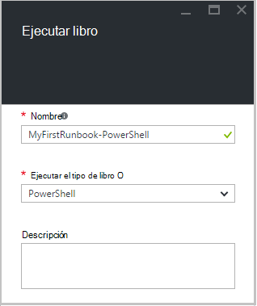  
6.  Haga clic en **crear** para crear runbook y abra el editor de texto.

## <a name="step-2---add-code-to-the-runbook"></a>Paso 2: agregar código a runbook

Puede cualquier tipo de código directamente en runbook, o puede seleccionar cmdlets, runbooks y activos desde el control de la biblioteca y agregarlas al runbook con los parámetros relacionados. En este tutorial, se deberá escribir directamente en runbook.

1.  Nuestra runbook está vacío, tipo *salida de escritura "Hola a todos."*.  
      
2.  Guardar runbook haciendo clic en **Guardar**.  
    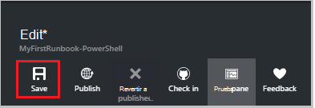  

## <a name="step-3---test-the-runbook"></a>Paso 3: probar runbook

Antes de que se publica runbook para que esté disponible en producción, queremos probar para asegurarse de que funciona correctamente. Cuando se prueba un runbook, ejecuta su versión de **Borrador** y ver los resultados de forma interactiva.

1.  Haga clic en **panel de prueba** para abrir el panel de prueba.  
    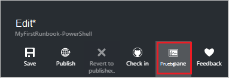  
2.  Haga clic en **Iniciar** para iniciar la prueba. Debe ser la única opción habilitada.
3.  Se crea un [trabajo runbook](automation-runbook-execution.md) y muestra su estado.  
    El estado del trabajo se iniciará como *en cola* que indica que está esperando un trabajador runbook en la nube dar disponibles. A continuación, mover a *Iniciar* cuando un trabajador de reclamaciones la tarea y, a continuación, *ejecute* cuando en realidad runbook comienza a ejecutarse.  
4.  Cuando finalice el trabajo runbook, se muestra el resultado. En este caso, debemos vemos *Hola a todos*  
    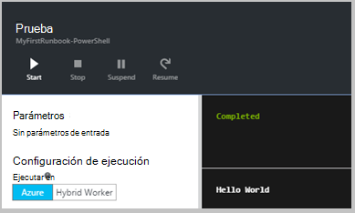  
5.  Cierre el panel de prueba para volver al lienzo.

## <a name="step-4---publish-and-start-the-runbook"></a>Paso 4: publicar e iniciar runbook

Runbook que acaba de crear aún está en modo borrador. Es necesario publicar para que podamos ejecutarlo en producción. Cuando se publica un runbook, sobrescribir la versión publicada existente con la versión de borrador. En este caso, no tenemos una versión publicada todavía porque hemos creado runbook.

1.  Haga clic en **Publicar** para publicar runbook y, a continuación, en **Sí** cuando se le solicite.  
    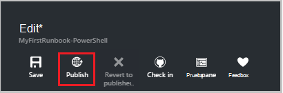  
2.  Si desplazarse hacia la izquierda para ver runbook en el panel de **Runbooks** ahora, se muestran un **Estado de creación de** **publicado**.
3.  Desplácese hacia la derecha para ver el panel de **PowerShell MyFirstRunbook**.  
    Las opciones en la parte superior nos permiten iniciar runbook, ver runbook, prográmelo para iniciar en algún momento en el futuro, o cree una [webhook](automation-webhooks.md) para que se puede iniciar mediante una llamada HTTP.
4.  Queremos iniciar runbook, haga clic en **Inicio** y, a continuación, haga clic en **Aceptar** cuando se abre el módulo Runbook de inicio.  
    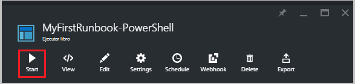  
5.  Se abrirá un panel de trabajo para el trabajo de runbook que acaba de crear. Podemos cerrar este panel, pero en este caso, deberá déjela abierta para que nos podemos ver el progreso de la tarea.
6.  El estado del trabajo se muestra en **Resumen de tareas** y coincide con los Estados que hemos visto cuando hemos probado runbook.  
    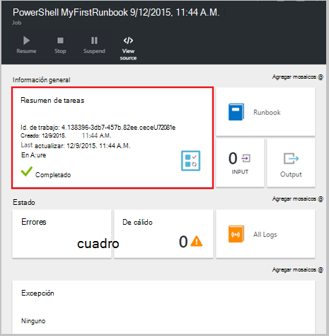  
7.  Una vez que el estado de runbook muestra *completada*, haga clic en **resultados**. Se abre el panel de resultados y podemos ver nuestro *Hola a todos*.  
    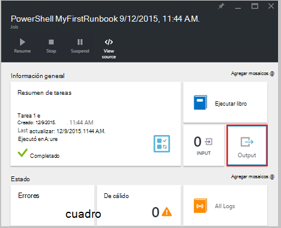
8.  Cierre el panel de resultados.
9.  Haga clic en **Todos los registros** para abrir el panel de secuencias para el trabajo runbook. Sólo deberíamos ver *Hola a todos* en la secuencia de salida, pero esto puede mostrar otras secuencias para un trabajo runbook como detallado y Error si escribe runbook a ellos.  
    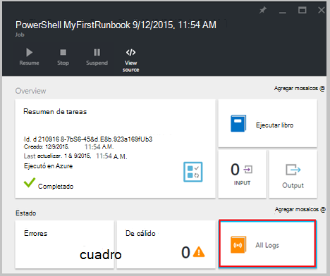  
10. Cierre el panel de secuencias y el panel de trabajo para volver al panel de PowerShell MyFirstRunbook.
11. Haga clic en **tareas** para abrir el panel de tareas para este runbook. Enumera todas las tareas creadas por este runbook. Sólo deberíamos vemos un trabajo aparece ya que nos hemos solo encontrado el trabajo de una vez.  
    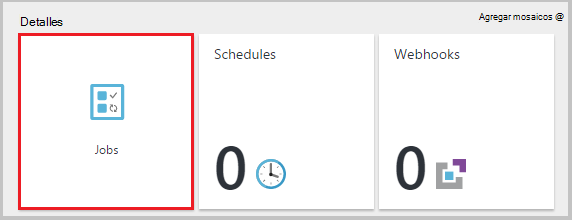  
12. Puede hacer clic en esta tarea para abrir el mismo panel de trabajo que se ve cuando se inicia runbook. Esto le permite volver atrás en el tiempo y ver los detalles de cualquier tarea que se creó para una determinada runbook.

## <a name="step-5---add-authentication-to-manage-azure-resources"></a>Paso 5: agregar autenticación para administrar los recursos de Azure

Hemos probado y publicado nuestra runbook, pero hasta ahora no hace nada útil. Queremos que administrar recursos de Azure. No podrá hacerlo aunque a menos que tenemos autenticar con las credenciales que se hace referencia en los [requisitos previos](#prerequisites). Para hacerlo con el cmdlet **Add-AzureRmAccount** .

1.  Abra el editor de texto haciendo clic en **Editar** en el panel de PowerShell MyFirstRunbook.  
    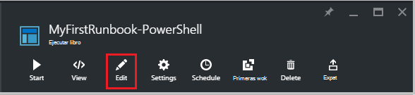  
2.  Ya no necesitamos la línea de **Salida de escritura** , así que siga adelante y elimínelo.
3.  Escriba o copie y pegue el código siguiente que controle la autenticación con su cuenta de automatización ejecutar como:

    ```
     $Conn = Get-AutomationConnection -Name AzureRunAsConnection 
     Add-AzureRMAccount -ServicePrincipal -Tenant $Conn.TenantID `
     -ApplicationId $Conn.ApplicationID -CertificateThumbprint $Conn.CertificateThumbprint
    ``` 
<br>
4.  Haga clic en **probar panel** probemos runbook.
5.  Haga clic en **Iniciar** para iniciar la prueba. Cuando haya terminado, obtendrá un resultado similar al siguiente, que muestra información básica de su cuenta. Esto confirma que la credencial es válida. <br> 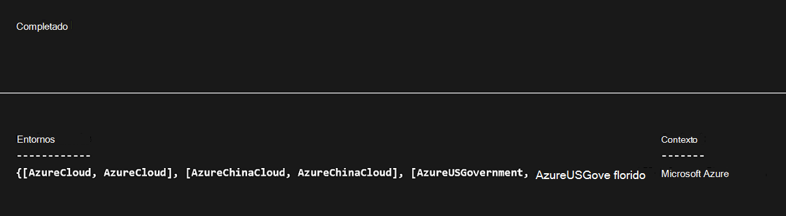

## <a name="step-6---add-code-to-start-a-virtual-machine"></a>Paso 6: agregar código para iniciar una máquina virtual

Ahora que nuestros runbook autentica a nuestra suscripción Azure, podemos administrar recursos. Agregaremos un comando para iniciar una máquina virtual. Puede seleccionar cualquier máquina virtual en su suscripción de Azure y por ahora vamos a ser codificar que asigne un nombre al cmdlet.

1.  Después de *Agregar AzureRmAccount*, escriba *AzureRmVM inicio-nombre 'VMName' - ResourceGroupName 'NameofResourceGroup'* proporcionar el nombre y el nombre del grupo de recursos de la máquina virtual para iniciar.  
    
    ```
     $Conn = Get-AutomationConnection -Name AzureRunAsConnection 
     Add-AzureRMAccount -ServicePrincipal -Tenant $Conn.TenantID `
     -ApplicationID $Conn.ApplicationID -CertificateThumbprint $Conn.CertificateThumbprint 
     Start-AzureRmVM -Name 'VMName' -ResourceGroupName 'ResourceGroupName'
     ```
<br>
2.  Guardar runbook y, a continuación, haga clic en **panel de prueba** para que podamos probarlo.
3.  Haga clic en **Iniciar** para iniciar la prueba. Cuando haya terminado, compruebe que se ha iniciado la máquina virtual.

## <a name="step-7---add-an-input-parameter-to-the-runbook"></a>Paso 7: agregar un parámetro de entrada a runbook

Actualmente se inicia nuestra runbook virtual del equipo que nos codificado en runbook, pero es más útil si podríamos especificar la máquina virtual cuando se inicia runbook. Ahora agregaremos parámetros de entrada a runbook para proporcionar esa funcionalidad.

1.  Agregar parámetros para *VMName* y *ResourceGroupName* a runbook y usar estas variables con el cmdlet **AzureRmVM inicio** como en el ejemplo siguiente.  
    
    ```
    Param(
       [string]$VMName,
       [string]$ResourceGroupName
    )
     $Conn = Get-AutomationConnection -Name AzureRunAsConnection 
     Add-AzureRMAccount -ServicePrincipal -Tenant $Conn.TenantID `
     -ApplicationID $Conn.ApplicationID -CertificateThumbprint $Conn.CertificateThumbprint 
     Start-AzureRmVM -Name $VMName -ResourceGroupName $ResourceGroupName
     ```
<br> 
2.  Guardar runbook y abra el panel de prueba. Observe que ahora puede proporcionar valores para las dos variables de entrada que se utilizará en la prueba.
3.  Cierre el panel de prueba.
4.  Haga clic en **Publicar** para publicar la nueva versión del runbook.
5.  Detener la máquina virtual que inició en el paso anterior.
6.  Haga clic en **Iniciar** para iniciar runbook. Escriba en **VMName** y **ResourceGroupName** para la máquina virtual que va a iniciar.  
    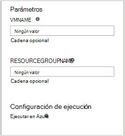  
7.  Cuando finalice la runbook, compruebe que se ha iniciado la máquina virtual.

## <a name="differences-from-powershell-workflow"></a>Diferencias de flujo de trabajo de PowerShell

PowerShell runbooks tengan el mismo ciclo de vida, capacidades de administración de flujo de trabajo de PowerShell runbooks pero hay algunas diferencias y limitaciones:

1.  PowerShell runbooks ejecutar rápido en comparación con el flujo de trabajo de PowerShell runbooks que no tengan paso de compilación.
2.  Puntos de control, con puntos de comprobación de soporte técnico runbooks de flujo de trabajo de PowerShell, runbooks de flujo de trabajo de PowerShell puede reanudar desde cualquier punto en runbook considerando PowerShell runbooks solo puede reanudar desde el principio.
3.  Flujo de trabajo de PowerShell runbooks admiten ejecución paralela y serie mientras que PowerShell runbooks sólo puede ejecutar los comandos en serie.
4.  En un runbook de flujo de trabajo de PowerShell, una actividad, un comando o un bloque de script puede tener su propio espacio, mientras que en un runbook de PowerShell, todo el contenido de una secuencia de comandos se ejecuta en un único espacio. También hay algunas [diferencias sintácticas](https://technet.microsoft.com/magazine/dn151046.aspx) entre un runbook de PowerShell nativo y un runbook de flujo de trabajo de PowerShell.

## <a name="next-steps"></a>Pasos siguientes

-   Para empezar con runbooks gráfica, consulte [Mi primera runbook gráfica](automation-first-runbook-graphical.md)
-   Para empezar con PowerShell runbooks de flujo de trabajo, consulte [Mi primera runbook de flujo de trabajo de PowerShell](automation-first-runbook-textual.md)
-   Para más información sobre las limitaciones, sus ventajas y runbook tipos, vea [tipos de runbook de automatización de Azure](automation-runbook-types.md)
-   Para obtener más información acerca de los comandos de PowerShell admite la característica, vea [secuencias de comandos de PowerShell nativo de soporte técnico de automatización de Azure](https://azure.microsoft.com/blog/announcing-powershell-script-support-azure-automation-2/)
