<properties 
    pageTitle="Creación de gráficos en la automatización de Azure | Microsoft Azure"
    description="Edición gráfica le permite crear runbooks para la automatización de Azure sin tener que trabajar con código. Este artículo proporciona una introducción a la creación de gráficos y todos los detalles necesarios para empezar a crear un gráfico runbook."
    services="automation"   
    documentationCenter=""
    authors="mgoedtel"
    manager="jwhit"
    editor="tysonn" />
<tags 
    ms.service="automation"
    ms.devlang="na"
    ms.topic="article"
    ms.tgt_pltfrm="na"
    ms.workload="infrastructure-services"
    ms.date="06/03/2016"
    ms.author="magoedte;bwren" />

# Edición gráfica de automatización de Azure

## Introducción

Creación gráficos le permite crear runbooks para la automatización de Azure sin las complejidades del código subyacente de Windows PowerShell o flujo de trabajo de PowerShell. Agregar actividades al lienzo de una biblioteca de cmdlets y runbooks, enlazarlos y configurar para formar un flujo de trabajo.  Si alguna vez ha trabajado con System Center Orchestrator o automatización de administración de servicios (SMA), a continuación, este debe tener un aspecto familiar.   

Este artículo proporciona una introducción a la creación de gráficos y los conceptos que necesarios empezar a crear un gráfico runbook.

## Runbooks gráfica

Todos los runbooks en Azure automatización son los flujos de trabajo de Windows PowerShell.  Runbooks gráfica y flujo de trabajo de PowerShell gráfica generar código de PowerShell que se ejecute por los trabajadores de automatización, pero no es posible verlo o modificarlo directamente.  Un runbook gráfica puede convertirse en un flujo de trabajo de PowerShell gráfica runbook y viceversa, pero no se puede convertir a un runbook textual. No se puede importar un runbook de texto existente en el editor de gráficos.  

## Información general del editor de gráficos

Puede abrir el editor gráfico en el portal de Azure crear o editar un runbook gráfica.

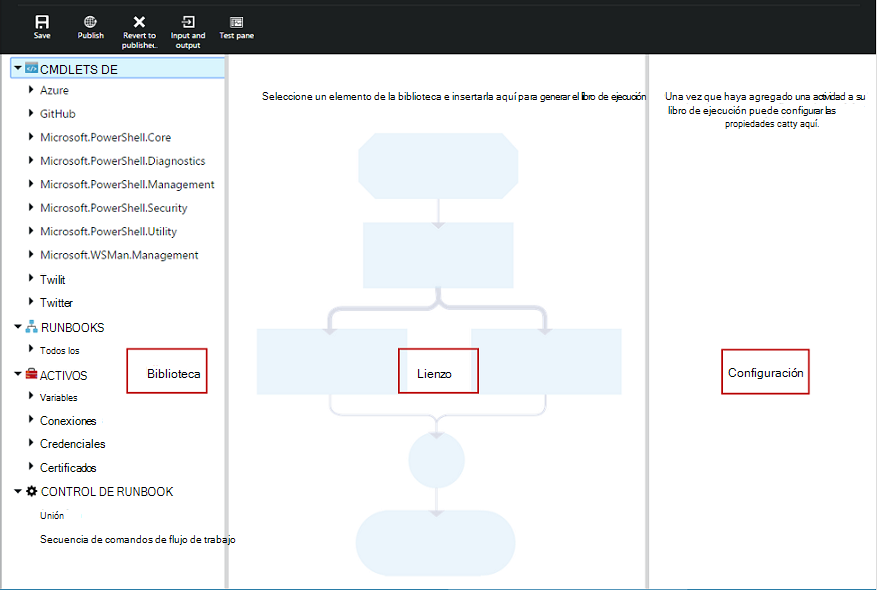

Las siguientes secciones describen los controles en el editor de gráficos.

### Lienzo
El lienzo es donde diseñar su runbook.  Agregue las actividades de los nodos en el control de la biblioteca a runbook y conectarlas con vínculos a definir el valor lógico del runbook.

Puede utilizar los controles en la parte inferior del lienzo para acercar y alejar.

### Control de biblioteca

El control de la biblioteca es donde seleccionar [actividades](#activities) para agregar a su runbook.  Agregar al lienzo donde se conecta a otras actividades.  Incluye cuatro secciones descritas en la tabla siguiente.

| Sección | Descripción |
|:---|:---|
| Cmdlets de | Incluye todos los cmdlets que se pueden usar en su runbook.  Cmdlets están organizados por módulo.  Todos los módulos que haya instalado en su cuenta de automatización estarán disponibles.  |
| Runbooks |  Incluye la runbooks en su cuenta de automatización. Estos runbooks pueden agregarse al lienzo que se usará como runbooks secundarios. Se muestran solo runbooks del mismo tipo de núcleo como runbook editando; para gráficos se muestran runbooks solo basada en PowerShell runbooks, mientras que para el flujo de trabajo de gráficos PowerShell runbooks se muestran runbooks solo PowerShell flujo de trabajo basados en.
| Activos | Incluye los [activos de automatización](http://msdn.microsoft.com/library/dn939988.aspx) en su cuenta de automatización que se pueden usar en su runbook.  Al agregar un activo a un runbook, se agregará una actividad de flujo de trabajo que obtiene el activo seleccionado.  En el caso de los activos de variable, puede seleccionar si desea agregar una actividad para obtener la variable o establecer la variable.
| Control de runbook | Incluye runbook las actividades de control que se pueden usar en su runbook actual. Una *unión* tiene varias entradas y espera hasta que todos se hayan antes de continuar con el flujo de trabajo. Una actividad de *código* ejecuta una o varias líneas de código de PowerShell o flujo de trabajo de PowerShell según el tipo de gráfico runbook.  Puede usar esta actividad para código personalizado o funcionalidad que es difícil de lograr con otras actividades.|

### Control de configuración

El control de la configuración es donde se proporcionan detalles para un objeto seleccionado en el lienzo. Las propiedades disponibles en este control dependerá del tipo de objeto seleccionado.  Al seleccionar una opción en el control de configuración, se abrirá módulos adicionales para proporcionar información adicional.

### Control de prueba

El control de prueba no se muestra cuando primero se inicia el editor de gráficos. Se abre cuando se [prueba un runbook gráfico](#graphical-runbook-procedures)de forma interactiva.  

## Procedimientos runbook gráfica 

### Exportar e importar un runbook gráfica

Sólo puede exportar la versión publicada de un runbook gráfica.  Si aún no se ha publicado runbook, deshabilitará el botón **Exportar publicado** .  Al hacer clic en el botón **Exportar publicado** , runbook se descargará en su equipo local.  El nombre del archivo coincide con el nombre del runbook con una extensión de *graphrunbook* .

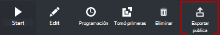

Puede importar un archivo de runbook gráfica o flujo de trabajo de PowerShell gráfica seleccionando la opción **Importar** al agregar un runbook.   Cuando seleccione el archivo para importar, puede mantener el mismo **nombre** o proporcionar uno nuevo.  El campo tipo de Runbook mostrará el tipo de runbook después de que evalúa el archivo seleccionado y si intenta seleccionar un tipo diferente que no es correcto, un mensaje se presentará anotar hay posibles conflictos y durante la conversión, puede haber errores de sintaxis.  

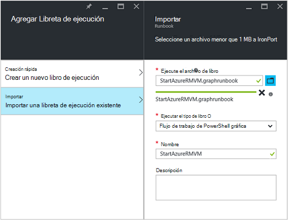

### Probar un runbook gráfica

Puede probar la versión de borrador de un runbook en el portal de Azure mientras salir de la versión publicada del runbook sin modificar, o puede probar una nueva runbook antes de que se ha publicado. Esto le permite comprobar que runbook funciona correctamente antes de reemplazar la versión publicada. Cuando se prueba un runbook, runbook borrador se ejecuta y se hayan completado todas las acciones que lleva a cabo. No se crea historial de trabajo, pero resultado se muestra en el panel de resultados de la prueba. 

Abra el control de prueba para un runbook abriendo runbook para editar y, a continuación, haga clic en el botón **panel de prueba** .

El control de prueba se mostrará un mensaje para los parámetros de entrada y, a continuación, puede iniciar runbook haciendo clic en el botón **Inicio** .

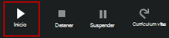

### Publicar un runbook gráfica

Cada runbook de automatización de Azure tiene un borrador y una versión publicada. Solo la versión publicada está disponible para ejecutarse y se puede modificar la versión de borrador. La versión publicada se ven afectada por los cambios a la versión de borrador. Cuando esté lista para que esté disponible la versión de borrador, a continuación, publicarla que sobrescribe la versión publicada con la versión de borrador.

Puede publicar un runbook gráfica abriendo runbook de edición y, a continuación, haciendo clic en el botón **Publicar** .

Cuando no se ha publicado un runbook, tiene un estado de **nuevo**.  Cuando se publica, tiene un estado **publicado**.  Si modifica el runbook después de que se ha publicado y las versiones de borrador y publicados son diferentes, runbook tiene un estado de **Edición**.

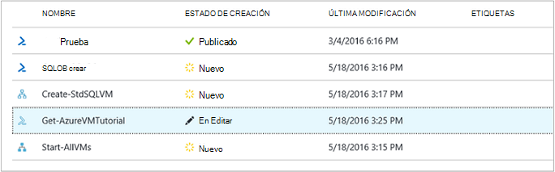 

También tiene la opción para volver a la versión publicada de un runbook.  Esto inicia inmediatamente los cambios realizados desde runbook última publicación y reemplaza la versión de borrador del runbook con la versión publicada.

## Actividades

Las actividades son los bloques de creación de un runbook.  Una actividad puede ser un cmdlet de PowerShell, un runbook secundario o una actividad de flujo de trabajo.  Agregar una actividad a runbook, hacer clic en el control de la biblioteca y seleccione **Agregar al lienzo**.  Puede, a continuación, haga clic en y arrastre la actividad para colocarla en cualquier lugar en el lienzo que le guste.  La ubicación de la de la actividad del lienzo no afecta a la operación del runbook de ninguna forma.  Puede diseño su runbook a pesar de que le resulte más adecuada para visualizar su funcionamiento. 

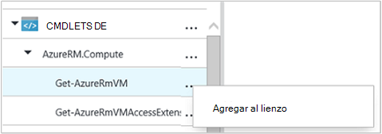

Seleccionar la actividad en el lienzo para configurar sus propiedades y parámetros en el módulo de configuración.  Puede cambiar la **etiqueta** de la actividad de algo que sea descriptivo a usted.  Aún se está ejecutando el cmdlet original, simplemente está cambiando su nombre para mostrar que se utilizará en el editor de gráficos.  La etiqueta debe ser única dentro del runbook. 

### Conjuntos de parámetros

Un conjunto de parámetros define los parámetros obligatorios y opcionales que aceptarán valores para un cmdlet en particular.  Todos los cmdlets tiene al menos un parámetro establecer y algunos tienen varias.  Si un cmdlet tiene varios conjuntos de parámetros, debe seleccionar cuál se usará para poder configurar parámetros.  El conjunto de parámetros que elija dependerá de los parámetros que se pueden configurar.  Puede cambiar el conjunto de parámetros usados por una actividad seleccionando **Establecer parámetros** y seleccione otro conjunto.  En este caso, los valores de parámetro que haya configurado se pierden.

En el ejemplo siguiente, el cmdlet Get-AzureRmVM tiene tres conjuntos de parámetros.  No puede configurar los valores de parámetro hasta que se seleccione uno de los conjuntos de parámetros.  El parámetro ListVirtualMachineInResourceGroupParamSet establecido para devolver todos los equipos virtuales en un grupo de recursos y tiene un único parámetro opcional.  El GetVirtualMachineInResourceGroupParamSet es para especificar la máquina virtual para devolver y tiene dos obligatorio y parámetros opcionales.

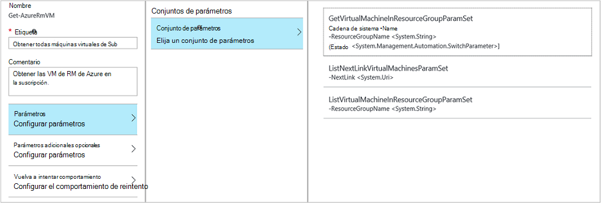

#### Valores de parámetro

Al especificar un valor para un parámetro, seleccione un origen de datos para determinar cómo se especificará el valor.  Los orígenes de datos que están disponibles para un parámetro en particular dependerá de los valores válidos para dicho parámetro.  Por ejemplo, Null no estará disponible la opción para un parámetro que no admite valores nulos.

| Origen de datos | Descripción |
|:---|:---|
|Valor constante|Escriba un valor para el parámetro.  Esto solo está disponible para los siguientes tipos de datos: Int32, Int64, cadena, booleano, DateTime, cambiar. |
|Resultados de la actividad|Resultado de una actividad que precede a la actividad actual del flujo de trabajo.  Se mostrarán todas las actividades de válida.  Seleccione la actividad de usar su resultado para el valor del parámetro.  Si la actividad de los resultados de un objeto con varias propiedades, escriba el nombre de la propiedad después de seleccionar la actividad.|
|Entrada de runbook |Seleccione un parámetro de entrada runbook como entrada para el parámetro de actividad.|  
|Variable activo|Seleccione una Variable de automatización como entrada.|  
|Activo de credenciales|Seleccione una credencial de automatización como entrada.|  
|Activo de certificado|Seleccione un certificado de automatización como entrada.|  
|Conexión activo|Seleccione una conexión de automatización como entrada.| 
|Expresión de PowerShell|Especificar simple [PowerShell expresión](#powershell-expressions).  La expresión se evaluará antes de la actividad y el resultado que se usa para el valor del parámetro.  Puede utilizar variables para hacer referencia a los resultados de una actividad o un parámetro de entrada runbook.|
|Sin configurar|Borra cualquier valor que se ha configurado previamente.|

#### Parámetros adicionales opcionales

Todos los cmdlets tendrá la opción de proporcionar parámetros adicionales.  Estos son los parámetros de PowerShell comunes u otros parámetros personalizados.  Aparecerá un cuadro de texto donde puede proporcionar parámetros mediante la sintaxis de PowerShell.  Por ejemplo, para usar el parámetro común **detallado** , especifique **"-detallado: $True"**.

### Vuelva a intentar la actividad

**Vuelva a intentar comportamiento** permite una actividad para ejecutarse varias veces hasta que se cumpla una condición determinada, un bucle de forma muy parecida.  Puede usar esta característica para las actividades que deben ejecutarse varias veces, es susceptible de error y puede necesita más de un intento para tener éxito o probar la información de salida de la actividad de los datos válidos.    

Al habilitar intentos de una actividad, puede establecer un retraso y una condición.  El retraso es el tiempo (en segundos o minutos) que runbook esperará antes de que se ejecuta la actividad de nuevo.  Si no se especifica ningún retraso, la actividad se ejecutará nuevo inmediatamente después de que finalice. 

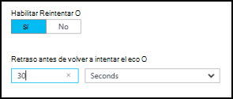

La condición de reintento es una expresión de PowerShell que se evalúa cada vez que se ejecuta la actividad.  Si la expresión se convierte en True, a continuación, la actividad se ejecuta de nuevo.  Si la expresión se convierte en False la actividad no ejecute de nuevo y runbook pasa a la siguiente actividad. 

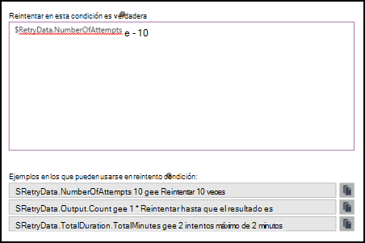

La condición de reintento puede usar una variable denominada $RetryData que proporciona acceso a información sobre los reintentos de actividad.  Esta variable tiene las propiedades de la tabla siguiente.

| (Propiedad) | Descripción |
|:--|:--|
| NumberOfAttempts | Número de veces que se ha ejecutado la actividad.              |
| Salida           | Resultado de la última ejecución de la actividad.                    |
| TotalDuration    | Tiempo transcurrido desde la actividad se ha iniciado por primera vez. |
| StartedAt        | Hora en formato UTC que primero se inició la actividad.           |

Los siguientes son ejemplos de actividad Reintentar condiciones.

    # Run the activity exactly 10 times.
    $RetryData.NumberOfAttempts -ge 10 

    # Run the activity repeatedly until it produces any output.
    $RetryData.Output.Count -ge 1 

    # Run the activity repeatedly until 2 minutes has elapsed. 
    $RetryData.TotalDuration.TotalMinutes -ge 2

Después de configurar una condición de intentos de una actividad, la actividad incluye dos guías visuales para recordarle.  Uno se presenta en la actividad y la otra al revisar la configuración de la actividad.

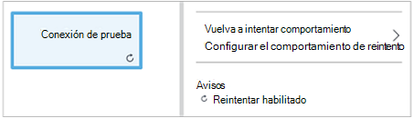

### Control de secuencia de comandos de flujo de trabajo

Un control de código es una actividad especial que acepta la secuencia de comandos de PowerShell o flujo de trabajo de PowerShell según el tipo de gráfico runbook siendo editada para proporcionar funcionalidad que de lo contrario no esté disponible.  No puede aceptar parámetros, pero puede utilizar variables de actividad de salida y runbook parámetros de entrada.  Los resultados de la actividad se agregan a la databus a menos que no tiene ningún saliente vincular en cuyo caso se agrega a la salida del runbook.

Por ejemplo, el siguiente código realiza cálculos de fecha con una variable de entrada runbook denominada $NumberOfDays.  A continuación, se envía una hora de fecha calculada como resultado para usarlo con las siguientes actividades en runbook.

    $DateTimeNow = (Get-Date).ToUniversalTime()
    $DateTimeStart = ($DateTimeNow).AddDays(-$NumberOfDays)}
    $DateTimeStart

## Vínculos y flujo de trabajo

Un **vínculo** en un gráfico runbook conecta dos actividades.  En el lienzo se muestra como una flecha que señala desde la actividad de origen a la actividad de destino.  Las actividades de ejecutan en la dirección de la flecha con la actividad de destino iniciar después de que finalice la actividad de origen.  

### Crear un vínculo

Crear un vínculo entre dos actividades seleccionando la actividad de origen y haga clic en el círculo en la parte inferior de la forma.  Arrastre la flecha a la actividad de destino y la versión.

Seleccione el vínculo para configurar sus propiedades en el módulo de configuración.  Esto incluye el tipo de vínculo que se describe en la tabla siguiente.

| Tipo de vínculo | Descripción |
|:---|:---|
| Canalización | La actividad de destino se ejecuta una vez para cada objeto de salida de la actividad de origen.  La actividad de destino no se ejecuta si los resultados de la actividad de origen en ningún resultado.  Resultado de la actividad de origen está disponible como un objeto.  |
| Secuencia | La actividad de destino se ejecuta una sola vez.  Recibe una matriz de objetos de la actividad de origen.  Resultado de la actividad de origen está disponible como una matriz de objetos. |

### Inicia la actividad

Se iniciará un runbook gráfica con las actividades que no tienen un vínculo de entrada.  Esto suele ser sólo una actividad que podría actuar como la actividad de inicia de runbook.  Si varias actividades no tiene un vínculo de entrada, se iniciará runbook ejecutándola en paralelo.  A continuación, seguirá los vínculos para ejecutar otras actividades como cada finaliza.

### Condiciones

Al especificar una condición en un vínculo, la actividad de destino sólo se ejecuta si la condición es true.  Normalmente se usan una variable $ActivityOutput en una condición para recuperar el resultado de la actividad de origen.  

Un vínculo de canalización, especifique una condición para un único objeto y la condición se evalúa para cada objeto de salida por la actividad de origen.  A continuación, se ejecuta la actividad de destino para cada objeto que cumpla la condición.  Por ejemplo, con una actividad de origen de Get-AzureRmVm, la siguiente sintaxis se podrían usar un vínculo de canalización condicional para recuperar solo máquinas virtuales en el grupo de recursos con el nombre de *grupo 1*.  

    $ActivityOutput['Get Azure VMs'].Name -match "Group1"

Para un vínculo de la secuencia, la condición sólo se evalúa una vez desde que se devuelve una matriz que contiene todos los resultados de los objetos de la actividad de origen.  Por este motivo, un vínculo de secuencia no se puede utilizar para filtrar como un vínculo de canalización pero simplemente determinará si no se ejecuta la siguiente actividad. Tomar por ejemplo el siguiente conjunto de actividades en nuestro runbook VM iniciar.  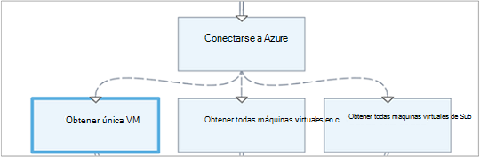 
Hay tres vínculos de secuencia diferentes que están comprobando proporcionaron valores a dos parámetros de entrada runbook que representa el nombre de máquina virtual y el nombre de grupo de recursos para determinar que es la acción apropiada para tomar - iniciar una única VM, iniciar todas las máquinas virtuales en el grupo de recursos o todas las máquinas virtuales en una suscripción.  Para el vínculo de la secuencia entre conectarse a Azure y obtener única VM, esto es la lógica de la condición:

    <# 
    Both VMName and ResourceGroupName runbook input parameters have values 
    #>
    (
    (($VMName -ne $null) -and ($VMName.Length -gt 0))
    ) -and (
    (($ResourceGroupName -ne $null) -and ($ResourceGroupName.Length -gt 0))
    )

Cuando utiliza un vínculo condicional, se filtran los datos disponibles en la actividad de origen a otras actividades en la sucursal la condición.  Si una actividad es el origen de varios vínculos, los datos disponibles en las actividades de cada rama dependerá la condición en el vínculo conectarse a esa rama.

Por ejemplo, la actividad de **Inicio AzureRmVm** en runbook siguiente inicia todos los equipos virtuales.  Tiene dos vínculos condicional.  El primer vínculo condicional utiliza la expresión *$ActivityOutput ['inicio-AzureRmVM']. IsSuccessStatusCode - EC $true* para filtrar si la actividad de inicio AzureRmVm se completó correctamente.  El segundo utiliza la expresión *$ActivityOutput ['inicio-AzureRmVM']. IsSuccessStatusCode - ne $true* para filtrar si la actividad de inicio AzureRmVm no se pudo iniciar la máquina virtual.  

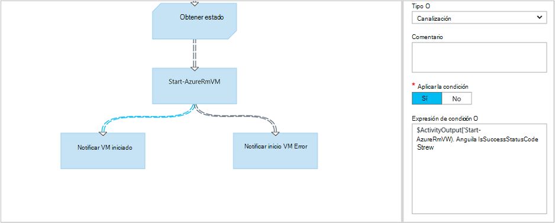

Cualquier actividad que sigue la primera vínculo y utiliza el resultado de la actividad de Get-AzureVM solo obtendrán las máquinas virtuales que se han iniciado en el momento en que se ejecute Get-AzureVM.  Cualquier actividad que sigue el segundo vínculo solo obtendrán la las máquinas virtuales que se han detenido en el momento en que se ejecute Get-AzureVM.  Cualquier actividad siguiendo el tercer vínculo obtendrá todos los equipos virtuales con independencia de su estado de ejecución.

### Uniones

Una unión es una actividad especial que va a esperar hasta que han completado todas las ramas entrantes.  Esto le permite ejecutar varias actividades en paralelo y asegúrese de que todos han completado antes de continuar.

Aunque una unión puede tener una cantidad ilimitada de vínculos entrantes, no más de uno de esos vínculos puede ser una canalización.  No se limita el número de vínculos de secuencia de entrada.  Se le permitirá crear a la unión con varios vínculos de canalización entrantes y guardar runbook, pero se producirá un error cuando se ejecuta.

El ejemplo siguiente forma parte de un runbook que se inicia un conjunto de máquinas virtuales al descargar simultáneamente revisiones que se aplique a esos equipos.  Una unión se usa para asegurarse de que ambos procesos se completan antes de que continúe runbook.

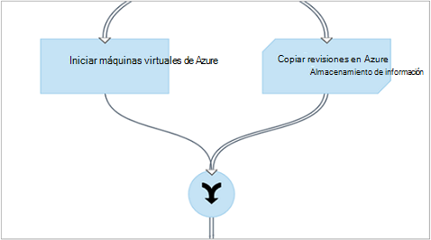

### Ciclos

Un ciclo es cuando una vínculos de actividad de destino a su actividad de origen o a otra actividad finalmente vínculos volver a su origen.  Ciclos actualmente no se permiten en la creación de gráficos.  Si su runbook tiene un ciclo, se guardará correctamente pero recibirá un error cuando se ejecuta.

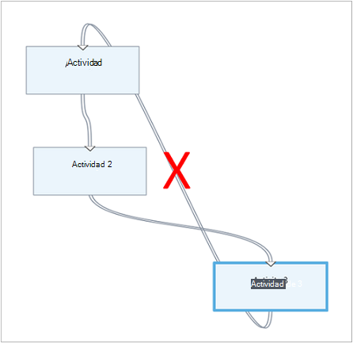

### Compartir datos entre actividades

Cualquier dato que dan como resultado una actividad con un vínculo de salida se escribe en el *databus* para runbook.  Cualquier actividad de runbook puede utilizar los datos en el databus para rellenar valores de parámetro o incluir en el código de secuencia de comandos.  Una actividad puede tener acceso a los resultados de la actividad anterior en el flujo de trabajo.     

Cómo se escriben los datos a la databus dependiendo del tipo del vínculo de la actividad.  Para una **canalización**, los datos son resultado como objetos de múltiplos.  Para un vínculo de la **secuencia** , los datos son resultado como una matriz.  Si hay un único valor, será salida como una matriz de elemento único.

Puede obtener acceso a datos en la databus usando uno de estos dos métodos.  En primer lugar usa un origen de datos de **Salida de actividad** para rellenar un parámetro de otra actividad.  Si el resultado es un objeto, puede especificar una única propiedad.

También puede recuperar el resultado de una actividad en un origen de datos de la **Expresión de PowerShell** o de una actividad de **Secuencia de comandos de flujo de trabajo** con una variable ActivityOutput.  Si el resultado es un objeto, puede especificar una única propiedad.  Variables de ActivityOutput utilizan la siguiente sintaxis.

    $ActivityOutput['Activity Label']
    $ActivityOutput['Activity Label'].PropertyName 

### Puntos de comprobación

Puede establecer [puntos de comprobación](automation-powershell-workflow.md#checkpoints) en un runbook de flujo de trabajo de PowerShell gráfica seleccionando *runbook de punto de comprobación* en cualquier actividad.  Hace que un punto de comprobación se almacenen después de ejecuta la actividad.

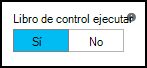

Los controles solo están habilitados en el flujo de trabajo de gráficos PowerShell runbooks, no está disponible en runbooks gráfica.  Si runbook usa cmdlets de Azure, debe seguir cualquier actividad marcada con un AzureRMAccount de agregar en caso de runbook se suspende y reinicia desde este punto de control en un trabajador diferente. 

## Autenticación en los recursos de Azure

Runbooks en Azure automatización que administrar recursos Azure requieren autenticación de Azure.  La nueva característica de [Ejecutar como cuenta](automation-sec-configure-azure-runas-account.md) (también conocida como servicio principal) es el método predeterminado para tener acceso a recursos de administrador de recursos de Azure en la suscripción con runbooks de automatización.  Puede agregar esta funcionalidad a un gráfico runbook agregando activo de conexión **AzureRunAsConnection** , que usa el cmdlet de PowerShell [Get-AutomationConnection](https://technet.microsoft.com/library/dn919922%28v=sc.16%29.aspx) y [Agregar AzureRmAccount](https://msdn.microsoft.com/library/mt619267.aspx) cmdlet al lienzo. Esto se muestra en el ejemplo siguiente. 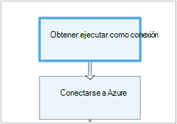 
La actividad de obtener ejecutar como conexión (es decir, Get-AutomationConnection) está configurado con un origen de datos de valor constante llamado AzureRunAsConnection. 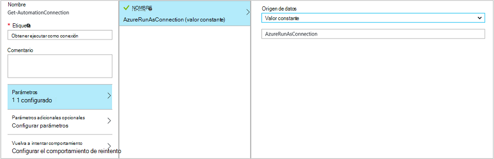 
La actividad siguiente, agregar-AzureRmAccount, agrega la cuenta de inicio de ejecutar como autenticada para su uso en runbook. 
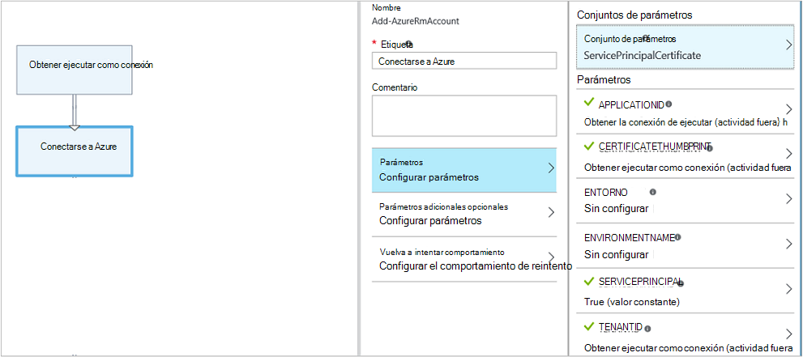 
Para los parámetros **APPLICATIONID** **CERTIFICATETHUMBPRINT**y **TENANTID** debe especificar el nombre de la propiedad de la ruta de acceso del campo porque la actividad envía un objeto con varias propiedades.  En caso contrario, cuando se ejecuta runbook, se producirá intentar autenticar.  Esto es lo que necesita como mínimo para autenticar su runbook con la cuenta ejecutar como.

Para mantener la compatibilidad con versiones anteriores para los suscriptores que han creado una cuenta de automatización con una [cuenta de usuario de Azure AD](automation-sec-configure-aduser-account.md) para administrar los recursos de administración de servicio de Azure (ASM) o el Administrador de recursos de Azure, el método para autenticar es el cmdlet Add-AzureAccount con un [activo de credenciales](http://msdn.microsoft.com/library/dn940015.aspx) que representa un usuario de Active Directory con acceso a la cuenta de Azure.

Puede agregar esta funcionalidad a un gráfico runbook mediante la adición de un activo de credenciales al lienzo seguido de una actividad de agregar AzureAccount.  AzureAccount agregar usa la actividad de credenciales para su entrada.  Esto se muestra en el ejemplo siguiente.

Se deben autenticar al principio del runbook y después de cada punto de control.  Esto significa que agregar una actividad de adición agregar AzureAccount después de las actividades de flujo de trabajo de control. No necesita una actividad de credenciales de suma ya que puede utilizar el mismo 

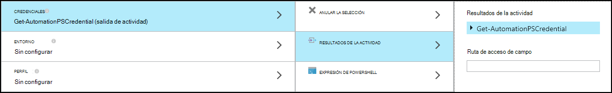

## Runbook de entrada y salida

### Entrada de runbook

Un runbook puede requerir la entrada de un usuario cuando vuelvan a iniciar runbook a través del portal de Azure o desde otro runbook si actual se usa como un elemento secundario.
Por ejemplo, si tiene un runbook que crea una máquina virtual, deberá proporcionar información como el nombre de la máquina virtual y otras propiedades de cada vez que inicie runbook.  

Acepte la entrada un runbook definiendo uno o más parámetros de entrada.  Para proporcionar los valores de estos parámetros cada vez que se inicie runbook.  Cuando se inicia un runbook con el portal de Azure, le pedirá que proporcione valores para cada uno de los parámetros de entrada del runbook.

Puede obtener acceso a los parámetros de entrada para un runbook haciendo clic en el botón de **entrada y salida** de la barra de herramientas de runbook.  

 

Se abrirá el control de **entrada y salida** donde puede editar un parámetro de entrada existente o cree uno nuevo haciendo clic en **Agregar entrada**. 

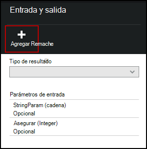

Cada parámetro de entrada se define mediante las propiedades de la tabla siguiente.

|(Propiedad)|Descripción|
|:---|:---|
| Nombre | El nombre único del parámetro.  Esto solo puede contener caracteres numéricos alfabéticas y no puede contener un espacio. |
| Descripción | Una descripción opcional para el parámetro de entrada.  |
| Tipo | Tipo de datos previsto para el valor del parámetro.  El portal de Azure le proporcionará un control adecuado para el tipo de datos para cada parámetro cuando solicitar entrada de datos. |
| Obligatorio | Especifica si se debe proporcionar un valor para el parámetro.  No se puede iniciar runbook si no se proporciona un valor para cada parámetro obligatorio que no tiene un valor predeterminado definido. |
| Valor predeterminado | Especifica el valor que se utiliza para el parámetro si no se proporciona.  Puede ser Null o un valor específico. |

### Salida runbook

Datos creados por cualquier actividad que no tiene un vínculo de salida se agregará a la [salida del runbook](http://msdn.microsoft.com/library/azure/dn879148.aspx).  El resultado se guarda con el trabajo runbook y está disponible para un runbook primario cuando runbook se usa como un elemento secundario.  

## Expresiones de PowerShell

Una de las ventajas de edición gráfica se le proporciona la capacidad para crear un runbook con conocimientos mínimos de PowerShell.  Actualmente, debe saber un poco de PowerShell aunque para rellenar algunos [valores de parámetro](#activities) y para configurar [las condiciones del vínculo](#links-and-workflow).  Esta sección proporciona una introducción rápida a las expresiones de PowerShell para aquellos usuarios que no esté familiarizados con él.  Detalles completos de PowerShell están disponibles en [Scripting con Windows PowerShell](http://technet.microsoft.com/library/bb978526.aspx). 

### Origen de datos de expresión de PowerShell

Puede usar una expresión de PowerShell como origen de datos para rellenar el valor de un [parámetro de actividad](#activities) con los resultados de un código de PowerShell.  Esto puede deberse a una sola línea de código que realiza alguna función simple o varias líneas que lleve a cabo una lógica compleja.  Los resultados de un comando que no está asignado a una variable aparece en el valor del parámetro. 

Por ejemplo, el siguiente comando desea mostrar la fecha actual. 

    Get-Date

Los siguientes comandos generación una cadena de la fecha actual y asignarlo a una variable.  El contenido de la variable se envía a los resultados 

    $string = "The current date is " + (Get-Date)
    $string

Los siguientes comandos evaluación la fecha actual y devuelven una cadena que indica si el día actual es un fin de semana o un día de la semana. 

    $date = Get-Date
    if (($date.DayOfWeek = "Saturday") -or ($date.DayOfWeek = "Sunday")) { "Weekend" }
    else { "Weekday" }
    
 
### Resultados de la actividad

Para usar el resultado de una actividad anterior en runbook, use la variable $ActivityOutput con la siguiente sintaxis.

    $ActivityOutput['Activity Label'].PropertyName

Por ejemplo, puede tener una actividad con una propiedad que requiere el nombre de una máquina virtual en cuyo caso podría usar la siguiente expresión.

    $ActivityOutput['Get-AzureVm'].Name

Si la propiedad que requiere la máquina virtual de objetos en lugar de solo una propiedad, se devolverá todo el objeto utilizando la sintaxis siguiente.

    $ActivityOutput['Get-AzureVm']

También puede usar el resultado de una actividad de una expresión más compleja como la siguiente que concatena texto en el nombre de la máquina virtual.

    "The computer name is " + $ActivityOutput['Get-AzureVm'].Name

### Condiciones

Usar [operadores de comparación](https://technet.microsoft.com/library/hh847759.aspx) para comparar valores o determinar si un valor coincide con un modelo especificado.  Una comparación devuelve un valor de $true o $false.

Por ejemplo, la siguiente condición determina si la máquina virtual de una actividad denominada *Get-AzureVM* está actualmente *detenido*. 

    $ActivityOutput["Get-AzureVM"].PowerState –eq "Stopped"

La siguiente condición comprueba si es la misma máquina virtual en cualquier estado distinto *detenido*.

    $ActivityOutput["Get-AzureVM"].PowerState –ne "Stopped"

Puede unirse a varias condiciones con un [operador lógico](https://technet.microsoft.com/library/hh847789.aspx) como **- y** o **- o**.  Por ejemplo, la siguiente condición comprueba si la misma máquina virtual en el ejemplo anterior está en un estado de *detenido* o *Detener*.

    ($ActivityOutput["Get-AzureVM"].PowerState –eq "Stopped") -or ($ActivityOutput["Get-AzureVM"].PowerState –eq "Stopping") 

### Tablas hash

[Tablas hash](http://technet.microsoft.com/library/hh847780.aspx) son pares de nombre/valor son útiles para devolver un conjunto de valores.  Propiedades de determinadas actividades que espere una tabla hash en lugar de un valor simple.  También puede ver como tabla hash que se conoce como un diccionario. 

Crear una tabla hash con la siguiente sintaxis.  Una tabla hash puede contener cualquier número de entradas pero están definidos por un nombre y un valor.

    @{ <name> = <value>; [<name> = <value> ] ...}

Por ejemplo, la expresión siguiente crea una tabla hash que se usará en el origen de datos para un parámetro de actividad que espera una tabla hash con valores para una búsqueda de internet.

    $query = "Azure Automation"
    $count = 10
    $h = @{'q'=$query; 'lr'='lang_ja';  'count'=$Count}
    $h

En el ejemplo siguiente se utiliza la salida de una actividad denominada *Obtener conexión Twitter* para rellenar una tabla hash.

    @{'ApiKey'=$ActivityOutput['Get Twitter Connection'].ConsumerAPIKey;
      'ApiSecret'=$ActivityOutput['Get Twitter Connection'].ConsumerAPISecret;
      'AccessToken'=$ActivityOutput['Get Twitter Connection'].AccessToken;
      'AccessTokenSecret'=$ActivityOutput['Get Twitter Connection'].AccessTokenSecret}

## Pasos siguientes

- Para empezar con PowerShell runbooks de flujo de trabajo, consulte [Mi primera runbook de flujo de trabajo de PowerShell](automation-first-runbook-textual.md) 
- Para empezar con runbooks gráfica, consulte [Mi primera runbook gráfica](automation-first-runbook-graphical.md)
- Para más información sobre las limitaciones, sus ventajas y runbook tipos, vea [tipos de runbook de automatización de Azure](automation-runbook-types.md)
- Para comprender cómo autenticar con la cuenta ejecutar como de automatización, vea [Configurar ejecutar como cuenta de Azure](automation-sec-configure-azure-runas-account.md)
 
