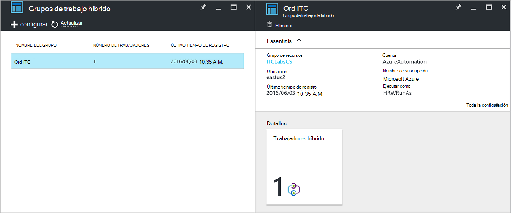
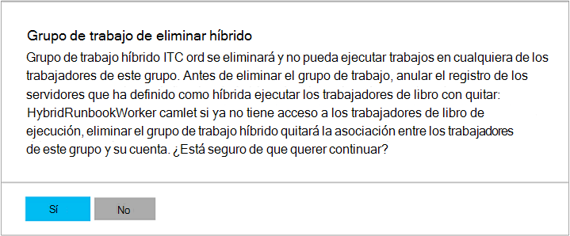

<properties
   pageTitle="Automatización de Azure híbrido Runbook trabajadores | Microsoft Azure"
   description="En este artículo se proporciona información sobre cómo instalar y usar híbrido Runbook trabajo que es una característica de automatización de Azure que le permite ejecutar runbooks en equipos de su centro de datos local."
   services="automation"
   documentationCenter=""
   authors="mgoedtel"
   manager="jwhit"
   editor="tysonn" />
<tags
   ms.service="automation"
   ms.devlang="na"
   ms.topic="article"
   ms.tgt_pltfrm="na"
   ms.workload="infrastructure-services"
   ms.date="10/14/2016"
   ms.author="bwren" />

# Automatización de Azure híbrido Runbook trabajadores

Runbooks en automatización de Azure no puede acceder a los recursos en el centro de datos locales desde que se ejecutan en la nube de Azure.  La característica híbrida Runbook trabajador de Azure automatización le permite ejecutar runbooks en equipos que se encuentra en el centro de datos con el fin de administrar recursos locales. La runbooks se almacenan y administran en automatización de Azure y, después, se enviarán a uno o varios equipos locales.  

Esta funcionalidad se muestra en la siguiente imagen.   

Puede designar uno o varios equipos en el centro de datos para actuar como híbrida Runbook trabajador y ejecutar runbooks desde automatización de Azure.  Cada trabajador requiere al agente de administración de Microsoft con una conexión a la serie de administración de operaciones de Microsoft y el entorno de runbook de automatización de Azure.  Serie de administración de operaciones solo se usa para instalar y mantener al agente de administración y para supervisar la funcionalidad del trabajador.  Automatización de Azure realiza la entrega de runbooks y la instrucción para ejecutarlos.

No existen requisitos para admitir híbrido Runbook trabajadores firewall de entrada. El agente en el equipo local inicia todas las comunicaciones con la automatización de Azure en la nube. Cuando se inicia un runbook, automatización de Azure crea una instrucción recuperados por agente. El agente, a continuación, extrae runbook y de los parámetros antes de ejecutarlo.  También recuperará los [activos](http://msdn.microsoft.com/library/dn939988.aspx) que utilizan runbook de automatización de Azure.

>[AZURE.NOTE] Híbrido Runbook trabajadores no compatible con las [Configuraciones de DSC](automation-dsc-overview.md).

## Grupos de trabajo Runbook híbrido

Cada empleado de Runbook híbrido es un miembro de un grupo de trabajo Runbook de híbrido que especifique al instalar el agente.  Un grupo puede incluir a un único agente, pero puede instalar a varios agentes en un grupo de alta disponibilidad.

Cuando se inicia un runbook en híbrido Runbook trabajador, especifique el grupo que se ejecuta en.  Los miembros del grupo determinará qué trabajo se la solicitud de servicio.  No puede especificar un empleado determinado.

## Requisitos del trabajo Runbook híbrido

Debe designar al menos un equipo local para ejecutar híbrido runbook trabajos.  Este equipo debe tener el siguiente:

- Windows Server 2012 o posterior
- Windows PowerShell 4.0 o posterior
- Mínimo de dos núcleos y 4 GB de RAM

Tenga en cuenta las siguientes recomendaciones para los trabajadores híbrido: 

- Designar varios trabajadores híbrido en cada grupo de alta disponibilidad.  
- Los trabajadores de híbridos pueden coexistencia con servidores de automatización de la administración de servicio o System Center Orchestrator runbook.
- Considere la posibilidad de usar un equipo que se encuentra en o cerca de la región de su cuenta de automatización, ya que los datos de trabajo se envía a Azure automatización cuando se complete una tarea.

>[AZURE.NOTE] Híbrido Runbook trabajo versión 7.2.11136.0 admite actualmente comunicarse mediante un servidor proxy sólo con secuencias de comandos de PowerShell.  Compatibilidad para las secuencias de comandos de flujo de trabajo de PowerShell estará disponible en una versión futura.  

### Establecer la configuración de proxy y firewall

Trabajador de Runbook de local híbrido para conectarse y registrar con el servicio de conjunto de aplicaciones de administración de operaciones de Microsoft (OMS), debe tener acceso al número de puerto y las direcciones URL que se describe a continuación.  Esto es además de [puertos y las direcciones URL necesarias para el agente de supervisión de Microsoft](../log-analytics/log-analytics-proxy-firewall.md#configure-proxy-and-firewall-settings-with-the-microsoft-monitoring-agent) para conectarse a OMS. Si usa un servidor proxy para la comunicación entre el agente y el servicio OMS, debe asegurarse de que los recursos apropiados son accesibles. Si utiliza un firewall para restringir el acceso a Internet, debe configurar el firewall para permitir el acceso. 

La siguiente información de la lista el puerto y las direcciones URL que son necesarias para el trabajo Runbook híbrido para comunicarse con la automatización.

- Puerto: Solo TCP 443 es necesaria para el acceso a Internet
- Global de direcciones URL: *.azure-automation.net

Si tiene una cuenta de automatización definida para una región específica y desea restringir comunicación con ese centro de datos regional, la tabla siguiente proporciona el registro DNS para cada región.

|**Región**|**Registro DNS**|
|--------------|--------------|
|Sur Central de EE.|scus jobruntimedata ord su1.azure automation.net|
|Estados Unidos oriental 2|eus2 jobruntimedata ord su1.azure automation.net|
|Europa occidental|nos-jobruntimedata-ord-su1.azure-automation.net|
|Europa del Norte|ne jobruntimedata ord su1.azure automation.net|
|Canadá Central|CC jobruntimedata ord su1.azure automation.net|
|Sudeste asiático|mar jobruntimedata ord su1.azure automation.net|
|India central|CID jobruntimedata ord su1.azure automation.net|
|Japón oriental|jpe jobruntimedata ord su1.azure automation.net|
|Australia sudeste|ase jobruntimedata ord su1.azure automation.net|

## Instalar híbrido Runbook trabajo

El procedimiento siguiente describe cómo instalar y configurar híbrido Runbook trabajo.  Realizar los dos primeros pasos una vez para su entorno de automatización y, a continuación, repita los pasos restantes para cada equipo de trabajo.

### 1. crear el área de trabajo de operaciones Management Suite

Si no dispone de un área de trabajo de la serie de administración de operaciones, cree uno utilizando instrucciones al [Configurar el área de trabajo](https://technet.microsoft.com/library/mt484119.aspx). Puede usar un área de trabajo existente si ya tiene una.

### 2. Agregar solución de automatización al área de trabajo de operaciones Management Suite

Soluciones agregan funcionalidad al conjunto de aplicaciones de administración de operaciones.  La solución de automatización agrega la funcionalidad de automatización de Azure incluido el soporte técnico para híbrido Runbook trabajador.  Al agregar la solución al área de trabajo, automáticamente se push componentes de trabajo en el equipo de agente que va a instalar en el siguiente paso.

Siga las instrucciones [para agregar una solución utilizando la Galería de soluciones](../log-analytics/log-analytics-add-solutions.md) para agregar la solución de **automatización** al área de trabajo conjunto de aplicaciones de administración de operaciones.

### 3. instalar el agente de supervisión de Microsoft

El agente de supervisión de Microsoft se conecta a los equipos al conjunto de aplicaciones de administración de operaciones.  Cuando instale al agente en el equipo local y conectarse a su área de trabajo, que descargue automáticamente los componentes necesarios para el trabajo de Runbook híbrido.

Siga las instrucciones en [equipos con Windows conectarse al análisis de registro](../log-analytics/log-analytics-windows-agents.md) para instalar al agente en el equipo local.  Puede repetir el proceso para varios equipos agregar varios trabajadores a su entorno.

Cuando el agente se ha conectado correctamente al conjunto de aplicaciones de administración de operaciones, se mostrará en la pestaña **Orígenes conectados** del panel de **configuración** del conjunto de aplicaciones de administración de operaciones.  Puede comprobar que el agente ha descargado correctamente la solución de automatización cuando tiene una carpeta denominada **AzureAutomationFiles** en C:\Program Files\Microsoft supervisión Agent\Agent.  Para confirmar la versión del trabajador Runbook híbrido, puede ir a C:\Program Files\Microsoft supervisión Agent\Agent\AzureAutomation\ y observe la \\ *versión* subcarpeta.   

### 4. instalar el entorno runbook y conectarse a la automatización de Azure

Cuando agrega un agente al conjunto de aplicaciones de administración de operaciones, la solución de automatización inserta el módulo de PowerShell **HybridRegistration** que contiene el cmdlet **HybridRunbookWorker agregar** .  Use este cmdlet para instalar el entorno runbook en el equipo y registrar con la automatización de Azure.

Abra una sesión PowerShell en modo de administrador y ejecute los comandos siguientes para importar el módulo.

    cd "C:\Program Files\Microsoft Monitoring Agent\Agent\AzureAutomation\<version>\HybridRegistration"
    Import-Module HybridRegistration.psd1

Luego ejecute el cmdlet de **Agregar HybridRunbookWorker** utilizando la sintaxis siguiente:

    Add-HybridRunbookWorker –Name <String> -EndPoint <Url> -Token <String>

Puede obtener la información necesaria para este cmdlet desde el módulo de **Administración de claves** en el portal de Azure.  Abra este módulo haciendo clic en el icono de llave en el panel de elementos de la cuenta de automatización.

- **Nombre** es el nombre del grupo de trabajo de Runbook híbrido. Si este grupo ya existe en la cuenta de automatización, el equipo actual se agrega a él.  Si aún no existe, se agrega.
- **Extremo** es el campo **dirección URL** en el módulo de **Administración de claves** .
- **Token** es la **Clave principal de acceso** en el módulo de **Administración de claves** .  

Usar el **-detallado** modificador con **Agregar HybridRunbookWorker** para recibir información detallada sobre la instalación.

### 5. instalar módulos de PowerShell

Runbooks puede utilizar cualquiera de las actividades y los cmdlets que se definen en los módulos instalados en su entorno de automatización de Azure.  No obstante, estos módulos no se implementan automáticamente a los equipos locales por lo que debe instalar manualmente.  La excepción es el módulo Azure que se instala de forma predeterminada, proporcionar acceso a los cmdlets para todos los servicios de Azure y actividades para automatización de Azure.

Dado que la finalidad principal de la característica híbrida Runbook trabajo Administrar recursos locales, es muy probable que debe instalar los módulos que estos recursos de soporte técnico.  Puede hacer referencia a [Instalar módulos](http://msdn.microsoft.com/library/dd878350.aspx) para obtener información sobre cómo instalar Windows PowerShell módulos.

## Quitar híbrido Runbook trabajo

Puede quitar uno o más híbrido Runbook trabajadores de un grupo o puede quitar el grupo, dependiendo de los requisitos.  Para quitar un trabajador de Runbook híbrido desde un equipo local, abra una sesión PowerShell en modo de administrador y ejecute el siguiente comando: **Quitar HybridRunbookWorker** cmdlet.  Usar el **-detallado** cambiar para un registro detallado del proceso de eliminación. 

No se quita al agente de supervisión de Microsoft desde el equipo, solo la configuración y la funcionalidad de la función de trabajo de Runbook híbrido.  

Para quitar un grupo, primero tendrá que quitar híbrido Runbook trabajador de cada equipo que es miembro del grupo mediante el comando mostrado antes y después de realizar los siguientes pasos para quitar el grupo.  

1. Abra la cuenta de automatización en el portal de Azure.
2. Seleccione el icono de **Grupos de trabajo híbrido** y en el módulo de **Grupos de trabajo híbrido** , seleccione el grupo que desea eliminar.  Después de seleccionar el grupo específico, se muestra el módulo de propiedades del **grupo de trabajo de implementación híbrida** .     
3. En la hoja de propiedades para el grupo seleccionado, haga clic en **Eliminar**.  Un mensaje aparecerán le pide que confirme esta acción y seleccione **Sí** si está seguro de que querer continuar.    Este proceso puede tardar algunos segundos en completarse y puede realizar un seguimiento de su progreso en **notificaciones** en el menú.  

## Iniciar runbooks en híbrido Runbook trabajo

[Iniciar un Runbook de automatización de Azure](automation-starting-a-runbook.md) describen los diferentes métodos para iniciar un runbook.  Híbrido Runbook trabajo agrega una opción de **RunOn** donde puede especificar el nombre de un grupo de trabajo de Runbook híbrido.  Si se especifica un grupo, runbook se recuperan y ejecute los trabajadores de ese grupo.  Si no se especifica esta opción, a continuación, se ejecuta en Azure automatización como normal.

Cuando inicia un runbook en el portal de Azure, aparecerá con la opción **ejecutar en** donde puede seleccionar **Azure** o **Trabajo híbrido**.  Si selecciona **Trabajo híbrido**, puede seleccionar el grupo en una lista desplegable.

Usar el parámetro **RunOn** podría usar el comando siguiente para iniciar un runbook denominado Runbook de prueba en un grupo de trabajo de Runbook híbrido denominada MyHybridGroup con Windows PowerShell.

    Start-AzureRmAutomationRunbook –AutomationAccountName "MyAutomationAccount" –Name "Test-Runbook" -RunOn "MyHybridGroup"

>[AZURE.NOTE] El parámetro **RunOn** se agregó al cmdlet **AzureAutomationRunbook de inicio** en la versión 0.9.1 de PowerShell de Microsoft Azure.  Debe [Descargar la última versión](https://azure.microsoft.com/downloads/) si tiene un instalado uno anterior.  Solo necesita instalar esta versión en una estación de trabajo donde comenzará runbook de Windows PowerShell.  No es necesario instalar en el equipo de trabajo a menos que desee iniciar runbooks desde el equipo.  Actualmente no se puede iniciar un runbook en híbrido Runbook trabajador desde otro runbook ya que esto requeriría la última versión de Azure Powershell esté instalado en su cuenta de automatización.  La versión más reciente se actualizan automáticamente en la automatización de Azure y automáticamente introducirlos en los trabajadores pronto.

## Permisos de runbook

Runbooks quedando híbrido Runbook trabajador no puede usar el mismo [método que se suele usar para runbooks autenticar a recursos de Azure](automation-configuring.md#configuring-authentication-to-azure-resources) ya que tendrá acceso de recursos fuera de Azure.  Runbook puede proporcionar su propia autenticación a los recursos locales, o puede especificar una cuenta de RunAs para proporcionar un contexto de usuario para todos los runbooks.

### Autenticación de runbook

De forma predeterminada, runbooks se ejecutará en el contexto de la cuenta del sistema local en el equipo local, por lo que deben proporcionar su propia autenticación a los recursos que tienen acceso a.  

Puede utilizar los activos de [certificado](http://msdn.microsoft.com/library/dn940013.aspx) y [credenciales](http://msdn.microsoft.com/library/dn940015.aspx) en su runbook con los cmdlets que le permiten especificar credenciales, por lo que puede autenticarse en diferentes recursos.  En el ejemplo siguiente se muestra una parte de un runbook que reinicia el equipo de un equipo.  Recupera las credenciales de un activo de credenciales y el nombre del equipo de un activo de variables y, a continuación, usa estos valores con el cmdlet de reiniciar el equipo.

    $Cred = Get-AzureRmAutomationCredential -ResourceGroupName "ResourceGroup01" -Name "MyCredential"
    $Computer = Get-AzureRmAutomationVariable -ResourceGroupName "ResourceGroup01" -Name  "ComputerName"

    Restart-Computer -ComputerName $Computer -Credential $Cred

También puede aprovechar [InlineScript](automation-powershell-workflow.md#inline-script) que le permita ejecutar bloques de código en otro equipo con credenciales especificadas por el [parámetro de PSCredential común](http://technet.microsoft.com/library/jj129719.aspx).

### Cuenta de RunAs

En lugar de tener runbooks proporcionar su propia autenticación a los recursos locales, puede especificar una cuenta de **RunAs** para un grupo de trabajo híbrido.  Especificar un [activo de credenciales](automation-credentials.md) que tiene acceso a los recursos locales y todos los runbooks se ejecutará en estas credenciales cuando se ejecuta en un trabajo de Runbook híbrido en el grupo.  

El nombre de usuario de la credencial debe estar en uno de los siguientes formatos:

- dominio\nombre de usuario 
- username@domain
- nombre de usuario (para las cuentas locales en el equipo local)

Use el siguiente procedimiento para especificar una cuenta de RunAs para un grupo de trabajo híbrido:

1. Cree un [activo de credenciales](automation-credentials.md) con acceso a los recursos locales.
2. Abra la cuenta de automatización en el portal de Azure.
2. Seleccione el icono de **Grupos de trabajo híbrido** y, a continuación, seleccione el grupo.
3. Seleccione **toda la configuración** y luego en **configuración de grupo de trabajo híbrido**.
4. Cambiar la opción **Ejecutar como** de **predeterminado** **personalizado**.
5. Seleccione la credencial y haga clic en **Guardar**.

## Creación de runbooks híbrido Runbook trabajador

No hay ninguna diferencia en la estructura de runbooks que se ejecutan en automatización de Azure y aquellos que se ejecutan en un trabajo de Runbook híbrido. Runbooks que usa con cada uno más probable es que variarán considerablemente aunque runbooks híbrido Runbook trabajador normalmente se administran los recursos locales en el centro de datos mientras runbooks en Azure automatización normalmente administrar recursos en la nube de Azure. 

Puede editar un runbook híbrido Runbook trabajador de Azure automatización, pero es posible que tenga dificultades si intenta probar runbook en el editor.  Los módulos de PowerShell que tienen acceso a los recursos locales no pueden estar instalados en su entorno de automatización de Azure en cuyo caso, no la prueba.  Si instala los módulos necesarios, a continuación, se ejecutará runbook, pero no podrá tener acceso a los recursos locales para una prueba completa.

## Solución de problemas de runbooks en híbrido Runbook trabajo

[Mensajes y salida Runbook](automation-runbook-output-and-messages.md) se envían a Azure automatización de híbrido trabajadores como trabajos runbook ejecutar en la nube.  También puede habilitar las secuencias detallado y el progreso de la misma manera que lo haría con otros runbooks.  

Registros se almacenan localmente en cada trabajador híbrido en C:\ProgramData\Microsoft\System Center\Orchestrator\7.2\SMA\Sandboxes.

Si sus runbooks no está completando correctamente y la tarea de resumen muestra el estado de **suspendido**, revise el artículo de solución de problemas [híbrido Runbook trabajo: un trabajo runbook termina con un estado de suspendido](automation-troubleshooting-hrw-runbook-terminates-suspended.md).   

## Relación de automatización de la administración de servicio

[Automatización de administración de servicios (SMA)](https://technet.microsoft.com/library/dn469260.aspx) le permite ejecutar el mismo runbooks que son compatibles con la automatización de Azure en el centro de datos local. SMA generalmente se implementa junto con el módulo de Windows Azure, como Windows Azure Pack contiene una interfaz gráfica para la administración de SMA. A diferencia de automatización de Azure, SMA requiere una instalación local que incluye servidores web para alojar la API, una base de datos que contenga runbooks y configuración de SMA y los trabajadores Runbook para ejecutar runbook trabajos. Automatización de Azure proporciona estos servicios en la nube y sólo requiere mantener los trabajadores de Runbook híbrido en su entorno local.

Si es un usuario SMA existente, puede mover sus runbooks automatización de Azure se utiliza con híbridos Runbook trabajo sin cambios, suponiendo que realicen su propia autenticación a recursos como se describe en [crear runbooks híbrido Runbook trabajador](#creating-runbooks-for-hybrid-runbook-worker).  Runbooks en SMA se ejecute en el contexto de la cuenta de servicio en el servidor de trabajo que puede proporcionar que la autenticación de la runbooks.

Puede usar los siguientes criterios para determinar si es más apropiada para los requisitos de automatización de Azure con híbrido Runbook trabajo o de automatización de la administración de servicio.

- SMA requiere una instalación local de sus componentes subyacentes que están conectadas a Windows Azure Pack si se requiere una interfaz gráfica de administración. Se necesita más recursos locales con los costos de mantenimiento mayor que la automatización de Azure, que solo necesita a un agente instalado en los trabajadores runbook local. Los agentes administrados por el conjunto de aplicaciones de administración de operaciones, disminuir aún más los costes de mantenimiento.
- Automatización de Azure almacena sus runbooks en la nube y los entrega a sus colegas Runbook local híbrido. Si la directiva de seguridad no permite este comportamiento, debe usar a SMA.
- SMA se incluye con System Center; Por tanto, se requiere una licencia de System Center 2012 R2. Automatización de Azure se basa en un modelo en niveles de suscripción.
- Automatización de Azure ha características avanzadas como gráfica runbooks que no están disponibles en SMA.

## Pasos siguientes

- Para obtener más información acerca de los diferentes métodos que pueden usar para iniciar un runbook, vea [iniciar un Runbook de automatización de Azure](automation-starting-a-runbook.md)
- Para conocer los procedimientos diferentes para trabajar con PowerShell y flujo de trabajo de PowerShell runbooks en automatización de Azure mediante el editor de texto, vea [Editar un Runbook de automatización de Azure](automation-edit-textual-runbook.md)

 
