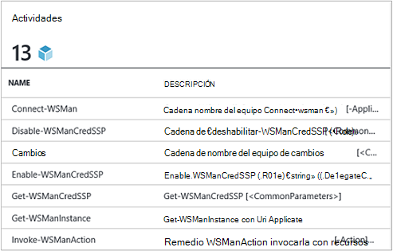
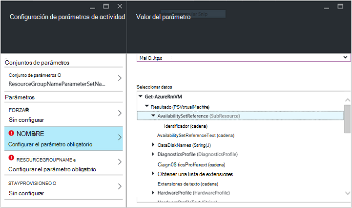
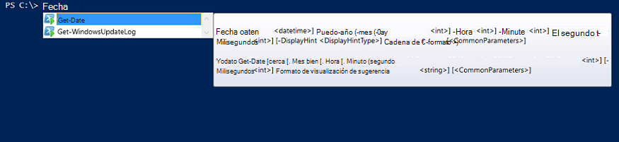

<properties
   pageTitle="Crear un módulo de integración de automatización Azure | Microsoft Azure"
   description="Tutoriales le guiará por el uso de ejemplo, probar y creación de módulos de integración de automatización de Azure."
   services="automation"
   documentationCenter=""
   authors="mgoedtel"
   manager="jwhit"
   editor="" />

<tags
   ms.service="automation"
   ms.workload="tbd"
   ms.tgt_pltfrm="na"
   ms.devlang="na"
   ms.topic="get-started-article"
   ms.date="09/12/2016"
   ms.author="magoedte" />

# <a name="azure-automation-integration-modules"></a>Módulos de integración de automatización de Azure

PowerShell es la tecnología fundamental detrás de automatización de Azure. Puesto que la automatización de Azure se basa en PowerShell, módulos de PowerShell son fundamentales para la capacidad de ampliación de automatización de Azure. En este artículo, se le guiará a través de las características de uso de Azure automatización de módulos de PowerShell, denominados "Módulos de integración" y los procedimientos recomendados para crear sus propios módulos de PowerShell para asegurarse de que funcionan como módulos de integración de automatización de Azure. 

## <a name="what-is-a-powershell-module"></a>¿Qué es un módulo de PowerShell?

Un módulo de PowerShell es un grupo de cmdlets de PowerShell como **Get-Date** o **Copiar elemento**, que se puede usar desde la consola de PowerShell, secuencias de comandos, flujos de trabajo, runbooks y recursos de PowerShell DSC como WindowsFeature o archivo, que puede usarse desde configuraciones de PowerShell DSC. Todas las funciones de PowerShell se expone a través de los cmdlets y recursos de DSC y todos los recursos de cmdlet/DSC se copia un módulo de PowerShell, muchos de los que se incluyen con PowerShell. Por ejemplo, el cmdlet **Get-Date** forma parte del módulo de Microsoft.PowerShell.Utility PowerShell y **Copiar elemento** cmdlet forma parte del módulo de Microsoft.PowerShell.Management PowerShell y el recurso de paquete DSC es parte del módulo de PSDesiredStateConfiguration PowerShell. Ambos módulos suministran con PowerShell. Pero muchos módulos de PowerShell no incluyen como parte de PowerShell y en su lugar se distribuyen con productos de terceros o primera como administrador de configuración de System Center 2012 o por la amplia comunidad de PowerShell en lugares como galería de PowerShell.  Los módulos son útiles, ya que hacen tareas complejas sencillos mediante funcionalidad encapsulada.  Puede obtener más información sobre [los módulos de PowerShell en MSDN](https://msdn.microsoft.com/library/dd878324%28v=vs.85%29.aspx). 

## <a name="what-is-an-azure-automation-integration-module"></a>¿Qué es un módulo de integración de automatización de Azure?

Un módulo de integración no es muy diferente de un módulo de PowerShell. Su simplemente un módulo de PowerShell que contiene opcionalmente un archivo adicional: un archivo de metadatos que especifica un tipo de conexión de automatización de Azure para usarlo con los cmdlets del módulo en runbooks. Opcional de archivo o no, estos módulos se pueden importar a Azure automatización para realizar sus cmdlets disponibles para su uso dentro de runbooks y sus recursos DSC disponibles para su uso dentro de las configuraciones de DSC de PowerShell. En segundo plano, automatización de Azure almacena estos módulos y runbook trabajo y el tiempo de ejecución de trabajo DSC compiliation carga en entornos limitados de automatización de Azure donde se ejecutan runbooks y se compilan configuraciones DSC.  Los recursos DSC en módulos se colocan también automáticamente en el servidor de extracción DSC de automatización, para que pueden extraer máquinas intentando aplicar configuraciones DSC.  Ofrecemos un número de módulos de Azure PowerShell fuera de la caja en Azure automatización para que se use para que pueda empezar automatizar la administración de Azure inmediatamente, pero puede importar fácilmente módulos de PowerShell para cualquier sistema, servicio o herramienta que desea integrar con. 

>[AZURE.NOTE] Algunos módulos se envían como "módulos globales" en el servicio de automatización. Estos módulos globales están disponibles para el cuadro al crear una cuenta de automatización y, a continuación, se actualiza a veces que automáticamente las inserta su cuenta de automatización. Si no desea que se actualiza automáticamente, siempre puede importar el mismo módulo y que tiene prioridad sobre la versión del módulo global de ese módulo que vienen en el servicio. 

El formato en el que importar un paquete de Integration Module es un archivo comprimido con el mismo nombre que el módulo y una extensión .zip. Contiene el módulo Windows PowerShell y los archivos auxiliares, incluido un archivo manifiesto (.psd1) si el módulo tiene uno.

Si el módulo debe contener un tipo de conexión de automatización de Azure, también debe contener un archivo con el nombre *<ModuleName>*-Automation.json que especifica las propiedades de tipo de conexión. Este es un archivo de json situado dentro de la carpeta de módulo del archivo .zip comprimido y contiene los campos de una conexión de"" que se necesita para conectarse al sistema o servicio que representa el módulo. Esto terminará la creación de un tipo de conexión en la automatización de Azure. Con este archivo puede establecer los nombres de campo, tipos, y si los campos deben ser cifrada u opcionales para el tipo de conexión del módulo. La siguiente es una plantilla en el formato de archivo de json.

```
{ 
   "ConnectionFields": [
   {
      "IsEncrypted":  false,
      "IsOptional":  false,
      "Name":  "ComputerName",
      "TypeName":  "System.String"
   },
   {
      "IsEncrypted":  false,
      "IsOptional":  true,
      "Name":  "Username",
      "TypeName":  "System.String"
   },
   {
      "IsEncrypted":  true,
      "IsOptional":  false,
      "Name":  "Password",
   "TypeName":  "System.String"
   }],
   "ConnectionTypeName":  "DataProtectionManager",
   "IntegrationModuleName":  "DataProtectionManager"
}
```

Si ha implementado automatización de la administración de servicio y crea paquetes de módulos de integración para sus runbooks automatización, debería resultarle muy familiar. 


## <a name="authoring-best-practices"></a>Prácticas recomendadas de creación

Simplemente porque módulos de integración son esencialmente módulos de PowerShell, que no significa que no tiene un conjunto de prácticas acerca de la creación de ellos. Aún hay una serie de cosas que le recomendamos que considere durante la edición de un módulo de PowerShell, para que sea más fácil de usar en automatización de Azure. Algunos de ellos son específicos de automatización de Azure y algunos de ellos son útiles para realizar los módulos funcionan bien en el flujo de trabajo de PowerShell, independientemente de si usa la automatización. 

1. Incluir un resumen, descripción y ayude a URI para cada cmdlet en el módulo. En PowerShell, puede definir determinada información de ayuda para los cmdlets permitir al usuario recibir ayuda sobre el uso de con el cmdlet **Get-Help** . Por ejemplo, aquí es cómo puede definir un resumen y ayuda URI para un módulo de PowerShell escrito en un archivo .psm1.<br>  

    ```
    <#
        .SYNOPSIS
         Gets all outgoing phone numbers for this Twilio account 
    #>
    function Get-TwilioPhoneNumbers {
    [CmdletBinding(DefaultParameterSetName='SpecifyConnectionFields', `
    HelpUri='http://www.twilio.com/docs/api/rest/outgoing-caller-ids')]
    param(
       [Parameter(ParameterSetName='SpecifyConnectionFields', Mandatory=$true)]
       [ValidateNotNullOrEmpty()]
       [string]
       $AccountSid,

       [Parameter(ParameterSetName='SpecifyConnectionFields', Mandatory=$true)]
       [ValidateNotNullOrEmpty()]
       [string]
       $AuthToken,

       [Parameter(ParameterSetName='UseConnectionObject', Mandatory=$true)]
       [ValidateNotNullOrEmpty()]
       [Hashtable]
       $Connection
    )

    $cred = CreateTwilioCredential -Connection $Connection -AccountSid $AccountSid -AuthToken $AuthToken

    $uri = "$TWILIO_BASE_URL/Accounts/" + $cred.UserName + "/IncomingPhoneNumbers"
    
    $response = Invoke-RestMethod -Method Get -Uri $uri -Credential $cred

    $response.TwilioResponse.IncomingPhoneNumbers.IncomingPhoneNumber
    }
    ```
<br> 
Siempre que esta información no mostrará solo esta ayuda con el cmdlet **Get-ayuda** de la consola de PowerShell, también expone esta funcionalidad de la Ayuda en la automatización de Azure, por ejemplo al insertar actividades durante la edición de runbook. Haciendo clic en "Ver ayuda detallada" se abrirá la Ayuda URI de otra pestaña del explorador web que se usa para tener acceso a automatización de Azure.<br>
2. Si el módulo se ejecuta en un sistema remoto, una. Debe contener un archivo de metadatos de integración módulo que define la información necesaria para conectarse al sistema remoto, lo que significa que el tipo de conexión. b. Cada cmdlet en el módulo debería poder tomar en un objeto de conexión (una instancia de ese tipo de conexión) como un parámetro.  
    Cmdlets en el módulo resulta más fáciles de usar en Azure automatización si permite pasar de un objeto con los campos del tipo de conexión como un parámetro para el cmdlet. Esta forma, los usuarios no tienen que asignar los parámetros de los activos de conexión a los parámetros correspondientes del cmdlet cada vez que se llama a un cmdlet. Según el ejemplo runbook anterior, usa un activo de conexión Twilio denominado CorpTwilio para acceder a Twilio y devolver todos los números de teléfono de la cuenta.  ¿Observe cómo se trata de asignar los campos de la conexión a los parámetros del cmdlet?<br>

    ```
    workflow Get-CorpTwilioPhones
    {
      $CorpTwilio = Get-AutomationConnection -Name 'CorpTwilio'
    
      Get-TwilioPhoneNumbers 
        -AccountSid $CorpTwilio.AccountSid  
        -AuthToken $CorptTwilio.AuthToken
    }
    ```
<br>
Una manera mejor y más fácil de este enfoque es pasar directamente el objeto de conexión al cmdlet:

    ```
    workflow Get-CorpTwilioPhones
    {
      $CorpTwilio = Get-AutomationConnection -Name 'CorpTwilio'

      Get-TwilioPhoneNumbers -Connection $CorpTwilio
    }
    ```
<br>
Puede habilitar el comportamiento así de los cmdlets por lo que les permite aceptar un objeto de conexión directamente como un parámetro, en lugar de campos de conexión solo para los parámetros. Normalmente querrá un parámetro para cada uno, para que un usuario que no usa la automatización de Azure puede llamar a los cmdlets sin construir una tabla hash para que actúe como el objeto de conexión. Conjunto de parámetro **SpecifyConnectionFields** se utiliza para pasar a la conexión de propiedades de campo uno a uno. **UseConnectionObject** le permite pasar recta a través de la conexión. Como puede ver, el cmdlet enviar TwilioSMS en el [módulo de Twilio PowerShell](https://gallery.technet.microsoft.com/scriptcenter/Twilio-PowerShell-Module-8a8bfef8) permite pasar en ambos casos: 

    ```
    function Send-TwilioSMS {
      [CmdletBinding(DefaultParameterSetName='SpecifyConnectionFields', `
      HelpUri='http://www.twilio.com/docs/api/rest/sending-sms')]
      param(
         [Parameter(ParameterSetName='SpecifyConnectionFields', Mandatory=$true)]
         [ValidateNotNullOrEmpty()]
         [string]
         $AccountSid,

         [Parameter(ParameterSetName='SpecifyConnectionFields', Mandatory=$true)]
         [ValidateNotNullOrEmpty()]
         [string]
         $AuthToken,

         [Parameter(ParameterSetName='UseConnectionObject', Mandatory=$true)]
         [ValidateNotNullOrEmpty()]
         [Hashtable]
         $Connection

       )
    }
    ```
<br>
3. Definir el tipo de salida para todos los cmdlets en el módulo. Definir un tipo de resultado de un cmdlet permite tiempo de diseño IntelliSense para ayudarle a determinar las propiedades del resultado del cmdlet, para su uso durante la edición. Es especialmente útil durante la automatización runbook gráfica edición, donde conocimientos de tiempo de diseño es clave para una experiencia de usuario sencilla con el módulo.<br> <br> Esto es similar a la funcionalidad "escriba anticipada" de salida de un cmdlet de PowerShell ISE sin tener que ejecutarlo.<br> <br>
4. Cmdlets en el módulo no debe tener tipos de objeto compleja para los parámetros. Flujo de trabajo de PowerShell es diferente de PowerShell en que almacena tipos complejos en formulario deserializado. Tipos simples permanecerá como fundamentos, pero tipos complejos se convierten en sus versiones deserializados, que son esencialmente los contenedores de propiedades. Por ejemplo, si ha usado el cmdlet **Get-Process** en un runbook (o un flujo de trabajo de PowerShell para ello), devolverá un objeto de tipo [Deserialized.System.Diagnostic.Process], no el tipo de [System.Diagnostic.Process] esperado. Este tipo tiene las mismas propiedades como el tipo no deserializar, pero ninguno de los métodos. Y si intenta pasar este valor como un parámetro a un cmdlet, donde el cmdlet espera un valor de [System.Diagnostic.Process] para este parámetro, recibirá el siguiente error: *no se puede procesar la transformación de los argumentos de parámetro 'process'. Error: "no se puede convertir el valor de"System.Diagnostics.Process (CcmExec)"del tipo"Deserialized.System.Diagnostics.Process"escribir"System.Diagnostics.Process".*   Esto es porque no hay tipos no coinciden entre el tipo de [System.Diagnostic.Process] esperado y el tipo de [Deserialized.System.Diagnostic.Process] determinado. Para solucionar este problema es asegurarse de que los cmdlets del módulo no tipos complejos de parámetros. Esta es una manera incorrecta que hacerlo.

    ```
    function Get-ProcessDescription {
      param (
            [System.Diagnostic.Process] $process
      )
      $process.Description
    }
    ``` 
<br>
Y esta es una manera adecuada, tomar notas en un simple que puede ser usada internamente por el cmdlet para captar el objeto complejo y usarlo. Puesto que los cmdlets que se ejecutan en el contexto de PowerShell, no PowerShell flujo de trabajo, el cmdlet $process se convierte en el tipo correcto de [System.Diagnostic.Process].  

    ```
    function Get-ProcessDescription {
      param (
            [String] $processName
      )
      $process = Get-Process -Name $processName

      $process.Description
    }
    ```
<br>
Los activos de conexión en runbooks son tablas hash, que son un tipo complejo, y aún parece podrá pasar a cmdlets para estas tablas hash sus: parámetro de conexión perfectamente, con ninguna excepción de conversión. Técnicamente, algunos tipos de PowerShell pueden convertir correctamente su formulario de número de serie en su formulario deserializado y, por tanto, se pueden pasar en cmdlets para aceptar el tipo deserializado no de parámetros. Tabla hash es uno de estos. Es posible que tipos definidos del autor de un módulo se implementa de manera que pueda deserializar correctamente también, pero hay algunas desventajas. El tipo debe tener un constructor predeterminado, dispone de todas sus propiedades públicas y tiene una PSTypeConverter. Sin embargo, para los tipos de ya definido que no pertenece el autor del módulo, hay ninguna manera "corregirlos", por lo tanto, la recomendación para evitar tipos complejos de parámetros todo. Creación de runbook Sugerencia: si por algún motivo la necesidad de cmdlets toman un parámetro de tipo complejo o está utilizando otra persona módulo que requiere un parámetro de tipo complejo, es la solución de flujo de trabajo de PowerShell runbooks y flujos de trabajo de PowerShel en PowerShell local ajustar el cmdlet que genera el tipo complejo y el cmdlet que consume el tipo complejo en la misma actividad InlineScript. Dado que InlineScript ejecuta su contenido como PowerShell en lugar de flujo de trabajo de PowerShell, el cmdlet generar el tipo complejo generará ese tipo correcto, no el tipo complejo deserializado.
5. Hacer que todos los cmdlets en el módulo de estado. Flujo de trabajo de PowerShell ejecuta cada cmdlet llamado en el flujo de trabajo en una sesión diferente. Esto significa que los cmdlets que dependen de estado de sesión creado o modificado por otros cmdlets en el mismo módulo no funcionarán en el flujo de trabajo de PowerShell runbooks.  Aquí es un ejemplo de lo que no.

    ```
    $globalNum = 0
    function Set-GlobalNum {
       param(
           [int] $num
       )
      
       $globalNum = $num
    }
    function Get-GlobalNumTimesTwo {
       $output = $globalNum * 2
     
       $output
    }
    ```
<br>
6. El módulo debe estar totalmente contenido en un paquete capaz de Xcopy. Porque módulos de automatización de Azure se distribuyen a los entornos limitados automatización cuando necesite ejecutar runbooks, que necesitan trabajar de manera independiente el host en que se están ejecutando. Esto significa que debería poder Zip el paquete de módulo, muévalo a cualquier otro host con la versión de PowerShell misma o una versión posterior, y hacer que funcione con normalidad cuando se importan en el entorno de PowerShell de ese host. En orden para que esto suceda, el módulo no debería depender en todos los archivos fuera de la carpeta de módulo (la carpeta que obtiene zip hacia arriba al importar en automatización de Azure) o en cualquier configuración de registro único en un host, como las establecidas por la instalación de un producto. Si no se sigue este procedimiento recomendado, el módulo no se podrá utilizar en la automatización de Azure.  

## <a name="next-steps"></a>Pasos siguientes

- Para empezar con PowerShell runbooks de flujo de trabajo, consulte [Mi primera runbook de flujo de trabajo de PowerShell](automation-first-runbook-textual.md)
- Para obtener más información sobre cómo crear módulos de PowerShell, vea [crear un módulo de Windows PowerShell](https://msdn.microsoft.com/library/dd878310%28v=vs.85%29.aspx)