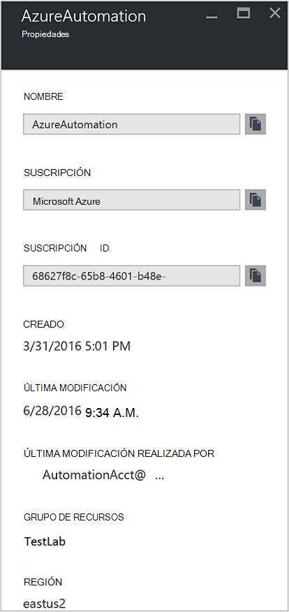
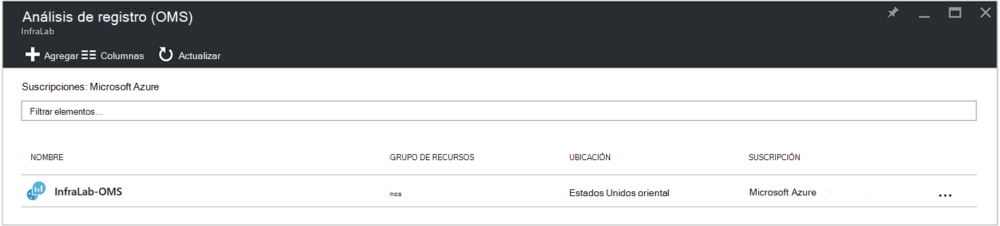
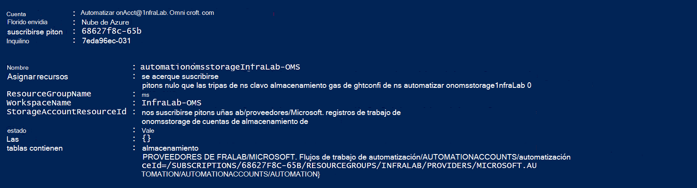
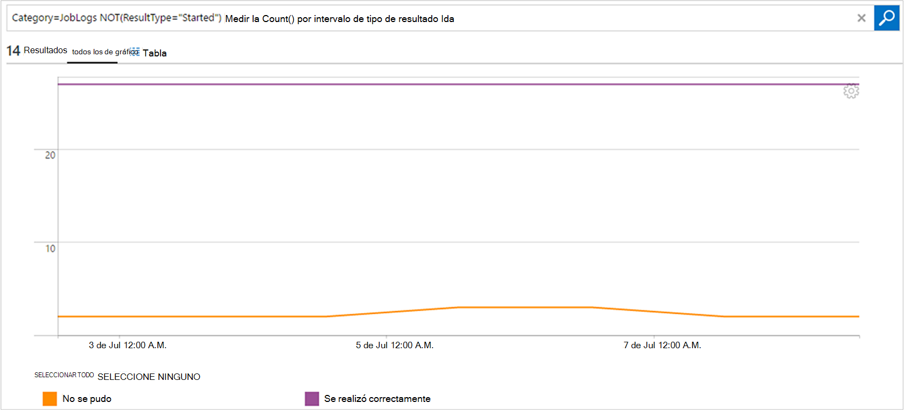

<properties
    pageTitle="Reenviar el estado del trabajo y flujos de trabajo de automatización para el análisis de registro (OMS) | Microsoft Azure"
    description="En este artículo muestra cómo enviar runbook y estado del trabajo de flujos de trabajo a Microsoft operaciones Management Suite registro Analytics para proporcionar información adicional y administración."
    services="automation"
    documentationCenter=""
    authors="MGoedtel"
    manager="jwhit"
    editor="tysonn" />
<tags
    ms.service="automation"
    ms.devlang="na"
    ms.topic="article"
    ms.tgt_pltfrm="na"
    ms.workload="infrastructure-services"
    ms.date="09/22/2016"
    ms.author="magoedte" />

# Reenviar el estado del trabajo y flujos de trabajo de automatización para el análisis de registro (OMS)

Automatización puede enviar runbook flujos de trabajo estado y el trabajo en el área de trabajo de análisis de registro del conjunto de aplicaciones de administración de operaciones de Microsoft (OMS).  Si bien puede ver esta información en el portal de Azure o con PowerShell por estado del trabajo individuales o todas las tareas para una cuenta de automatización determinada, nada avanzadas para admitir los requisitos operativos requiere que crear secuencias de comandos de PowerShell personalizadas.  Ahora con Anaytics de registro, puede:

- Obtenga información sobre los trabajos de automatización 
- Desencadenar un correo electrónico o una alerta según su estado de trabajo runbook (por ejemplo, no se pudo o suspendido) 
- Escribir consultas avanzadas en los flujos de trabajo 
- Relacionar trabajos entre cuentas de automatización 
- Visualizar el historial de trabajo a lo largo del tiempo     

## Requisitos previos y consideraciones de implementación

Para empezar a enviar los registros de automatización para el análisis de registro, debe tener el siguiente:

1. Una suscripción de OMS. Para obtener más información, vea [Introducción a análisis de registro](../log-analytics/log-analytics-get-started.md).  

    >[AZURE.NOTE]El área de trabajo OMS y la cuenta de automatización deben estar en la misma suscripción Azure esta configuración para que funcione correctamente. 
  
2. Una [cuenta de almacenamiento de Azure](../storage/storage-create-storage-account.md).  
   
    >[AZURE.NOTE]La cuenta de almacenamiento *debe* estar en la misma región como la cuenta de automatización. 
 
3. PowerShell Azure con versión 1.0.8 o una versión posterior de los cmdlets de perspectivas operativas. Para obtener información acerca de esta versión y cómo instalarlo, consulte [cómo instalar y configurar Azure PowerShell](../powershell-install-configure.md).
4. Diagnóstico de Azure y PowerShell de análisis de registro.  Para obtener más información acerca de esta versión y cómo instalarlo, vea [análisis de registro y diagnóstico de Azure](https://www.powershellgallery.com/packages/AzureDiagnosticsAndLogAnalytics/0.1).  
5. Descargue la secuencia de comandos de PowerShell **Habilitar AzureDiagnostics.ps1** desde la [Galería de PowerShell](https://www.powershellgallery.com/packages/Enable-AzureDiagnostics/1.0/DisplayScript). Esta secuencia de comandos configurará lo siguiente:
 - Una cuenta de almacenamiento para almacenar los datos de estado y flujo de trabajo de runbook para una cuenta de automatización que especifique.
 - Habilitar la recopilación de datos de su cuenta de automatización para almacenar en una cuenta de almacenamiento de blobs de Windows Azure en formato JSON.
 - Configurar la recopilación de datos de su cuenta de almacenamiento de blobs para el análisis del registro de OMS.
 - Habilitar la solución de análisis de registro de automatización en el área de trabajo OMS.   

La secuencia de comandos de **AzureDiagnostics.ps1 habilitar** requiere los siguientes parámetros durante la ejecución:

- *AutomationAccountName* - el nombre de su cuenta de automatización
- *LogAnalyticsWorkspaceName* - el nombre de su área de trabajo OMS

Para encontrar los valores de *AutomationAccountName*, en el portal de Azure, seleccione su cuenta de automatización en el módulo de **cuenta de automatización** y seleccione **todas las opciones**.  Desde el módulo de **toda la configuración** , en **Configuración de cuenta** , seleccione **Propiedades**.  En la hoja de **Propiedades** , puede anotar estos valores.  .

## Integración con el análisis de registro de instalación

1. En el equipo, inicie **Windows PowerShell** desde la pantalla de **Inicio** .  
2. Desde el shell de línea de comandos de PowerShell, vaya a la carpeta que contiene la secuencia de comandos descargar y ejecutar modificando los valores de parámetros *- AutomationAccountName* y *- LogAnalyticsWorkspaceName*.

    >[AZURE.NOTE] Se le pedirá para autenticar con Azure después de ejecutar la secuencia de comandos.  **Debe** iniciar sesión con una cuenta que es miembro de la función de los administradores de la suscripción y compañeros Administrador de la suscripción.   
    
        .\Enable-AzureDiagnostics -AutomationAccountName <NameofAutomationAccount> `
        -LogAnalyticsWorkspaceName <NameofOMSWorkspace> `

3. Después de ejecutar esta secuencia de comandos debería ver registros de análisis de registro unos 30 minutos después de escribirán los datos de diagnóstico nuevos al almacenamiento.  Si los registros no están disponibles después de este momento hacer referencia a la sección de solución de problemas en [archivos JSON en el almacenamiento de blobs](../log-analytics/log-analytics-azure-storage-json.md#troubleshooting-configuration-for-azure-diagnostics-written-to-blob-in-json).

### Comprobar la configuración

Para confirmar que la secuencia de comandos configuró su cuenta de automatización y OMS wokspace correctamente, puede realizar los pasos siguientes en PowerShell.  Antes de hacerlo, para buscar que los valores de su nombre de área de trabajo OMS y el nombre del grupo de recursos desde el portal de Azure, desplácese al registro análisis (OMS) y en el módulo de análisis de registro (OMS), anote el valor de **nombre** y **Grupo de recursos**.   se utilizará estos dos valores cuando se compruebe la configuración en el área de trabajo OMS mediante el cmdlet [Get-AzureRmOperationalInsightsStorageInsight](https://msdn.microsoft.com/library/mt603567.aspx)de PowerShell.

1.  Desde el portal de Azure, vaya a cuentas de almacenamiento y busque la siguiente cuenta de almacenamiento, que utiliza la convención de nomenclatura - *AutomationAccountNameomsstorage*.  Después de un runbook haya terminado el trabajo, poco después verá dos contenedores de Blob creados - **registros de información de joblogs** y **jobstreams de registros de información**.  

2.  De PowerShell, ejecute el siguiente código de PowerShell, cambie los valores de los parámetros **ResourceGroupName** y **WorkspaceName** que copiado o se indicó anteriormente.  

    Inicio de sesión AzureRmAccount Get-AzureRmSubscription - SubscriptionName 'SubscriptionName' | Establecer AzureRmContext Get-AzureRmOperationalInsightsStorageInsight - ResourceGroupName "OMSResourceGroupName" '-"OMSWorkspaceName" del área de trabajo 

    Devolverá la perspectiva de almacenamiento para el área de trabajo OMS especificado.  Queremos confirmar la perspectiva de almacenamiento para la cuenta de automatización que anteriormente hemos especificado existe y el objeto de **estado** muestra un valor de **Aceptar**.  .

## Análisis de registros

Automatización crea dos tipos de registros en el repositorio OMS.

### Registros de trabajo

(Propiedad) | Descripción|
----------|----------|
Hora | Fecha y hora cuando se ejecuta el trabajo runbook.|
resourceId | Especifica el tipo de recurso en Azure.  Automatización, el valor es la cuenta de automatización asociada runbook.|
operationName | Especifica el tipo de operación realizada en Azure.  Automatización, el valor será el trabajo.|
resultType | El estado del trabajo runbook.  Los valores posibles son: -Introducción -Detenido -Suspendido -Error -Correctamente|
resultDescription | Describe el estado de resultado de trabajo runbook.  Los valores posibles son: -Se inicia trabajo : Error del trabajo -Trabajo completado|
CorrelationId | GUID que es el identificador de correlación del trabajo runbook.|
Categoría | Clasificación del tipo de datos.  Automatización, el valor es JobLogs.|
RunbookName | El nombre del runbook.|
Id. | GUID que es el identificador del trabajo runbook.|
Autor de la llamada |  ¿Quién inició la operación.  Los valores posibles son una dirección de correo electrónico o el sistema para tareas programadas.|

### Flujos de trabajo
(Propiedad) | Descripción|
----------|----------|
Hora | Fecha y hora cuando se ejecuta el trabajo runbook.|
resourceId | Especifica el tipo de recurso en Azure.  Automatización, el valor es la cuenta de automatización asociada runbook.|
operationName | Especifica el tipo de operación realizada en Azure.  Automatización, el valor será el trabajo.|
resultType | El estado del trabajo runbook.  Los valores posibles son: -En curso|
resultDescription | Incluye la secuencia de salida de runbook.|
CorrelationId | GUID que es el identificador de correlación del trabajo runbook.|
Categoría | Clasificación del tipo de datos.  Automatización, el valor es JobStreams.|
RunbookName | El nombre del runbook.|
Id. | GUID que es el identificador del trabajo runbook.|
Autor de la llamada | ¿Quién inició la operación.  Los valores posibles son una dirección de correo electrónico o el sistema para tareas programadas.| 
StreamType | El tipo de flujo de trabajo. Los valores posibles son: : Curso -Resultado -Advertencia : Error -Depurar -Detallado|

## Automatización de ver los registros de análisis de registro 

Ahora que ha iniciado el envío de los registros de trabajo de automatización para el análisis de registro, vamos a ver lo que puede hacer con estos registros de OMS.   

### Enviar un correo electrónico cuando se produce un error de un trabajo runbook o suspende 

Uno de nuestros clientes superior pregunta es la capacidad enviar un correo electrónico o un texto cuando algo va mal con un trabajo runbook.   

Para crear una regla de alerta, primero debe crear una búsqueda de registro de los registros de trabajo runbook que debe invocar la alerta.  El botón de **alerta** , a continuación, estará disponible para que pueda crear y configurar la regla de alerta.

1.  Desde la página información general de OMS, haga clic en **Búsqueda de registros**.
2.  Crear una consulta de búsqueda de registro para la alerta escribiendo en el siguiente en el campo de consulta: `Category=JobLogs (ResultType=Failed || ResultType=Suspended)`.  También puede agrupar por la RunbookName usando: `Category=JobLogs (ResultType=Failed || ResultType=Suspended) | measure Count() by RunbookName_s`.   
  
    Si ha configurado registros de más de una cuenta de automatización o de suscripción al área de trabajo, también puede estar interesado en agrupar las alertas por la suscripción o cuenta de automatización.  Nombre de la cuenta de automatización puede obtenerse desde el campo de recursos de la búsqueda de JobLogs.  

3.  Haga clic en **alerta** en la parte superior de la página para abrir la pantalla **Agregar regla de alerta** .  Para obtener más información sobre las opciones para configurar la alerta, vea [las alertas de análisis de registro](../log-analytics/log-analytics-alerts.md#creating-an-alert-rule).

### Buscar todas las tareas que se han completado con errores 

Además de alertas basado en errores, probablemente desea saber cuándo un trabajo runbook ha tenido un error de no terminación (PowerShell genera una secuencia de error, pero no terminación errores hacen que su trabajo suspender o no).    

1. En el portal OMS, haga clic en **Búsqueda de registros**.
2. En el campo de consulta, escriba `Category=JobStreams StreamType_s=Error | measure count() by JobId_g` y, a continuación, haga clic en **Buscar**.

### Vista de flujos de trabajo para una tarea  

Al depurar un trabajo, también puede buscar en los flujos de trabajo.  La siguiente consulta muestra todas las secuencias en un solo trabajo con GUID de 2ebd22ea-e05e-4eb9 - 9d 76 d73cbd4356e0:   

`Category=JobStreams JobId_g="2ebd22ea-e05e-4eb9-9d76-d73cbd4356e0" | sort TimeGenerated | select ResultDescription` 

### Ver el estado de trabajo histórico 

Por último, desea visualizar el historial de trabajo a lo largo del tiempo.  Puede usar esta consulta para buscar el estado de los trabajos con el tiempo. 

`Category=JobLogs NOT(ResultType="started") | measure Count() by ResultType interval 1day`  
   

## Resumen

Mediante el envío de los datos de estado y flujo de trabajo de automatización para el análisis de registro, puede obtener mejor el estado de los trabajos de automatización mediante la configuración de alertas para que le notifique cuando hay un problema y paneles personalizados con consultas avanzadas para visualizar los resultados del runbook, runbook el estado del trabajo y otros indicadores claves relacionados o métricas.  Esto le ayudará a proporcionar mayor visibilidad operativa e incidencias de dirección más rápidos.  

## Pasos siguientes

- Para obtener más información sobre cómo crear consultas de búsqueda diferente y revise los registros de trabajo de automatización con el análisis de registro, vea [búsquedas de registro de análisis de registro](../log-analytics/log-analytics-log-searches.md)
- Para comprender cómo crear y recuperar mensajes de error y de salida de runbooks, vea [mensajes y salida Runbook](automation-runbook-output-and-messages.md) 
- Para obtener más información sobre la ejecución del runbook, cómo supervisar runbook trabajos y otros detalles técnicos, consulte [realizar un seguimiento un trabajo runbook](automation-runbook-execution.md)
- Para obtener más información sobre el análisis del registro de OMS y orígenes de datos de colección, consulte [Azure de recopilación de datos de almacenamiento de información general de análisis de registro](../log-analytics/log-analytics-azure-storage.md)