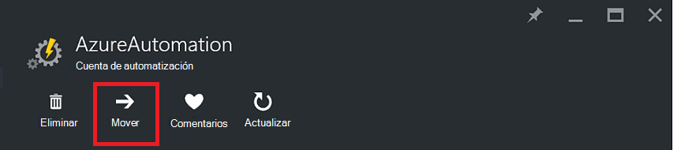
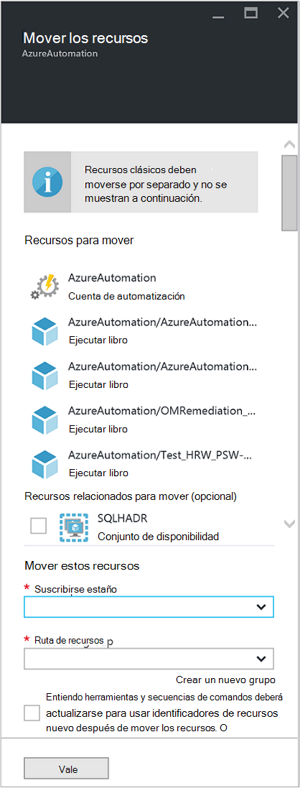

<properties
   pageTitle="Migrar cuentas de automatización y recursos | Microsoft Azure"
   description="En este artículo se describe cómo mover una cuenta de automatización en automatización de Azure y los recursos asociados de una suscripción a otro."
   services="automation"
   documentationCenter=""
   authors="MGoedtel"
   manager="jwhit"
   editor="tysonn" />
<tags
   ms.service="automation"
   ms.devlang="na"
   ms.topic="article"
   ms.tgt_pltfrm="na"
   ms.workload="infrastructure-services"
   ms.date="07/07/2016"
   ms.author="magoedte" />

# <a name="migrate-automation-account-and-resources"></a>Migrar cuentas de automatización y recursos

Para cuentas de automatización y los recursos asociados (es decir, activos, runbooks, módulos, etc.) que haya creado en el portal de Azure y desea migrar desde un grupo de recursos a otro o de una suscripción a otra, puede hacerlo fácilmente con la característica de [mover los recursos](../resource-group-move-resources.md) disponible en el portal de Azure. Sin embargo, antes de continuar con esta acción, primero debe revisar la siguiente [lista de comprobación antes de mover los recursos](../resource-group-move-resources.md#Checklist-before-moving-resources) y, además, la lista siguiente específicas para automatización.   

1.  El destino suscripción o grupo de recursos debe estar en la misma región como el origen.  Es decir, cuentas de automatización no puede moverse entre regiones.
2.  Al mover los recursos (por ejemplo, runbooks, tareas, etc.), el grupo de origen y el grupo de destino están bloqueadas para la duración de la operación. Escribir y eliminar operaciones están bloqueados en los grupos hasta que se complete el movimiento.  
3.  Cualquier runbooks o las variables que hacen referencia a un identificador de recursos o suscripción de la suscripción existente, deberá actualizarse una vez completada la migración.   


>[AZURE.NOTE] Esta característica no admite mover recursos de automatización clásico.

## <a name="to-move-the-automation-account-using-the-portal"></a>Para mover la cuenta de automatización con el portal

1. Desde su cuenta de automatización, haga clic en **mover** en la parte superior de la hoja.<br> <br> 
2. En el módulo de **mover los recursos** , tenga en cuenta que presenta recursos relacionados con su cuenta de automatización y los grupos de recursos.  Seleccione la **suscripción** y el **grupo de recursos** de las listas desplegables, o seleccione la opción para **crear un nuevo grupo de recursos** y escriba un nuevo nombre de grupo de recursos en el campo proporcionado.  
3. Revise y seleccione la casilla de verificación para confirmar *comprender herramientas y secuencias de comandos se deben actualizar para usar los nuevos identificadores de recursos después de mover los recursos* y, a continuación, haga clic en **Aceptar**.<br> <br>   

Esta acción tardará varios minutos en completarse.  En **notificaciones**, se presentará con un estado de cada acción que se lleve a cabo - validación, migración y, a continuación, por último cuando haya finalizado.     

## <a name="to-move-the-automation-account-using-powershell"></a>Para mover la cuenta de automatización con PowerShell

Para mover los recursos existentes de automatización a otra suscripción o grupo de recursos, use el cmdlet **Get-AzureRmResource** para obtener la cuenta de automatización específico y, a continuación, **Mover AzureRmResource** cmdlet para realizar el movimiento.

El primer ejemplo muestra cómo mover una cuenta de automatización a un nuevo grupo de recursos.

   ```
    $resource = Get-AzureRmResource -ResourceName "TestAutomationAccount" -ResourceGroupName "ResourceGroup01"
    Move-AzureRmResource -ResourceId $resource.ResourceId -DestinationResourceGroupName "NewResourceGroup"
   ``` 

Después de ejecutar el código de ejemplo anterior, se le pedirá que lo compruebe que desee realizar esta acción.  Una vez que haga clic en **Sí** y permitir la secuencia de comandos continuar, no recibirá las notificaciones mientras realiza la migración.  

Para mover a una nueva suscripción, incluya un valor para el parámetro *DestinationSubscriptionId* .

   ```
    $resource = Get-AzureRmResource -ResourceName "TestAutomationAccount" -ResourceGroupName "ResourceGroup01"
    Move-AzureRmResource -ResourceId $resource.ResourceId -DestinationResourceGroupName "NewResourceGroup" -DestinationSubscriptionId "SubscriptionId"
   ``` 

Como en el ejemplo anterior, se le pedirá que confirme el movimiento.  

## <a name="next-steps"></a>Pasos siguientes

- Para obtener más información acerca de cómo mover recursos a nuevo grupo de recursos o suscripción, vea [mover recursos al nuevo grupo de recursos o suscripción](../resource-group-move-resources.md)
- Para más información sobre el Control de acceso basado en roles en automatización de Azure, consulte [control de acceso basado en roles en automatización de Azure](../automation/automation-role-based-access-control.md).
- Para obtener información sobre los cmdlets de PowerShell para administrar la suscripción, vea [con Azure con el Administrador de recursos](../powershell-azure-resource-manager.md)
- Para obtener información sobre las características de portal de administración de la suscripción, consulte [con el Portal de Azure para administrar los recursos](../azure-portal/resource-group-portal.md). 
