<properties 
   pageTitle="Control de acceso basado en roles en automatización de Azure | Microsoft Azure"
   description="Control de acceso basado en roles (RBAC) permite la administración de acceso para los recursos de Azure. En este artículo se describe cómo configurar RBAC en automatización de Azure."
   services="automation"
   documentationCenter=""
   authors="mgoedtel"
   manager="jwhit"
   editor="tysonn"
   keywords="automatización rbac, control de acceso, rbac azure basado en roles" />
<tags 
   ms.service="automation"
   ms.devlang="na"
   ms.topic="get-started-article"
   ms.tgt_pltfrm="na"
   ms.workload="infrastructure-services"
   ms.date="09/12/2016"
   ms.author="magoedte;sngun"/>

# Control de acceso basado en roles en automatización de Azure

## Control de acceso basado en roles

Control de acceso basado en roles (RBAC) permite la administración de acceso para los recursos de Azure. [RBAC](../active-directory/role-based-access-control-configure.md)puede dividir tareas en su equipo y conceder solo la cantidad de acceso a los usuarios, grupos y las aplicaciones que necesitan para realizar su trabajo. Acceso basado en roles se puede conceder a los usuarios con el portal de Azure, Azure herramientas de línea de comandos o las API de administración de Azure.

## RBAC en cuentas de automatización

En la automatización de Azure, acceso al asignar el rol RBAC correspondiente a los usuarios, grupos y aplicaciones en el ámbito de la cuenta de automatización. Los siguientes son las funciones integradas compatibles con una cuenta de automatización:  

|**Función** | **Descripción** |
|:--- |:---|
| Propietario | El rol de propietario permite el acceso a todos los recursos y acciones dentro de una cuenta de automatización incluidos proporcionar acceso a otros usuarios, grupos y aplicaciones para administrar la cuenta de automatización. |
| Colaborador | El rol de colaborador le permite administrar todo excepto Modificar permisos de acceso de otros usuarios a una cuenta de automatización. |
| Lector | La función lector le permite ver todos los recursos en una cuenta de automatización, pero no puede realizar los cambios.|
| Operador de automatización | La función de operador de automatización le permite realizar tareas operativas, como iniciar, detener, suspender, reanudar y programar trabajos. Esta función es útil si desea proteger los recursos de la cuenta de automatización como activos de credenciales y runbooks se puedan ver o modificar pero desea que los miembros de su organización ejecutar estos runbooks. |
| Administrador de acceso de usuario | El rol de administrador de acceso de usuario le permite administrar el acceso de usuario a cuentas de automatización de Azure. |

>[AZURE.NOTE] No puede conceder derechos de acceso a un runbook específica o runbooks, sólo para los recursos y las acciones dentro de la cuenta de automatización.  

En este artículo le guiaremos a través de cómo configurar RBAC en automatización de Azure. Pero primero, echemos un vistazo a los permisos individuales que le ha concedido el colaborador, lector, operador de automatización y Administrador de acceso de usuario para que obtenemos un buen conocimiento antes de todos los usuarios conceder derechos a la cuenta de automatización.  En caso contrario, podría provocar consecuencias no deseadas o no deseadas.     

## Permisos del rol de colaborador

La siguiente tabla muestra las acciones específicas que se pueden realizar el rol de colaborador en la automatización.

| **Tipo de recurso** | **Lectura** | **Escritura** | **Eliminar** | **Otras acciones** |
|:--- |:---|:--- |:---|:--- |
| Cuenta de automatización de Azure |  |  |  | | 
| Activo de certificado de automatización |  |  |  | |
| Activo de conexión de automatización |  |  |  | | 
| Activo de tipo de conexión de automatización |  |  |  | | 
| Activo de credenciales de automatización |  |  |  | |
| Activo de programación de automatización |  |  |  | |
| Activo de Variable de automatización |  |  |  | |
| Automatización deseado configuración de estado | | | |  |
| Tipo de recurso de trabajo Runbook híbrido |  | |  | | 
| Trabajo de automatización de Azure |  |  | |  | 
| Flujo de trabajo de automatización |  | | | | 
| Programación de trabajos de automatización |  |  |  | |
| Módulo de automatización |  |  |  | |
| Automatización de Azure Runbook |  |  |  |  |
| Borrador de Runbook de automatización |  | | |  |
| Trabajo de prueba de automatización Runbook borrador |  |  | |  | 
| Webhook de automatización |  |  |  |  |

## Permisos de la función Lector

En la siguiente tabla muestra las acciones específicas que pueden realizarse mediante la función de lector en automatización.

| **Tipo de recurso** | **Lectura** | **Escritura** | **Eliminar** | **Otras acciones** |
|:--- |:---|:--- |:---|:--- |
| Administrador de suscripción clásica |  | | | 
| Bloqueo de administración |  | | | 
| Permisos |  | | |
| Operaciones de proveedor |  | | | 
| Asignación de roles |  | | | 
| Definición de función |  | | | 

## Permisos de la función de automatización operador

La siguiente tabla presenta las acciones específicas que pueden realizarse mediante la función de operador de automatización de automatización.

| **Tipo de recurso** | **Lectura** | **Escritura** | **Eliminar** | **Otras acciones** |
|:--- |:---|:--- |:---|:--- |
| Cuenta de automatización de Azure |  | | | 
| Activo de certificado de automatización | | | |
| Activo de conexión de automatización | | | |
| Activo de tipo de conexión de automatización | | | |
| Activo de credenciales de automatización | | | |
| Activo de programación de automatización |  |  | | |
| Activo de Variable de automatización | | | |
| Automatización deseado configuración de estado | | | | |
| Tipo de recurso de trabajo Runbook híbrido | | | | | 
| Trabajo de automatización de Azure |  |  | |  | 
| Flujo de trabajo de automatización |  | | |  
| Programación de trabajos de automatización |  |  | | |
| Módulo de automatización | | | |
| Automatización de Azure Runbook |  | | | |
| Borrador de Runbook de automatización | | | |
| Trabajo de prueba de automatización Runbook borrador | | | |  
| Webhook de automatización | | | |

Para obtener más información, las [Acciones del operador de automatización](../active-directory/role-based-access-built-in-roles.md#automation-operator) enumera las acciones que admite la función de operador de automatización de la cuenta de automatización y sus recursos.

## Permisos de la función de administrador de acceso de usuario

En la siguiente tabla muestra las acciones específicas que pueden realizarse mediante la función de administrador de acceso de usuario de automatización.

| **Tipo de recurso** | **Lectura** | **Escritura** | **Eliminar** | **Otras acciones** |
|:--- |:---|:--- |:---|:--- |
| Cuenta de automatización de Azure |  | | | |
| Activo de certificado de automatización |  | | | |
| Activo de conexión de automatización |  | | | |
| Activo de tipo de conexión de automatización |  | | | |
| Activo de credenciales de automatización |  | | | |
| Activo de programación de automatización |  | | | |
| Activo de Variable de automatización |  | | | |
| Automatización deseado configuración de estado | | | | |
| Tipo de recurso de trabajo Runbook híbrido |  | | | | 
| Trabajo de automatización de Azure |  | | | | 
| Flujo de trabajo de automatización |  | | | | 
| Programación de trabajos de automatización |  | | | |
| Módulo de automatización |  | | | |
| Automatización de Azure Runbook |  | | | |
| Borrador de Runbook de automatización |  | | | |
| Trabajo de prueba de automatización Runbook borrador |  | | | | 
| Webhook de automatización |  | | |

## Configurar RBAC para su cuenta de automatización con el Portal de Azure

1.  Inicie sesión en el [Portal de Azure](https://portal.azure.com/) y abra su cuenta de automatización desde el módulo de cuentas de automatización.  

2.  Haga clic en el control de **acceso** en la esquina superior derecha. Se abrirá el módulo de **usuarios** que puede agregar nuevos usuarios, grupos y aplicaciones para administrar su cuenta de automatización y ver los roles existentes que se pueden configurar para la cuenta de automatización.  

      

>[AZURE.NOTE] **Los administradores de la suscripción** del usuario predeterminado ya existe. El grupo de active directory de administradores de suscripción incluye los administradores de servicio y co-administrator(s) para su suscripción de Azure. El administrador del servicio es el propietario de la suscripción de Azure y sus recursos y tendrá el rol de propietario heredado para las cuentas de automatización demasiado. Esto significa que el acceso es **heredado** para **los administradores de servicios y co-administradores** de una suscripción y es **asignado** para todos los usuarios. Haga clic en **administradores de suscripción** para ver más detalles sobre los permisos.  

### Agregar un nuevo usuario y asigne un rol

1.  En el módulo de usuarios, haga clic en **Agregar** para abrir el **módulo de access agregar** donde puede agregar un usuario, grupo o aplicación y asignar un rol a ellos.  

    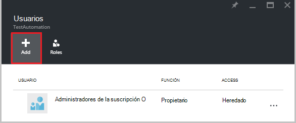  

2.  Seleccione una función de la lista de funciones disponibles. Elegimos la función **lector** , pero puede elegir cualquiera de las funciones integradas disponibles compatible con una cuenta de automatización o cualquier función personalizada que haya definido.  

    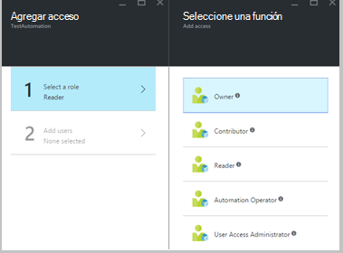  

3.  Haga clic en **Agregar usuarios** para abrir el módulo de **Agregar usuarios** . Si ha agregado los usuarios, grupos o aplicaciones para administrar su suscripción, a continuación, se enumeran los usuarios y puede seleccionarlas para agregar el acceso. Si no hay ningún usuarios enumerados o agregar no aparece si el usuario que le interesa, a continuación, haga clic en **Invitar a** para abrir el módulo de **Invitar a un invitado** , donde puede invitar a un usuario con una dirección de correo electrónico de cuenta de Microsoft válida como Outlook.com, OneDrive o Xbox Live ID. Una vez que ha escrito la dirección de correo electrónico del usuario, haga clic en **Seleccionar** para agregar el usuario y, a continuación, haga clic en **Aceptar**. 

    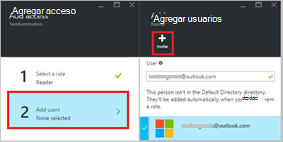  
 
    Ahora debe ver el usuario agregado a módulo de **usuarios** con la función de **lector** asignada.  

      

    También puede asignar un rol al usuario desde el módulo de **funciones** . 

1. Haga clic en **Roles** desde el módulo de los usuarios para abrir el **módulo de funciones**. En este módulo, puede ver el nombre de la función, el número de usuarios y grupos asignados a ese rol.

      
   
    >[AZURE.NOTE] Solo se puede establecer el control de acceso basado en roles en el nivel de automatización cuenta y no en todos los recursos por debajo de la cuenta de automatización.

    Puede asignar más de un rol a un usuario, un grupo o una aplicación. Por ejemplo, si se agrega el rol de **Automatización operador** junto con la **función Lector** al usuario, a continuación, puede ver todos los recursos de automatización, así como ejecutar los trabajos runbook. Puede expandir la lista desplegable para ver una lista de los roles asignados al usuario.  

    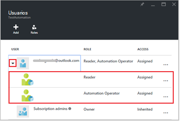  
 
### Quitar un usuario

Puede quitar el permiso de acceso para un usuario que no administra la cuenta de automatización o que ya no funciona para la organización. A continuación se muestran los pasos para quitar un usuario: 

1.  En el módulo de **usuarios** , seleccione la asignación de roles que desea quitar.

2.  Haga clic en el botón **Quitar** en el módulo de detalles de la asignación.

3.  Haga clic en **Sí** para confirmar la eliminación. 

    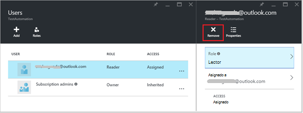  

## Rol de usuario asignado

Cuando un usuario se asigna a un rol inicia sesión en su cuenta de automatización, ahora puede verán cuenta del propietario que aparece en la lista de **Directorios predeterminada**. Para poder ver la cuenta de automatización que se han agregado, deben cambiar el directorio predeterminado en el directorio del propietario predeterminado.  

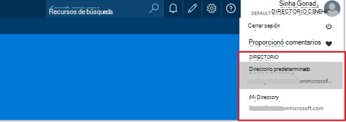  

### Experiencia de usuario para la función de operador de automatización

Cuando un usuario, que se asigna a las vistas de la función de operador de automatización están asignados a la cuenta de automatización, sólo se puede ver la lista de programaciones en la cuenta de automatización y trabajos de runbook de runbooks pero no puede ver su definición. Puede iniciar, detener, suspender, reanudar o programar el trabajo runbook. El usuario no tendrán acceso a otros recursos de automatización como las configuraciones de grupos de trabajo de híbrido o nodos DSC.  

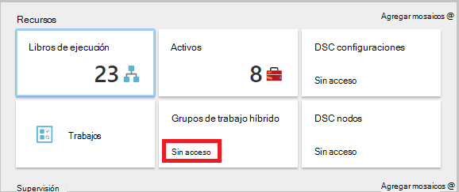  

Cuando el usuario hace clic en runbook, los comandos para ver el origen o editar runbook no se proporcionan como la función de operador de automatización no permite el acceso a ellos.  

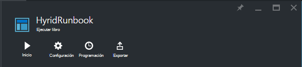  

El usuario tendrá acceso para ver y crear programaciones, pero no tendrán acceso a cualquier otro tipo de activos.  

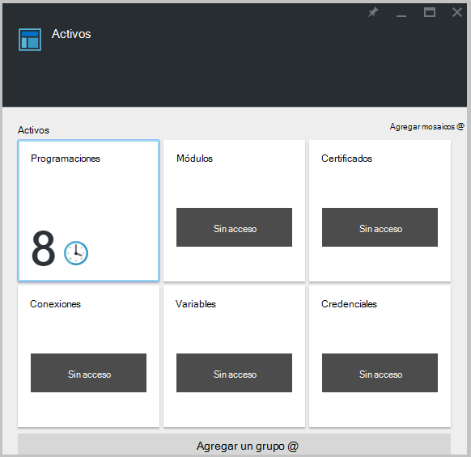  

También este usuario no tiene acceso para ver el webhooks asociado con un runbook

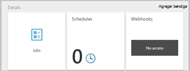  

## Configurar RBAC para su cuenta de automatización con PowerShell de Azure

También puede configurarse acceso basado en roles a una cuenta de automatización mediante los siguientes [cmdlets de PowerShell de Azure](../active-directory/role-based-access-control-manage-access-powershell.md).

• [Get-AzureRmRoleDefinition](https://msdn.microsoft.com/library/mt603792.aspx) enumera todas las funciones de RBAC que están disponibles en Azure Active Directory. Puede usar este comando junto con la propiedad **nombre** para mostrar todas las acciones que pueden realizar una función específica.  
    **Ejemplo:**  
    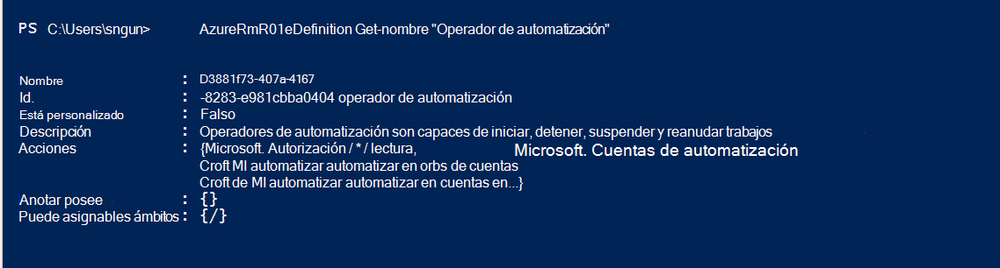  

• [Get-AzureRmRoleAssignment](https://msdn.microsoft.com/library/mt619413.aspx) enumera las asignaciones de roles de Azure AD RBAC en el ámbito especificado. Sin parámetros, el comando devuelve todas las asignaciones de roles realizadas en la suscripción. Usar el parámetro **ExpandPrincipalGroups** a las asignaciones de acceso de lista para el usuario especificado, así como los grupos que el usuario es miembro.  
    **Ejemplo:** Use el comando siguiente para obtener una lista de todos los usuarios y sus funciones dentro de una cuenta de automatización.

    Get-AzureRMRoleAssignment -scope “/subscriptions/<SubscriptionID>/resourcegroups/<Resource Group Name>/Providers/Microsoft.Automation/automationAccounts/<Automation Account Name>” 

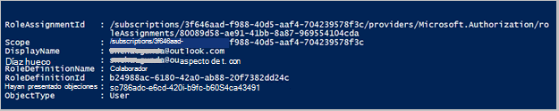

• [Nuevo AzureRmRoleAssignment](https://msdn.microsoft.com/library/mt603580.aspx) asignar acceso a los usuarios, grupos y aplicaciones para un ámbito particular.  
    **Ejemplo:** Utilice el comando siguiente para asignar el rol "Operador de automatización" para un usuario en el ámbito de la cuenta de automatización.

    New-AzureRmRoleAssignment -SignInName <sign-in Id of a user you wish to grant access> -RoleDefinitionName "Automation operator" -Scope “/subscriptions/<SubscriptionID>/resourcegroups/<Resource Group Name>/Providers/Microsoft.Automation/automationAccounts/<Automation Account Name>”  

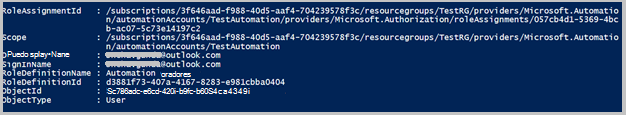

• Use [AzureRmRoleAssignment quitar](https://msdn.microsoft.com/library/mt603781.aspx) para quitar el acceso de un usuario especificado, el grupo o la aplicación de un ámbito particular.  
    **Ejemplo:** Use el comando siguiente para quitar el usuario de la función "Operador de automatización" en el ámbito de la cuenta de automatización.

    Remove-AzureRmRoleAssignment -SignInName <sign-in Id of a user you wish to remove> -RoleDefinitionName "Automation Operator" -Scope “/subscriptions/<SubscriptionID>/resourcegroups/<Resource Group Name>/Providers/Microsoft.Automation/automationAccounts/<Automation Account Name>”

En los ejemplos anteriores, reemplace el **Id de inicio de sesión**, **identificador de la suscripción**, **el nombre del grupo de recursos** y **nombre de la cuenta de automatización** con detalles de su cuenta. Elija **Sí** cuando se le pida que confirme antes de continuar quitar la asignación de roles de usuario.   

## Pasos siguientes
-  Para obtener información sobre las diferentes maneras de configurar RBAC para automatización de Azure, consulte [Administrar RBAC con PowerShell de Azure](../active-directory/role-based-access-control-manage-access-powershell.md).
- Para obtener más información acerca de diferentes maneras para iniciar un runbook, vea [iniciar un runbook](automation-starting-a-runbook.md)
- Para obtener información acerca de los tipos de runbook diferente, consulte [tipos de runbook de automatización de Azure](automation-runbook-types.md)

