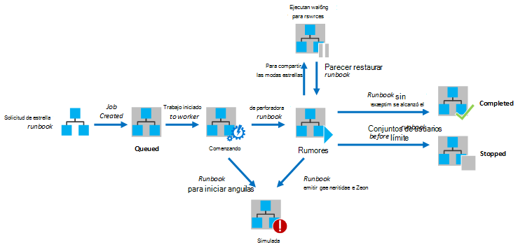

<properties
   pageTitle="Ejecución de runbook de automatización de Azure"
   description="Describe los detalles de cómo se procesa un runbook de automatización de Azure."
   services="automation"
   documentationCenter=""
   authors="mgoedtel"
   manager="stevenka"
   editor="tysonn" />
<tags
   ms.service="automation"
   ms.devlang="na"
   ms.topic="article"
   ms.tgt_pltfrm="na"
   ms.workload="infrastructure-services"
   ms.date="03/21/2016"
   ms.author="bwren" />

# Ejecución de runbook de automatización de Azure

Cuando inicia un runbook en automatización de Azure, se crea una tarea. Un trabajo es una instancia de ejecución de un runbook. Un trabajador de Azure automatización se asigna a ejecutar cada tarea. Mientras los trabajadores están compartidos por varias cuentas de Azure, trabajos de cuentas diferentes de automatización están aislados entre sí. No tiene control sobre qué trabajo le servicio la solicitud de su trabajo.  Una sola runbook puede tener varias tareas que se ejecutan a la vez. Cuando se ve la lista de runbooks en el portal de Azure, mostrará el estado de la última tarea que se ha iniciado para cada runbook. Puede ver la lista de tareas para cada runbook para realizar un seguimiento del estado de cada uno. Para obtener una descripción de los Estados de trabajo diferente, vea [Estados de trabajo](#job-statuses).

El siguiente diagrama muestra el ciclo de vida de un trabajo runbook de [runbooks gráfica](automation-runbook-types.md#graphical-runbooks) y [flujo de trabajo de PowerShell runbooks](automation-runbook-types.md#powershell-workflow-runbooks).

El siguiente diagrama muestra el ciclo de vida de un trabajo runbook de [PowerShell runbooks](automation-runbook-types.md#powershell-runbooks).

Los trabajos tendrán acceso a los recursos de Azure mediante una conexión a su suscripción de Azure. Solo tendrán acceso a los recursos en el centro de datos si los recursos están accesibles desde la nube pública.

## Estados de trabajo

La siguiente tabla describe los diferentes estados posibles para una tarea.

| Estado| Descripción|
|:---|:---|
|Completado|La tarea que se completó correctamente.|
|No se pudo| Para [el flujo de trabajo de PowerShell y gráficos runbooks](automation-runbook-types.md), runbook no se pudo compilar.  Para [runbooks Script de PowerShell](automation-runbook-types.md), no se pudo iniciar runbook o el trabajo ha encontrado una excepción. |
|No se pudo esperando recursos|Error en el trabajo porque se ha alcanzado el límite de [una feria compartir](#fairshare) tres veces y ha iniciado desde el mismo punto de control o desde el principio del runbook cada vez.|
|En la cola|El trabajo está en espera para los recursos en un trabajo de automatización para dar disponible para que se puede iniciar.|
|Iniciar|El trabajo se ha asignado a un trabajo y el sistema está en el proceso de inicio.|
|Reanudar|El sistema está en el proceso de reanudar el trabajo después de se ha suspendido.|
|Ejecutar|El trabajo en ejecución.|
|Ejecutar, esperando recursos|El trabajo se ha descargado porque ha alcanzado el límite de [una feria compartir](#fairshare) . Se le reanudar poco desde el último punto de comprobación.|
|Detener|El trabajo se ha detenido por el usuario antes de que se ha completado.|
|Detener|El sistema está en el proceso de detener el trabajo.|
|Suspendido|El trabajo se ha suspendido por el usuario, el sistema o un comando de runbook. Un trabajo que se ha suspendido puede volver a iniciar y reanuda desde el último punto de comprobación o desde el principio del runbook si no tiene ningún puntos de control. Runbook solo será suspendido por el sistema en el caso de una excepción. De forma predeterminada, se establece ErrorActionPreference para **continuar** lo que significa que el trabajo se mantienen en ejecución en un error. Si se establece esta variable de preferencia para **Detener** el trabajo anulará en un error.  Solo se aplica a [runbooks de flujo de trabajo de PowerShell y gráficos](automation-runbook-types.md) .|
|Suspender|El sistema está intentando suspender el trabajo en la solicitud del usuario. Runbook debe llegar a su punto de control siguiente antes de que se pueda suspender. Si ya ha pasado su último punto de comprobación, se completará antes de que se pueda suspender.  Solo se aplica a [runbooks de flujo de trabajo de PowerShell y gráficos](automation-runbook-types.md) .|

## Ver el estado del trabajo con el Portal de administración de Azure

### Panel de automatización

El panel de automatización muestra un resumen de todos los runbooks para una cuenta de automatización determinado. También incluye un resumen de uso de la cuenta. El gráfico de resumen muestra el número total de trabajos de para todos los runbooks que especificar cada estado sobre un número determinado de días u horas. Puede seleccionar el intervalo de tiempo en la esquina superior derecha del gráfico. Cambia el eje de tiempo del gráfico según el tipo de intervalo de tiempo que seleccione. Puede elegir si desea mostrar la línea para un estado concreto haciendo clic en él en la parte superior de la pantalla.

Puede usar los siguientes pasos para mostrar el panel de automatización.

1. En el Portal de administración de Azure, seleccione **automatización** y, a continuación, haga clic en el nombre de una cuenta de automatización.
1. Seleccione la pestaña **panel** .

### Panel runbook

El panel Runbook muestra un resumen de una sola runbook. El gráfico de resumen muestra el número total de trabajos de para runbook que especificar cada estado sobre un número determinado de días u horas. Puede seleccionar el intervalo de tiempo en la esquina superior derecha del gráfico. Cambia el eje de tiempo del gráfico según el tipo de intervalo de tiempo que seleccione. Puede elegir si desea mostrar la línea para un estado concreto haciendo clic en él en la parte superior de la pantalla.

Puede usar los siguientes pasos para mostrar el panel Runbook.

1. En el Portal de administración de Azure, seleccione **automatización** y, a continuación, haga clic en el nombre de una cuenta de automatización.
1. Haga clic en el nombre de un runbook.
1. Seleccione la pestaña **panel** .

### Resumen de tareas

Puede ver una lista de todas las tareas que se han creado para una determinada runbook y su estado más reciente. Puede filtrar la lista por estado del trabajo y el intervalo de fechas para el último cambio en el trabajo. Haga clic en el nombre de una tarea para ver su información detallada y su resultado. La vista detallada de la tarea incluye los valores para los parámetros de runbook proporcionaron a ese trabajo.

Puede usar los siguientes pasos para ver los trabajos de un runbook.

1. En el Portal de administración de Azure, seleccione **automatización** y, a continuación, haga clic en el nombre de una cuenta de automatización.
1. Haga clic en el nombre de un runbook.
1. Seleccione la ficha **trabajos** .
1. Haga clic en la columna **Trabajo creado** para una tarea ver sus detalles y los resultados.

## Recuperar el estado del trabajo con Windows PowerShell

Puede usar el [AzureAutomationJob Get](http://msdn.microsoft.com/library/azure/dn690263.aspx) para recuperar trabajos creados para un runbook y los detalles de un trabajo concreto. Si inicia una runbook con [AzureAutomationRunbook de inicio](http://msdn.microsoft.com/library/azure/dn690259.aspx)de Windows PowerShell, devolverá el trabajo resultante. Utilizar los resultados de [Get-AzureAutomationJob](http://msdn.microsoft.com/library/azure/dn690263.aspx)para obtener los resultados de la tarea.

Los siguientes comandos de ejemplo recupera el último trabajo para un runbook de muestra y muestra el estado de TI, proporcionan los valores para los parámetros de runbook y el resultado de la tarea.

    $job = (Get-AzureAutomationJob –AutomationAccountName "MyAutomationAccount" –Name "Test-Runbook" | sort LastModifiedDate –desc)[0]
    $job.Status
    $job.JobParameters
    Get-AzureAutomationJobOutput –AutomationAccountName "MyAutomationAccount" -Id $job.Id –Stream Output

## Compartir una feria

Para compartir recursos entre runbooks todos en la nube, automatización de Azure descargará temporalmente cualquier trabajo después de se ha ejecutado durante 3 horas.    Se puede reanudar runbooks de [Flujo de trabajo de PowerShell](automation-runbook-types.md#powershell-workflow-runbooks) y [gráficos](automation-runbook-types.md#graphical-runbooks) desde el último [punto de control](http://technet.microsoft.com/library/dn469257.aspx#bk_Checkpoints). Durante este período, el trabajo mostrará un estado de ejecución, esperando recursos. Si runbook no tiene puntos o el trabajo no llegó el primer punto de control antes de que se descargan, se reinicie desde el principio.  [PowerShell](automation-runbook-types.md#powershell-runbooks) runbooks siempre se reiniciar desde el principio, ya que no admiten los controles.

>[AZURE.NOTE] El límite de una feria compartir no es aplicable a trabajos runbook ejecutando en sus colegas Runbook híbrido.

Si runbook se reinicia desde el mismo punto de control o desde el principio del runbook tres veces consecutivas, terminará con un estado de error, esperando recursos. Esto es proteger de runbooks ejecutándose indefinidamente sin completar, y cuando no se puede realizar en el punto de control siguiente sin que se va a descargar nuevamente. En este caso, recibirá la siguiente excepción con el error.

*El trabajo no puede seguir ejecutando debido a se expulsa varias veces desde el mismo punto de control. Asegúrese de que su Runbook no realiza operaciones largas sin conservar su estado.*

Cuando se crea un runbook, debe asegurarse de que la hora para ejecutar las actividades entre dos puntos de comprobación no exceda 3 horas. Tendrá que agregar los controles a su runbook para asegurarse de que no alcanza el límite de 3 horas o divida larga ejecuta las operaciones. Por ejemplo, su runbook podría llevar a cabo una reindex una gran base de datos SQL. Si esta única operación no se completa dentro del límite de una feria compartir, el trabajo se descarga y se reinicia desde el principio. En este caso, debe dividir la operación reindex en varios pasos, como la indización de una tabla a la vez y, a continuación, inserte un punto de comprobación después de cada operación de modo que puede reanudar el trabajo después de la última operación para completar.

## Pasos siguientes

- [Iniciar un runbook de automatización de Azure](automation-starting-a-runbook.md)
