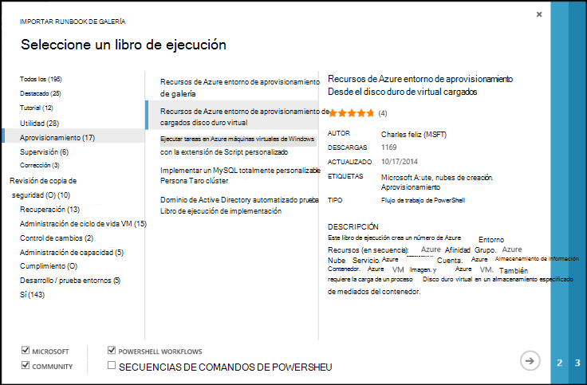
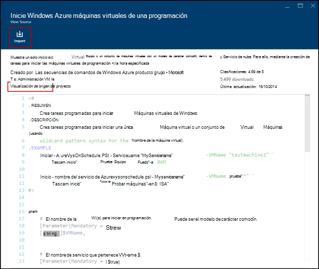
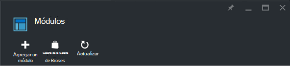
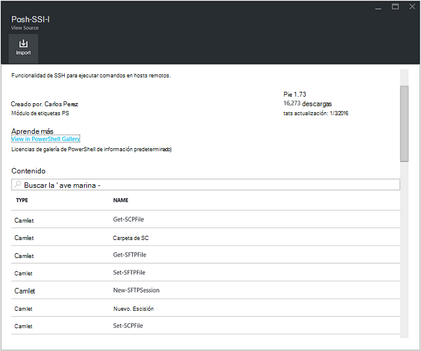
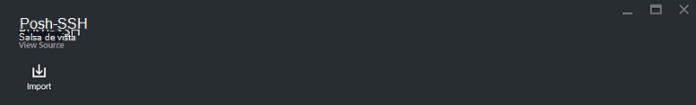
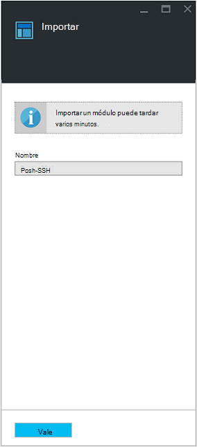

<properties
    pageTitle="Galerías runbook y módulo de automatización de Azure | Microsoft Azure"
    description="Runbooks y módulos de Microsoft y la Comunidad están disponibles para instalar y usar en su entorno de automatización de Azure.  En este artículo se describe cómo tener acceso a estos recursos y contribuir sus runbooks a la galería."
    services="automation"
    documentationCenter=""
    authors="mgoedtel"
    manager="jwhit"
    editor="tysonn" />
<tags
    ms.service="automation"
    ms.devlang="na"
    ms.topic="article"
    ms.tgt_pltfrm="na"
    ms.workload="infrastructure-services"
    ms.date="09/18/2016"
    ms.author="magoedte;bwren" />

# Galerías runbook y módulo de automatización de Azure

En lugar de crear su propio runbooks y módulos en la automatización de Azure, puede acceder a una amplia variedad de escenarios que ya ha sido creado por Microsoft y la Comunidad.  Puede usar estos escenarios sin modificaciones o puede usarlas como punto de partida y editarlas para sus necesidades específicas.

Puede obtener runbooks desde la [Galería de Runbook](#runbooks-in-runbook-gallery) y módulos de la [Galería de PowerShell](#modules-in-powerShell-gallery).  También pueden contribuir a la Comunidad compartiendo escenarios que desarrolle.

## Runbooks en Runbook Galería

La [Galería de Runbook](http://gallery.technet.microsoft.com/scriptcenter/site/search?f[0].Type=RootCategory&f[0].Value=WindowsAzure&f[1].Type=SubCategory&f[1].Value=WindowsAzure_automation&f[1].Text=Automation) proporciona una gran variedad de runbooks de Microsoft y la Comunidad que puede importar a automatización de Azure. Puede descargar un runbook de la galería que está alojada en el [Centro de secuencia de comandos de TechNet](http://gallery.technet.microsoft.com/)o puede importar runbooks directamente desde la Galería de imágenes desde el portal clásica Azure o en el portal de Azure.

Solo puede importar directamente desde la Galería de Runbook mediante el portal de clásica Azure o portal de Azure. No puede realizar esta función con Windows PowerShell.

>[AZURE.NOTE] Debe validar el contenido de cualquier runbooks que obtener desde la Galería de Runbook y tener mucho cuidado al instalar y ejecutarlos en un entorno de producción. |

### Para importar un runbook de la Galería de Runbook con el portal de clásico de Azure

1. En el Portal de Azure, haga clic en **nuevo**, **Servicios de aplicación**, **automatización**, **Runbook**, **Desde la Galería**.
2. Seleccione una categoría para ver runbooks relacionados y seleccione un runbook para ver sus detalles. Cuando se selecciona runbook que desee, haga clic en el botón de flecha derecha.

    

3. Revisar el contenido del runbook y tenga en cuenta los requisitos de la descripción. Cuando haya terminado, haga clic en el botón de flecha derecha.
4. Escriba los detalles de runbook y, a continuación, haga clic en el botón de marca de verificación. El nombre del runbook ya se rellenará.
5. Runbook aparecerá en la pestaña **Runbooks** para la cuenta de automatización.

### Para importar un runbook de la Galería de Runbook con el portal de Azure

1. En el Portal de Azure, abra su cuenta de automatización.
2. Haga clic en el mosaico **Runbooks** para abrir la lista de runbooks.
3. Haga clic en el botón **Examinar Galería** .

    

4. Busque el elemento que desee y selecciónela para ver los detalles de la galería.

    

4. Haga clic en **proyecto de código fuente de la vista** para ver el elemento en el [Centro de secuencia de comandos de TechNet](http://gallery.technet.microsoft.com/).
5. Para importar un elemento, haga clic en él para ver sus detalles y, a continuación, haga clic en el botón **Importar** .

    

6. Si lo desea, cambie el nombre del runbook y, a continuación, haga clic en **Aceptar** para importar runbook.
5. Runbook aparecerá en la pestaña **Runbooks** para la cuenta de automatización.

### Agregar un runbook a la Galería de runbook

Microsoft recomienda agregar runbooks a la Galería de Runbook que considere útil para otros clientes.  Puede agregar un runbook [cargarlo en el centro de secuencia de comandos](http://gallery.technet.microsoft.com/site/upload) teniendo en cuenta los siguientes detalles.

- Debe especificar *Windows Azure* para que la **categoría** y la *automatización* de la **subcategoría** para runbook para que se muestre en el asistente.  

- La carga debe ser un único archivo. ps1 o .graphrunbook.  Si runbook requiere los módulos, secundarios runbooks o activos, debe enumerarlos en la descripción de la presentación y en la sección Comentarios del runbook.  Si tiene un escenario que requieren varios runbooks, cargar cada una por separado y los nombres de los runbooks relacionados en cada una de las descripciones de la lista. Asegúrese de usar las mismas etiquetas para que se muestran en la misma categoría. El usuario tendrá que leer la descripción para saber que otros runbooks se requieren el escenario para que funcione.

- Agregue la etiqueta "GraphicalPS" Si está publicando un **runbook gráfica** (no en un flujo de trabajo gráfica). 

- Inserte una PowerShell o el flujo de trabajo de PowerShell fragmento de código en la descripción mediante el icono **Insertar sección de código** .

- Resumen de la carga se mostrará en los resultados de la Galería de Runbook por lo que debe proporcionar información detallada que le ayudarán a un usuario para identificar la funcionalidad del runbook.

- Debe asignar uno a tres de las etiquetas siguientes a la carga.  Runbook se mostrarán en el Asistente para en las categorías que coincidan con sus etiquetas.  Las etiquetas no aparecen en esta lista se omitirá por el asistente. Si no especifica las etiquetas coincidentes, runbook aparecerá en la categoría otro.

 - Copia de seguridad
 - Administración de la capacidad
 - Control de cambios
 - Cumplimiento
 - Desarrollo / entornos de prueba
 - Recuperación
 - Supervisión
 - Revisión
 - Aprovisionamiento
 - Corrección
 - Administración del ciclo de vida de VM

- Automatización actualiza la Galería de una vez cada hora, por lo que no podrá ver sus contribuciones inmediatamente.

## Módulos en la Galería de PowerShell

Módulos de PowerShell contienen cmdlets que puede usar en sus runbooks y módulos existentes que se pueden instalar en la automatización de Azure están disponibles en la [Galería de PowerShell](http://www.powershellgallery.com).  Puede iniciar esta galería desde el portal de Azure e instalarlas directamente en Azure automatización o puede descargar e instalar ellos manualmente.  No puede instalar los módulos directamente desde el portal de clásico Azure, pero se pueden descargar instalarlos como lo haría con cualquier otro módulo.

### Para importar un módulo de la Galería de módulo de automatización con el portal de Azure

1. En el Portal de Azure, abra su cuenta de automatización.
2. Haga clic en el mosaico de **activos** para abrir la lista de activos.
3. Haga clic en el mosaico de **módulos** para abrir la lista de módulos.
4. Haga clic en el botón **Examinar Galería** y se inicia el módulo de la Galería de examinar.

      
5. Después de iniciar el módulo de la Galería de examinar, puede buscar por los siguientes campos:

   - Nombre del módulo
   - Etiquetas
   - Autor
   - Nombre del recurso de cmdlet/DSC

6. Busque un módulo que le interesa y selecciónela para ver sus detalles.  
Al explorar en profundidad un módulo específico, puede ver más información acerca del módulo, incluyendo un vínculo a la Galería de PowerShell, cualquier necesaria dependencias y todos los cmdlets y recursos de DSC que contiene el módulo.

      

7. Para instalar el módulo directamente en Azure automatización, haga clic en el botón **Importar** .

    

8. Al hacer clic en el botón Importar, verá el nombre del módulo que va a importar. Si están instaladas todas las dependencias, se activará el botón **Aceptar** . Si faltan las dependencias, debe importar aquellos antes de poder importar este módulo.
9. Haga clic en **Aceptar** para importar el módulo, y se iniciará el módulo módulo. Cuando la automatización de Azure importa un módulo a su cuenta, extrae metadatos acerca del módulo y los cmdlets.

    

    Esto puede tardar un par de minutos, ya que cada actividad necesita extraer.
10. Recibirá una notificación que se implementa el módulo y una notificación cuando se ha completado.
11. Después de importa el módulo, verá las actividades disponibles y puede usar sus recursos en sus runbooks y la configuración de estado deseado.

## Solicitar un runbook o módulo

Puede enviar convocatorias a [Voz de usuario](https://feedback.azure.com/forums/246290-azure-automation/).  Si necesita ayuda escribiendo un runbook o tiene alguna pregunta sobre PowerShell, publique una pregunta a nuestro [foro](http://social.msdn.microsoft.com/Forums/windowsazure/en-US/home?forum=azureautomation&filter=alltypes&sort=lastpostdesc).

## Pasos siguientes

- Para empezar con runbooks, vea [crear o importar un runbook de automatización de Azure](automation-creating-importing-runbook.md)
- Para conocer las diferencias entre PowerShell y flujo de trabajo de PowerShell con runbooks, vea [flujo de trabajo de PowerShell de aprendizaje](automation-powershell-workflow.md)
