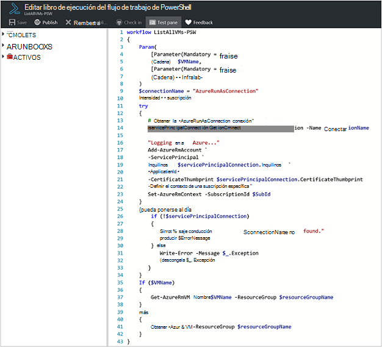
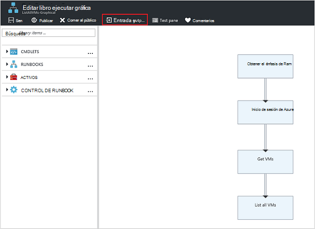
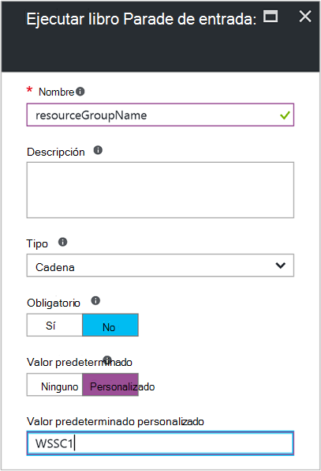
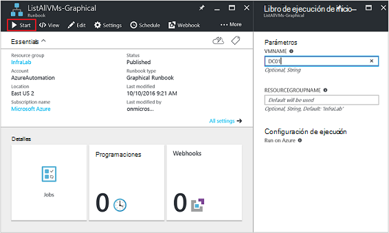
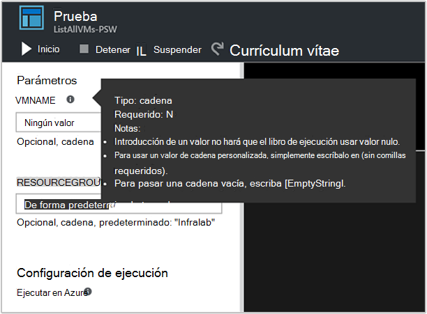
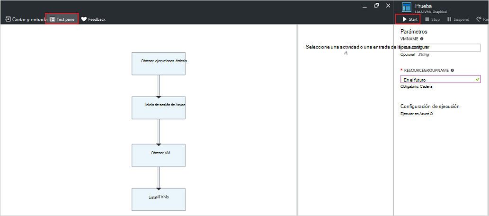
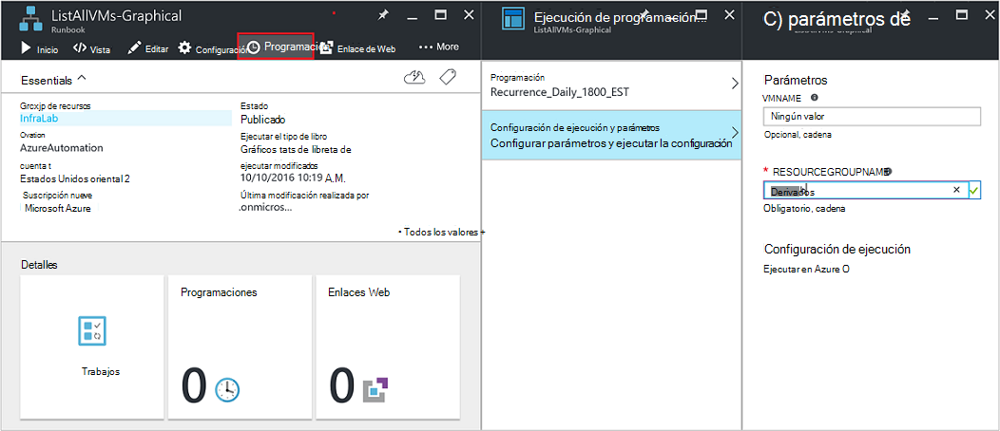
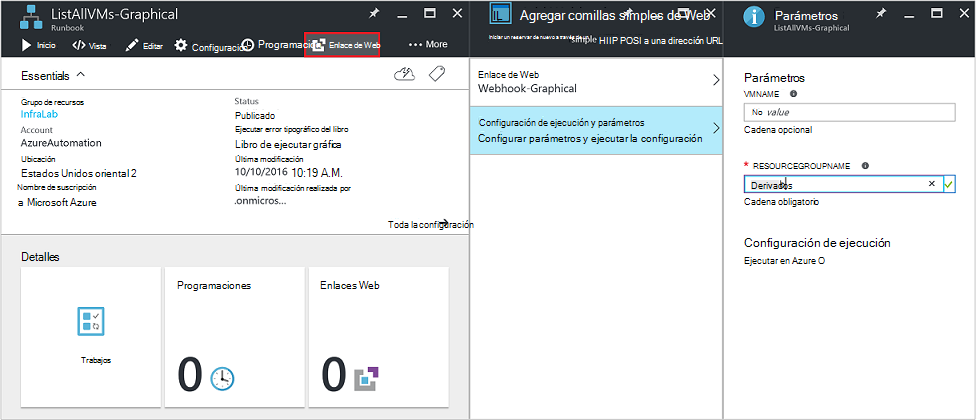
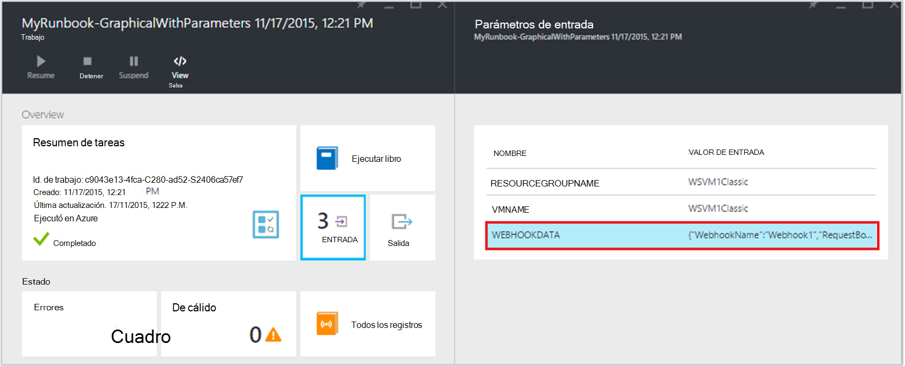

<properties
   pageTitle="Parámetros de entrada runbook | Microsoft Azure"
   description="Parámetros de entrada runbook aumentan la flexibilidad de runbooks por lo que le permite pasar datos a un runbook cuando se inicia. En este artículo se describe diferentes escenarios donde se utilizan los parámetros de entrada en runbooks."
   services="automation"
   documentationCenter=""
   authors="MGoedtel"
   manager="jwhit"
   editor="tysonn" />
<tags
   ms.service="automation"
   ms.devlang="na"
   ms.topic="article"
   ms.tgt_pltfrm="na"
   ms.workload="infrastructure-services"
   ms.date="10/11/2016"
   ms.author="sngun"/>

# <a name="runbook-input-parameters"></a>Parámetros de entrada runbook

Parámetros de entrada runbook aumentan la flexibilidad de runbooks que le permite pasar datos a ella cuando se inicia. Los parámetros permiten las acciones runbook de destino para entornos y escenarios específicos. En este artículo, le guiaremos a través de diferentes escenarios donde se utilizan los parámetros de entrada en runbooks.

## <a name="configure-input-parameters"></a>Configurar parámetros de entrada

Parámetros de entrada se pueden configurar en PowerShell, flujo de trabajo de PowerShell y runbooks gráfica. Un runbook puede tener varios parámetros con diferentes tipos de datos, o sin parámetros en absoluto. Parámetros de entrada pueden ser obligatoria u opcional y puede asignar un valor predeterminado para los parámetros opcionales. Puede asignar valores para los parámetros de entrada para un runbook al iniciar a través de uno de los métodos disponibles. Estos métodos incluyen empezando un runbook desde el portal de o un servicio web. También puede iniciar una como un runbook secundarios que se llama en línea en otro runbook.

## <a name="configure-input-parameters-in-powershell-and-powershell-workflow-runbooks"></a>Configurar parámetros de entrada en runbooks PowerShell y flujo de trabajo de PowerShell

Parámetros de entrada que se definen mediante los siguientes atributos de soporte de PowerShell y [flujo de trabajo de PowerShell runbooks](automation-first-runbook-textual.md) en automatización de Azure.  

| **(Propiedad)** | **Descripción** |
|:--- |:---|
| Tipo | Obligatorio. El tipo de datos esperado para el valor del parámetro. Cualquier tipo de .NET es válido. |
| Nombre | Obligatorio. El nombre del parámetro. Esto debe ser único dentro del runbook y pueden contener sólo letras, números o caracteres de subrayado. Debe empezar con una letra. |
| Obligatorio | Opcional. Especifica si se debe proporcionar un valor para el parámetro. Si establece **$true**, se debe proporcionar un valor cuando se inicia runbook. Si establece **$false**, un valor es opcional. |
| Valor predeterminado | Opcional.  Especifica un valor que se utilizará para el parámetro si un valor no se pasa cuando se inicia runbook. Un valor predeterminado se puede establecer para cualquier parámetro y realizará automáticamente el parámetro opcional independientemente de la opción obligatoria. |

Windows PowerShell es compatible con más atributos de parámetros de entrada de los enumerados aquí, como la validación, alias, y conjuntos de parámetros. Sin embargo, automatización de Azure admite actualmente solo los parámetros de entrada enumerados anteriormente.

Una definición de parámetro de flujo de trabajo de PowerShell runbooks tiene el formato general siguiente, donde varios parámetros están separados por comas.

   ```
     Param
     (
         [Parameter (Mandatory= $true/$false)]
         [Type] Name1 = <Default value>,

         [Parameter (Mandatory= $true/$false)]
         [Type] Name2 = <Default value>
     )
   ```

>[AZURE.NOTE] Al definir parámetros, si no se especifica el atributo **obligatorio** , a continuación, de forma predeterminada, el parámetro se considera opcional. Además, si establece un valor predeterminado para un parámetro en el flujo de trabajo de PowerShell runbooks, se tratará PowerShell como un parámetro opcional, independientemente del valor de atributo **obligatorio** .

Por ejemplo, vamos a configurar los parámetros de entrada para un runbook de flujo de trabajo de PowerShell que envía detalles sobre máquinas virtuales de Windows, una única VM o todas las máquinas virtuales dentro de un grupo de recursos. Este runbook tiene dos parámetros, como se muestra en la siguiente captura de pantalla: el nombre de la máquina virtual y el nombre del grupo de recursos.



En este parámetro definición, los parámetros **$VMName** y **$resourceGroupName** son parámetros simples de tipo cadena. Sin embargo, PowerShell y flujo de trabajo de PowerShell runbooks admiten todos los tipos simples y complejos, como **objeto** o **PSCredential** parámetros de entrada.

Si su runbook tiene un parámetro de entrada de tipo de objeto, a continuación, usar una tabla de hash de PowerShell con (nombre, valor) pares para pasar un valor. Por ejemplo, si tiene el siguiente parámetro en un runbook:

     [Parameter (Mandatory = $true)]
     [object] $FullName

A continuación, puede pasar el siguiente valor para el parámetro:

    @{"FirstName"="Joe";"MiddleName"="Bob";"LastName"="Smith"}


## <a name="configure-input-parameters-in-graphical-runbooks"></a>Configurar parámetros de entrada en runbooks gráfica

Para [configurar un runbook gráfica](automation-first-runbook-graphical.md) con parámetros de entrada, vamos a crear un gráfico runbook que envía detalles sobre máquinas virtuales de Windows, una única VM o todas las máquinas virtuales dentro de un grupo de recursos. Configurar un runbook consta de dos actividades principales, como se describe a continuación.

[**Autenticar Runbooks con Azure ejecutar como cuenta**](automation-sec-configure-azure-runas-account.md) para autenticar con Azure.

[**Get-AzureRmVm**](https://msdn.microsoft.com/library/mt603718.aspx) para obtener las propiedades de un máquinas virtuales.

Puede usar la actividad de [**Salida de escritura**](https://technet.microsoft.com/library/hh849921.aspx) a los nombres de máquinas virtuales de salida. La actividad **Get-AzureRmVm** acepta dos parámetros, el **nombre de la máquina virtual** y el **nombre del grupo de recursos**. Puesto que estos parámetros podrían requerir valores diferentes cada vez que inicie runbook, puede agregar parámetros de entrada a su runbook. Estos son los pasos para agregar parámetros de entrada:

1. Seleccione runbook gráfica en el módulo **Runbooks** y, a continuación, haga clic en [**Editar**](automation-graphical-authoring-intro.md) él.

2. Desde el editor runbook, haga clic en **entrada y salida** para abrir el módulo de **entrada y salida** .

    

3. El módulo de **entrada y salida** muestra una lista de parámetros de entrada que se definen para runbook. En este módulo, puede agregar un nuevo parámetro de entrada o modificar la configuración de un parámetro de entrada existente. Para agregar un nuevo parámetro para runbook, haga clic en **Agregar entrada** para abrir el módulo **Runbook parámetro de entrada** . Allí, puede configurar los parámetros siguientes:

  	| **(Propiedad)** | **Descripción** |
  	|:--- |:---|
  	| Nombre | Obligatorio.  El nombre del parámetro. Esto debe ser único dentro del runbook y pueden contener sólo letras, números o caracteres de subrayado. Debe empezar con una letra. |
  	| Descripción | Opcional. Descripción sobre el propósito del parámetro de entrada. |
  	| Tipo | Opcional. El tipo de datos que se espera para el valor del parámetro. Tipos de parámetro compatibles son **cadena**, **Int32**, **Int64**, **Decimal**, **booleano**, **DateTime**y **objeto**. Si no se selecciona un tipo de datos, el valor predeterminado es **String**. |
  	| Obligatorio | Opcional. Especifica si se debe proporcionar un valor para el parámetro. Si elige **Sí**, se debe proporcionar un valor cuando se inicia runbook. Si elige **no**, un valor no es necesario cuando se inicia runbook y se puede establecer un valor predeterminado. |
  	| Valor predeterminado | Opcional. Especifica un valor que se utilizará para el parámetro si un valor no se pasa cuando se inicia runbook. Puede establecerse un valor predeterminado para un parámetro que no es obligatorio. Para establecer un valor predeterminado, seleccione **personalizado**. Este valor se utiliza a menos que se ofrece otro valor cuando se inicia runbook. Seleccione **ninguna** si no desea proporcionar ningún valor predeterminado. |  

    

4. Crear dos parámetros con las siguientes propiedades que se utilizará la actividad de **Get-AzureRmVm** :

    - **Parámetro1:**
      - Nombre: VMName
      - Tipo de-cadena
      - Obligatorio - n

    - **Parámetro2:**
      - Nombre: resourceGroupName
      - Tipo de-cadena
      - Obligatorio - n
      - Valor predeterminado - personalizado
      - Valor predeterminado personalizado - \<nombre del grupo de recursos que contiene las máquinas virtuales >

5. Una vez que agregue los parámetros, haga clic en **Aceptar**.  Ahora puede verlas en la **entrada y salida módulo**. Haga clic en **Aceptar** de nuevo y, a continuación, haga clic en **Guardar** y **Publicar** su runbook.

## <a name="assign-values-to-input-parameters-in-runbooks"></a>Asignar los valores de parámetros en runbooks de entrada

Puede pasar valores de parámetros en runbooks en los siguientes escenarios de entrada.

### <a name="start-a-runbook-and-assign-parameters"></a>Iniciar un runbook y asignar parámetros

Se puede iniciar un runbook muchas formas: a través del portal de Azure, con un webhook, con los cmdlets de PowerShell, con la API de REST o con el SDK. A continuación trataremos entre diferentes métodos para iniciar un runbook y asignar parámetros.

#### <a name="start-a-published-runbook-by-using-the-azure-portal-and-assign-parameters"></a>Iniciar un runbook publicado mediante el portal de Azure y asignar parámetros

Cuando [inicie runbook](automation-starting-a-runbook.md#starting-a-runbook-with-the-azure-portal), el módulo **Runbook de inicio** se abre y puede configurar los valores de los parámetros que acaba de crear.



En la etiqueta debajo del cuadro de entrada, puede ver los atributos que se han configurado para el parámetro. Atributos son obligatorio u opcional, tipo y valor predeterminado. En el globo de ayuda junto al nombre del parámetro, puede ver toda la información clave que debe tomar decisiones sobre los valores de parámetro de entrada. Esta información incluye si un parámetro es obligatorio u opcional. También incluye el tipo y valor predeterminado (si los hay) y otras notas útiles.



>[AZURE.NOTE] Parámetros de tipo cadena compatible con los valores de cadena **vacía** .  Introducir **[EmptyString]** en el cuadro de parámetro de entrada pasará una cadena vacía para el parámetro. Parámetros de tipo cadena no admiten valores **nulos** que se pasa. Si no pasa ningún valor para el parámetro de cadena, a continuación, PowerShell interpretará esa como null.

#### <a name="start-a-published-runbook-by-using-powershell-cmdlets-and-assign-parameters"></a>Iniciar un runbook publicado mediante cmdlets de PowerShell y asignar parámetros

  - **Cmdlets del Administrador de recursos de azure:** Puede iniciar un runbook de automatización creado en un grupo de recursos usando [AzureRmAutomationRunbook de inicio](https://msdn.microsoft.com/library/mt603661.aspx).

    **Ejemplo:**

   ```
    $params = @{“VMName”=”WSVMClassic”;”resourceGroupeName”=”WSVMClassicSG”}
 
    Start-AzureRmAutomationRunbook -AutomationAccountName “TestAutomation” -Name “Get-AzureVMGraphical” –ResourceGroupName $resourceGroupName -Parameters $params
   ```

  - **Cmdlets de administración de servicios de azure:** Puede iniciar un runbook de automatización creado en un grupo de recursos predeterminado mediante [AzureAutomationRunbook de inicio](https://msdn.microsoft.com/library/dn690259.aspx).

    **Ejemplo:**

   ```
    $params = @{“VMName”=”WSVMClassic”; ”ServiceName”=”WSVMClassicSG”}

    Start-AzureAutomationRunbook -AutomationAccountName “TestAutomation” -Name “Get-AzureVMGraphical” -Parameters $params
   ```

>[AZURE.NOTE] Cuando se inicia un runbook mediante cmdlets de PowerShell, un parámetro de forma predeterminada, se crea **MicrosoftApplicationManagementStartedBy** con el valor de **PowerShell**. Puede ver este parámetro en el módulo de **Detalles de la tarea** .  

#### <a name="start-a-runbook-by-using-an-sdk-and-assign-parameters"></a>Iniciar un runbook mediante un SDK y asignar parámetros

  - **Método de administrador de recursos de azure:** Puede iniciar un runbook mediante el SDK de un lenguaje de programación. A continuación se muestra un fragmento de código de C# para iniciar un runbook de su cuenta de automatización. Puede ver todo el código en nuestro [repositorio de GitHub](https://github.com/Azure/azure-sdk-for-net/blob/master/src/ResourceManagement/Automation/Automation.Tests/TestSupport/AutomationTestBase.cs).  

   ```
     public Job StartRunbook(string runbookName, IDictionary<string, string> parameters = null)
        {
          var response = AutomationClient.Jobs.Create(resourceGroupName, automationAccount, new JobCreateParameters
           {
              Properties = new JobCreateProperties
               {
                  Runbook = new RunbookAssociationProperty
                   {
                     Name = runbookName
                   },
                     Parameters = parameters
               }
           });
        return response.Job;
        }
   ```

  - **Método de administración de servicios de azure:** Puede iniciar un runbook mediante el SDK de un lenguaje de programación. A continuación se muestra un fragmento de código de C# para iniciar un runbook de su cuenta de automatización. Puede ver todo el código en nuestro [repositorio de GitHub](https://github.com/Azure/azure-sdk-for-net/blob/master/src/ServiceManagement/Automation/Automation.Tests/TestSupport/AutomationTestBase.cs).

   ```      
    public Job StartRunbook(string runbookName, IDictionary<string, string> parameters = null)
      {
        var response = AutomationClient.Jobs.Create(automationAccount, new JobCreateParameters
      {
        Properties = new JobCreateProperties
           {
             Runbook = new RunbookAssociationProperty
           {
             Name = runbookName
                },
                  Parameters = parameters
                }
         });
        return response.Job;
      }
   ```

  Para iniciar este método, crear un diccionario para almacenar los parámetros de runbook, **VMName** y **resourceGroupName**y sus valores. A continuación, inicie runbook. A continuación, encontrará el fragmento de código de C# para llamar al método que se define más arriba.

   ```
    IDictionary<string, string> RunbookParameters = new Dictionary<string, string>();

    // Add parameters to the dictionary.
    RunbookParameters.Add("VMName", "WSVMClassic");
    RunbookParameters.Add("resourceGroupName", "WSSC1");

    //Call the StartRunbook method with parameters
    StartRunbook(“Get-AzureVMGraphical”, RunbookParameters);
   ```

#### <a name="start-a-runbook-by-using-the-rest-api-and-assign-parameters"></a>Iniciar un runbook mediante la API de REST y asignar parámetros

Crear un trabajo runbook y empezar con la API de REST de automatización de Azure a través del método **poner** con el siguiente URI de solicitud.

    https://management.core.windows.net/<subscription-id>/cloudServices/<cloud-service-name>/resources/automation/~/automationAccounts/<automation-account-name>/jobs/<job-id>?api-version=2014-12-08`

En la convocatoria de URI, reemplace los siguientes parámetros:

  - **identificador de suscripción:** Su identificador de suscripción de Azure.  
  - **nombre de servicio de nube:** El nombre del servicio de nube a la que se debe enviar la solicitud.  
  - **nombre de la cuenta de automatización:** El nombre de su cuenta de automatización está alojado en el servicio de nube especificado.  
  - **Id. de trabajo:** GUID de la tarea. GUID de PowerShell pueden crearse mediante el **[GUID]::NewGuid(). ToString()** comando.

Para especificar los parámetros para el trabajo runbook, use el cuerpo de la solicitud. Realiza las dos propiedades siguientes proporcionadas en formato JSON:

  - **Runbook nombre:** Obligatorio. El nombre del runbook para que se inicie el trabajo.  
  - **Runbook parámetros:** Opcional. Dar formato a un diccionario de la lista de parámetros de (nombre, valor) donde nombre debe ser de tipo cadena y valor puede ser cualquier valor JSON válido.

Si desea iniciar runbook **Get-AzureVMTextual** que se creó anteriormente con **VMName** y **resourceGroupName** como parámetros, use el siguiente formato JSON para el cuerpo de la solicitud.

   ```
    {
      "properties":{
        "runbook":{
        "name":"Get-AzureVMTextual"},
      "parameters":{
         "VMName":"WSVMClassic",
         "resourceGroupName":”WSCS1”}
        }
    }
   ```

Si el trabajo se ha creado correctamente, se devuelve un código de estado HTTP 201. Para obtener más información sobre encabezados de respuesta y el cuerpo de la respuesta, consulte el artículo sobre cómo [crear un trabajo runbook mediante la API de REST.](https://msdn.microsoft.com/library/azure/mt163849.aspx)

### <a name="test-a-runbook-and-assign-parameters"></a>Probar un runbook y asignar parámetros

Cuando se abre el módulo de **prueba** de [probar la versión de borrador de su runbook](automation-testing-runbook.md) mediante la opción de prueba, y puede configurar los valores de los parámetros que acaba de crear.



### <a name="link-a-schedule-to-a-runbook-and-assign-parameters"></a>Vincular una programación a un runbook y asignar parámetros

Puede [vincular una programación de](automation-schedules.md) a su runbook para que se inicie runbook en un momento determinado. Asignar parámetros de entrada al crear la programación y runbook usará estos valores cuando se inicia por la programación. No se puede guardar la programación hasta que se proporcionan todos los valores de parámetro obligatorio.



### <a name="create-a-webhook-for-a-runbook-and-assign-parameters"></a>Crear un webhook para un runbook y asignar parámetros

Puede crear un [webhook](automation-webhooks.md) para su runbook y configurar runbook parámetros de entrada. No se puede guardar la webhook hasta que se proporcionan todos los valores de parámetro obligatorio.



Cuando se ejecuta un runbook usando un webhook, el parámetro de entrada predefinido se ha enviado **[Webhookdata](automation-webhooks.md#details-of-a-webhook)** , junto con los parámetros de entrada que haya definido. Puede hacer clic para expandir el parámetro **WebhookData** para obtener más detalles.




## <a name="next-steps"></a>Pasos siguientes

- Para obtener más información sobre runbook entrada y salida, vea [automatización de Azure: runbook de entrada, salida y runbooks anidadas](https://azure.microsoft.com/blog/azure-automation-runbook-input-output-and-nested-runbooks/).
- Para obtener más información acerca de diferentes maneras de iniciar un runbook, consulte [iniciar un runbook](automation-starting-a-runbook.md).
- Para editar un runbook textual, consulte [runbooks textual de edición](automation-edit-textual-runbook.md).
- Para editar un runbook gráfica, consulte [creación de gráficos en la automatización de Azure](automation-graphical-authoring-intro.md).
