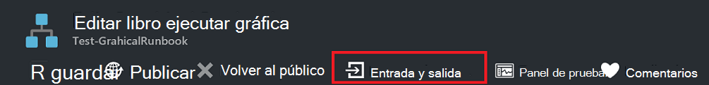
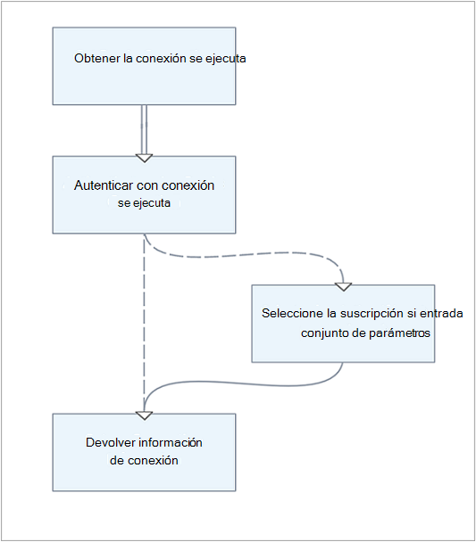
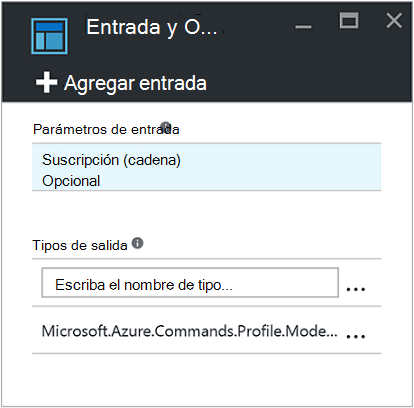
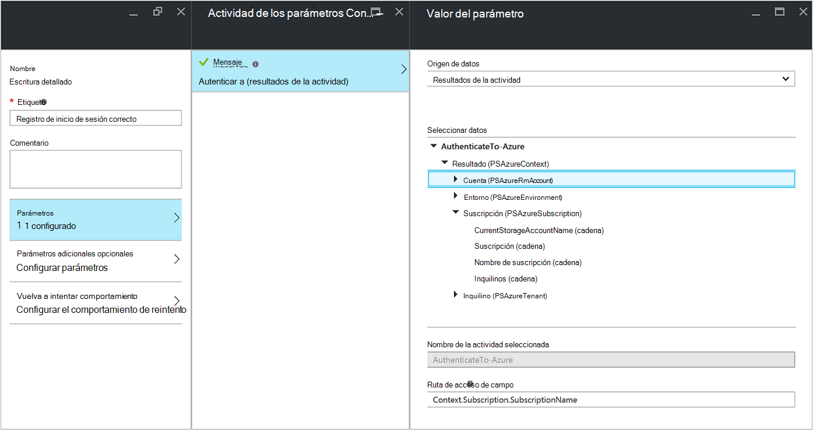
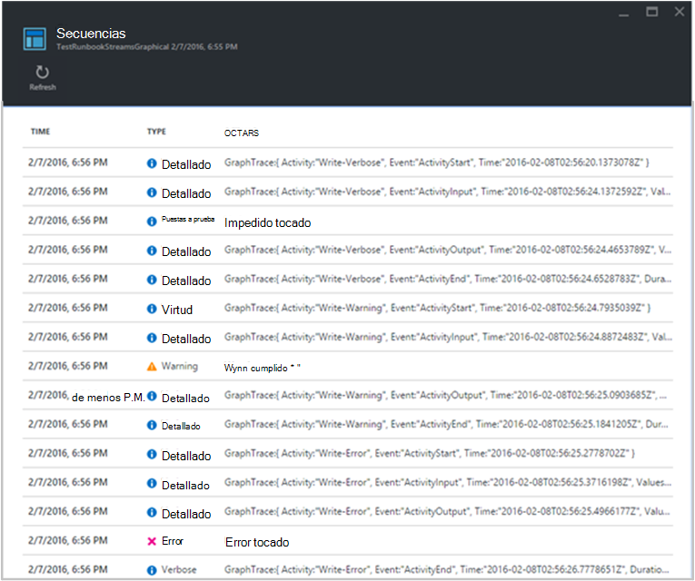
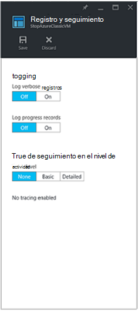

<properties
   pageTitle="Salida runbook y mensajes de automatización Azure | Microsoft Azure"
   description="Describe cómo crear y recuperar resultados y error mensajes desde runbooks en automatización de Azure."
   services="automation"
   documentationCenter=""
   authors="mgoedtel"
   manager="jwhit"
   editor="tysonn" />
<tags
   ms.service="automation"
   ms.devlang="na"
   ms.topic="article"
   ms.tgt_pltfrm="na"
   ms.workload="infrastructure-services"
   ms.date="08/24/2016"
   ms.author="magoedte;bwren" />

# Salida runbook y mensajes de automatización de Azure

La mayoría de Azure automatización runbooks tendrá algún tipo de resultado como un mensaje de error al usuario o un objeto complejo está pensado para ser consumido por otro flujo de trabajo. Windows PowerShell ofrece [varias secuencias](http://blogs.technet.com/heyscriptingguy/archive/2014/03/30/understanding-streams-redirection-and-write-host-in-powershell.aspx) para enviar los resultados de una secuencia de comandos o el flujo de trabajo. Automatización de Azure funciona con cada una de estas secuencias de forma diferente y, a continuación, debe seguir los procedimientos recomendados para cómo usar cada una cuando se crea un runbook.

La tabla siguiente proporciona una breve descripción de cada una de las secuencias y su comportamiento en el Portal de administración de Azure cuando se ejecuta un runbook publicado y cuando [pruebas un runbook](automation-testing-runbook.md). En las secciones siguientes, se proporcionan más detalles sobre cada flujo.

| Secuencia | Descripción | Publicado | Prueba|
|:---|:---|:---|:---|
|Salida|Objetos está pensado para ser consumido por otras runbooks.|Escribir en el historial de trabajos.|Se muestran en el panel de resultados de la prueba.|
|Advertencia|Mensaje de advertencia para el usuario.|Escribir en el historial de trabajos.|Se muestran en el panel de resultados de la prueba.|
|Error|Mensaje de error está pensado para el usuario. A diferencia de una excepción runbook continúa después de un mensaje de error de forma predeterminada.|Escribir en el historial de trabajos.|Se muestran en el panel de resultados de la prueba.|
|Detallado|Proporcionar información general o depuración de mensajes.|Escribe en historial de trabajos solo si el registro detallado está activado para runbook.|En el panel de resultados de pruebas sólo aparece si $VerbosePreference está configurado para continuar en runbook.|
|Progreso|Generada automáticamente antes y después de cada actividad en runbook de registros. Runbook no debería intentar crear sus propios registros de progreso, ya que están pensados para un usuario interactivo.|Escribe en historial de trabajos solo si se activa el registro de progreso para runbook.|No se muestran en el panel de resultados de la prueba.|
|Depurar|Mensajes destinados a un usuario interactivo. No se recomienda en runbooks.|No se escriben en el historial de trabajos.|No se escriben en el panel de resultados de la prueba.|

## Secuencia de salida

La secuencia de salida está destinada a los resultados de objetos creados por un script o un flujo de trabajo cuando se ejecute correctamente. En la automatización de Azure, esta secuencia se utiliza principalmente para objetos está pensados para ser consumido por [runbooks primario que llamar runbook actual](automation-child-runbooks.md). Cuando [llame a un insertado runbook](automation-child-runbooks.md#InlineExecution) desde un runbook primario, devuelve datos de la secuencia de salida al elemento primario. Solo debe usar la secuencia de salida para comunicar información general al usuario si sabe que nunca se llamará runbook por otro runbook. Como práctica recomendada, sin embargo, debe suelen usar la [secuencia detallado](#Verbose) para comunicar información general al usuario.

Puede escribir datos en la secuencia de salida con la [Salida de escritura](http://technet.microsoft.com/library/hh849921.aspx) o colocando el objeto en su propia línea runbook.

    #The following lines both write an object to the output stream.
    Write-Output –InputObject $object
    $object

### Resultado de una función

Al escribir en la secuencia de salida en una función que se incluye en su runbook, el resultado se pasa a runbook. Si runbook asigna que los resultados a una variable, a continuación, no se escribe en la secuencia de salida. Escribir en cualquier otros secuencias desde dentro de la función va a escribir en la secuencia correspondiente para runbook.

Tenga en cuenta lo siguientes runbook de muestra.

    Workflow Test-Runbook
    {
        Write-Verbose "Verbose outside of function" -Verbose
        Write-Output "Output outside of function"
        $functionOutput = Test-Function
        $functionOutput

    Function Test-Function
     {
        Write-Verbose "Verbose inside of function" -Verbose
        Write-Output "Output inside of function"
      }
    }

La secuencia de salida para el trabajo runbook sería:

    Output inside of function
    Output outside of function

La secuencia detallada para el trabajo runbook sería:

    Verbose outside of function
    Verbose inside of function

Una vez que haya publicado runbook y antes de que lo inicia, también debe activar el registro en la configuración de runbook para obtener los resultados de la secuencia detallado detallado.

### Tipo de datos de salida declaración

Un flujo de trabajo puede especificar el tipo de datos de su resultado utilizando el [atributo OutputType](http://technet.microsoft.com/library/hh847785.aspx). Este atributo no tiene ningún efecto en tiempo de ejecución, pero proporciona una indicación al autor runbook en tiempo de diseño de los resultados esperados del runbook. Como el conjunto de herramientas para runbooks sigue evolucionando, aumentará la importancia de la declaración de tipos de datos de salida en tiempo de diseño en importancia. Por tanto, es recomendable incluir esta declaración en cualquier runbooks que cree.

Aquí tiene una lista de ejemplo tipos de resultados:

-   System.String
-   System.Int32
-   System.Collections.Hashtable
-   Microsoft.Azure.Commands.Compute.Models.PSVirtualMachine

  
La siguiente runbook de muestra envía un objeto de cadena e incluye una declaración de su tipo de resultado. Si su runbook genera una matriz de un tipo determinado, todavía debe especificar el tipo en lugar de una matriz del tipo.

    Workflow Test-Runbook
    {
       [OutputType([string])]

       $output = "This is some string output."
       Write-Output $output
    }

Para declarar un tipo de resultado de runbooks Grapical o flujo de trabajo de PowerShell gráfica, puede seleccionar la opción de menú de **entrada y salida** y escriba el nombre del tipo de resultado.  Se recomienda que usar el nombre completo de la clase .NET para que sea fácil de identificar al hacer referencia a él desde un runbook primario.  Esto expone todas las propiedades de la clase para el bus de datos en runbook y proporciona una gran cantidad de flexibilidad cuando se usan para lógica condicional, registro y a continuación, hacer referencia a como valores de otras actividades en runbook.  

En el siguiente ejemplo, tenemos dos runbooks gráficas para demostrar esta característica.  Si se aplica el modelo de diseño modular runbook, tenemos un runbook que sirve como la *plantilla de autenticación Runbook* administrar la autenticación con Azure con la cuenta ejecutar como.  Nuestra segunda runbook, que suele realizar la lógica básica para automatizar un escenario determinado, en este caso va a ejecutar la *plantilla Runbook de autenticación* y mostrar los resultados en el panel de resultados de la **prueba** .  En circunstancias normales, tendríamos este runbook hacer algo en un recurso aprovechar el resultado de runbook secundarios.    

Aquí tiene la lógica básica del runbook **AuthenticateTo Azure** .  .  

Incluye el tipo de salida *Microsoft.Azure.Commands.Profile.Models.PSAzureContext*, que devolverá la autenticación propiedades de perfil.   

Aunque esta runbook es muy sencillo, hay un elemento de configuración para destacar aquí.  La última actividad está ejecutando el cmdlet de **Salida de escritura** y escribe los datos de perfil en una variable $_ mediante una expresión de PowerShell para el parámetro **Inputobject** , que es necesario para ese cmdlet.  

Para la segunda runbook en este ejemplo, denominado *ChildOutputType de prueba*, simplemente tenemos dos actividades.   

La primera actividad llama runbook **AuthenticateTo Azure** y la segunda actividad está ejecutando el cmdlet **Escritura detallado** con el **origen de datos** del **resultado de la actividad** y el valor de la **ruta de acceso del campo** es **Context.Subscription.SubscriptionName**, que es el resultado de contexto de **Azure AuthenticateTo** runbook que especifica.      

El resultado es el nombre de la suscripción.  

Una nota sobre el comportamiento del control de tipo de resultado.  Cuando escribe un valor en el campo tipo de resultado de la hoja de propiedades de entrada y salida, debe hacer clic fuera del control después de escribir, en orden de la entrada que se reconocerá en el control.  

## Secuencias de mensaje

A diferencia de la secuencia de salida, secuencias de mensajes están pensadas para comunicar información al usuario. Hay varias secuencias de mensaje para diferentes tipos de información y automatización de Azure controlar cada uno diferente.

### Secuencias de advertencia y de error

Las secuencias de Error y advertencia están pensadas para registrar los problemas que se producen en un runbook. Cuando se ejecuta un runbook y se incluyen en el panel de resultados de pruebas en el Portal de administración de Azure cuando se prueba un runbook se escriben en el historial de trabajos. De forma predeterminada, runbook seguirá ejecutando después de un error o advertencia. Puede especificar que runbook debe suspendido en una advertencia o un error al establecer una [variable de preferencias](#PreferenceVariables) de runbook antes de crear el mensaje. Por ejemplo, para hacer que un runbook suspender en un error como lo haría con una excepción, establezca **$ErrorActionPreference** en Detener.

Crear un mensaje de error o advertencia mediante el cmdlet de [Advertencia de escritura](https://technet.microsoft.com/library/hh849931.aspx) o [Error de escritura](http://technet.microsoft.com/library/hh849962.aspx) . También pueden escribir actividades estas secuencias.

    #The following lines create a warning message and then an error message that will suspend the runbook.

    $ErrorActionPreference = "Stop"
    Write-Warning –Message "This is a warning message."
    Write-Error –Message "This is an error message that will stop the runbook because of the preference variable."

### Secuencia detallado

La secuencia de mensaje detallado es para obtener información general sobre la operación runbook. Puesto que la [secuencia de depuración](#Debug) no está disponible en un runbook, mensajes detallados se deben utilizar información de depuración. De forma predeterminada, los mensajes detallados de runbooks publicados no se almacenarán en el historial de trabajos. Para almacenar mensajes detallados, configurar runbooks publicados a registro detallado registros en la ficha Configurar del runbook en el Portal de administración de Azure. En la mayoría de los casos, debe conservar la configuración predeterminada de no registro detallados registros para un runbook por razones de rendimiento. Active esta opción solo para solucionar problemas o depurar un runbook.

Cuando [prueba un runbook](automation-testing-runbook.md), mensajes detallados no son muestra aunque runbook está configurado para registrar registros detallados. Para mostrar mensajes detallados mientras [un runbook de prueba](automation-testing-runbook.md), debe establecer la variable $VerbosePreference para continuar. Con el conjunto variable, mensajes detallados se mostrará en el panel de resultados de la prueba del portal de Azure.

Crear un mensaje detallado mediante el cmdlet [Escritura detallado](http://technet.microsoft.com/library/hh849951.aspx) .

    #The following line creates a verbose message.

    Write-Verbose –Message "This is a verbose message."

### Depurar secuencia

La secuencia de depuración está pensada para su uso con un usuario interactivo y no debe usarse en runbooks.

## Registros de progreso

Si configura un runbook para registrar el progreso de registros (en la ficha Configurar del runbook en el portal de Azure) y luego un registro se escribirá en el historial de trabajos antes y después de ejecuta cada actividad. En la mayoría de los casos, debe conservar el valor predeterminado de registro no registros de progreso para un runbook para maximizar el rendimiento. Active esta opción solo para solucionar problemas o depurar un runbook. Cuando se prueba un runbook, no se muestran mensajes de progreso aunque runbook está configurado para registrar registros de progreso.

El cmdlet de [Progreso de escritura](http://technet.microsoft.com/library/hh849902.aspx) no es válido en un runbook, ya que esto se refieren a un usuario interactivo.

## Variables de preferencias

Windows PowerShell usa [variables preferencias](http://technet.microsoft.com/library/hh847796.aspx) para determinar cómo responder a los datos enviados en secuencias de salida diferente. Puede establecer estas variables en una runbook para controlar cómo debe responder a los datos enviados en secuencias diferentes.

La siguiente tabla enumera las variables de preferencia que pueden usarse en runbooks con sus válida y valores predeterminados. Tenga en cuenta que esta tabla contiene solo los valores que son válidos en un runbook. Valores adicionales son válidos para las variables de preferencia cuando se usa en Windows PowerShell fuera automatización de Azure.

| Variable| Valor predeterminado| Valores válidos|
|:---|:---|:---|
|WarningPreference|Continuar|Detener Continuar SilentlyContinue|
|ErrorActionPreference|Continuar|Detener Continuar SilentlyContinue|
|VerbosePreference|SilentlyContinue|Detener Continuar SilentlyContinue|

La tabla siguiente muestra el comportamiento de los valores de variables de preferencia que son válidos en runbooks.

| Valor| Comportamiento|
|:---|:---|
|Continuar|Registre el mensaje y continúa ejecutando runbook.|
|SilentlyContinue|Continúa la ejecución runbook sin iniciar el mensaje. Esto tiene el efecto de omitir el mensaje.|
|Detener|Registre el mensaje y suspende runbook.|

## Recuperar resultados runbook y mensajes

### Portal de Azure

Puede ver los detalles de una tarea runbook en el portal de la ficha de trabajos de un runbook de Azure. Resumen de la tarea mostrará los parámetros de entrada y la [secuencia de salida](#Output) , además de información general sobre el trabajo y las excepciones si ha producido. El historial incluye mensajes de la [secuencia de salida](#Output) y [flujos de Error y advertencia](#WarningError) además de los [Registros de progreso](#Progress) y [secuencia detallado](#Verbose) si runbook está configurado para el registro detallado y registros de progreso.

### Windows PowerShell

En Windows PowerShell, puede recuperar los resultados y mensajes de un runbook mediante el cmdlet [Get-AzureAutomationJobOutput](https://msdn.microsoft.com/library/mt603476.aspx) . Este cmdlet requiere el identificador de la tarea y tiene un parámetro denominado secuencia donde puede especificar qué secuencia para devolver. Puede especificar cualquiera para devolver todos los flujos de trabajo.

En el ejemplo siguiente se inicia un runbook de muestra y, a continuación, espera a que finalice. Una vez completada, se recopila su secuencia de salida de la tarea.

    $job = Start-AzureRmAutomationRunbook -ResourceGroupName "ResourceGroup01" `
    –AutomationAccountName "MyAutomationAccount" –Name "Test-Runbook"

    $doLoop = $true
    While ($doLoop) {
       $job = Get-AzureRmAutomationJob -ResourceGroupName "ResourceGroup01" `
       –AutomationAccountName "MyAutomationAccount" -Id $job.JobId
       $status = $job.Status
       $doLoop = (($status -ne "Completed") -and ($status -ne "Failed") -and ($status -ne "Suspended") -and ($status -ne "Stopped")
    }

    Get-AzureRmAutomationJobOutput -ResourceGroupName "ResourceGroup01" `
    –AutomationAccountName "MyAutomationAccount" -Id $job.JobId –Stream Output

### Creación de gráficos

Para runbooks gráfica, registro extra está disponible en el formulario de seguimiento en el nivel de actividad.  Existen dos niveles de seguimiento: Basic y detallado.  En seguimiento básicos, puede ver el inicio y hora de finalización de cada actividad runbook además de la información relacionada con los reintentos de actividad, como el número de intentos y la hora de inicio de la actividad.  En seguimiento detallada, obtener datos de salida y seguimiento más básicos de entrada para cada actividad.  Tenga en cuenta que actualmente los registros de seguimiento se escriben utilizando la secuencia detallada, por lo que debe habilitar el registro detallado cuando se habilita el seguimiento.  Para runbooks gráfica con el seguimiento habilitado no es necesario iniciar sesión registros de progreso, porque el seguimiento básico sirve para el mismo propósito y es más informativo.

Puede ver en la captura de pantalla anterior que, cuando se habilita detallado de registro y seguimiento de runbooks gráfica, mucha más información está disponible en la vista de flujos de trabajo de producción.  Esta información adicional puede resultar esencial para solucionar problemas de producción con un runbook y, por tanto, se debe sólo habilitar a tal fin y no como práctica general.    
Los registros de seguimiento pueden ser especialmente numerosos.  Con gráfica runbook de seguimiento puede obtener registros de dos o cuatro por actividad dependiendo de si ha configurado el seguimiento básico o detallado.  A menos que necesite esta información para realizar un seguimiento del progreso de un runbook para solucionar este problema, puede desear mantener seguimiento desactivado.

**Para habilitar el seguimiento de nivel de actividad, realice los pasos siguientes.**

 1. En el Portal de Azure, abra su cuenta de automatización.

 2. Haga clic en el mosaico **Runbooks** para abrir la lista de runbooks.

 3. En el módulo Runbooks, haga clic para seleccionar un runbook gráfica de la lista de runbooks.

 4. En el módulo de configuración para runbook seleccionado, haga clic en **registro y seguimiento**.

 5. En el registro y seguimiento de módulo, en el registro detallados registros, haga clic **en** para habilitar el registro detallado y seguimiento de nivel de actividad de udner, cambiar el nivel de seguimiento para **básico** o **detallado** basándose en el nivel de seguimiento requieren. 

    

## Pasos siguientes

- Para obtener más información sobre la ejecución del runbook, cómo supervisar runbook trabajos y otros detalles técnicos, consulte [realizar un seguimiento un trabajo runbook](automation-runbook-execution.md)
- Para comprender cómo diseñar y usar runbooks secundarios, vea [runbooks secundarios en automatización de Azure](automation-child-runbooks.md)
