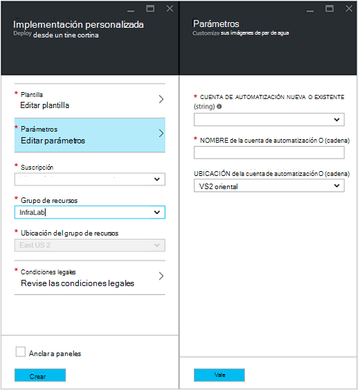
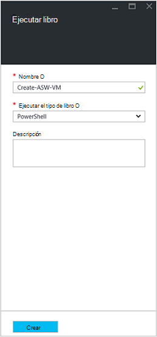
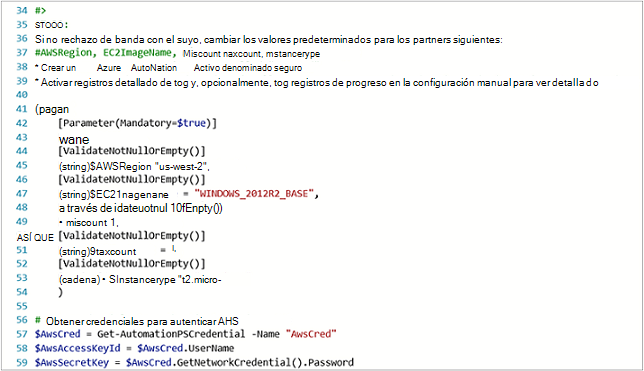
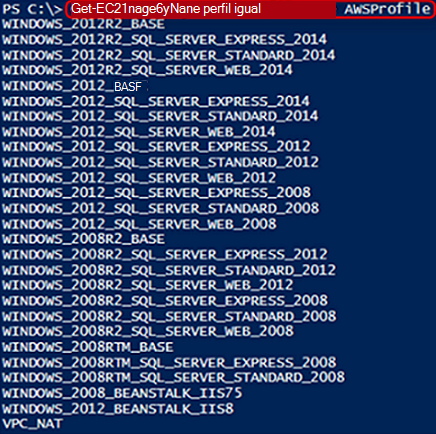
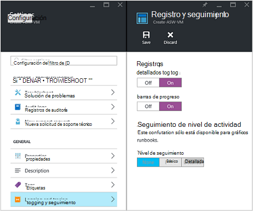
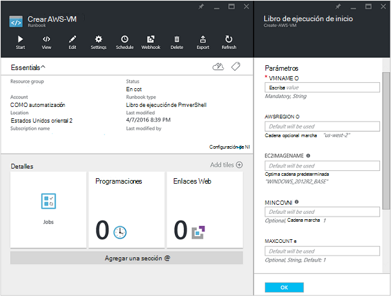
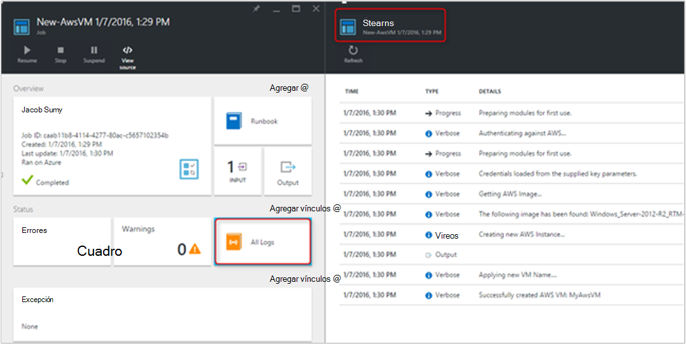
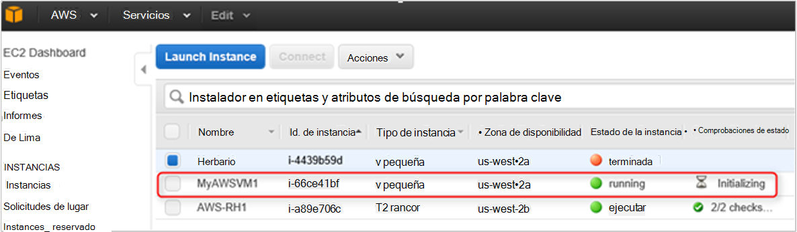

<properties
   pageTitle="Automatizar la implementación de una máquina virtual de los servicios Web de Amazon | Microsoft Azure"
   description="En este artículo se muestra cómo usar la automatización de Azure para automatizar la creación de una VM de servicio Web de Amazon"
   services="automation"
   documentationCenter=""
   authors="mgoedtel"
   manager="jwhit"
   editor="" />
<tags
   ms.service="automation"
   ms.devlang="na"
   ms.topic="article"
   ms.tgt_pltfrm="na"
   ms.workload="na"
   ms.date="08/17/2016"
   ms.author="tiandert; bwren" />

# <a name="azure-automation-scenario---provision-an-aws-virtual-machine"></a>Escenario de automatización Azure - aprovisionar una máquina virtual AWS 

En este artículo se explica cómo puede aprovechar la automatización de Azure para aprovisionar una máquina virtual en su suscripción de servicio Web de Amazon (AWS) y asigne un nombre específico: que AWS hace referencia a "marcar" la máquina virtual a máquina.

## <a name="prerequisites"></a>Requisitos previos

Para el propósito de este artículo, debe tener una cuenta de Azure automatización y una suscripción AWS. Para obtener más información sobre cómo configurar una cuenta de Azure automatización y configurar con sus credenciales de suscripción AWS, revise [Configurar autenticación con servicios Web de Amazon](../automation/automation-sec-configure-aws-account.md).  Esta cuenta debe creada o actualizada con sus credenciales de suscripción AWS antes de continuar, tal y como se hará referencia a esta cuenta en los pasos siguientes.


## <a name="deploy-amazon-web-services-powershell-module"></a>Implementar el módulo de PowerShell de servicios Web de Amazon

Nuestra VM runbook de aprovisionamiento Aproveche el módulo de PowerShell AWS para hacer su trabajo. Siga estos pasos para agregar el módulo a su cuenta de automatización está configurado con sus credenciales de suscripción AWS.  

1. Abra el explorador web y vaya a la [Galería de PowerShell](http://www.powershellgallery.com/packages/AWSPowerShell/) y haga clic en la **implementación al botón de automatización de Azure**.<br> 

2. Se toman a la página de inicio de sesión de Azure y después de autenticar, se enrutan en el Portal de Azure y realizada con la siguiente hoja.<br> 

3. Seleccione el grupo de recursos de la lista desplegable de **Grupo de recursos** y en el módulo de parámetros, proporcione la siguiente información:
   * En la lista desplegable **nuevo o existente de automatización de cuenta (cadena)** seleccione **existente**.  
   * En el cuadro **Nombre de cuenta de automatización (cadena)** , escriba el nombre de la cuenta de automatización que incluye las credenciales para la suscripción AWS exacto.  Por ejemplo, si ha creado una cuenta dedicada denominada **AWSAutomation**, a continuación, es lo que escribe en el cuadro.
   * Seleccione la región de la lista desplegable de **Ubicación de la cuenta de automatización** .

4. Cuando haya terminado de escribir la información necesaria, haga clic en **crear**.

    >[AZURE.NOTE]Mientras importar un módulo de PowerShell en Azure automatización, es también extraer los cmdlets y estas actividades no aparecerán hasta que el módulo completamente ha terminado de importar y extraer los cmdlets. Este proceso puede tardar unos minutos.  
<br>
5. En el Portal de Azure, abra su cuenta de automatización hace referencia en el paso 3.
6. Haga clic en el mosaico de **activos** y en el módulo de **activos** , seleccione el icono de **módulos** .
7. En el módulo de **módulos** , verá el módulo **AWSPowerShell** en la lista.

## <a name="create-aws-deploy-vm-runbook"></a>Crear AWS implementar runbook VM

Una vez que se ha implementado el módulo de PowerShell AWS, ahora nos podemos crear un runbook para automatizar una máquina virtual en AWS mediante un script de PowerShell de aprovisionamiento. Los pasos siguientes le muestran cómo aprovechar nativa script de PowerShell en automatización de Azure.  

>[AZURE.NOTE] Para obtener más opciones e información relacionada con esta secuencia de comandos, visite la [Galería de PowerShell](https://www.powershellgallery.com/packages/New-AwsVM/DisplayScript).


1. Descargar la secuencia de comandos de PowerShell AwsVM nuevo de la Galería de PowerShell, abra una sesión PowerShell y escriba lo siguiente:<br>
   ```
   Save-Script -Name New-AwsVM -Path \<path\>
   ```
<br>
2. Desde el Portal de Azure, abra su cuenta de automatización y haga clic en el mosaico **Runbooks** .  
3. En el módulo **Runbooks** , seleccione **Agregar un runbook**.
4. En el módulo de **Agregar un runbook** , seleccione **Crear rápido** (crear una nueva runbook).
5. En la hoja de propiedades **Runbook** , escriba un nombre en el cuadro Nombre de su runbook y del **tipo de Runbook** seleccione **PowerShell**lista desplegable y, a continuación, haga clic en **crear**.<br> 
6. Cuando aparezca el módulo PowerShell Runbook de editar, copiar y pegar la secuencia de comandos de PowerShell en runbook lienzo de creación.<br> <br>

    >[AZURE.NOTE] Tenga en cuenta lo siguiente cuando trabaje con el ejemplo de script de PowerShell:
    >
    > - Runbook contiene un número de valores de parámetro predeterminados. Visite evaluar todos los valores predeterminados y actualice cuando sea necesario.
    > - Si ha guardado sus credenciales AWS como activo credenciales un nombre diferente de **AWScred**, deberá actualizar el script en línea 57 para que coincida con según corresponda.  
    > - Cuando se trabaja con los comandos de CLI AWS en PowerShell, especialmente con runbook de este ejemplo, debe especificar la región AWS. En caso contrario, se producirá un error de los cmdlets.  Ver tema AWS [Especificar AWS región](http://docs.aws.amazon.com/powershell/latest/userguide/pstools-installing-specifying-region.html) en las herramientas de AWS para el documento de PowerShell para obtener más detalles.  
<br>
7. Para recuperar una lista de nombres de la imagen de la suscripción AWS, iniciar PowerShell ISE e importar el módulo de PowerShell AWS.  Para autenticarse AWS reemplazando **Get-AutomationPSCredential** en su entorno de ISE con **AWScred = Get-Credential**.  Esto le solicitará las credenciales y puede proporcionar el **Identificador de tecla de acceso** para el usuario y una **Tecla de acceso de secreto** para la contraseña.  Consulte el ejemplo siguiente:

        #Sample to get the AWS VM available images
        #Please provide the path where you have downloaded the AWS PowerShell module
        Import-Module AWSPowerShell
        $AwsRegion = "us-west-2"
        $AwsCred = Get-Credential
        $AwsAccessKeyId = $AwsCred.UserName
        $AwsSecretKey = $AwsCred.GetNetworkCredential().Password

        # Set up the environment to access AWS
        Set-AwsCredentials -AccessKey $AwsAccessKeyId -SecretKey $AwsSecretKey -StoreAs AWSProfile
        Set-DefaultAWSRegion -Region $AwsRegion

        Get-EC2ImageByName -ProfileName AWSProfile
   Se devuelve el resultado siguiente:<br>
     
8. Copie y pegue uno de los nombres de imagen en una variable de automatización como referencia en runbook como **$InstanceType**. Dado que en este ejemplo se usa la AWS gratuita en niveles de suscripción, usaremos **t2.micro** en nuestro ejemplo runbook.
9. Guardar runbook y luego haga clic en **Publicar** para publicar runbook y, a continuación, en **Sí** cuando se le solicite.


### <a name="testing-the-aws-vm-runbook"></a>Probar runbook AWS VM
Antes de continuar con las pruebas runbook, es necesario comprobar algunas cosas. Específicamente:

   -  Se ha creado un activo para autenticar contra AWS llamado **AWScred** o se ha actualizado la secuencia de comandos para hacer referencia al nombre de su activo de credenciales.  
   -  Se ha importado el módulo de PowerShell AWS en automatización de Azure
   -  Se ha creado un nuevo runbook y valores de parámetro se han verificado y actualizado cuando sea necesario
   -  **Registros detallados** y, opcionalmente, **registros de progreso** en runbook configuración de **registro y seguimiento** se establecieron en **activado**.<br> 

1. Queremos iniciar runbook, así que haga clic en **Inicio** y, a continuación, haga clic en **Aceptar** cuando se abre el módulo Runbook de inicio.
2. En el módulo Runbook de inicio, proporcione un **VMname**.  Acepte los valores predeterminados de los otros parámetros que ha configurado previamente en el script de una versión anterior.  Haga clic en **Aceptar** para iniciar el trabajo runbook.<br> 
3. Se abrirá un panel de trabajo para el trabajo de runbook que acaba de crear. Cerrar este panel.
4. Podemos ver el progreso de la tarea y la **vista salida seleccionando el icono de **Todos los registros** de la hoja de trabajo runbook** .<br> 
5. Para confirmar que se le proporciona la máquina virtual, inicie sesión en la consola de administración de AWS si usted no ha iniciado.<br> 

## <a name="next-steps"></a>Pasos siguientes
-   Para empezar con runbooks gráfica, consulte [Mi primera runbook gráfica](automation-first-runbook-graphical.md)
-   Para empezar con PowerShell runbooks de flujo de trabajo, consulte [Mi primera runbook de flujo de trabajo de PowerShell](automation-first-runbook-textual.md)
-   Para más información sobre las limitaciones, sus ventajas y runbook tipos, vea [tipos de runbook de automatización de Azure](automation-runbook-types.md)
-   Para obtener más información acerca de los comandos de PowerShell admite la característica, vea [secuencias de comandos de PowerShell nativo de soporte técnico de automatización de Azure](https://azure.microsoft.com/blog/announcing-powershell-script-support-azure-automation-2/)
