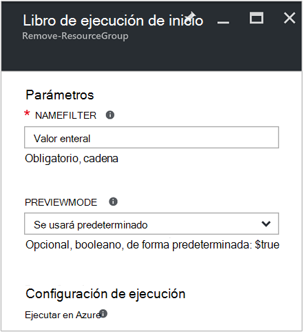
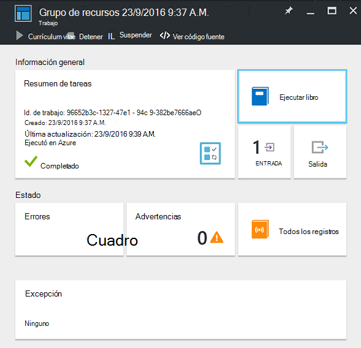
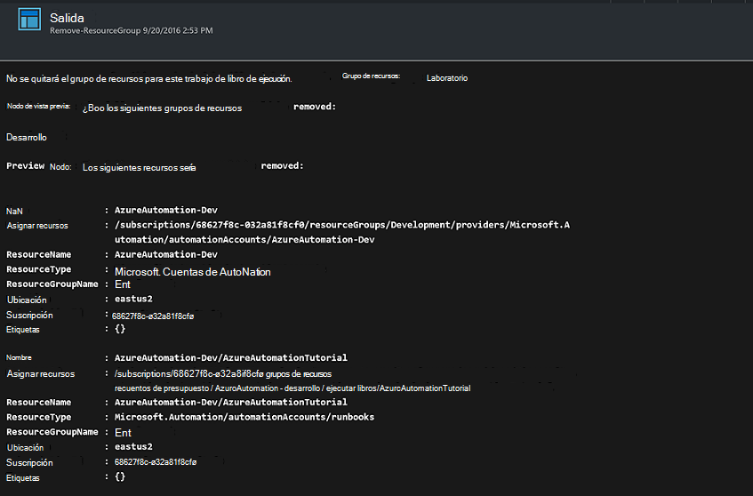

<properties
    pageTitle="Automatizar la eliminación de grupos de recursos | Microsoft Azure"
    description="Versión del flujo de trabajo de PowerShell de un escenario de automatización de Azure incluidos runbooks para quitar todos los grupos de recursos en la suscripción."
    services="automation"
    documentationCenter=""
    authors="MGoedtel"
    manager="jwhit"
    editor=""
    />
<tags
    ms.service="automation"
    ms.workload="tbd"
    ms.tgt_pltfrm="na"
    ms.devlang="na"
    ms.topic="get-started-article"
    ms.date="09/26/2016"
    ms.author="magoedte"/>

# Escenario de automatización de Azure - automatizar la eliminación de grupos de recursos

Muchos clientes crean más de un grupo de recursos. Algunos pueden utilizarse para administrar las aplicaciones de producción y otros usuarios pueden usarse como desarrollo, pruebas y entornos de ensayo. Automatizar la implementación de estos recursos es una cosa, pero poder retirar un grupo de recursos con un clic en el botón es otra. Puede simplificar esta tarea de administración comunes mediante la automatización de Azure. Esto es útil si está trabajando con una suscripción de Azure que tiene un límite de gastos a través de una oferta de miembro como MSDN o el programa de Microsoft Partner Network Cloud Essentials.

Este escenario se basa en un runbook de PowerShell y está diseñado para quitar uno o varios grupos de recursos que se especifican de la suscripción. La configuración predeterminada del runbook es probar antes de continuar. Así se garantiza que no elimina accidentalmente el grupo de recursos antes de que esté listo para completar este procedimiento.   

## Obtener el escenario

Este escenario consta de un runbook de PowerShell que puede descargarse desde la [Galería de PowerShell](https://www.powershellgallery.com/packages/Remove-ResourceGroup/1.0/DisplayScript). También puede importar directamente desde la [Galería de Runbook](automation-runbook-gallery.md) en el portal de Azure.  

Runbook | Descripción|
----------|------------|
Quitar ResourceGroup | Quita uno o varios grupos de recursos de Azure y recursos asociados de la suscripción.  
 
Los siguientes parámetros de entrada se definen para este runbook:

Parámetro | Descripción|
----------|------------|
NameFilter (obligatorio) | Especifica un filtro de nombre para limitar los grupos de recursos que desea eliminar. Pueden pasar varios valores con una lista de valores separados por comas. El filtro no distingue mayúsculas de minúsculas y corresponden a cualquier grupo de recursos que contiene la cadena.|
PreviewMode (opcional) | Ejecuta runbook para ver qué grupos de recursos se pueden eliminar, pero no realiza ninguna acción. El valor predeterminado es **true** para ayudar a evitar el borrado accidental de uno o varios grupos de recursos pasada a runbook.  

## Instalar y configurar este escenario

### Requisitos previos

Este runbook autentica con la [cuenta de Azure ejecutar como](automation-sec-configure-azure-runas-account.md).    

### Instalar y publicar la runbooks

Después de descargar runbook, puede importar mediante el procedimiento descrito en [Importar runbook procedimientos](automation-creating-importing-runbook.md#importing-a-runbook-from-a-file-into-Azure-Automation). Publicar runbook después de que se ha importado correctamente a su cuenta de automatización.

## Usar runbook

Los siguientes pasos le guiará a través de la ejecución de este runbook y ayudarán a familiarizarse con su funcionamiento. Va solo a probar runbook en este ejemplo, realmente no eliminar el grupo de recursos.  

1. Desde el portal de Azure, abra su cuenta de automatización y pulse **Runbooks**.
2. Seleccione **Quitar ResourceGroup** runbook y haga clic en **Inicio**.
3. Iniciar runbook, el módulo **Runbook de inicio** se abre y puede configurar los parámetros. Escriba los nombres de los grupos de recursos en la suscripción que puede usar para realizar pruebas y no provocará ningún daño si elimina accidentalmente.  

    >[AZURE.NOTE] Asegúrese de que **Previewmode** se establece en **true** para evitar la eliminación de los grupos de recursos seleccionados.  **Nota** que este runbook no quitará el grupo de recursos que contiene la cuenta de automatización que se está ejecutando esta runbook.  

4. Después de haber configurado el parámetro de todos los valores, haga clic en **Aceptar**y, a continuación, runbook se pondrán en cola de ejecución.  

Para ver los detalles de la tarea de runbook **ResourceGroup quitar** en el portal de Azure, seleccione **trabajos** en runbook. La tarea de resumen muestra los parámetros de entrada y la secuencia de salida, además de información general sobre el trabajo y las excepciones que se ha producido.  .

**Resumen de tareas** incluye mensajes de salida, advertencia y secuencias de error. Seleccione **salida** para ver los resultados de la ejecución del runbook detallados.  

## Pasos siguientes

- Para empezar a crear su propio runbook, vea [crear o importar un runbook de automatización de Azure](automation-creating-importing-runbook.md).
- Para empezar con runbooks de flujo de trabajo de PowerShell, consulte [Mi primera runbook de flujo de trabajo de PowerShell](automation-first-runbook-textual.md).
