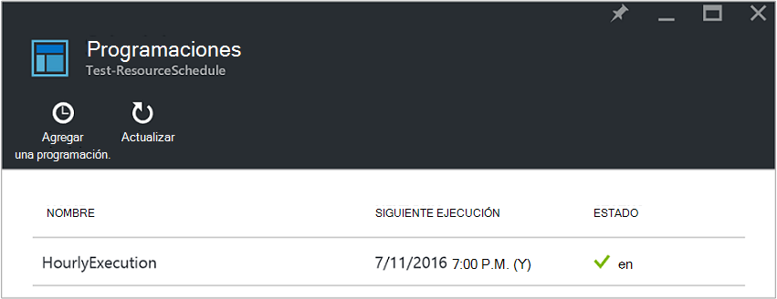
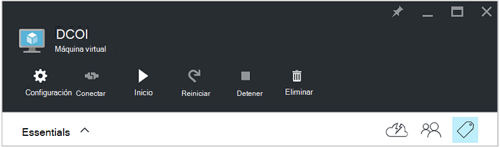
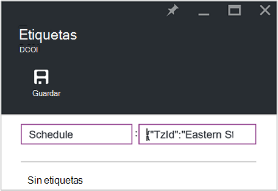
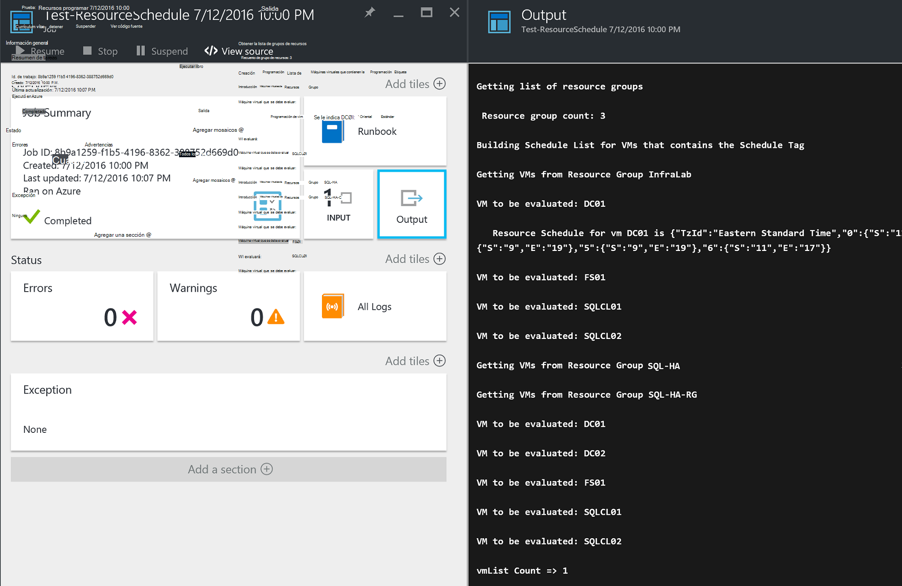

<properties
   pageTitle="Usar etiquetas con formato JSON para crear una programación para Azure VM inicio y cierre | Microsoft Azure"
   description="En este artículo se muestra cómo usar las cadenas JSON en etiquetas para automatizar la programación de cierre e inicio de máquina virtual."
   services="automation"
   documentationCenter=""
   authors="MGoedtel"
   manager="jwhit"
   editor="tysonn" />
<tags
   ms.service="automation"
   ms.devlang="na"
   ms.topic="article"
   ms.tgt_pltfrm="na"
   ms.workload="infrastructure-services"
   ms.date="07/18/2016"
   ms.author="magoedte;paulomarquesc" />

# Escenario de automatización de Azure: usar etiquetas con formato JSON para crear una programación para Azure VM inicio y cierre

Los clientes con qué frecuencia desean programar el inicio y cierre de máquinas virtuales para ayudar a reducir los costos de suscripción o admitir requisitos técnicos y empresariales.  

El siguiente escenario le permite configurar automatizado inicio y cierre de sus máquinas virtuales usando una etiqueta de programación en un nivel de grupo de recursos o máquina virtual en Azure. Esta programación puede configurarse del domingo al sábado con una fecha de inicio y cierre.  

Tenemos algunas opciones del cuadro. Se incluyen:
-  [Establece la escala de la máquina Virtual](../virtual-machine-scale-sets/virtual-machine-scale-sets-overview.md) con Autoescala la configuración que le permite ampliar o reducir.
- Servicio de [Prácticas DevTest](../devtest-lab/devtest-lab-overview.md) , que tiene la función integrada de programación de operaciones de inicio y cierre.

Sin embargo, estas opciones solo admiten escenarios específicos y no se puede aplicar a máquinas virtuales de infraestructura como-servicio (IaaS).   

Cuando la etiqueta de programación se aplica a un grupo de recursos, también se aplica a todos los equipos virtuales dentro de ese grupo de recursos. Si una programación directamente también se aplica a una máquina virtual, la programación de la última tiene prioridad en el siguiente orden:

1.  Programación aplicado a un grupo de recursos
2.  Programación aplicado a un grupo de recursos y de la máquina virtual en el grupo de recursos
3.  Programación aplicado a una máquina virtual

Este escenario esencialmente toma una cadena JSON a un formato específico y lo agrega como el valor de una etiqueta de programación. A continuación, un runbook enumera todos los grupos de recursos y máquinas virtuales e identifica las programaciones para cada VM basándose en las situaciones enumeradas anteriormente. A continuación recorre las máquinas virtuales que tengan programaciones adjuntas y evalúa se debe realizar la acción. Por ejemplo, determina qué máquinas virtuales es necesario detenido, cerrar o pasan por alto.

Estos runbooks autenticar mediante la [cuenta de Azure ejecutar como](../automation/automation-sec-configure-azure-runas-account.md).

## Descargar el runbooks para el escenario

Este escenario consta de cuatro runbooks de flujo de trabajo de PowerShell que puede descargarse desde la [Galería de TechNet](https://gallery.technet.microsoft.com/Azure-Automation-Runbooks-84f0efc7) o en el repositorio de [GitHub](https://github.com/paulomarquesdacosta/azure-automation-scheduled-shutdown-and-startup) para este proyecto.

Runbook | Descripción
----------|----------
ResourceSchedule de prueba | Comprueba la programación de cada máquina virtual y realiza apagado o inicio según la programación.
ResourceSchedule agregar | Agrega la etiqueta de programación para un máquina virtual o grupo de recursos.
Actualización ResourceSchedule | Modifica la etiqueta de programación existente reemplazándola por uno nuevo.
Quitar ResourceSchedule | Quita la etiqueta de la programación de un máquina virtual o grupo de recursos.

## Instalar y configurar este escenario

### Instalar y publicar la runbooks

Después de descargar el runbooks, puede importarlos mediante el procedimiento descrito en [crear o importar un runbook de automatización de Azure](automation-creating-importing-runbook.md#importing-a-runbook-from-a-file-into-Azure-Automation).  Publicar cada runbook después de que se ha importado correctamente a su cuenta de automatización.

### Agregar una programación de a runbook ResourceSchedule de prueba

Siga estos pasos para habilitar la programación para runbook ResourceSchedule de prueba. Esta es la runbook que comprueba qué máquinas virtuales debe iniciar, apagar o quedas como está.

1. Desde el portal de Azure, abra su cuenta de automatización y, a continuación, haga clic en el mosaico **Runbooks** .
2. En el módulo **ResourceSchedule de prueba** , haga clic en el mosaico de **programaciones** .
3. En el módulo de **programaciones** , haga clic en **Agregar una programación**.
4. En el módulo de **programaciones** , seleccione **una programación para su runbook de vínculo**. Haga clic en **crear una nueva programación**.
5.  En el módulo de **programación de nuevo** , escriba el nombre de este programa, por ejemplo: *HourlyExecution*.
6. Para la programación de **Inicio**, establezca la hora de inicio en un incremento de hora.
7. Seleccione **Periodicidad**y, a continuación, para que **se repita cada intervalo**, seleccione **1 hora**.
8. Compruebe que el **conjunto de caducidad** está establecida en **No**y, a continuación, haga clic en **crear** para guardar la programación nueva.
9. En el módulo de opciones de **Programación Runbook** , seleccione **configuración de ejecución y parámetros**. En el módulo de prueba ResourceSchedule **parámetros** , escriba el nombre de la suscripción en el campo **SubscriptionName** .  Este es el único parámetro necesario para runbook.  Cuando haya terminado, haga clic en **Aceptar**.  

La programación de runbook debe tener un aspecto parecido al siguiente cuando se complete:

 

## Aplicar formato a la cadena JSON

Esta solución básicamente tengan un JSON cadena con un formato específico y lo agrega como el valor de una etiqueta denominada programación. A continuación, un runbook enumera todos los grupos de recursos y máquinas virtuales e identifica las programaciones de cada máquina virtual.

Runbook recorre las máquinas virtuales que tengan programaciones adjuntas y comprueba qué acciones deben ejecutarse. A continuación se muestra un ejemplo de cómo se deben aplicar el formato de las soluciones:

    {
       "TzId": "Eastern Standard Time",
        "0": {  
           "S": "11",
           "E": "17"
        },
        "1": {
           "S": "9",
           "E": "19"
        },
        "2": {
           "S": "9",
           "E": "19"
        },
    }

Aquí encontrará información detallada sobre esta estructura:

1. El formato de la estructura JSON está optimizado para evitar la limitación de 256 caracteres de un valor de etiqueta único en Azure.

2. *TzId* representa la zona horaria de la máquina virtual. Este ID puede obtenerse mediante la clase TimeZoneInfo .NET en una sesión PowerShell--**[System.TimeZoneInfo]:: GetSystemTimeZones()**.

    

    - Días laborables están representados por un valor numérico cero a seis. El valor cero es igual al domingo.
    - La hora de inicio se representa con el atributo **S** y su valor está en un formato de 24 horas.
    - La hora de finalización o apagado se representa con el atributo **E** y su valor está en un formato de 24 horas.

    Si los atributos **S** y **E** tienen un valor de cero (0), la máquina virtual quedará en su estado actual en el momento de evaluación.   

3. Si desea omitir la evaluación de un día concreto de la semana, no agregar una sección para ese día de la semana. En el ejemplo siguiente, se evalúan solo lunes y se pasan por alto el resto de los días de la semana:

        {
          "TzId": "Eastern Standard Time",
           "1": {
             "S": "11",
             "E": "17"
           }
        }

## Grupos de recursos de etiqueta o máquinas virtuales

Para cerrar máquinas virtuales, debe etiquetar las máquinas virtuales o los grupos de recursos que se encuentran. No se evalúan máquinas virtuales que no tiene una etiqueta de programación. Por lo tanto, no se inició o apagados.

Hay dos formas de grupos de recursos de etiqueta o máquinas virtuales con esta solución. Puede hacerlo directamente desde el portal. O bien, puede usar el ResourceSchedule agregar, actualizar ResourceSchedule y quitar ResourceSchedule runbooks.

### Etiquetar a través del portal

Siga estos pasos para etiquetar una máquina virtual o grupo de recursos en el portal:

1. Acoplar la cadena JSON y compruebe que no son espacios.  La cadena JSON debería tener este aspecto:

        {"TzId":"Eastern Standard Time","0":{"S":"11","E":"17"},"1":{"S":"9","E":"19"},"2": {"S":"9","E":"19"},"3":{"S":"9","E":"19"},"4":{"S":"9","E":"19"},"5":{"S":"9","E":"19"},"6":{"S":"11","E":"17"}}

2. Seleccione el icono de la **etiqueta** para un máquina virtual o grupo de recursos aplicar esta programación.

    
3. Las etiquetas se definen siguiendo un par de clave/valor. Escriba la **programación** en el campo de **clave** y, a continuación, pegue la cadena JSON en el campo de **valor** . Haga clic en **Guardar**. La nueva etiqueta ahora debería aparecer en la lista de etiquetas para el recurso.

### Etiqueta de PowerShell

Todos los runbooks importados contienen información de ayuda al principio de la secuencia de comandos que se describe cómo ejecutar el runbooks directamente desde PowerShell. Puede llamar la runbooks ScheduleResource agregar y actualizar ScheduleResource de PowerShell. Para ello, pasando parámetros requeridos que le permite crear o actualizar la etiqueta de programación en una máquina virtual o grupo de recursos fuera del portal.  

Para crear, agregar y eliminar etiquetas a través de PowerShell, primero tiene que [Configurar el entorno de PowerShell para Azure](../powershell-install-configure.md). Después de completar la instalación, puede continuar con los pasos siguientes.

### Crear una etiqueta de programación con PowerShell

1. Abra una sesión PowerShell. A continuación, use el siguiente ejemplo para autenticar con la cuenta ejecutar como y especifique una suscripción:   

        Conn = Get-AutomationConnection -Name AzureRunAsConnection
        Add-AzureRMAccount -ServicePrincipal -Tenant $Conn.TenantID `
        -ApplicationId $Conn.ApplicationID -CertificateThumbprint $Conn.CertificateThumbprint
        Select-AzureRmSubscription -SubscriptionName "MySubscription"

2. Definir una tabla de hash de programación. Aquí tiene un ejemplo de cómo se debe construir:

        $schedule= @{ "TzId"="Eastern Standard Time"; "0"= @{"S"="11";"E"="17"};"1"= @{"S"="9";"E"="19"};"2"= @{"S"="9";"E"="19"};"3"= @{"S"="9";"E"="19"};"4"= @{"S"="9";"E"="19"};"5"= @{"S"="9";"E"="19"};"6"= @{"S"="11";"E"="17"}}

3. Defina los parámetros que requieren runbook. En el ejemplo siguiente, estamos se dirige a una máquina virtual:

        $params = @{"SubscriptionName"="MySubscription";"ResourceGroupName"="ResourceGroup01"; `
        "VmName"="VM01";"Schedule"=$schedule}

    Si está etiquetado de un grupo de recursos, quitar el parámetro *VMName* de la tabla de hash $params como sigue:

        $params = @{"SubscriptionName"="MySubscription";"ResourceGroupName"="ResourceGroup01"; `
        "Schedule"=$schedule}

4. Ejecute runbook agregar ResourceSchedule con los parámetros siguientes para crear la etiqueta de la programación:

        Start-AzureRmAutomationRunbook -Name "Add-ResourceSchedule" -Parameters $params `
        -AutomationAccountName "AutomationAccount" -ResourceGroupName "ResourceGroup01"

5. Para actualizar un grupo de recursos o la etiqueta de la máquina virtual, ejecute runbook **Actualización ResourceSchedule** con los parámetros siguientes:

        Start-AzureRmAutomationRunbook -Name "Update-ResourceSchedule" -Parameters $params `
        -AutomationAccountName "AutomationAccount" -ResourceGroupName "ResourceGroup01"

### Quitar una etiqueta de programación con PowerShell

1. Abra una sesión PowerShell y ejecute el siguiente procedimiento para autenticar con la cuenta ejecutar como y para seleccionar y especificar una suscripción:

        Conn = Get-AutomationConnection -Name AzureRunAsConnection
        Add-AzureRMAccount -ServicePrincipal -Tenant $Conn.TenantID `
        -ApplicationId $Conn.ApplicationID -CertificateThumbprint $Conn.CertificateThumbprint
        Select-AzureRmSubscription -SubscriptionName "MySubscription"

2. Defina los parámetros que requieren runbook. En el ejemplo siguiente, estamos se dirige a una máquina virtual:

        $params = @{"SubscriptionName"="MySubscription";"ResourceGroupName"="ResourceGroup01" `
        ;"VmName"="VM01"}

    Si elimina una etiqueta de un grupo de recursos, quitar el parámetro *VMName* de la tabla de hash $params como sigue:

        $params = @{"SubscriptionName"="MySubscription";"ResourceGroupName"="ResourceGroup01"}

3. Ejecute runbook ResourceSchedule quitar para quitar la etiqueta de la programación:

        Start-AzureRmAutomationRunbook -Name "Remove-ResourceSchedule" -Parameters $params `
        -AutomationAccountName "AutomationAccount" -ResourceGroupName "ResourceGroup01"

4. Para actualizar un grupo de recursos o la etiqueta de la máquina virtual, ejecute runbook quitar ResourceSchedule con los parámetros siguientes:

        Start-AzureRmAutomationRunbook -Name "Remove-ResourceSchedule" -Parameters $params `
        -AutomationAccountName "AutomationAccount" -ResourceGroupName "ResourceGroup01"

>[AZURE.NOTE] Se recomienda supervisar proactiva Estos runbooks (y los Estados de máquina virtual) para comprobar salir de sus máquinas virtuales hacia abajo y se inicia en consecuencia.  

Para ver los detalles de la tarea de prueba ResourceSchedule runbook en el portal de Azure, seleccione el icono de **trabajos** del runbook. La tarea de resumen muestra los parámetros de entrada y la secuencia de salida, además de información general sobre el trabajo y las excepciones si ha producido.  

**Resumen de tareas** incluye mensajes de salida, advertencia y secuencias de error. Seleccione el mosaico de **salida** para ver los resultados de la ejecución del runbook detallados.

  

## Pasos siguientes

-  Para empezar con PowerShell runbooks de flujo de trabajo, consulte [Mi primera runbook de flujo de trabajo de PowerShell](automation-first-runbook-textual.md).
-  Para obtener más información sobre tipos de runbook, sus ventajas y limitaciones, vea [tipos de runbook de automatización de Azure](automation-runbook-types.md).
-  Para obtener más información acerca de la secuencia de comandos de PowerShell admite características, vea [secuencias de comandos de PowerShell nativo de soporte técnico de automatización de Azure](https://azure.microsoft.com/blog/announcing-powershell-script-support-azure-automation-2/).
-  Para obtener más información sobre el registro de runbook y de salida, consulte [Runbook resultados y mensajes en automatización de Azure](automation-runbook-output-and-messages.md).
-  Para obtener más información sobre una cuenta de Azure ejecutar como y cómo autenticar sus runbooks mediante su uso, consulte [runbooks autenticar con Azure ejecutar como cuenta](../automation/automation-sec-configure-azure-runas-account.md).
