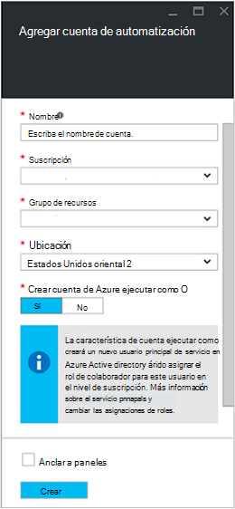
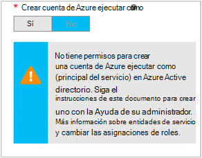

<properties
   pageTitle="Configurar la cuenta de usuario de Azure AD | Microsoft Azure"
   description="En este artículo se describe cómo configurar credenciales de cuenta de usuario de Azure AD para runbooks en Azure automatización para autenticarse en el BRAZO y ASM."
   services="automation"
   documentationCenter=""
   authors="MGoedtel"
   manager="jwhit"
   editor="tysonn"
   keywords="Azure, azure servicio Administración, azure ad usuario cuenta de active directory" />
<tags
   ms.service="automation"
   ms.devlang="na"
   ms.topic="get-started-article"
   ms.tgt_pltfrm="na"
   ms.workload="infrastructure-services"
   ms.date="09/12/2016"
   ms.author="magoedte" />

# Autenticar Runbooks con el Administrador de recursos y de administración del servicio de Azure

En este artículo se describe los pasos que debe realizar para configurar una cuenta de usuario de Azure AD para runbooks automatización de Azure ejecuta frente a recursos de administración de servicio de Azure (ASM) o el Administrador de recursos de Azure (ARM).  Aunque esto sigue siendo que una identidad de autenticación compatibles para el BRAZO según runbooks, el método recomendado es con la nueva cuenta de Azure ejecutar como.       

## Crear un nuevo usuario de Azure Active Directory

1. Inicie sesión en el Portal de clásico de Azure como administrador de servicio de la suscripción de Azure que desee administrar.
2. Seleccione **Active Directory**y, a continuación, seleccione el nombre del directorio de su organización.
3. Seleccione la ficha **usuarios** y, a continuación, en el área de comando, seleccione **Agregar usuario**.
4. En la página **Díganos sobre este usuario** , en **tipo de usuario**, seleccione **nuevo usuario de su organización**.
5. Escriba un nombre de usuario.  
6. Seleccione el nombre del directorio que esté asociado a su suscripción de Azure en la página de Active Directory.
7. En la página de **perfil de usuario** , proporcione un primer y último nombre, un nombre descriptivo y usuario de la lista de **funciones** .  Hacer no **Habilitar la autenticación multifactor**.
8. Observe el nombre completo del usuario y la contraseña temporal.
9. Seleccione **Configuración > administradores > Agregar**.
10. Escriba el nombre de usuario completo del usuario que ha creado.
11. Seleccione la suscripción que desea que el usuario para administrar.
12. Cerrar la sesión de Azure y, a continuación, inicie sesión con la cuenta que acaba de crear. Se le pedirá para cambiar la contraseña del usuario.

## Crear una cuenta de automatización en Portal clásico de Azure
En esta sección, realizará los siguientes pasos para crear una nueva cuenta de automatización de Azure en el Portal de Azure que se usarán con sus runbooks administración de recursos en modo de ASM y ARM.  

>[AZURE.NOTE] Clásico de Azure y Azure Portal tanto cualquiera pueden administrar cuentas de automatización creadas con el Portal de clásico de Azure conjunto de cmdlets. Una vez creada la cuenta, no supone ninguna diferencia cómo crear y administrar los recursos dentro de la cuenta. Si va a seguir usando el Portal de Azure clásica, a continuación, se debe usa en lugar de en el Portal de Azure para crear las cuentas de automatización.

1. Inicie sesión en el Portal de Azure clásico como administrador de servicio de la suscripción de Azure que desee administrar.
2. Seleccione **automatización**.
3. En la página de **automatización** , seleccione **crear una cuenta de automatización**.
4. En el cuadro **crear una cuenta de automatización** , escriba un nombre para la nueva cuenta de automatización y seleccione una **región** de la lista desplegable.  
5. Haga clic en **Aceptar** para aceptar la configuración y crear la cuenta.
6. Después de crearlo, aparecerá en la página de **automatización** .
7. Haga clic en la cuenta y le llevará a la página de panel.  
8. En la página panel de automatización, seleccione **activos**.
9. En la página de **activos** , seleccione **Agregar configuración** se encuentra en la parte inferior de la página.
10. En la página **Agregar configuración** , seleccione **Agregar credenciales**.
11. En la página **Definir credenciales** , seleccione **Credenciales de Windows PowerShell** desde la lista desplegable **Tipo de credenciales** y proporcione un nombre para la credencial.
12. En el siguiente tipo de página de **Definir credenciales** en el nombre de usuario de la cuenta de usuario de AD creó anteriormente en el campo **Nombre de usuario** y la contraseña en los campos **contraseña** y **Confirmar contraseña** . Haga clic en **Aceptar** para guardar los cambios.

## Crear una cuenta de automatización en el Portal de Azure

En esta sección, realizará los siguientes pasos para crear una nueva cuenta de automatización de Azure en el Portal de Azure que se utilizará con los recursos de administración de runbooks en modo ARM.  

1. Inicie sesión en el portal de Azure como administrador de servicio de la suscripción de Azure que desee administrar.
2. Seleccione **cuentas de automatización**.
3. En el módulo de automatización cuentas, haga clic en **Agregar**. 
2. En el módulo de **Agregar una cuenta de automatización** , en el cuadro **nombre** , escriba un nombre para la nueva cuenta de automatización.
5. Si tiene más de una suscripción, especifique uno a la cuenta nueva, así como un **grupo de recursos** de nuevo o existente y un centro de datos de Azure **ubicación**.
3. Seleccione el valor **No** para la opción de **crear Azure ejecutar como cuenta** y haga clic en el botón **crear** .  

    >[AZURE.NOTE] Si decide no crear la cuenta ejecutar como seleccionando la opción **No**, aparecerá un mensaje de advertencia en el módulo de **Agregar una cuenta de automatización** .  Mientras que la cuenta se creado y asignada el rol de **Colaborador** en la suscripción, no tendrá una identidad de autenticación correspondiente dentro de un servicio de directorio de suscripciones y por tanto, sin acceso a los recursos en la suscripción.  Esto evitará cualquier runbooks que hacen referencia a esta cuenta se puede autenticar y realizar tareas con recursos ARM.

    

4. Mientras Azure crea la cuenta de automatización, puede realizar un seguimiento del progreso en **notificaciones** en el menú.

Cuando haya finalizado la creación de la credencial, necesitará crear un activo de credenciales para asociar la cuenta con la automatización con la cuenta de usuario de AD que creó anteriormente.  Recuerde que hemos creado solo la cuenta de automatización y no está asociada a una identidad de autenticación.  Realice los pasos indicados en los [activos de credenciales en el artículo de automatización de Azure](../automation/automation-credentials.md#creating-a-new-credential) y escriba el valor de **nombre de usuario** en el formato **dominio\usuario**.

## Usar la credencial en un runbook

Puede recuperar la credencial en un runbook mediante la actividad de [Get-AutomationPSCredential](http://msdn.microsoft.com/library/dn940015.aspx) y usarlo con [Agregar AzureAccount](http://msdn.microsoft.com/library/azure/dn722528.aspx) para conectarse a su suscripción de Azure. Si la credencial es un administrador de varias suscripciones de Azure, también debe usar [AzureSubscription seleccione](http://msdn.microsoft.com/library/dn495203.aspx) para especificar el correcto. Esto se muestra en el ejemplo de Windows PowerShell siguiente que normalmente aparecerá en la parte superior de la mayoría runbooks automatización de Azure.

    $cred = Get-AutomationPSCredential –Name "myuseraccount.onmicrosoft.com"
    Add-AzureAccount –Credential $cred
    Select-AzureSubscription –SubscriptionName "My Subscription"

Debe repetir estas líneas después de los [puntos de comprobación](http://technet.microsoft.com/library/dn469257.aspx#bk_Checkpoints) en su runbook. Si runbook se suspende y después se reanude en otro trabajador, será necesario llevar a cabo la autenticación de nuevo.

## Pasos siguientes
* Revisar los tipos de runbook diferente y los pasos para crear su propio runbooks desde el siguiente artículo [automatización de Azure runbook tipos](../automation/automation-runbook-types.md)
