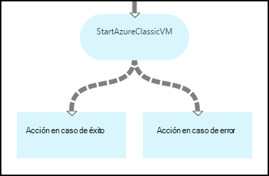
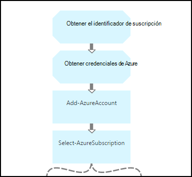
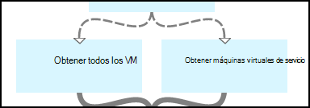
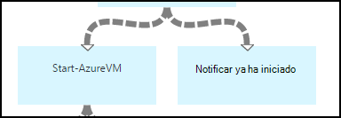
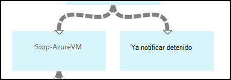
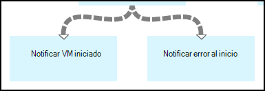
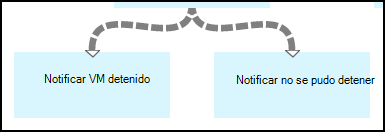

<properties 
    pageTitle="Iniciar y detener máquinas virtuales - gráfico | Microsoft Azure"
    description="Versión del flujo de trabajo de PowerShell de escenario de automatización de Azure incluidos runbooks para iniciar y detener máquinas virtuales de Windows clásico."
    services="automation"
    documentationCenter=""
    authors="mgoedtel"
    manager="jwhit"
    editor="tysonn" />
<tags 
    ms.service="automation"
    ms.devlang="na"
    ms.topic="article"
    ms.tgt_pltfrm="na"
    ms.workload="infrastructure-services"
    ms.date="07/06/2016"
    ms.author="bwren" />

# Escenario de automatización Azure - iniciar y detener máquinas virtuales de Windows

En este escenario de automatización de Azure incluye runbooks para iniciar y detener máquinas virtuales de Windows clásico.  Puede usar este escenario por cualquiera de las siguientes acciones:  

- Use la runbooks sin modificaciones en su entorno. 
- Modificar la runbooks para llevar a cabo la funcionalidad personalizada.  
- Llamar a la runbooks desde otro runbook como parte de una solución general. 
- Use la runbooks como tutoriales para aprender a runbook conceptos de creación. 

> [AZURE.SELECTOR]
- [Gráfica](automation-solution-startstopvm-graphical.md)
- [Flujo de trabajo de PowerShell](automation-solution-startstopvm-psworkflow.md)

Esta es la versión gráfica runbook de este escenario. También está disponible con [el flujo de trabajo de PowerShell runbooks](automation-solution-startstopvm-psworkflow.md).

## Obtener el escenario

Este escenario consta de dos dos runbooks gráficas que puede descargarse desde los siguientes vínculos.  Ver la [versión del flujo de trabajo de PowerShell](automation-solution-startstopvm-psworkflow.md) de este escenario para vínculos a runbooks de flujo de trabajo de PowerShell.

| Runbook | Vínculo | Tipo | Descripción |
|:---|:---|:---|:---|
| StartAzureClassicVM | [Iniciar Runbook gráfica de Azure VM clásica](https://gallery.technet.microsoft.com/scriptcenter/Start-Azure-Classic-VM-c6067b3d) | Gráfica | Todos los equipos virtuales clásicos se inicia en una suscripción de Azure o todos los equipos virtuales con un nombre de servicio en particular. |
| StopAzureClassicVM | [Detener Runbook gráfica de Azure VM clásica](https://gallery.technet.microsoft.com/scriptcenter/Stop-Azure-Classic-VM-397819bd) | Gráfica | Detiene todos los equipos virtuales en una cuenta de automatización o todos los equipos virtuales con un nombre de servicio en particular.  |

## Instalar y configurar el escenario

### 1. Instale el runbooks

Después de descargar el runbooks, puede importarlos usando el procedimiento de [procedimientos runbook gráfica](automation-graphical-authoring-intro.md#graphical-runbook-procedures).

### 2. Revise los requisitos y descripción
La runbooks incluyen una actividad denominada **Léame** que se incluye una descripción y activos necesarios.  Puede ver esta información, seleccione la actividad **Léame** y, a continuación, en el parámetro de **Secuencia de comandos de flujo de trabajo** .  También puede obtener la misma información de este artículo. 

### 3. configurar activos
La runbooks requieren los siguientes activos que debe crear y rellenar con los valores apropiados.  Los nombres están predeterminado.  Puede utilizar activos con nombres diferentes si especifica los nombres de los [parámetros de entrada](#using-the-runbooks) al iniciar runbook.

| Tipo de activos | Nombre predeterminado | Descripción |
|:---|:---|:---|:---|
| [Credenciales](automation-credentials.md) | AzureCredential | Contiene las credenciales para una cuenta que tenga autoridad para iniciar y detener máquinas virtuales de la suscripción de Azure.  |
| [Variable](automation-variables.md) | AzureSubscriptionId | Contiene el identificador de la suscripción de su suscripción de Azure. |

## Usar el escenario

### Parámetros

La runbooks tiene los siguientes [parámetros de entrada](automation-starting-a-runbook.md#runbook-parameters).  Debe proporcionar los valores para los parámetros obligatorios y puede proporcionar valores para otros parámetros según sus necesidades.

| Parámetro | Tipo | Obligatorio | Descripción |
|:---|:---|:---|:---|
| ServiceName | cadena | No | Si se proporciona un valor, se inician todos los equipos virtuales con ese nombre de servicio o se detiene.  Si no se proporciona ningún valor, se inician todos los equipos virtuales clásicos en la suscripción de Azure o se detiene. |
| AzureSubscriptionIdAssetName | cadena | No | Contiene el nombre de la [variable activo](#installing-and-configuring-the-scenario) que contiene el identificador de la suscripción de su suscripción de Azure.  Si no especifica un valor, se utiliza *AzureSubscriptionId* .  |
| AzureCredentialAssetName | cadena | No | Contiene el nombre del [activo de credenciales](#installing-and-configuring-the-scenario) que contiene las credenciales de runbook usar.  Si no especifica un valor, se utiliza *AzureCredential* .  |

### Iniciar la runbooks

Puede utilizar cualquiera de los métodos en el [Inicio de un runbook de automatización de Azure](automation-starting-a-runbook.md) para iniciar uno de los runbooks en este artículo.

Los comandos de ejemplo siguiente utiliza Windows PowerShell para ejecutar **StartAzureClassicVM** para iniciar todas las máquinas virtuales con el nombre del servicio *MyVMService*.

    $params = @{"ServiceName"="MyVMService"}
    Start-AzureAutomationRunbook –AutomationAccountName "MyAutomationAccount" –Name "StartAzureClassicVM" –Parameters $params

### Salida

La runbooks mostrará [un mensaje de salida](automation-runbook-output-and-messages.md) para cada máquina virtual que indica si no se envió correctamente la instrucción de iniciar o detener.  Puede buscar una cadena específica en el resultado para determinar el resultado para cada runbook.  Las cadenas de resultados posibles se muestran en la tabla siguiente.

| Runbook | Condición | Mensaje |
|:---|:---|:---|
| StartAzureClassicVM | Máquina virtual ya se está ejecutando  | MyVM ya se está ejecutando |
| StartAzureClassicVM | Solicitud de inicio de máquina virtual enviado correctamente | Se ha iniciado MyVM |
| StartAzureClassicVM | Error de solicitud de inicio de máquina virtual  | No se pudo iniciar MyVM |
| StopAzureClassicVM | Máquina virtual ya se está ejecutando  | MyVM ya se ha detenido |
| StopAzureClassicVM | Solicitud de inicio de máquina virtual enviado correctamente | Se ha iniciado MyVM |
| StopAzureClassicVM | Error de solicitud de inicio de máquina virtual  | No se pudo iniciar MyVM |

Siguiente es una imagen de uso de la **StartAzureClassicVM** como un [runbook secundarios](automation-child-runbooks.md) en un runbook de gráficos de muestra.  Los vínculos condicional se utiliza en la tabla siguiente.

| Vínculo | Criterios |
|:---|:---|
| Vínculo de éxito | $ActivityOutput ['StartAzureClassicVM']-como "\* se ha iniciado"    |
| Vínculo de error   | $ActivityOutput ['StartAzureClassicVM']-notlike "\* se ha iniciado" |

## Desglose detallado

A continuación se muestra un desglose detallado de la runbooks en este escenario.  Puede usar esta información para personalizar el runbooks o solamente para aprender de ellas para crear sus propios escenarios de automatización.
 

### Autenticación

Runbook comienza con actividades para establecer las [credenciales](automation-configuring.md#configuring-authentication-to-azure-resources) y la suscripción de Azure que se utilizará para el resto del runbook.

Las dos primeras actividades, **Obtener credenciales de Azure**y **Obtener el identificador de suscripción** recuperan los [activos](#installing-the-runbook) que se usan las dos actividades.  Las actividades podrían especificar directamente los activos, pero que necesitan los nombres de los activos.  Puesto que estamos lo que permite al usuario que especifique los nombres de los [parámetros de entrada](#using-the-runbooks), debemos estas actividades para recuperar los activos con un nombre especificado por un parámetro de entrada.

**Agregar AzureAccount** establece las credenciales que se utilizará para el resto del runbook.  Los activos de credenciales que recupera de **Obtener credenciales de Azure** deben tener acceso a iniciar y detener máquinas virtuales de la suscripción de Azure.  **Seleccione AzureSubscription** que usa el identificador de **Obtener el identificador de suscripción**de la suscripción está seleccionada la suscripción que se utiliza.

### Obtener máquinas virtuales de Windows

Runbook debe determinar qué máquinas virtuales de Windows va a trabajar y si ya está iniciados o detenidos (función runbook).   Una de las dos actividades recuperará las máquinas virtuales.  **Obtener máquinas virtuales de servicio** se ejecutará si el parámetro de entrada *ServiceName* para runbook contiene un valor.  **Obtener todos los VM** se ejecutará si el parámetro de entrada *ServiceName* para runbook no contiene un valor.  Los vínculos condicional antes de cada actividad realiza esta lógica.

Ambas actividades use el cmdlet **Get-AzureVM** .  **Obtener todos los VM** utiliza el parámetro de **ListAllVMs** establecido para devolver todos los equipos virtuales.  **Obtener las máquinas virtuales en el servicio** utiliza el conjunto de parámetros **GetVMByServiceAndVMName** y proporciona el parámetro de entrada **ServiceName** para el parámetro **ServiceName** .  

### Combinar VM

Se requiere para proporcionar la entrada al **Inicio AzureVM** que necesita el nombre y el nombre de servicio de la vm(s) para iniciar la actividad de **Máquinas virtuales de combinar** .  Esos datos pueden proceder de **Obtener todas máquinas virtuales** u **Obtener máquinas virtuales de servicio**, pero **AzureVM inicio** sólo puede especificar una actividad de su entrada.   

El escenario es crear **Máquinas virtuales de combinar** que se ejecute el cmdlet de **Salida de escritura** .  El parámetro **InputObject** para ese cmdlet es una expresión de PowerShell que combina la entrada de las actividades de dos anterior.  Solo uno de esos actividades ejecutarán solo se espera un conjunto de resultados.  **Inicio AzureVM** puede utilizar que los resultados de sus parámetros de entrada. 

### Iniciar o detener máquinas virtuales de Windows

 

Según el runbook las siguientes actividades intentan iniciar o detener runbook con **AzureVM iniciar** o **Detener AzureVM**.  Puesto que la actividad es precedida por un vínculo de canalización, se ejecutará una vez para cada objeto devuelto por **Máquinas virtuales de combinar**.  El vínculo es condicional para que solo se ejecutará la actividad si la *RunningState* de la máquina virtual está *detenido* para **AzureVM de inicio** y *Introducción* para **Detener AzureVM**. Si no se cumple esta condición, se ejecuta **Notificar ya ha iniciado** o **Ya notificar detenido** para enviar un mensaje con el **Resultado de escritura**.

### Enviar los resultados

 

El paso final en runbook es Enviar resultado si se envió correctamente la solicitud de iniciar o detener para cada máquina virtual. Hay un independiente actividad de **Salida de escritura** para cada uno, y determinar cuál se ejecuten con vínculos condicional.  **Notificar VM iniciado** o **Notificar detenido VM** se ejecuta si *OperationStatus* es *correcta*.  Si *OperationStatus* es cualquier otro valor, se ejecuta **Notificar error al iniciar** o **Notificar no se pudo detener** .

## Pasos siguientes

- [Edición gráfica de automatización de Azure](automation-graphical-authoring-intro.md)
- [Runbooks secundarios en automatización de Azure](automation-child-runbooks.md) 
- [Salida runbook y mensajes de automatización de Azure](automation-runbook-output-and-messages.md)