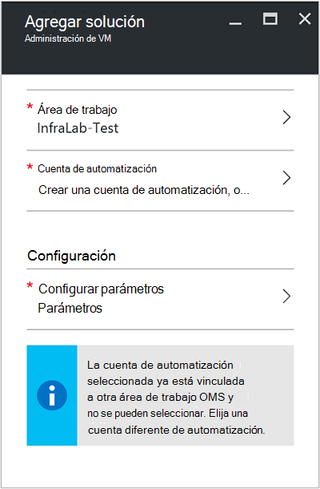
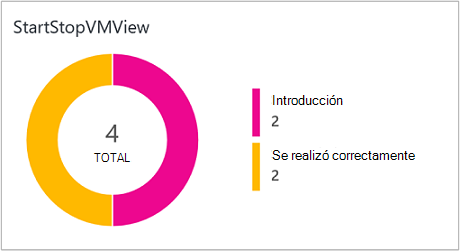
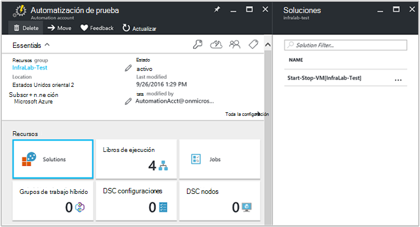
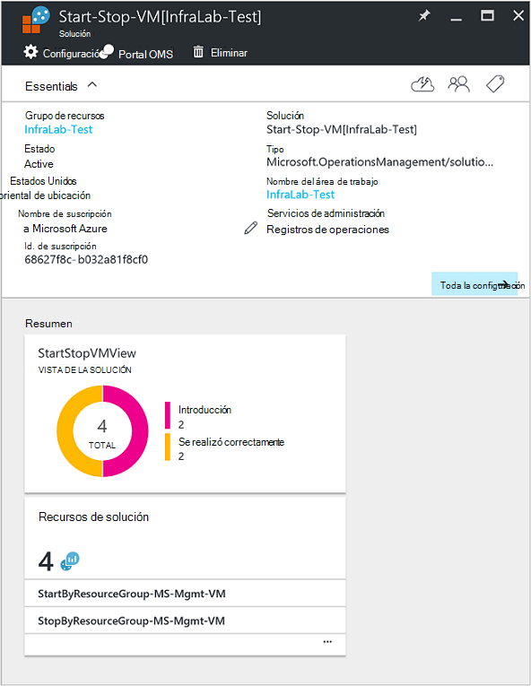

<properties
    pageTitle="Máquinas virtuales de inicio o parada durante la solución de laborables (Preview) | Microsoft Azure"
    description="Las soluciones de administración de VM se inicia y se detiene su máquinas virtuales de administrador de recursos de Azure en una programación y supervisar de manera proactiva de análisis de registro."
    services="automation"
    documentationCenter=""
    authors="MGoedtel"
    manager="jwhit"
    editor=""
    />
<tags
    ms.service="automation"
    ms.workload="tbd"
    ms.tgt_pltfrm="na"
    ms.devlang="na"
    ms.topic="get-started-article"
    ms.date="10/07/2016"
    ms.author="magoedte"/>

# Máquinas virtuales de inicio o parada durante la solución de laborables (Preview) en la automatización

Las máquinas virtuales de inicio o parada durante la solución de laborables (Preview) se inicia y se detiene su máquinas virtuales de administrador de recursos de Azure en una programación definida por el usuario y proporciona información sobre el éxito de los trabajos de automatización que iniciar y detener las máquinas virtuales con el análisis del registro de OMS.  

## Requisitos previos

- La runbooks trabaje con una [cuenta de Azure ejecutar como](automation-sec-configure-azure-runas-account.md).  La cuenta ejecutar como es el método de autenticación preferido, ya que utiliza la autenticación de certificado en lugar de una contraseña que expire o cambian a menudo.  

- Esta solución sólo puede administrar máquinas virtuales que se encuentran en la misma suscripción y el grupo de recursos donde reside la cuenta de automatización.  

- Esta solución sólo se implementa en las siguientes regiones Azure - sureste de Australia, Estados Unidos oriental, sudeste asiático y Europa occidental.  Máquinas virtuales en cualquier región pueden destinar el runbooks que administrar la programación de la máquina virtual.  

- Para enviar notificaciones de correo electrónico cuando se complete la runbooks VM de inicio y detención, se requiere una suscripción de clase empresarial de Office 365.  

## Componentes de la solución

Esta solución consta de los siguientes recursos que se importará y se agrega a su cuenta de automatización.

### Runbooks

Runbook | Descripción|
--------|------------|
CleanSolution MS administración VM | Este runbook quitará todos los contenidos recursos y programaciones cuando va a eliminar la solución de la suscripción.|  
Administración de MS SendMailO365 | Este runbook envía un correo electrónico a través de Exchange de Office 365.|
StartByResourceGroup MS administración VM | Este runbook está pensado para iniciar máquinas virtuales (ambos clásico y en máquinas virtuales ARM) que reside en una lista de grupos de recursos de Azure.
StopByResourceGroup MS administración VM | Este runbook pretende detener máquinas virtuales (ambos clásico y en máquinas virtuales ARM) que reside en una lista de grupos de recursos de Azure.|
 

### Variables

Variable | Descripción|
---------|------------|
**Administración de MS SendMailO365** Runbook ||
SendMailO365 IsSendEmail MS administración | Especifica si StartByResourceGroup MS administración VM y StopByResourceGroup MS administración VM runbooks puede enviar notificación de correo electrónico al finalizar.  Seleccione **True** para habilitar y **False** para deshabilitar las alertas de correo electrónico. Valor predeterminado es **False**.| 
**StartByResourceGroup MS administración VM** Runbook ||
StartByResourceGroup ExcluirLista MS administración VM | Escriba los nombres de máquina virtual para excluir de la operación de administración. separar nombres mediante semi-colon(;). Valores distinguen mayúsculas de minúsculas y caracteres comodín (asterisco) es compatible.|
StartByResourceGroup SendMailO365 EmailBodyPreFix MS Admin | Texto que se puede anexar al principio del cuerpo del mensaje de correo electrónico.|
StartByResourceGroup SendMailO365 EmailRunBookAccount MS Admin | Especifica el nombre de la cuenta de automatización que contiene runbook de correo electrónico.  **No modifique esta variable.**|
StartByResourceGroup SendMailO365 EmailRunbookName MS Admin | Especifica el nombre del runbook de correo electrónico.  Se usa el StartByResourceGroup MS administración VM y StopByResourceGroup MS administración VM runbooks enviar correo electrónico.  **No modifique esta variable.**|
StartByResourceGroup SendMailO365 EmailRunbookResourceGroup MS Admin | Especifica el nombre del grupo de recursos que contiene el runbook de correo electrónico.  **No modifique esta variable.**|
StartByResourceGroup SendMailO365 EmailSubject MS Admin | Especifica el texto de la línea de asunto del correo electrónico.|  
StartByResourceGroup SendMailO365 EmailToAddress MS Admin | Especifica los destinatarios del correo electrónico.  Introducir nombres independientes usando semi-colon(;).|
StartByResourceGroup TargetResourceGroups MS administración VM | Escriba los nombres de máquina virtual para excluir de la operación de administración. separar nombres mediante semi-colon(;). Valores distinguen mayúsculas de minúsculas y caracteres comodín (asterisco) es compatible.  Valor predeterminado (asterisco) incluye todos los grupos de recursos en la suscripción.|
StartByResourceGroup TargetSubscriptionID MS administración VM | Especifica la suscripción que contiene máquinas virtuales que se administra mediante esta solución.  Debe ser la misma suscripción donde reside la cuenta de automatización de esta solución.|
**StopByResourceGroup MS administración VM** Runbook ||
StopByResourceGroup ExcluirLista MS administración VM | Escriba los nombres de máquina virtual para excluir de la operación de administración. separar nombres mediante semi-colon(;). Valores distinguen mayúsculas de minúsculas y caracteres comodín (asterisco) es compatible.|
StopByResourceGroup SendMailO365 EmailBodyPreFix MS Admin | Texto que se puede anexar al principio del cuerpo del mensaje de correo electrónico.|
StopByResourceGroup SendMailO365 EmailRunBookAccount MS Admin | Especifica el nombre de la cuenta de automatización que contiene runbook de correo electrónico.  **No modifique esta variable.**|
StopByResourceGroup SendMailO365 EmailRunbookResourceGroup MS Admin | Especifica el nombre del grupo de recursos que contiene el runbook de correo electrónico.  **No modifique esta variable.**|
StopByResourceGroup SendMailO365 EmailSubject MS Admin | Especifica el texto de la línea de asunto del correo electrónico.|  
StopByResourceGroup SendMailO365 EmailToAddress MS Admin | Especifica los destinatarios del correo electrónico.  Introducir nombres independientes usando semi-colon(;).|
StopByResourceGroup TargetResourceGroups MS administración VM | Escriba los nombres de máquina virtual para excluir de la operación de administración. separar nombres mediante semi-colon(;). Valores distinguen mayúsculas de minúsculas y caracteres comodín (asterisco) es compatible.  Valor predeterminado (asterisco) incluye todos los grupos de recursos en la suscripción.|
StopByResourceGroup TargetSubscriptionID MS administración VM | Especifica la suscripción que contiene máquinas virtuales que se administra mediante esta solución.  Debe ser la misma suscripción donde reside la cuenta de automatización de esta solución.|  
 

### Programaciones

Programación | Descripción|
---------|------------|
StartByResourceGroup programación MS administración | Programación de runbook StartByResourceGroup, que realiza el inicio de máquinas virtuales administradas por esta solución.|
StopByResourceGroup programación MS administración | Programación de runbook StopByResourceGroup, que se realiza el cierre de máquinas virtuales administradas por esta solución.|

### Credenciales

Credenciales | Descripción|
-----------|------------|
O365Credential | Especifica una cuenta de usuario de Office 365 válida para enviar correo electrónico.  Solo se requiere si variable de SendMailO365 IsSendEmail-MS administración está establecida en **True**.

## Configuración

Siga estos pasos para agregar las máquinas virtuales de inicio o parada durante la solución de laborables (Preview) a su cuenta de automatización y, a continuación, configure las variables para personalizar la solución.

1. En la pantalla de inicio en el portal de Azure, seleccione el icono de **catálogo de soluciones** .  Si el mosaico ya no está anclado a la pantalla de inicio, en el panel de navegación izquierdo, seleccione **nuevo**.  
2. En el módulo de Marketplace, escriba **VM inicio** en el cuadro de búsqueda y, a continuación, seleccione la solución **Máquinas virtuales de inicio o parada horario (Preview)** de los resultados de búsqueda.  
3. En el módulo de **Máquinas virtuales de inicio o parada horario (Preview)** para la solución seleccionada, revise la información de resumen y, a continuación, haga clic en **crear**.  
4. El módulo de **Agregar solución** aparece donde se le pide que configurar la solución antes de poder importar en su suscripción de automatización.     
5.  En el módulo de **Agregar solución** , seleccione **área de trabajo** y aquí selecciona un área de trabajo OMS que se vincula a la misma suscripción Azure que se encuentra la cuenta de automatización o crea un área de trabajo OMS.  Si no tiene un área de trabajo OMS, puede seleccionar **Crear nueva área de trabajo** y en el módulo de **Área de trabajo de OMS** haga lo siguiente: 
   - Especifique un nombre para la nueva **Área de trabajo de OMS**.
   - Seleccione una **suscripción** para vincular a, seleccione de la lista desplegable si seleccionada la opción predeterminada no es adecuada.
   - Para el **Grupo de recursos**, puede crear un nuevo grupo de recursos o seleccione un grupo de recursos existente.  
   - Seleccione una **ubicación**.  Actualmente las ubicaciones sola previstas selección son **Sureste de Australia**, **Estados Unidos oriental**, **Sudeste asiático**y **Europa occidental**.
   - Seleccione un **nivel de precios**.  La solución se ofrece en dos niveles: libre y OMS pagado nivel.  El nivel gratuito tiene un límite de la cantidad de datos recopilados diariamente, período de retención y minutos de tiempo de ejecución de trabajo runbook.  El nivel OMS pagado no tiene un límite de la cantidad de datos recopilados diariamente.  

        > [AZURE.NOTE]
        > Mientras el independiente pagado nivel se muestra como una opción, no es aplicable.  Si seleccionarlo y continuar con la creación de esta solución en la suscripción, se producirá un error.  Se enviará cuando se ha publicado oficialmente esta solución. Si utiliza esta solución, solo se usan minutos de trabajo de automatización e iniciar recopilación.  La solución no agrega nodos OMS adicionales a su entorno.  

6. Después de proporcionar la información necesaria en el **área de trabajo OMS** el módulo, haga clic en **crear**.  Mientras se comprueba la información y se crea el área de trabajo, puede realizar un seguimiento de su progreso en **notificaciones** en el menú.  Volverá a módulo de **Agregar solución** .  
7. En el módulo de **Agregar solución** , seleccione la **Cuenta de automatización**.  Si va a crear un área de trabajo OMS, se debe crear también una nueva cuenta de automatización que se asociará con el nuevo OMS área de trabajo especificada anteriormente, incluida su suscripción de Azure, grupo de recursos y de región.  Puede seleccionar **crear una cuenta de automatización** y en el módulo de **automatización agregar cuenta** , escriba la información siguiente: 
  - En el campo **nombre** , escriba el nombre de la cuenta de automatización.

    Todas las demás opciones se rellenan automáticamente según el área de trabajo OMS seleccionada y no se puede modificar estas opciones.  Una cuenta de Azure ejecutar como es el método de autenticación predeterminado para la runbooks incluidos en esta solución.  Una vez que haga clic en **Aceptar**, las opciones de configuración se validarán y se crea la cuenta de automatización.  Para realizar un seguimiento de su progreso en **notificaciones** en el menú. 

    En caso contrario, puede seleccionar una cuenta existente de automatización ejecutar como.  Se presentará la nota que la cuenta que seleccione no ya puede vincularse a otra área de trabajo OMS, en caso contrario, un mensaje en el módulo para informarle.  Si ya está vinculada, deberá seleccionar una cuenta diferente de automatización ejecutar como o crear uno nuevo.    

8. Por último en el módulo de **Agregar solución** , seleccione **configuración** y se muestra el módulo de **parámetros** .  En el módulo de **parámetros** , se le pide que:  
   - Especifique los **Nombres de ResourceGroup de destino**, que es un nombre de grupo de recursos que contiene máquinas virtuales que se administra mediante esta solución.  Puede especificar más de un nombre y separe cada con un punto y coma (valores distinguen mayúsculas de minúsculas).  Un carácter comodín se puede usar si desea máquinas virtuales de destino en todos los grupos de recursos de la suscripción.
   - Seleccione una **programación** que es una fecha y hora para iniciar y detener la máquina virtual en los grupos de recursos de destino periódica.  

10. Una vez haya completado la configuración inicial necesarios para la solución, seleccione **crear**.  Se valida toda la configuración y, a continuación, intentará implementar la solución en la suscripción.  Este proceso puede tardar algunos segundos en completarse y puede realizar un seguimiento de su progreso en **notificaciones** en el menú. 

## Frecuencia de la colección

Datos de flujo de trabajo y registro del trabajo automatización se ingestión en el repositorio OMS cada cinco minutos.  

## Con la solución

Al agregar la solución de administración de VM, en el área de trabajo OMS la **Vista StartStopVM** mosaico se agrega al panel del OMS.  Este mosaico muestra un recuento y una representación gráfica de los trabajos de runbooks para la solución que se han iniciado y se han completado correctamente.     

En su cuenta de automatización, puede obtener acceso y administrar la solución seleccionando el icono de **soluciones** y, a continuación, en el módulo de **soluciones** , seleccionando la solución **VM de punto de inicio [Workspace]** en la lista.     

Seleccionar la solución mostrará el módulo de solución **VM de punto de inicio [Workspace]** , donde puede revisar detalles importantes como el mosaico **StartStopVM** , como en el área de trabajo OMS, que muestra un recuento y una representación gráfica de los trabajos de runbooks para la solución que se han iniciado y se han completado correctamente.     

Desde aquí también puede abrir el área de trabajo OMS y realizar más análisis de los registros de trabajo.  Simplemente haga clic en **toda la configuración**y en el módulo de **configuración** , seleccione **Inicio rápido** y, a continuación, en el módulo de **Inicio rápido** , seleccione **Portal de OMS**.   Se abrirá una nueva pestaña o una nueva sesión de explorador y presentar el área de trabajo OMS asociada a su cuenta de automatización y la suscripción.  

### Configurar notificaciones de correo electrónico

Para habilitar las notificaciones de correo electrónico cuando la runbooks inicio y detención VM completa, que debe modificar la **O365Credential** de credenciales y, como mínimo, las variables siguientes:

 - SendMailO365 IsSendEmail MS administración
 - StartByResourceGroup SendMailO365 EmailToAddress MS Admin
 - StopByResourceGroup SendMailO365 EmailToAddress MS Admin

Para configurar la credencial **O365Credential** , realice los pasos siguientes:

1. Desde su cuenta de automatización, haga clic en **Todas las opciones** en la parte superior de la ventana. 
2. En el módulo de **configuración** en la sección **Recursos de automatización**, seleccione **activos**. 
3. En el módulo de **activos** , seleccione el mosaico de **credenciales** y en el módulo de **credenciales** , seleccione la **O365Credential**.  
4. Escriba un nombre de usuario de Office 365 válido y una contraseña y, a continuación, haga clic en **Guardar** para guardar los cambios.  

Para configurar las variables de resaltado de una versión anterior, realice los pasos siguientes:

1. Desde su cuenta de automatización, haga clic en **Todas las opciones** en la parte superior de la ventana. 
2. En el módulo de **configuración** en la sección **Recursos de automatización**, seleccione **activos**. 
3. En el módulo de **activos** , seleccione el mosaico de **Variables** y en el módulo de **Variables** , seleccione la variable enumerada anteriormente y a continuación, modifique el siguiente valor la descripción para el mismo especificada en la sección [variable](##variables) anteriormente.  
4. Haga clic en **Guardar** para guardar los cambios a la variable.   

### Modificar la programación de inicio y cierre

Administrar la programación de inicio y cierre en esta solución sigue los mismos pasos que se describen en la [programación de un runbook de automatización de Azure](automation-scheduling-a-runbook.md).  Recuerde que no se puede modificar la configuración de programación.  Debe deshabilitar la programación existente y, a continuación, crear una nueva y, a continuación, vincular al **StartByResourceGroup MS administración VM** o runbook **StopByResourceGroup MS administración VM** que desee aplicar a la programación.   

## Análisis de registros

Automatización crea dos tipos de registros en el repositorio OMS.

### Registros de trabajo

(Propiedad) | Descripción|
----------|----------|
Autor de la llamada |  ¿Quién inició la operación.  Los valores posibles son una dirección de correo electrónico o el sistema para tareas programadas.|
Categoría | Clasificación del tipo de datos.  Automatización, el valor es JobLogs.|
CorrelationId | GUID que es el identificador de correlación del trabajo runbook.|
Id. | GUID que es el identificador del trabajo runbook.|
operationName | Especifica el tipo de operación realizada en Azure.  Automatización, el valor será el trabajo.|
resourceId | Especifica el tipo de recurso en Azure.  Automatización, el valor es la cuenta de automatización asociada runbook.|
ResourceGroup | Especifica el nombre del grupo de recursos de la tarea runbook.|
ResourceProvider | Especifica el servicio de Azure que proporciona los recursos que puede implementar y administrar.  Automatización, el valor es la automatización de Azure.|
Tipo de recurso | Especifica el tipo de recurso en Azure.  Automatización, el valor es la cuenta de automatización asociada runbook.|
resultType | El estado del trabajo runbook.  Los valores posibles son: -Introducción -Detenido -Suspendido -Error -Correctamente|
resultDescription | Describe el estado de resultado de trabajo runbook.  Los valores posibles son: -Se inicia trabajo : Error del trabajo -Trabajo completado|
RunbookName | Especifica el nombre del runbook.|
SourceSystem | Especifica el sistema de origen para los datos enviados.  Automatización, el valor será: OpsManager|
StreamType | Especifica el tipo de evento. Los valores posibles son: -Detallado -Resultado : Error -Advertencia|
SubscriptionId | Especifica el identificador de suscripción de la tarea.
Hora | Fecha y hora cuando se ejecuta el trabajo runbook.|

### Flujos de trabajo

(Propiedad) | Descripción|
----------|----------|
Autor de la llamada |  ¿Quién inició la operación.  Los valores posibles son una dirección de correo electrónico o el sistema para tareas programadas.|
Categoría | Clasificación del tipo de datos.  Automatización, el valor es JobStreams.|
Id. | GUID que es el identificador del trabajo runbook.|
operationName | Especifica el tipo de operación realizada en Azure.  Automatización, el valor será el trabajo.|
ResourceGroup | Especifica el nombre del grupo de recursos de la tarea runbook.|
resourceId | Especifica el identificador del recurso en Azure.  Automatización, el valor es la cuenta de automatización asociada runbook.|
ResourceProvider | Especifica el servicio de Azure que proporciona los recursos que puede implementar y administrar.  Automatización, el valor es la automatización de Azure.|
Tipo de recurso | Especifica el tipo de recurso en Azure.  Automatización, el valor es la cuenta de automatización asociada runbook.|
resultType | El resultado de la tarea runbook en el momento en que se generó el evento.  Los valores posibles son: -En curso|
resultDescription | Incluye la secuencia de salida de runbook.|
RunbookName | El nombre del runbook.|
SourceSystem | Especifica el sistema de origen para los datos enviados.  Automatización, el valor será OpsManager|
StreamType | El tipo de flujo de trabajo. Los valores posibles son: : Curso -Resultado -Advertencia : Error -Depurar -Detallado|
Hora | Fecha y hora cuando se ejecuta el trabajo runbook.|

Cuando se realiza cualquier búsqueda de registros que devuelve los registros de categoría de **JobLogs** o **JobStreams**, puede seleccionar la vista de **JobLogs** o **JobStreams** que muestra un conjunto de mosaicos resumir las actualizaciones devueltas por la búsqueda.

## Búsquedas de registro de ejemplo

La tabla siguiente proporciona búsquedas de registros de ejemplo para los registros de trabajo recopilados por esta solución. 

Consulta | Descripción|
----------|----------|
Buscar trabajos de runbook StartVM que se han completado correctamente | Categoría = JobLogs RunbookName_s = "StartByResourceGroup MS-administración VM" ResultType = correctamente & #124; medir count() por JobId_g|
Buscar trabajos de runbook StopVM que se han completado correctamente | Categoría = JobLogs RunbookName_s = "StartByResourceGroup MS-administración VM" ResultType = error & #124; medir count() por JobId_g
Mostrar el estado del trabajo con el tiempo para runbooks StartVM y StopVM | Categoría = JobLogs RunbookName_s = NOT(ResultType="started") "StartByResourceGroup MS-administración VM" o "StopByResourceGroup MS-administración VM" | medir Count() por intervalo ResultType 1 día|

## Pasos siguientes

- Para obtener más información sobre cómo crear consultas de búsqueda diferente y revise los registros de trabajo de automatización con el análisis de registro, vea [búsquedas de registro de análisis de registro](../log-analytics/log-analytics-log-searches.md)
- Para obtener más información sobre la ejecución del runbook, cómo supervisar runbook trabajos y otros detalles técnicos, consulte [realizar un seguimiento un trabajo runbook](automation-runbook-execution.md)
- Para obtener más información sobre el análisis del registro de OMS y orígenes de datos de colección, consulte [Azure de recopilación de datos de almacenamiento de información general de análisis de registro](../log-analytics/log-analytics-azure-storage.md)

   

