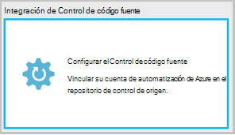
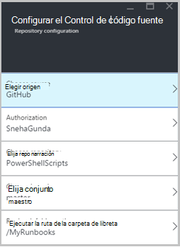
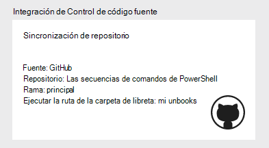
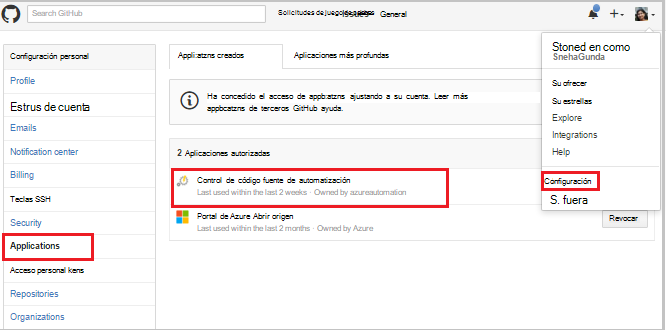
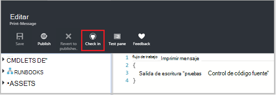
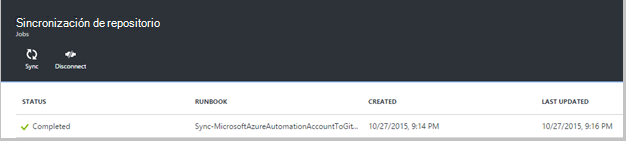
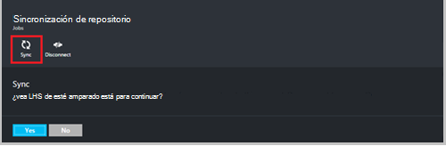
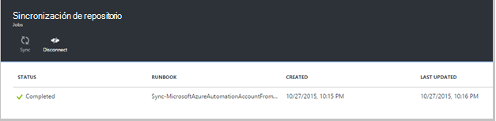
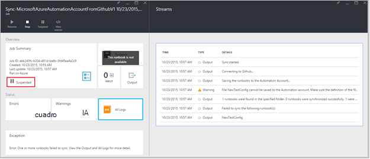
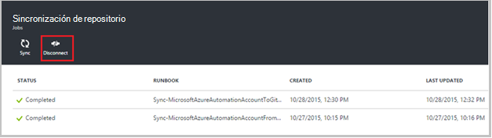

<properties 
    pageTitle=" Origen de integración de Control de automatización de Azure | Microsoft Azure"
    description="Este artículo describe la integración de control de código fuente con GitHub en automatización de Azure."
    services="automation"
    documentationCenter=""
    authors="mgoedtel"
    manager="jwhit"
    editor="tysonn" />    
<tags 
    ms.service="automation"
    ms.devlang="na"
    ms.topic="article"
    ms.tgt_pltfrm="na"
    ms.workload="infrastructure-services"
    ms.date="09/12/2016"
    ms.author="magoedte;sngun" />

# Integración de control de código fuente en la automatización de Azure

Integración de control de código fuente le permite asociar runbooks en su cuenta de automatización a un repositorio de control de origen de GitHub. Control de código fuente le permite colaborar con su equipo, control de cambios y volver a versiones anteriores de sus runbooks fácilmente. Por ejemplo, control de código fuente permite sincronizar distintas bifurcaciones en control de código fuente a sus cuentas de automatización de desarrollo, de producción o de prueba, lo que posibilita promover el código que se ha probado en su entorno de desarrollo a su cuenta de automatización de producción.

Control de código fuente le permite insertar código de automatización de Azure en control de código fuente o extraer sus runbooks de control de código fuente a la automatización de Azure. En este artículo se describe cómo configurar el control de código fuente en su entorno de automatización de Azure. Comenzaremos configurando automatización de Azure para acceder a su repositorio GitHub y recorra diferentes acciones que pueden llevar a cabo mediante la integración de control de origen. 

>[AZURE.NOTE]Control de código fuente admite extraer y tracción [runbooks de flujo de trabajo de PowerShell](automation-runbook-types.md#powershell-workflow-runbooks) , así como [runbooks PowerShell](automation-runbook-types.md#powershell-runbooks). Aún no se admite [runbooks gráfica](automation-runbook-types.md#graphical-runbooks) .  

Hay dos pasos sencillos necesarios para configurar el control de origen para su cuenta de automatización y único si ya tiene una cuenta de GitHub. Son:
## Paso 1: crear un repositorio de GitHub

Si ya tiene una cuenta de GitHub y un repositorio que desea establecer un vínculo a la automatización de Azure y, a continuación, inicie sesión en su cuenta existente e inicie desde el paso 2 a continuación. En caso contrario, Subir a [GitHub](https://github.com/), inicio de sesión de una cuenta nueva y [crear un nuevo repositorio](https://help.github.com/articles/create-a-repo/).

## Paso 2: configurar el control de código fuente en la automatización de Azure

1. En el módulo de automatización cuenta en el portal de Azure, haga clic en **hacia arriba el Control de código fuente.** 
 
    

2. Se abre el módulo de **Control de código fuente** , donde puede configurar los detalles de su cuenta de GitHub. A continuación se ofrece la lista de parámetros de configuración:  

  	|**Parámetro**            |**Descripción** |
  	|:---|:---| 
  	|Elegir origen   | Seleccione el origen. Actualmente, solo **GitHub** es compatible. |
  	|Autorización | Haga clic en el botón **autorizar** para conceder acceso de automatización de Azure en el repositorio de GitHub. Si ya ha iniciado sesión su cuenta de GitHub en una ventana diferente, se usan las credenciales de dicha cuenta. Una vez autorización es correcta, el módulo mostrará el nombre de usuario GitHub en **Propiedad de autorización**. |
  	|Elija repositorio | Seleccione un repositorio de GitHub de la lista de repositorios disponibles. |
  	|Elija la rama | Seleccione una rama de la lista de ramas disponibles. Solo la rama **principal** se muestra si no ha creado ningún ramas. |
  	|Ruta de la carpeta runbook | La ruta de acceso de la carpeta runbook especifica la ruta de acceso en el repositorio de GitHub desde la que desea insertar o extraer el código. Se deben introducirse en el formato **/foldername/subfoldername**. Solo runbooks en la ruta de acceso de la carpeta runbook se sincronizarán con su cuenta de automatización. Runbooks en las subcarpetas de runbook carpeta ruta de acceso necesitarán **no** podrá sincronizar. Usar **/** para sincronizar todas las runbooks en el repositorio. |

3. Por ejemplo, si tiene un repositorio denominado **PowerShellScripts** que contiene una carpeta denominada **RootFolder**, que contiene una carpeta denominada **subcarpeta**. Puede usar las siguientes cadenas para cada nivel de la carpeta de sincronización:

    1. Para sincronizar runbooks **repositorio**, runbook carpeta es*/*
    2. Para sincronizar runbooks desde **RootFolder**, runbook carpeta es */RootFolder*
    3. Para sincronizar runbooks de **subcarpeta**, runbook carpeta es */RootFolder/SubFolder*.
  

4. Después de configurar los parámetros, se muestran en la **placa hacia arriba el Control de código fuente.**  
 
    

5. Una vez que haga clic en Aceptar, integración de control de código fuente ahora está configurada para su cuenta de automatización y debe actualizarse con la información de GitHub. Ahora puede hacer clic en este elemento para ver todo el historial de trabajos de sincronización de control de origen.  

    

6. Después de configurar el control de código fuente, se crearán los siguientes recursos de automatización en su cuenta de automatización:  
 Se crean dos [variables activos](automation-variables.md) .  
      
    * La variable **Microsoft.Azure.Automation.SourceControl.Connection** contiene los valores de la cadena de conexión, tal como se muestra a continuación.  

  	|**Parámetro**            |**Valor** |
  	|:---|:---|
  	| Nombre  | Microsoft.Azure.Automation.SourceControl.Connection |
  	| Tipo | Cadena |
  	| Valor  | {"Rama":\<*el nombre de la rama*>, "RunbookFolderPath":\<*ruta de la carpeta Runbook*>, "tipo de proveedor":\<*tiene un valor 1 para GitHub*>, "Repositorio":\<*nombre del repositorio*>, "Nombre de usuario":\<*GitHub su nombre de usuario*>} |   

    * La variable **Microsoft.Azure.Automation.SourceControl.OAuthToken**, contiene el valor cifrado seguro de su OAuthToken.  

  	|**Parámetro**            |**Valor** |
  	|:---|:---|
  	| Nombre  | Microsoft.Azure.Automation.SourceControl.OAuthToken |
  	| Tipo | Unknown(Encrypted) |
  	| Valor | <*OAuthToken cifrada*> |  

      

    * **Control de código fuente de automatización** se agrega como una aplicación a su cuenta de GitHub autorizada. Para ver la aplicación: desde su página de inicio GitHub, vaya a su **perfil** > **configuración** > **aplicaciones**. Esta aplicación permite la automatización de Azure sincronizar su repositorio GitHub a una cuenta de automatización.  

    

## Usar el Control de origen de automatización

### Comprobación de un runbook de automatización de Azure control de código fuente

Verificación en runbook le permite a los cambios realizados en un runbook de automatización de Azure en el repositorio de control de origen de inserción. A continuación se muestran los pasos para un runbook de verificación:

1. Desde su cuenta de automatización, [crear una nueva runbook textual](automation-first-runbook-textual.md)o [modificar una existente, textual runbook](automation-edit-textual-runbook.md). Este runbook puede ser un flujo de trabajo de PowerShell o un runbook de secuencia de comandos de PowerShell.  

2. Después de modificar su runbook, guardarlo y haga clic en **protección** de la hoja de **Editar** .  

    

     >[AZURE.NOTE] De protección de automatización de Azure sobrescribirá el código que existe actualmente en el control de código fuente. La instrucción de la línea de comandos equivalente Git de verificación es **Agregar git + git confirmación + git push**  

3. Al hacer clic **en revisar**, se le indicará con un mensaje de confirmación, haga clic en Sí para continuar.  

    

4. En la verificación empieza runbook de control de código fuente: **MicrosoftAzureAutomationAccountToGitHubV1 de sincronización**. Este runbook se conecta a GitHub e inserta los cambios de automatización de Azure en el repositorio. Para ver el historial de trabajos de protección, vuelva a la pestaña de la **Integración de Control de código fuente** y haga clic para abrir el módulo de sincronización de repositorio. Este módulo muestra todos los trabajos de control de origen.  Seleccione la tarea que desea ver y haga clic para ver los detalles.  

    

    >[AZURE.NOTE] Origen control runbooks son runbooks automatización especial que no puede ver ni editar. Mientras que no se mostrará en la lista runbook, verá los trabajos de sincronización se muestre en la lista de trabajos.
 
5. El nombre del runbook modificada se envía como parámetro de entrada a la runbook de verificación. Puede [Ver los detalles del trabajo](automation-runbook-execution.md#viewing-job-status-using-the-azure-management-portal) expandir runbook en el módulo de **Repositorio de sincronización** .  

    

6. Actualizar su repositorio GitHub cuando se completa la tarea para ver los cambios.  Debe haber una confirmación en el repositorio con un mensaje de confirmación: *Nombre del Runbook *actualizado ** en Azure Automation.* *  

### Runbooks de sincronización de control de código fuente a la automatización de Azure 

El botón Sincronizar en el módulo de sincronización de repositorio le permite extraer todos los runbooks en la carpeta runbook del repositorio a su cuenta de automatización. El mismo repositorio se puede sincronizar con más de una cuenta de automatización. A continuación se muestran los pasos para sincronizar un runbook:

1. Desde la cuenta de automatización donde configurar el control de código fuente, abra el **módulo de sincronización de integración y repositorio de Control de origen** y haga clic en **sincronizar** , a continuación, se le indicará con un mensaje de confirmación, haga clic en **Sí** para continuar.  

    

2. Inicia la sincronización runbook: **MicrosoftAzureAutomationAccountFromGitHubV1 de sincronización**. Este runbook se conecta a GitHub y extrae los cambios del repositorio de automatización de Azure. Debería ver una nueva tarea en el módulo de **Sincronización de repositorio** para esta acción. Para ver los detalles sobre el trabajo de sincronización, haga clic para abrir el módulo de detalles de trabajo.  
 
    

 
    >[AZURE.NOTE] Una sincronización de control de código fuente sobrescribe la versión de borrador de la runbooks que existen actualmente en su cuenta de automatización para runbooks **todos los** que se encuentran actualmente en el control de código fuente. La instrucción de la línea de comandos equivalente de Git para sincronizar es **git extracción**

## Solución de problemas de control de código fuente

Si hay algún error con un trabajo de protección o sincronizar, el estado del trabajo debe ser suspendido y puede ver más detalles sobre el error en la hoja de trabajo.  El elemento de **Todos los registros** mostrará todas las secuencias de PowerShell asociadas a esa tarea. Esto le proporcionará los detalles necesarios para ayudar a solucionar los problemas con la verificación o una sincronización. También muestra la secuencia de acciones que se ha producido al sincronizar o comprobación en un runbook.  

## Desconexión de control de código fuente

Para desconectarse de la cuenta GitHub, abra el módulo de sincronización de repositorio y haga clic en **Desconectar**. Una vez que se desconecta el control de código fuente, runbooks que se hayan sincronizado anteriormente permanecerá en su cuenta de automatización, pero el módulo de sincronización de repositorio no estará habilitado.  

  

## Pasos siguientes

Para obtener más información sobre la integración de control de código fuente, consulte los siguientes recursos:  
- [Automatización Azure: Integración del Control de origen en automatización de Azure](https://azure.microsoft.com/blog/azure-automation-source-control-13/)  
- [Votar por el sistema de control de origen favoritos](https://www.surveymonkey.com/r/?sm=2dVjdcrCPFdT0dFFI8nUdQ%3d%3d)  
- [Automatización de Azure: Integrar el Control de origen de Runbook mediante Visual Studio Team Services](https://azure.microsoft.com/blog/azure-automation-integrating-runbook-source-control-using-visual-studio-online/)  
