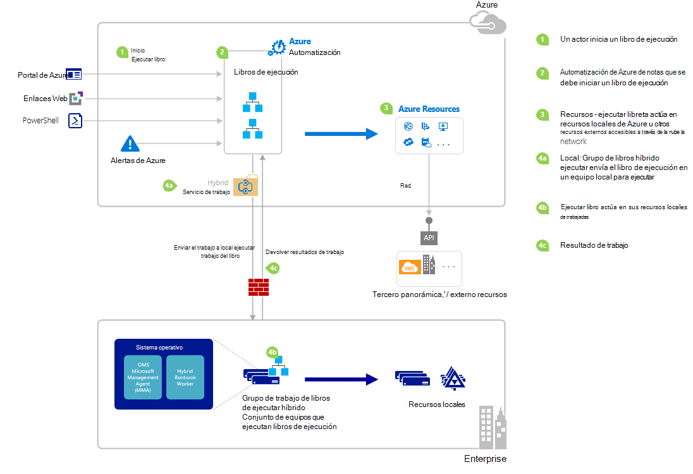

<properties
   pageTitle="Iniciar un runbook de automatización de Azure | Microsoft Azure"
   description="Se resumen los diferentes métodos que pueden utilizar para iniciar un runbook de automatización de Azure y proporcionan detalles sobre cómo usar el portal de Azure y Windows PowerShell."
   services="automation"
   documentationCenter=""
   authors="mgoedtel"
   manager="jwhit"
   editor="tysonn" />
<tags
   ms.service="automation"
   ms.devlang="na"
   ms.topic="article"
   ms.tgt_pltfrm="na"
   ms.workload="infrastructure-services"
   ms.date="10/08/2016"
   ms.author="magoedte;bwren"/>

# <a name="starting-a-runbook-in-azure-automation"></a>Iniciar un runbook de automatización de Azure

La siguiente tabla le ayudará a determinar el método para iniciar un runbook de automatización con Azure que mejor se adapte a su caso particular. En este artículo incluye detalles acerca de cómo iniciar un runbook con el portal de Azure y con Windows PowerShell. Obtener más información sobre los otros métodos se proporciona en otra documentación que puede tener acceso desde los siguientes vínculos.

| **MÉTODO**                                                                    | **CARACTERÍSTICAS**                                                                                                                                                                                                                                                                                                                                                |
|-------------------------------------------------------------------------------|--------------------------------------------------------------------------------------------------------------------------------------------------------------------------------------------------------------------------------------------------------------------------------------------------------------------------------------------------------------------|
| [Portal de Azure](#starting-a-runbook-with-the-azure-portal)                     | <li>Método más sencillo con la interfaz de usuario interactiva.<br> <li>Formulario para proporcionar los valores de parámetros simple.<br> <li>Realizar un seguimiento de estado del trabajo con facilidad.<br> <li>Acceso autenticado con inicio de sesión de Azure.                                                                                                                                                                               |
| [Windows PowerShell](https://msdn.microsoft.com/library/dn690259.aspx)        | <li>Llamar desde la línea de comandos con los cmdlets de Windows PowerShell.<br> <li>Puede incluir en una solución automatizada con varios pasos.<br> <li>Solicitud se autentica con el certificado o OAuth usuario principal o servicio principal.<br> <li>Proporcionar los valores de parámetro sencillos y complejos.<br> <li>Realizar un seguimiento del estado del trabajo.<br> <li>Cliente necesario para admitir los cmdlets de PowerShell. |
| [API de automatización de Azure](https://msdn.microsoft.com/library/azure/mt662285.aspx) | <li>Método más flexible pero también más complejos.<br> <li>Llamar desde cualquier código personalizado que puede realizar las solicitudes HTTP.<br> <li>Solicitud de autenticar con certificado o Oauth usuario principal o servicio principal.<br> <li>Proporcionar los valores de parámetro sencillos y complejos.<br> <li>Realizar un seguimiento del estado del trabajo.                                                                          |
| [Webhooks](automation-webhooks.md)                                            | <li>Iniciar runbook de solicitud HTTP.<br> <li>Autenticar con token de seguridad de URL.<br> <li>Cliente no puede reemplazar valores de parámetros especificados al crear webhook. Runbook puede definir solo parámetro que se rellena con los detalles de la solicitud HTTP.<br> <li>Sin capacidad para realizar un seguimiento del estado de trabajo a través de la dirección URL de webhook.                                      |
| [Responder a la alerta de Azure](../log-analytics/log-analytics-alerts.md)               | <li>Iniciar un runbook en respuesta a la alerta de Azure.<br> <li>Configurar webhook para runbook y vincular a alertas.<br> <li>Autenticar con token de seguridad de URL.<br> <li>Actualmente alerta métrica sólo admite.                                                                                                                                                       |
| [Programación](automation-schedules.md)                                | <li>Iniciar automáticamente runbook programación por hora, diaria o semanal.<br> <li>Manipular programación mediante el portal de Azure, cmdlets de PowerShell o API de Azure.<br> <li>Proporcionar los valores de parámetro para utilizar con programación.                                                                                                                                               |
| [Desde otro Runbook](automation-child-runbooks.md)                          | <li>Use un runbook como una actividad en otra runbook.<br> <li>Es útil para funcionalidad utilizada por varios runbooks.<br> <li>Proporcionar valores de parámetro runbook secundarios y use salida runbook primario.                                                                                                                                                               |

La imagen siguiente muestra el proceso paso a paso detallado del ciclo de vida de un runbook. Incluye un runbook se inicia en automatización de Azure, componentes necesarios para híbrido Runbook trabajador para ejecutar la automatización de Azure runbooks e interacciones entre los distintos componentes de diferentes maneras. Para obtener información acerca de cómo ejecutar runbooks de automatización en el centro de datos, hacer referencia a [sus colegas runbook híbrido](automation-hybrid-runbook-worker.md)



## <a name="starting-a-runbook-with-the-azure-portal"></a>Iniciar un runbook con el portal de Azure

1.  En el portal de Azure, seleccione **automatización** y, a continuación, haga clic en el nombre de una cuenta de automatización.
2.  Seleccione la pestaña **Runbooks** .
3.  Seleccione un runbook y, a continuación, haga clic en **Inicio**.
4.  Si runbook tiene parámetros, se le pedirá que proporcione valores con un cuadro de texto de cada parámetro. Para obtener más información sobre parámetros, vea [Parámetros Runbook](#Runbook-parameters) debajo.
5.  Seleccione **El trabajo de la vista** junto al mensaje de runbook de **Inicio** o la ficha **trabajos** para runbook ver el estado del trabajo runbook.

## <a name="starting-a-runbook-with-the-azure-portal"></a>Iniciar un runbook con el portal de Azure

1.  Desde su cuenta de automatización, haga clic en el elemento **Runbooks** para abrir el módulo **Runbooks** .
2.  Haga clic en un runbook para abrir su hoja de **Runbook** .
3.  Haga clic en **Inicio**.
4.  Si runbook no tiene parámetros, se le pedirá que confirme si desea iniciarlo. Si runbook tiene parámetros, se abrirá el módulo **Runbook de inicio** para que puedan proporcionar los valores de parámetro. Para obtener más información sobre parámetros, vea [Parámetros Runbook](#Runbook-parameters) debajo.
5.  Se abre la hoja de **trabajo de** modo que puede realizar un seguimiento de estado del trabajo.

## <a name="starting-a-runbook-with-windows-powershell"></a>Iniciar un runbook con Windows PowerShell

Puede usar el [Inicio AzureRmAutomationRunbook](https://msdn.microsoft.com/library/mt603661.aspx) para iniciar un runbook con Windows PowerShell. El código de ejemplo siguiente inicia un runbook denominado Runbook de prueba.

```
Start-AzureRmAutomationRunbook -AutomationAccountName "MyAutomationAccount" -Name "Test-Runbook" -ResourceGroupName "ResourceGroup01"
```

Inicio AzureRmAutomationRunbook devuelve un objeto de trabajo que puede usar para realizar un seguimiento de su estado una vez que se inicia runbook. A continuación, puede usar este objeto de trabajo con [Get-AzureRmAutomationJob](https://msdn.microsoft.com/library/mt619440.aspx) para determinar el estado del trabajo y [Get-AzureRmAutomationJobOutput](https://msdn.microsoft.com/library/mt603476.aspx) para obtener su resultado. El código de ejemplo siguiente inicia un runbook denominado Runbook de prueba, espera hasta que se ha completado y, a continuación, muestra los resultados.

```
$runbookName = "Test-Runbook"
$ResourceGroup = "ResourceGroup01"
$AutomationAcct = "MyAutomationAccount"

$job = Start-AzureRmAutomationRunbook –AutomationAccountName $AutomationAcct -Name $runbookName -ResourceGroupName $ResourceGroup

$doLoop = $true
While ($doLoop) {
   $job = Get-AzureRmAutomationJob –AutomationAccountName $AutomationAcct -Id $job.JobId -ResourceGroupName $ResourceGroup
   $status = $job.Status
   $doLoop = (($status -ne "Completed") -and ($status -ne "Failed") -and ($status -ne "Suspended") -and ($status -ne "Stopped"))
}

Get-AzureRmAutomationJobOutput –AutomationAccountName $AutomationAcct -Id $job.JobId -ResourceGroupName $ResourceGroup –Stream Output
```

Si runbook requiere parámetros, debe proporcionar ellos como una [tabla hash](http://technet.microsoft.com/library/hh847780.aspx) donde la clave de la tabla hash coincide con el nombre del parámetro y el valor es el valor del parámetro. En el ejemplo siguiente se muestra cómo iniciar un runbook con dos parámetros de cadena denominados nombre y apellido, un número entero denominado RepeatCount y un parámetro boolean denominada Show. Para obtener información adicional sobre los parámetros, vea [Runbook parámetros](#Runbook-parameters) .

```
$params = @{"FirstName"="Joe";"LastName"="Smith";"RepeatCount"=2;"Show"=$true}
Start-AzureRmAutomationRunbook –AutomationAccountName "MyAutomationAccount" –Name "Test-Runbook" -ResourceGroupName "ResourceGroup01" –Parameters $params
```

## <a name="runbook-parameters"></a>Parámetros de runbook

Cuando se inicia un runbook desde el Portal de Azure o Windows PowerShell, se envía la instrucción a través del servicio web de automatización de Azure. Este servicio no admite parámetros con tipos de datos complejos. Si debe proporcionar un valor para un parámetro complejo, a continuación, se debe llamar en línea desde otro runbook como se describe en [runbooks secundarios en automatización de Azure](automation-child-runbooks.md).

El servicio web de automatización de Azure le proporcionará funcionalidad especial para parámetros mediante ciertos tipos de datos, como se describe en las secciones siguientes.

### <a name="named-values"></a>Valores con nombre

Si el parámetro es el tipo de datos [objeto], puede usar el siguiente formato JSON para enviar una lista de valores con nombre: *{nombre1: 'Valor1', nombre2: 'Valor2', Nombre3: 'Value3'}*. Estos valores deben ser tipos simples. Runbook recibirá el parámetro como un [PSCustomObject](https://msdn.microsoft.com/library/system.management.automation.pscustomobject%28v=vs.85%29.aspx) con propiedades que corresponden a cada valor con nombre.

Tenga en cuenta lo siguientes runbook de prueba que acepte un parámetro de usuario.

```
Workflow Test-Parameters
{
   param (
      [Parameter(Mandatory=$true)][object]$user
   )
    $userObject = $user | ConvertFrom-JSON
    if ($userObject.Show) {
        foreach ($i in 1..$userObject.RepeatCount) {
            $userObject.FirstName
            $userObject.LastName
        }
    }
}
```

El texto siguiente se podría usar para el parámetro de usuario.

```
{FirstName:'Joe',LastName:'Smith',RepeatCount:'2',Show:'True'}
```

El resultado es el siguiente resultado.

```
Joe
Smith
Joe
Smith
```

### <a name="arrays"></a>Matrices.

Si el parámetro es una matriz como [matriz] o [, a continuación, puede usar el siguiente formato JSON para enviar una lista de valores de cadena []]: *[valor1, valor2, Valor3]*. Estos valores deben ser tipos simples.

Tenga en cuenta lo siguientes runbook de prueba que acepte un parámetro de *usuario*.

```
Workflow Test-Parameters
{
   param (
      [Parameter(Mandatory=$true)][array]$user
   )
    if ($user[3]) {
        foreach ($i in 1..$user[2]) {
            $ user[0]
            $ user[1]
        }
    }
}
```

El texto siguiente se podría usar para el parámetro de usuario.

```
["Joe","Smith",2,true]
```

El resultado es el siguiente resultado.

```
Joe
Smith
Joe
Smith
```

### <a name="credentials"></a>Credenciales

Si el parámetro es el tipo de datos **PSCredential**, puede proporcionar el nombre de un [activo de credenciales](automation-credentials.md)de automatización de Azure. Runbook recuperará las credenciales con el nombre que especifique.

Tenga en cuenta la siguiente runbook de prueba que acepta un parámetro denominado credenciales.

```
Workflow Test-Parameters
{
   param (
      [Parameter(Mandatory=$true)][PSCredential]$credential
   )
   $credential.UserName
}
```

El texto siguiente se podría usar para el parámetro de usuario suponiendo que se ha producido un activo de credencial denominado *Mis credenciales*.

```
My Credential
```

Suponiendo que el nombre de usuario de la credencial *jsmith*, el resultado siguiente resultado.

```
jsmith
```

## <a name="next-steps"></a>Pasos siguientes

-   La arquitectura de runbook en actual artículo proporciona una descripción general de administración de recursos en Azure y local con el trabajo de Runbook híbrido de runbooks.  Para obtener información acerca de cómo ejecutar runbooks de automatización en el centro de datos, consulte [Los trabajadores de Runbook híbrido](automation-hybrid-runbook-worker.md).
-   Para obtener más información sobre la creación runbooks modular para usarlo con otros runbooks para funciones específicas o comunes, consulte [Runbooks secundarios](automation-child-runbooks.md).
