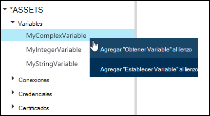
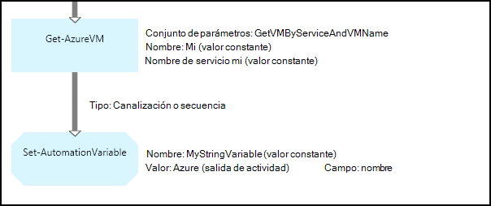
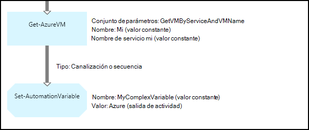
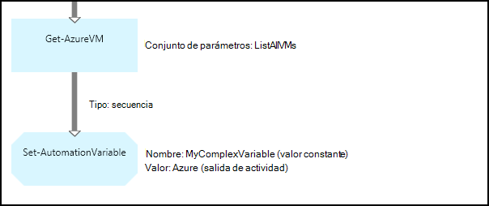
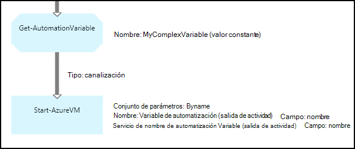
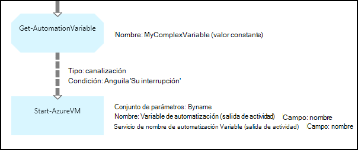

<properties 
   pageTitle="Variable activos en la automatización de Azure | Microsoft Azure"
   description="Variable activos son valores que están disponibles para todas las configuraciones de DSC en automatización de Azure y runbooks.  En este artículo se explica los detalles de variables y cómo trabajar con ellos en la creación de texto y gráficos."
   services="automation"
   documentationCenter=""
   authors="mgoedtel"
   manager="jwhit"
   editor="tysonn" />
<tags 
   ms.service="automation"
   ms.devlang="na"
   ms.topic="article"
   ms.tgt_pltfrm="na"
   ms.workload="infrastructure-services"
   ms.date="05/24/2016"
   ms.author="magoedte;bwren" />

# Variable activos en la automatización de Azure

Variable activos son valores que están disponibles para todas las configuraciones de DSC en su cuenta de automatización y runbooks. Puede crear, modificar y recuperados desde el portal de Azure, Windows PowerShell y desde una configuración de DLC o runbook. Las variables de automatización son útiles para las siguientes situaciones:

- Compartir un valor entre varias runbooks o configuraciones DSC.

- Compartir un valor entre varias tareas desde la misma runbook o configuración de DSC.

- Administrar un valor desde el portal o desde la línea de comandos de Windows PowerShell que se utiliza por runbooks o configuraciones DSC.

Las variables de automatización se conservan para que continúan esté disponible incluso si se produce un error en la configuración de DLC o runbook.  Esto también permite un valor establecer un runbook que se utiliza por otro o se utiliza el mismo runbook o configuración DSC la próxima vez que se ejecuta.

Cuando se crea una variable, puede especificar que se almacena cifrada.  Cuando se cifra una variable, se almacena de forma segura en la automatización de Azure y su valor no se puede recuperar el cmdlet [Get-AzureAutomationVariable](http://msdn.microsoft.com/library/dn913772.aspx) que se incluye como parte del módulo de PowerShell de Azure.  La única manera que se puede recuperar un valor cifrado es de la actividad de **Get-AutomationVariable** en una configuración de DLC o runbook.

>[AZURE.NOTE]Proteger los activos de automatización de Azure incluyen credenciales, certificados, conexiones y variables de cifrado. Estos activos se cifran y se almacenan en la automatización de Azure con una clave única que se genera para cada cuenta de automatización. Esta clave se cifra un certificado patrón y almacenada en automatización de Azure. Antes de almacenar un activo seguro, la clave para la cuenta de automatización se descifra con el certificado de patrón y, a continuación, se utiliza para cifrar el activo.

## Tipos de variables

Cuando se crea una variable con el portal de Azure, debe especificar un tipo de datos de la lista desplegable para que el portal puede mostrar el control adecuado para especificar el valor de la variable. La variable no se limita a este tipo de datos, pero debe establecer la variable con Windows PowerShell si desea especificar un valor de un tipo diferente. Si especifica **no definido**, a continuación, el valor de la variable se establecerá en **$null**y debe establecer el valor con el cmdlet [Set-AzureAutomationVariable](http://msdn.microsoft.com/library/dn913767.aspx) o la actividad de **Conjunto AutomationVariable** .  No puede crear o cambiar el valor de un tipo de variable de complejo en el portal, pero puede proporcionar un valor de cualquier tipo de uso de Windows PowerShell. Tipos complejos se devolverán como un [PSCustomObject](http://msdn.microsoft.com/library/system.management.automation.pscustomobject.aspx).

Puede almacenar varios valores en una única variable creando una matriz o tabla hash y guardarla en la variable.

## Actividades de flujo de trabajo y cmdlets

Los cmdlets en la siguiente tabla se usan para crear y administrar las variables de automatización con Windows PowerShell. Se envían como parte del [módulo de PowerShell de Azure](../powershell-install-configure.md) que está disponible para su uso en runbooks de automatización y configuración de DSC.

|Cmdlets de|Descripción|
|:---|:---|
|[Get-AzureAutomationVariable](http://msdn.microsoft.com/library/dn913772.aspx)|Recupera el valor de una variable existente.|
|[Nueva AzureAutomationVariable](http://msdn.microsoft.com/library/dn913771.aspx)|Crea una nueva variable y establece su valor.|
|[Quitar AzureAutomationVariable](http://msdn.microsoft.com/library/dn913775.aspx)|Quita una variable existente.|
|[Establecer AzureAutomationVariable](http://msdn.microsoft.com/library/dn913767.aspx)|Establece el valor de una variable existente.|

Las actividades de flujo de trabajo en la siguiente tabla se usan para tener acceso a las variables de automatización en un runbook. Que solo están disponibles para su uso en una configuración de DLC o runbook y no están incluidos como parte del módulo de PowerShell de Azure.

|Actividades de flujo de trabajo|Descripción|
|:---|:---|
|Get-AutomationVariable|Recupera el valor de una variable existente.|
|Establecer AutomationVariable|Establece el valor de una variable existente.|

>[AZURE.NOTE] Evitar el uso de variables en – parámetro nombre de **AutomationVariable obtener** un runbook o configuración de DLC, ya que esto puede dificultar descubrir dependencias entre runbooks o configuración de DSC y las variables de automatización en tiempo de diseño.

## Crear una nueva variable de automatización

### Para crear una nueva variable con el portal de Azure

1. Desde su cuenta de automatización, haga clic en **activos** en la parte superior de la ventana.
1. En la parte inferior de la ventana, haga clic en **Agregar**.
1. Haga clic en **Agregar Variable**.
1. Complete el asistente y haga clic en la casilla de verificación para guardar la nueva variable.

### Para crear una nueva variable con el portal de Azure

1. Desde su cuenta de automatización, haga clic en el elemento de **activos** para abrir el módulo de **activos** .
1. Haga clic en el elemento de **Variables** para abrir el módulo de **Variables** .
1. Haga clic en **Agregar una variable** en la parte superior de la hoja.
1. Complete el formulario y haga clic en **crear** para guardar la nueva variable.

### Para crear una nueva variable con Windows PowerShell

El cmdlet [New-AzureAutomationVariable](http://msdn.microsoft.com/library/dn913771.aspx) crea una nueva variable y establece su valor inicial. Puede recuperar el valor mediante [Get-AzureAutomationVariable](http://msdn.microsoft.com/library/dn913772.aspx). Si el valor es un tipo simple, se devuelve el mismo tipo. Si es un tipo complejo, se devuelve un **PSCustomObject** .

Los comandos de ejemplo siguientes muestran cómo crear una variable de tipo cadena y, a continuación, devolver su valor.

    New-AzureAutomationVariable –AutomationAccountName "MyAutomationAccount" –Name 'MyStringVariable' –Encrypted $false –Value 'My String'
    $string = (Get-AzureAutomationVariable –AutomationAccountName "MyAutomationAccount" –Name 'MyStringVariable').Value

Los comandos de ejemplo siguientes muestran cómo crear una variable con un tipo complejo y, a continuación, devolver sus propiedades. En este caso, se utiliza un objeto de máquina virtual de **Get-AzureVM** .

    $vm = Get-AzureVM –ServiceName "MyVM" –Name "MyVM"
    New-AzureAutomationVariable –AutomationAccountName "MyAutomationAccount" –Name "MyComplexVariable" –Encrypted $false –Value $vm
    
    $vmValue = (Get-AzureAutomationVariable –AutomationAccountName "MyAutomationAccount" –Name "MyComplexVariable").Value
    $vmName = $vmValue.Name
    $vmIpAddress = $vmValue.IpAddress

## Uso de una variable en una configuración de DLC o runbook

Use la actividad de **Conjunto AutomationVariable** para establecer el valor de una variable de automatización en un runbook o configuración de DSC y la **AutomationVariable Get** para recuperarla.  No debe usar los cmdlets **Set-AzureAutomationVariable** o **Get-AzureAutomationVariable** en una configuración de DLC o runbook ya que son menos eficaces que las actividades de flujo de trabajo.  Tampoco puede recuperar el valor de variables seguras con **Get-AzureAutomationVariable**.  La única manera de crear una nueva variable desde dentro de una configuración de DLC o runbook es usar el cmdlet [AzureAutomationVariable de nuevo](http://msdn.microsoft.com/library/dn913771.aspx) .

### Ejemplos de runbook textual

#### Establecer y recuperar un valor simple de una variable

Los siguientes comandos de ejemplo muestran cómo establecer y recuperar una variable en un runbook textual. En este ejemplo, se supone que las variables de tipo entero denominan *NumberOfIterations* y *NumberOfRunnings* y una variable de tipo cadena ya ha sido creado con nombre *SampleMessage* .

    $NumberOfIterations = Get-AutomationVariable -Name 'NumberOfIterations'
    $NumberOfRunnings = Get-AutomationVariable -Name 'NumberOfRunnings'
    $SampleMessage = Get-AutomationVariable -Name 'SampleMessage'
    
    Write-Output "Runbook has been run $NumberOfRunnings times."
    
    for ($i = 1; $i -le $NumberOfIterations; $i++) {
       Write-Output "$i`: $SampleMessage"
    }
    Set-AutomationVariable –Name NumberOfRunnings –Value ($NumberOfRunnings += 1)

#### Establecer y recuperar un objeto complejo en una variable

El código de ejemplo siguiente muestra cómo actualizar una variable con un valor en un runbook textual complejos. En este ejemplo, una máquina virtual Azure se recuperan con **Get-AzureVM** y guarda en una variable de automatización existente.  Como se explica en [tipos de Variable](#variable-types), se almacena como un PSCustomObject.

    $vm = Get-AzureVM -ServiceName "MyVM" -Name "MyVM"
    Set-AutomationVariable -Name "MyComplexVariable" -Value $vm

En el código siguiente, el valor es recuperado de la variable y se utiliza para iniciar la máquina virtual.

    $vmObject = Get-AutomationVariable -Name "MyComplexVariable"
    if ($vmObject.PowerState -eq 'Stopped') {
       Start-AzureVM -ServiceName $vmObject.ServiceName -Name $vmObject.Name
    }

#### Establecer y recuperar una colección de una variable

El código de ejemplo siguiente muestra cómo utilizar una variable con una colección de valores complejos en un runbook textual. En este ejemplo, se recuperan con **Get-AzureVM** varias máquinas virtuales de Azure y se guardan en una variable de automatización existente.  Como se explica en [tipos de Variable](#variable-types), se almacena como una colección de PSCustomObjects.

    $vms = Get-AzureVM | Where -FilterScript {$_.Name -match "my"}     
    Set-AutomationVariable -Name 'MyComplexVariable' -Value $vms

En el código siguiente, se recuperados de la variable de la colección y se usa para iniciar cada máquina virtual.

    $vmValues = Get-AutomationVariable -Name "MyComplexVariable"
    ForEach ($vmValue in $vmValues)
    {
       if ($vmValue.PowerState -eq 'Stopped') {
          Start-AzureVM -ServiceName $vmValue.ServiceName -Name $vmValue.Name
       }
    }

### Ejemplos de runbook gráfica

En un gráfico runbook, agregue la **Get-AutomationVariable** o **Establecer AutomationVariable** haciendo doble clic en la variable en el panel de la biblioteca del editor de gráficos y seleccionando la actividad que desee.

#### Valores de configuración de una variable

La imagen siguiente muestra las actividades de ejemplo para actualizar una variable con un valor simple en un runbook gráfica. En este ejemplo, se recupera una sola máquina virtual Azure con **Get-AzureVM** y el nombre del equipo se guarda en una variable de automatización existente con un tipo de cadena.  No importa si el [vínculo es una canalización o secuencia](automation-graphical-authoring-intro.md#links-and-workflow) ya que esperamos que solo un único objeto en el resultado.

La imagen siguiente muestra las actividades que se utiliza para actualizar una variable con un valor en un gráfico runbook complejo. El único cambio del ejemplo anterior no especifica una **ruta de acceso de campo** para la **salida de la actividad** de la actividad de **Conjunto AutomationVariable** para que se almacena el objeto en lugar de solo una propiedad del objeto.  Como se explica en [tipos de Variable](#variable-types), se almacena como un PSCustomObject.

La imagen siguiente muestra funciones similares, como el ejemplo anterior, con varios equipos virtuales que se guarda en la variable.  Un [vínculo de la secuencia](automation-graphical-authoring-intro.md#links-and-workflow) deben usarse aquí para que la actividad de **Conjunto AutomationVariable** recibe el conjunto completo de máquinas virtuales como una colección.  Si se ha utilizado un [vínculo de canalización](automation-graphical-authoring-intro.md#links-and-workflow) , a continuación, la actividad de **Conjunto AutomationVariable** ' d ejecutar por separado para cada objeto con el resultado que se guardan la última máquina virtual de la colección.  Como se explica en [tipos de Variable](#variable-types), se almacena como una colección de PSCustomObjects.

#### Recuperar los valores de una variable

La imagen siguiente muestra las actividades de ejemplo que recuperar y utilizan una variable en un runbook gráfica.  La primera actividad recupera los equipos virtuales que se han guardado en la variable en el ejemplo anterior.  El vínculo debe ser una [canalización](automation-graphical-authoring-intro.md#links-and-workflow) para que la actividad **AzureVM de inicio** se ejecuta una vez para cada objeto enviado desde la actividad de **Get-AutomationVariable** .  Funcionarán los mismos si una un objeto único o varios objetos se almacenan en la variable.  La actividad de **Inicio AzureVM** utiliza propiedades de la PSCustomObject que representa cada máquina virtual. 

La imagen siguiente muestra cómo filtrar los objetos que se almacenan en una variable en un runbook gráfica.  Se agrega una [condición](automation-graphical-authoring-intro.md#links-and-workflow) para el vínculo en el ejemplo anterior para filtrar sólo esas máquinas virtuales que se han detenido cuando se estableció la variable.

## Pasos siguientes

- Para más información sobre cómo conectar actividades juntos en la creación de gráficos, vea [los vínculos de edición gráfica](automation-graphical-authoring-intro.md#links-and-workflow)
- Para empezar con runbooks gráfica, consulte [Mi primera runbook gráfica](automation-first-runbook-graphical.md) 
