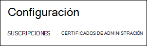
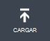
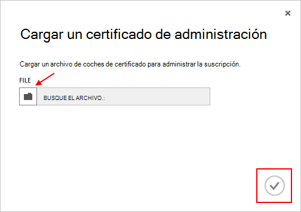

<properties 
    pageTitle="Cargar un certificado de la API de administración de Azure | Microsoft Azure" 
    description="Obtenga información sobre cómo cargar el certificado de la API de administración de athe para el Portal de clásico de Azure." 
    services="cloud-services" 
    documentationCenter=".net" 
    authors="Thraka" 
    manager="timlt" 
    editor=""/>

<tags 
    ms.service="na" 
    ms.workload="tbd" 
    ms.tgt_pltfrm="na" 
    ms.devlang="na" 
    ms.topic="article" 
    ms.date="04/18/2016"
    ms.author="adegeo"/>

# Cargar un certificado de administración de la API de administración de Azure

Certificados de administración le permiten autenticar con la API de administración de servicio proporcionadas por Azure. Muchos programas y herramientas (como Visual Studio o el SDK de Azure) usará estos certificados para automatizar la configuración e implementación de los diversos servicios de Azure. **Solo se aplica al portal clásico Azure**. 

>[AZURE.WARNING] ¡Ten cuidado! Estos tipos de certificados permitir que cualquier persona que autentica con ellos para administrar la suscripción que están asociados. 

Para obtener más información acerca de los certificados de Azure (incluida la creación de un certificado autofirmado) está [disponible](cloud-services/cloud-services-certs-create.md#what-are-management-certificates) si lo necesita.

También puede usar [Azure Active Directory](/services/active-directory/) para autenticar el código de cliente con fines de automatización.

## Cargar un certificado de administración

Una vez que tenga un certificado de administración creado, (archivo .cer con sólo la clave pública) puede cargar en el portal. Cuando el certificado esté disponible en el portal, cualquier usuario con un certficiate coincidente (clave privada) puede conectarse a través de la API de administración y acceso a los recursos de la suscripción asociada.

1. Inicie sesión en el [portal de clásico de Azure](http://manage.windowsazure.com).

2. Asegúrese de seleccionar la suscripción correcta que desea asociar un certificado con. Presione el texto de **las suscripciones** en la parte superior derecha del portal.

    

3. Una vez que la suscripción correcta seleccionada, presione **configuración** en el lado izquierdo del portal (es podrán que tenga que desplazarse hacia abajo). 
    
    

4. Presione la pestaña **Administración de certificados** .

    
    
5. Presione el botón **cargar** .

    
    
6. Rellene la información del cuadro de diálogo y pulse la **marca de verificación**de listo.

    

## Pasos siguientes

Ahora que tiene un certificado de administración asociada a una suscripción, puede (después de haber instalado el certificado coincidente localmente) mediante programación conectar con la [API de REST de administración de servicio](https://msdn.microsoft.com/library/azure/mt420159.aspx) y automatizar los diversos recursos de Azure que también están asociados a la suscripción. 