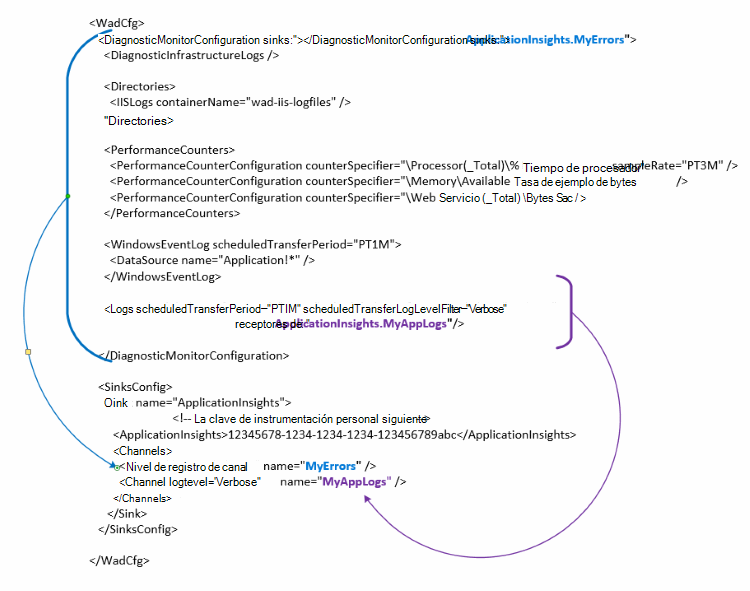

<properties
   pageTitle="Configurar diagnósticos de Azure para enviar datos a la aplicación perspectivas | Microsoft Azure"
   description="Actualizar la configuración de diagnósticos de Azure pública para enviar datos a la aplicación perspectivas."
   services="multiple"
   documentationCenter=".net"
   authors="sbtron"
   manager="douge"
   editor="" />
<tags
   ms.service="application-insights"
   ms.devlang="na"
   ms.topic="article"
   ms.tgt_pltfrm="na"
   ms.workload="na"
   ms.date="12/15/2015"
   ms.author="saurabh" />

# Configurar diagnósticos de Azure para enviar datos a la aplicación perspectivas

Diagnóstico de Azure almacena los datos en tablas de almacenamiento de Azure.  Sin embargo, también puede canalización todos o un subconjunto de los datos de aplicación impresiones configurando "receptores" y "canales" en la configuración cuando se usa la extensión de diagnósticos de Azure 1.5 o posterior.

En este artículo se describe cómo crear la configuración para la extensión de diagnósticos de Azure pública para que su configurado para enviar datos a la información de la aplicación.

## Configurar perspectivas de aplicación como un receptor

La extensión de diagnóstico de Azure 1,5 presenta el **<SinksConfig>** elemento de la configuración del pública. Define el adicionales *Lavabo* donde se pueden enviar los datos de diagnóstico de Azure. Puede especificar los detalles del recurso perspectivas de aplicación donde desea enviar los datos de diagnóstico de Azure como parte de esta **<SinksConfig>**.
Un ejemplo **SinksConfig** es similar a esta:  

    <SinksConfig>
        <Sink name="ApplicationInsights">
          <ApplicationInsights>{Insert InstrumentationKey}</ApplicationInsights>
          <Channels>
            <Channel logLevel="Error" name="MyTopDiagData"  />
            <Channel logLevel="Verbose" name="MyLogData"  />
          </Channels>
        </Sink>
      </SinksConfig>

Para el elemento **receptor** el atributo *name* especifica un valor de cadena que se utilizará para el receptor de forma exclusiva, consulte.
El elemento **ApplicationInsights** especifica la clave de instrumentación del recurso de perspectivas de aplicación que se envían los datos de diagnóstico de Azure. Si no tiene un recurso de perspectivas de aplicación existente, vea [crear un nuevo recurso de información de la aplicación](./application-insights/app-insights-create-new-resource.md) para obtener más información sobre cómo crear un recurso y obtener la clave de instrumentación.

Si va a desarrollar un proyecto de servicio de nube con Azure SDK 2,8 esta clave instrumentación se rellena automáticamente en la configuración pública basada en la configuración de servicio **APPINSIGHTS_INSTRUMENTATIONKEY** al empaquetar el proyecto de servicio de nube. Consulte [Usar aplicación perspectivas con Azure diagnóstico para solucionar problemas de servicio de nube](./cloud-services/cloud-services-dotnet-diagnostics-applicationinsights.md).

El elemento de **canales** le permite definir uno o varios elementos de **canal** para los datos que se envían al receptor. El canal actúa como un filtro y le permite seleccionar los niveles de registro específico que desee enviar al receptor. Por ejemplo puede recopilar registros detallados y enviarlos a almacenamiento, pero puede optar por definir un canal con un nivel de registro de Error y al enviar registros a través de que los registros de errores solo de canal se enviarán a dicho receptor.
Para un **canal** el atributo *name* se usa para inequívocamente hacen referencia a dicho canal.
El atributo *loglevel* le permite especificar el nivel de registro que le permitirá el canal. Son los niveles de registro disponibles en orden de la información más menos
 - Detallado
 - Información
 - Advertencia
 - Error
 - Tareas críticas

## Enviar datos al receptor perspectivas de aplicación
Una vez que se ha definido el receptor de la información de la aplicación puede enviar datos a esa Lavabo agregando el atributo *receptor* a los elementos en el nodo **DiagnosticMonitorConfiguration** . Agregar el elemento *receptores* a cada nodo especifica que desea que los datos recopilados desde ese nodo y cualquier nodo en el que se envíen al receptor especificado.

Por ejemplo, si desea enviar todos los datos recopilados por diagnóstico de Azure puede agregar el atributo *Lavabo* directamente al nodo **DiagnosticMonitorConfiguration** . Establezca el valor de los *receptores* en el nombre de receptor que se especificó en el **SinkConfig**.

    <DiagnosticMonitorConfiguration overallQuotaInMB="4096" sinks="ApplicationInsights">

Si desea enviar el receptor de solo los registros de errores para la información de la aplicación, puede establecer el valor de *receptores* en el nombre de receptor seguido del nombre de canal separado por un punto ("."). Por ejemplo, para enviar registros de errores solo a la información de la aplicación receptor de usar el canal de MyTopDiagdata que se definió en el SinksConfig anterior.  

    <DiagnosticMonitorConfiguration overallQuotaInMB="4096" sinks="ApplicationInsights.MyTopDiagdata">

Si desea enviar los registros de aplicación detallado de aplicación impresiones, a continuación, puede agregar el atributo *receptores* al nodo de **registros** .

    <Logs scheduledTransferPeriod="PT1M" scheduledTransferLogLevelFilter="Verbose" sinks="ApplicationInsights.MyLogData"/>

También puede incluir varios receptores en la configuración en distintos niveles en la jerarquía. En ese caso, el receptor especificado en el nivel superior de la jerarquía actúa como una configuración global y especificadas en los hechos de elemento de elemento individual como un reemplazo en la configuración global.    

Este es un ejemplo completo del archivo de configuración público que envía todos los errores y registros de nivel detallados además de perspectivas de aplicación (especificado en el nodo **DiagnosticMonitorConfiguration** ) para que los registros de la aplicación (especificado en el nodo **registros** ).

    <WadCfg>
      <DiagnosticMonitorConfiguration overallQuotaInMB="4096"
           sinks="ApplicationInsights.MyTopDiagData"> <!-- All info below sent to this channel -->
        <DiagnosticInfrastructureLogs />
        <PerformanceCounters>
          <PerformanceCounterConfiguration counterSpecifier="\Processor(_Total)\% Processor Time" sampleRate="PT3M" sinks="ApplicationInsights.MyLogData/>
          <PerformanceCounterConfiguration counterSpecifier="\Memory\Available MBytes" sampleRate="PT3M" />
          <PerformanceCounterConfiguration counterSpecifier="\Web Service(_Total)\Bytes Total/Sec" sampleRate="PT3M" />
        </PerformanceCounters>
        <WindowsEventLog scheduledTransferPeriod="PT1M">
          <DataSource name="Application!*" />
        </WindowsEventLog>
        <Logs scheduledTransferPeriod="PT1M" scheduledTransferLogLevelFilter="Verbose"
                sinks="ApplicationInsights.MyLogData"/> <!-- This specific info sent to this channel -->
      </DiagnosticMonitorConfiguration>

    <SinksConfig>
        <Sink name="ApplicationInsights">
          <ApplicationInsights>{Insert InstrumentationKey}</ApplicationInsights>
          <Channels>
            <Channel logLevel="Error" name="MyTopDiagData"  />
            <Channel logLevel="Verbose" name="MyLogData"  />
          </Channels>
        </Sink>
      </SinksConfig>
    </WadCfg>

Existen algunas limitaciones a tener en cuenta con esta funcionalidad

- Los canales sólo están diseñados para trabajar con el tipo de registro y no los contadores de rendimiento. Si especifica un canal con un elemento de contador de rendimiento se omitirá.
- El nivel de registro de un canal no puede superar el nivel de registro para lo que va a recopilar diagnóstico de Azure. Por ejemplo: no puede recopilar errores de registro de la aplicación en el elemento de registros y vuelva a intentar enviar detallado registros al receptor de conocimiento de la aplicación. El atributo *scheduledTransferLogLevelFilter* siempre debe recopilar igual o más registros que los registros que intenta enviar a un receptor.
- No puede enviar los datos de blob recopilados por extensión de diagnóstico de Azure a perspectivas de aplicación. Por ejemplo especificar nada en el nodo de *directorios* . Para bloqueo la descarga de bloqueo real se enviará a almacenamiento de blobs y solo una notificación que se ha generado la descarga de bloqueo se enviarán a la información de la aplicación.

## Pasos siguientes

- Usar [PowerShell](./cloud-services/cloud-services-diagnostics-powershell.md) para habilitar la extensión de diagnóstico de Azure para su aplicación. 
- Use [Visual Studio](vs-azure-tools-diagnostics-for-cloud-services-and-virtual-machines.md) para habilitar la extensión de diagnóstico de Azure para su aplicación
