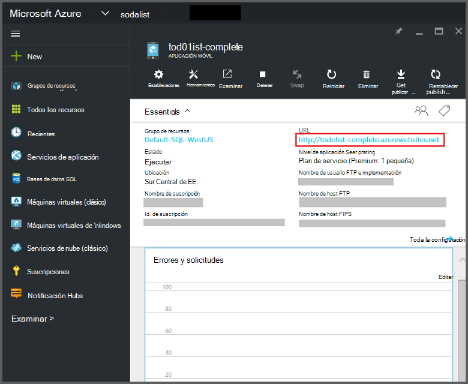
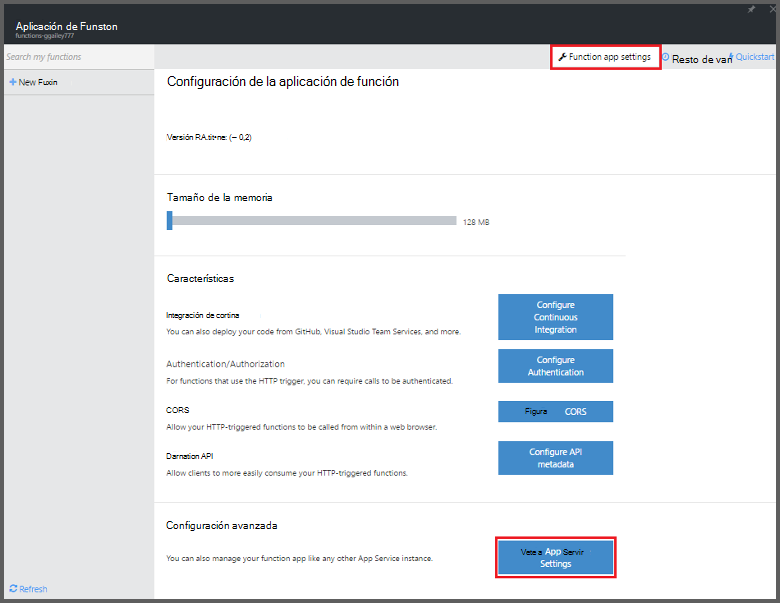
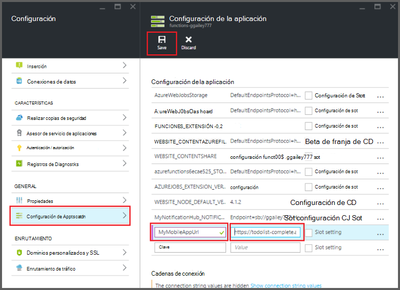

<properties
    pageTitle="Enlaces de aplicaciones móviles de funciones de Azure | Microsoft Azure"
    description="Entender cómo usar enlaces de aplicaciones móviles de Azure en las funciones de Azure."
    services="functions"
    documentationCenter="na"
    authors="ggailey777"
    manager="erikre"
    editor=""
    tags=""
    keywords="funciones de Azure, funciones, el procesamiento de eventos, cálculo dinámica, sin servidor arquitectura"/>

<tags
    ms.service="functions"
    ms.devlang="multiple"
    ms.topic="reference"
    ms.tgt_pltfrm="multiple"
    ms.workload="na"
    ms.date="08/30/2016"
    ms.author="glenga"/>

# Enlaces de aplicaciones móviles de funciones de Azure

[AZURE.INCLUDE [functions-selector-bindings](../../includes/functions-selector-bindings.md)]

En este artículo se explica cómo configurar y enlaces de aplicaciones de Azure Mobile código en las funciones de Azure. 

[AZURE.INCLUDE [intro](../../includes/functions-bindings-intro.md)] 

Aplicaciones de Azure aplicación de servicio móvil le permite exponer datos de extremo de tabla a los clientes móviles. En este mismos datos tabulares se pueden usar con ambos entrada y salida enlaces en las funciones de Azure. Porque admite esquema dinámicas, una aplicación móvil de back-end de Node.js es ideal para exponer datos tabulares para su uso con sus funciones. Esquema dinámico está habilitado de forma predeterminada y se debe deshabilitar en una aplicación móvil de producción. Para obtener más información sobre los extremos de la tabla en un servidor Node.js, consulte [información general: tabla operaciones](../app-service-mobile/app-service-mobile-node-backend-how-to-use-server-sdk.md#TableOperations). En las aplicaciones móviles, la copia back-end Node.js admite en el portal de exploración y edición de tablas. Para obtener más información, vea [en el portal de edición](../app-service-mobile/app-service-mobile-node-backend-how-to-use-server-sdk.md#in-portal-editing) en el tema SDK Node.js. Cuando se utiliza una aplicación móvil de back-end de .NET con funciones de Azure, debe actualizar manualmente el modelo de datos según sea necesario por su función. Para obtener más información sobre los extremos de la tabla en una aplicación móvil de back-end de .NET, vea [Cómo: definir un controlador de tabla](../app-service-mobile/app-service-mobile-dotnet-backend-how-to-use-server-sdk.md#define-table-controller) en el tema del SDK .NET back-end. 

## Crear una variable de entorno para la dirección URL de back-end de una aplicación móvil

Enlaces de aplicaciones móviles actualmente requieren que crear una variable de entorno que devuelve la dirección URL del servidor de la aplicación móvil. Esta dirección URL puede encontrarse en el [portal de Azure](https://portal.azure.com) localizar la aplicación móvil y abriendo la hoja.

Para establecer esta dirección URL como una variable de entorno en la aplicación de la función:

1. En la aplicación de la función en el [portal de funciones de Azure](https://functions.azure.com/signin), haga clic en **configuración de la aplicación de función** > **vaya a configuración del servicio de aplicación**. 

    

2. En la aplicación de la función, haga clic en **toda la configuración**, desplácese hacia abajo hasta la **configuración de la aplicación**, a continuación, en tipo de **configuración de la aplicación** un nuevo **nombre** para la variable de entorno, pegue la dirección URL en **valor**, asegúrese de usar la combinación de HTTPS, a continuación, haga clic en **Guardar** y cerrar el módulo de aplicación de la función para devolver el portal de funciones.   

    

Ahora puede establecer esta nueva variable de entorno como el campo de *conexión* en los enlaces.

## Usar una clave de API para el acceso seguro a los extremos de la tabla de aplicaciones móviles.

En las funciones de Azure, enlaces de tabla móvil le permiten especificar una clave de API, que es un secreto compartido que se pueden usar para evitar el acceso no deseado desde aplicaciones que no sean de sus funciones. Aplicaciones móviles no tiene compatibilidad integrada para la autenticación de clave API. Sin embargo, puede implementar una clave API en la aplicación móvil de back-end Node.js siguiendo los ejemplos de [implementación de una clave de la API de back-end de Azure aplicación Servicio móvil aplicaciones](https://github.com/Azure/azure-mobile-apps-node/tree/master/samples/api-key). Del mismo modo que pueda implementar una clave API en una [aplicación móvil de .NET back-end](https://github.com/Azure/azure-mobile-apps-net-server/wiki/Implementing-Application-Key).

>[AZURE.IMPORTANT] No se debe distribuir esta clave API con los clientes de la aplicación móvil, se debe solo distribuir segura a los clientes del servicio, como las funciones de Azure. 

## Enlace de entrada de Azure aplicaciones móviles

Enlaces de entrada pueden cargar un registro desde un punto final de la tabla móvil y pasar directamente a su enlace. El registro que se determina ID según el desencadenador que invoca la función. En una función de C#, se envían automáticamente los cambios realizados en el registro nuevo a la tabla cuando sale de la función correctamente.

#### enlace de entrada Function.JSON para las aplicaciones móviles

El archivo *function.json* es compatible con las siguientes propiedades:

- `name`: Nombre variable usado en el código de la función para el nuevo registro.
- `type`: Pujando tipo debe estar establecida en *mobileTable*.
- `tableName`: La tabla donde se creará el nuevo registro.
- `id`: El identificador del registro a recuperar. Esta propiedad admite enlaces similar a `{queueTrigger}`, que utiliza el valor de cadena del mensaje de cola como el Id. de registro
- `apiKey`: Cadena que es la configuración de la aplicación que especifica la clave de API opcional para la aplicación móvil. Esto es necesario cuando la aplicación móvil utiliza una clave de API para restringir el acceso de cliente.
- `connection`: Cadena que es el nombre de la variable de entorno en configuración de la aplicación que especifica la dirección URL de la aplicación móvil de back-end.
- `direction`: Dirección, que debe estar establecida en **el enlace.

Ejemplo de archivo de *function.json* :

    {
      "bindings": [
        {
          "name": "record",
          "type": "mobileTable",
          "tableName": "MyTable",
          "id" : "{queueTrigger}",
          "connection": "My_MobileApp_Url",
          "apiKey": "My_MobileApp_Key",
          "direction": "in"
        }
      ],
      "disabled": false
    }

#### Ejemplo de código de Azure aplicaciones móviles para un desencadenador de cola C#

En función de la function.json de ejemplo anterior, la recupera enlace de entrada, el registro de aplicaciones de Mobile extremo con el identificador que coincide con la cadena de mensaje de la cola y pasa al parámetro de *registro* de la tabla. Cuando no se encuentra el registro, el parámetro es null. A continuación, se actualiza el registro con el nuevo valor de *texto* cuando sale de la función.

    #r "Newtonsoft.Json"    
    using Newtonsoft.Json.Linq;
    
    public static void Run(string myQueueItem, JObject record)
    {
        if (record != null)
        {
            record["Text"] = "This has changed.";
        }    
    }

#### Ejemplo de código de Azure aplicaciones móviles para un desencadenador de cola Node.js

En función de la function.json de ejemplo anterior, la recupera enlace de entrada, el registro de aplicaciones de Mobile extremo con el identificador que coincide con la cadena de mensaje de la cola y pasa al parámetro de *registro* de la tabla. En las funciones Node.js, los registros actualizados no se envían a la tabla. Este ejemplo de código escribe el registro recuperado en el registro.

    module.exports = function (context, input) {    
        context.log(context.bindings.record);
        context.done();
    };

## Enlace de salida de Azure aplicaciones móviles

La función puede escribir un registro en un extremo de la tabla de aplicaciones móviles mediante un enlace de salida. 

#### enlace de salida Function.JSON para las aplicaciones móviles

El archivo function.json es compatible con las siguientes propiedades:

- `name`: Nombre variable usado en el código de la función para el nuevo registro.
- `type`: Tipo de enlace debe estar establecida en *mobileTable*.
- `tableName`: La tabla donde se crea el nuevo registro.
- `apiKey`: Cadena que es la configuración de la aplicación que especifica la clave de API opcional para la aplicación móvil. Esto es necesario cuando la aplicación móvil utiliza una clave de API para restringir el acceso de cliente.
- `connection`: Cadena que es el nombre de la variable de entorno en configuración de la aplicación que especifica la dirección URL de la aplicación móvil de back-end.
- `direction`: Dirección enlace, que debe establecerse *para*.

Ejemplo function.json:

    {
      "bindings": [
        {
          "name": "record",
          "type": "mobileTable",
          "tableName": "MyTable",
          "connection": "My_MobileApp_Url",
          "apiKey": "My_MobileApp_Key",
          "direction": "out"
        }
      ],
      "disabled": false
    }

#### Ejemplo de código de Azure aplicaciones móviles para un desencadenador de cola C#

Este ejemplo de código C# inserta un nuevo registro en un extremo de la tabla de aplicaciones de Mobile con una propiedad de *texto* en la tabla especificada en el enlace anterior.

    public static void Run(string myQueueItem, out object record)
    {
        record = new {
            Text = $"I'm running in a C# function! {myQueueItem}"
        };
    }

#### Ejemplo de código de Azure aplicaciones móviles para un desencadenador de cola Node.js

Este ejemplo de código Node.js inserta un nuevo registro en un extremo de la tabla de aplicaciones de Mobile con una propiedad de *texto* en la tabla especificada en el enlace anterior.

    module.exports = function (context, input) {
    
        context.bindings.record = {
            text : "I'm running in a Node function! Data: '" + input + "'"
        }   
    
        context.done();
    };

## Pasos siguientes

[AZURE.INCLUDE [next steps](../../includes/functions-bindings-next-steps.md)]
