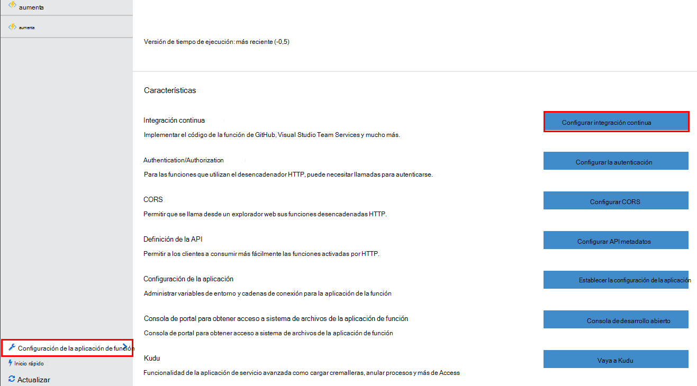
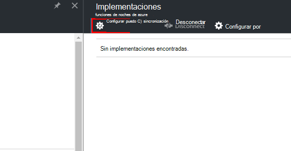
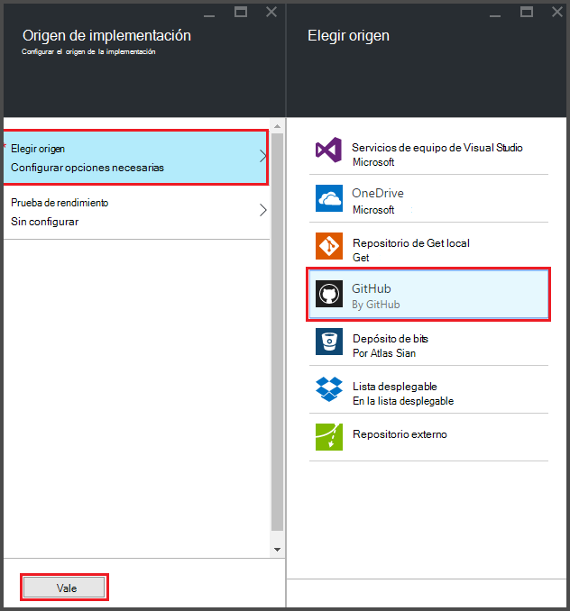
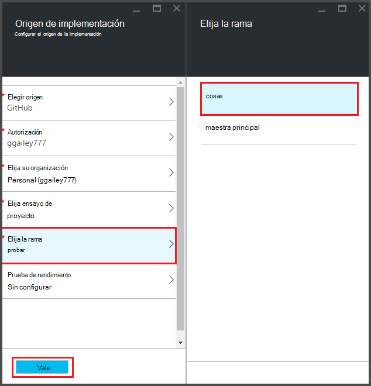
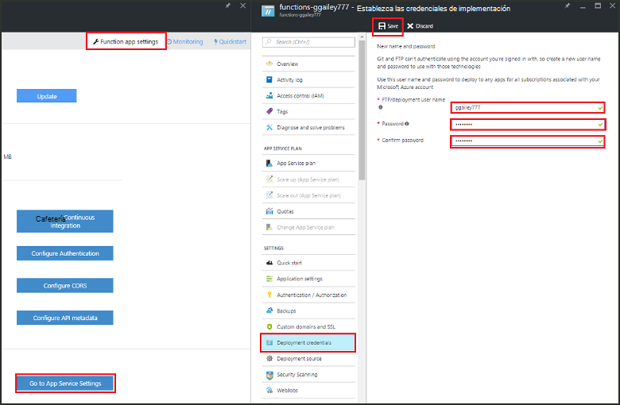
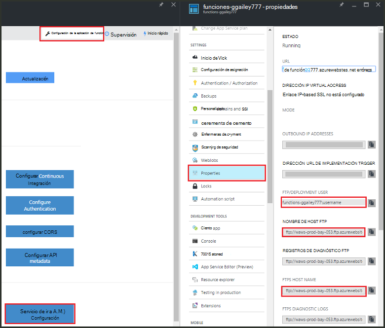
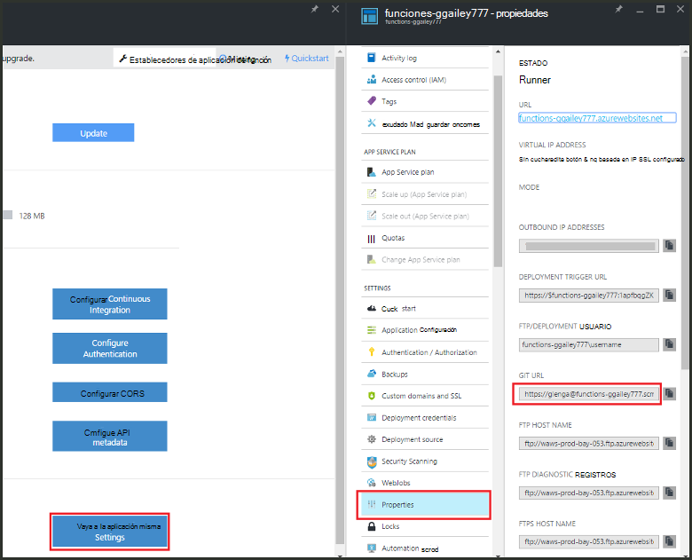

<properties
   pageTitle="Implementación continua para las funciones de Azure | Microsoft Azure"
   description="Usar funciones de implementación continua de servicio de la aplicación de Azure publicar sus funciones de Azure."
   services="functions"
   documentationCenter="na"
   authors="ggailey777"
   manager="erikre"
   editor=""
   tags=""
   />

<tags
   ms.service="functions"
   ms.devlang="multiple"
   ms.topic="article"
   ms.tgt_pltfrm="multiple"
   ms.workload="na"
   ms.date="09/25/2016"
   ms.author="glenga"/>

# Implementación continua para las funciones de Azure 

Funciones de Azure facilita la configurar la implementación continua de la aplicación de la función. Funciones aprovecha la integración de servicios de aplicación de Azure con BitBucket, Dropbox, GitHub y Visual Studio Team Services (VSTS) para habilitar un flujo de trabajo de implementación continua donde Azure extrae las actualizaciones para el código de funciones cuándo se publican en uno de estos servicios. Si está acostumbrado a las funciones de Azure, comience con [Información general de las funciones de Azure](functions-overview.md).

Implementación continua es una buena opción para proyectos donde varios e integradas de contribuciones frecuentes. También le permite mantener el control de código fuente en el código de funciones. Actualmente se admiten los siguientes orígenes de implementación:

+ [BitBucket](https://bitbucket.org/)
+ [Lista desplegable](https://bitbucket.org/)
+ [GIT local repo](../app-service-web/app-service-deploy-local-git.md)
+ GIT externo repo
+ [GitHub]
+ Mercuriano repo externo
+ [OneDrive](https://onedrive.live.com/)
+ Servicios de equipo de Visual Studio

Implementaciones se configuran en una base de la aplicación de función. Después de habilita implementación continuo, acceso al código de la función en el portal se establece en *solo lectura*.

## Requisitos de implementación continua

Debe tener su origen de implementación configurado y su código de funciones en el origen de implementación antes de configuración continuo implementación. En una implementación de la aplicación de función determinada, cada función reside en un subdirectorio con nombre, el nombre de la función se realiza el nombre del directorio. Esta estructura de carpetas es, esencialmente, el código del sitio. 

[AZURE.INCLUDE [functions-folder-structure](../../includes/functions-folder-structure.md)]

## Implementación de configurar continuo

Utilice el procedimiento siguiente para configurar la implementación continua para una aplicación de la función existente:

1. En la aplicación de la función en el [portal de funciones de Azure](https://functions.azure.com/signin), haga clic en **configuración de la aplicación de función** > **Configurar la integración continua** > **el programa de instalación**.

    
    
    
    
    También puede acceder a los módulos implementaciones desde el tutorial de funciones haciendo clic en **iniciar desde el control de origen**.

2. En el módulo de implementaciones, haga clic en **Elegir origen**, a continuación, para rellenar la información de su origen de implementación elegido y haga clic en **Aceptar**.

    

Después de configura la implementación continua, todos los archivos de cambios en el origen de implementación se copian en la aplicación de la función y se activa una implementación completa del sitio. El sitio se redistribuirá al actualizar los archivos en el origen.

##Opciones de implementación

Las siguientes son algunas situaciones habituales de implementación:

+ 

###Crear una implementación de ensayo

Función aplicaciones todavía no admite ranuras de implementación. Sin embargo, aún puede administrar implementaciones independientes de ensayo y de producción mediante la integración continua.

El proceso para configurar y trabajar con una implementación de ensayo generalmente es similar a esta:

1. Crear dos aplicaciones de función en la suscripción, uno para el código de producción y otro para el ensayo. 

2. Crear un origen de implementación, si todavía no tiene uno. Usamos [GitHub].
 
3. Para la aplicación de función de producción, realice los pasos anteriores en **implementación continua de configuración de** y establezca la rama de implementación en la rama principal de su repo GitHub.

    

4. Repita este paso para la aplicación de la función provisional, pero esta vez seleccione la rama provisional en su repo GitHub. Si no admite el origen de la implementación de bifurcación, utilice una carpeta diferente.
 
5. Realizar actualizaciones en el código en la carpeta o rama provisional y luego compruebe que dichos cambios se reflejarán en la implementación de ensayo.

6. Después de probar, combinar los cambios de la rama provisional en la bifurcación principal. Esto activará la implementación de la aplicación de la función de producción. Si su origen de implementación no admite ramas, sobrescribir los archivos en la carpeta de producción con los archivos de la carpeta de ensayo.

###Mover funciones existentes a implementación continua

Cuando tenga las funciones existentes que se crean y mantienen en el portal, debe descargar los archivos de código de función existentes mediante FTP o el repositorio de Git local antes de puede implementación continua de configuración como se describió anteriormente. Puede hacerlo en la configuración del servicio de aplicación de la aplicación de la función. Después de descargan los archivos, se puede cargar a su origen de implementación continua elegido.

>[AZURE.NOTE]Después de configurar la integración continua, ya no podrá modificar los archivos de origen en el portal de funciones.

####Cómo: configurar las credenciales de la implementación
Antes de poder descargar archivos de la aplicación de la función, debe configurar sus credenciales para tener acceso al sitio, lo que puede hacer desde el portal. Las credenciales se establecen en el nivel de aplicación de la función.

1. En la aplicación de la función en el [portal de funciones de Azure](https://functions.azure.com/signin), haga clic en **configuración de la aplicación de función** > **vaya a configuración del servicio de aplicación** > **credenciales de implementación**.

    

2. Escriba un nombre de usuario y contraseña y luego haga clic en **Guardar**. Ahora puede usar estas credenciales para tener acceso a la aplicación de la función de FTP o la repo Git integrado.

####Cómo: descargar archivos mediante FTP

1. En la aplicación de la función en el [portal de funciones de Azure](https://functions.azure.com/signin), haga clic en **configuración de la aplicación de función** > **vaya a configuración del servicio de aplicación** > **Propiedades** y copie los valores de **Usuario FTP e implementación**, **Nombre de Host FTP**y **FTPS nombre de Host**.  
**Usuario FTP/implementación** deben especificarse como se muestra en el portal, incluido el nombre de la aplicación para proporcionar contexto apropiado para el servidor FTP.

    
    
2. Desde el cliente de FTP, use la información de conexión recopilada para conectarse a su aplicación y descargar los archivos de origen para sus funciones.

####Cómo: descargar archivos mediante el repositorio de Git local

1. En la aplicación de la función en el [portal de funciones de Azure](https://functions.azure.com/signin), haga clic en **configuración de la aplicación de función** > **Configurar la integración continua** > **el programa de instalación**.

2. En el módulo de implementaciones, haga clic en **Elegir origen**, **repositorio Git Local**y, a continuación, haga clic en **Aceptar**.
 
3. Haga clic en **Ir a configuración del servicio de aplicación** > **Propiedades** y observe el valor de dirección URL Git. 
    
    

4. Clonar la repo en su equipo local con una línea de comandos Git cuenta o la herramienta Git favorito. El comando de clonar Git tiene el siguiente aspecto:

        git clone https://username@my-function-app.scm.azurewebsites.net:443/my-function-app.git

5. Recuperar archivos de la aplicación de la función a la copia en el equipo local, como en el ejemplo siguiente:

        git pull origin master

    Si se solicita, proporcione el nombre de usuario y la contraseña para la implementación de aplicación de la función.  

[GitHub]: https://github.com/
