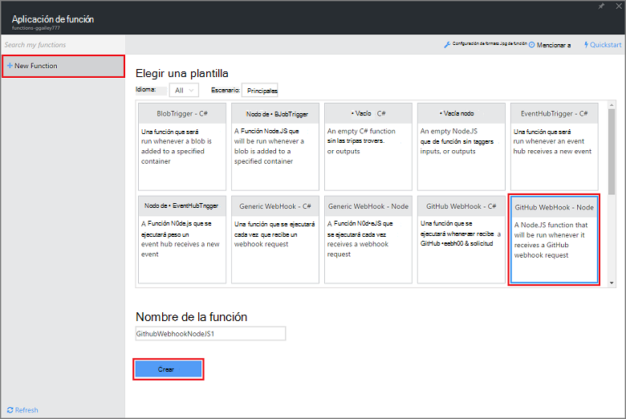
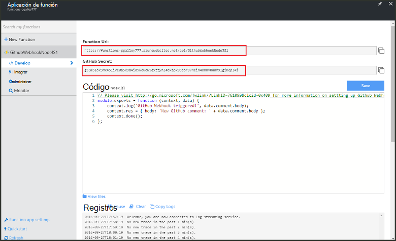
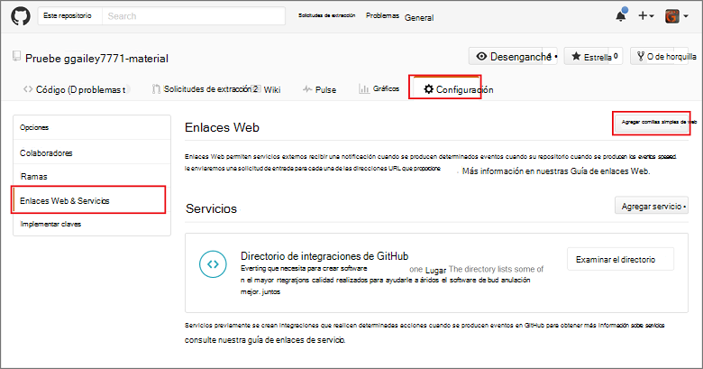
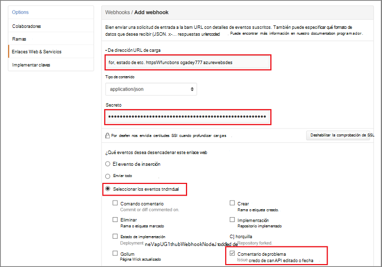

<properties
   pageTitle="Crear un enlace de web o de la función API Azure | Microsoft Azure"
   description="Utilizar funciones de Azure para crear una función que se invoca un WebHook o API de llamadas."
   services="azure-functions"
   documentationCenter="na"
   authors="ggailey777"
   manager="erikre"
   editor=""
   tags=""
   />

<tags
   ms.service="functions"
   ms.devlang="multiple"
   ms.topic="get-started-article"
   ms.tgt_pltfrm="multiple"
   ms.workload="na"
   ms.date="08/30/2016"
   ms.author="glenga"/>
   
# Crear un webhook o la función API de Azure

Funciones de Azure es una experiencia de cálculo a petición, condicionados por eventos que le permite crear programado o desencadenado unidades de código implementado en una gran variedad de lenguajes de programación. Para obtener más información acerca de las funciones de Azure, vea la [Información general de las funciones de Azure](functions-overview.md).

En este tema se muestra cómo crear una nueva función Node.js que invoca un webhook GitHub. La nueva función se crea basada en una plantilla predefinida en el portal de funciones de Azure. También puede ver un breve vídeo para ver cómo se realizan estos pasos en el portal.

## Vea el vídeo

El siguiente vídeo se muestra cómo llevar a cabo los pasos básicos en este tutorial 

[AZURE.VIDEO create-a-web-hook-or-api-azure-function]

##Crear una función activa webhook desde la plantilla

Una aplicación de la función aloja la ejecución de las funciones de Azure. Antes de crear una función, debe tener una cuenta de Azure active. Si todavía no tiene una cuenta de Azure, [están disponibles las cuentas gratuitas](https://azure.microsoft.com/free/). 

1. Vaya al [portal de funciones de Azure](https://functions.azure.com/signin) e iniciar sesión con su cuenta de Azure.

2. Si tiene una aplicación de la función existente para usar, selecciónela en **las aplicaciones de la función** , a continuación, haga clic en **Abrir**. Para crear una nueva aplicación de la función, escriba un **nombre** único para la nueva aplicación de función o acepte la generado una, seleccione su preferido **región**, haga clic en **crear + Introducción**. 

3. En la aplicación de la función, haga clic en **+ nueva función** > **GitHub Webhook - nodo** > **crear**. Esto crea una función con un nombre predeterminado que se basa en la plantilla especificada. 

     

4. En **desarrollar**, tenga en cuenta la función de express.js de ejemplo en la ventana de **código** . Esta función recibe una solicitud de GitHub de un webhook de comentario del problema, inicia el texto del problema y envía una respuesta a la webhook como `New GitHub comment: <Your issue comment text>`.

     

5. Copie los valores de la **Dirección URL de la función** y **GitHub secreto** . Necesitará estos cuando se crea la webhook en GitHub. 

6. Desplácese hacia abajo hasta que se **ejecute**, tenga en cuenta el cuerpo JSON predefinido de un comentario del problema en el cuerpo de la solicitud y luego haga clic en **Ejecutar**. 
 
    Siempre puede probar una nueva función basada en la plantilla directamente en la pestaña **desarrollar** proporcionando cualquiera espera cuerpo datos JSON y haciendo clic en el botón **Ejecutar** . En este caso, la plantilla tiene un cuerpo predefinido para un comentario de problema. 
 
A continuación, se creará el webhook real en el repositorio de GitHub.

##Configurar la webhook

1. En GitHub, vaya a un repositorio que es el propietario; Esto incluye todos los repositorios que haya bifurcado.
 
2. Haga clic en **configuración de** > **Webhooks & servicios** > **webhook de agregar**.

       

3. Pegue la dirección URL y el secreto de la función en **Dirección URL de carga** y **secreto**, a continuación, haga clic en **Seleccionar eventos individuales**, seleccione **problema comentario** y haga clic en **Agregar webhook**.

     

En este momento, la webhook GitHub está configurado para desencadenar la función cuando se agrega un nuevo comentario de problema.  
Ahora, es el momento para probarlo.

##La función de prueba

1. En su repo GitHub, abra la pestaña de **problemas** en una nueva ventana del explorador, haga clic en **Nuevo problema**, escriba un título y haga clic en **Enviar de nuevo problema**. También puede abrir un problema existente.

2. En el problema, escriba un comentario y haga clic en **comentario**. En este momento, puede volver a su nueva webhook en GitHub y en **Las entregas recientes** ven que se envía una solicitud de webhook y que es el cuerpo de respuesta `New GitHub comment: <Your issue comment text>`.

3. En el portal de funciones, desplácese hacia abajo hasta los registros y vea que se ha activado la función y el valor `New GitHub comment: <Your issue comment text>` se escribe en los registros de transmisión por secuencias.

##Pasos siguientes

Consulte estos temas para obtener más información acerca de las funciones de Azure.

+ [Referencia del programador de Azure funciones](functions-reference.md)  
Referencia del programador para la codificación de funciones.
+ [Probar funciones de Azure](functions-test-a-function.md)  
Describe diversas herramientas y técnicas para probar sus funciones.
+ [Cómo ampliar las funciones de Azure](functions-scale.md)  
Se tratan los planes de servicio disponibles con funciones de Azure, incluidos el plan de servicio dinámicos y cómo elegir el plan de la derecha.  

[AZURE.INCLUDE [Getting Started Note](../../includes/functions-get-help.md)]
