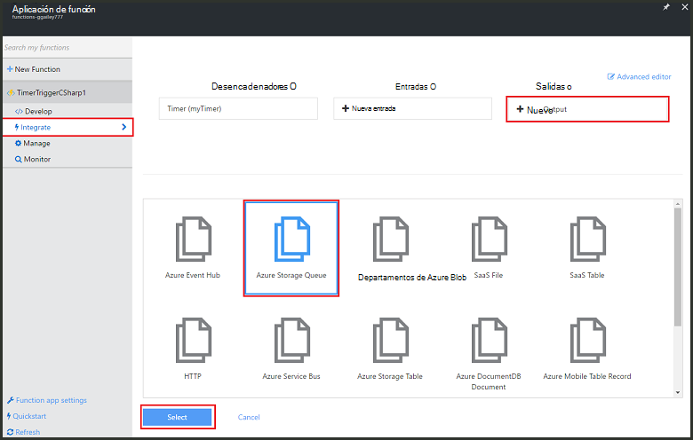
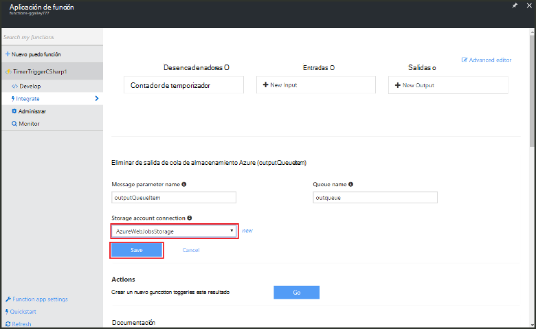

<properties
   pageTitle="Crear un evento en función de procesamiento | Microsoft Azure"
   description="Use funciones de Azure crear una función de C# que se ejecuta de acuerdo con un temporizador de evento."
   services="functions"
   documentationCenter="na"
   authors="ggailey777"
   manager="erikre"
   editor=""
   tags=""
   />

<tags
   ms.service="functions"
   ms.devlang="multiple"
   ms.topic="get-started-article"
   ms.tgt_pltfrm="multiple"
   ms.workload="na"
   ms.date="09/25/2016"
   ms.author="glenga"/>
   
# Crear un evento de procesamiento de la función de Azure

Funciones de Azure es una experiencia de cálculo a petición, condicionados por eventos que le permite crear programado o desencadenado unidades de código implementado en una gran variedad de lenguajes de programación. Para obtener más información acerca de las funciones de Azure, vea la [Información general de las funciones de Azure](functions-overview.md).

En este tema se muestra cómo crear una nueva función en C# que se ejecuta en función de un temporizador de evento para agregar los mensajes a una cola de almacenamiento. 

## Requisitos previos 

Antes de crear una función, debe tener una cuenta de Azure active. Si todavía no tiene una cuenta de Azure, [están disponibles las cuentas gratuitas](https://azure.microsoft.com/free/).

## Crear una función activa temporizador de la plantilla

Una aplicación de la función aloja la ejecución de las funciones de Azure. Antes de crear una función, debe tener una cuenta de Azure active. Si todavía no tiene una cuenta de Azure, [están disponibles las cuentas gratuitas](https://azure.microsoft.com/free/). 

1. Vaya al [portal de funciones de Azure](https://functions.azure.com/signin) e iniciar sesión con su cuenta de Azure.

2. Si tiene una aplicación de la función existente para usar, selecciónela en **las aplicaciones de la función** , a continuación, haga clic en **Abrir**. Para crear una nueva aplicación de la función, escriba un **nombre** único para la nueva aplicación de función o acepte la generado una, seleccione su preferido **región**, haga clic en **crear + Introducción**. 

3. En la aplicación de la función, haga clic en **+ nueva función** > **TimerTrigger - C#** > **crear**. Esto crea una función con un nombre predeterminado que se ejecute en la programación predeterminada de una vez cada minuto. 

    

4. En la nueva función, haga clic en la pestaña **integrar** > **Nueva salida** > **Cola de almacenamiento de Azure** > **Seleccione**.

    

5. En **cola de almacenamiento de Azure salida**, seleccione una **conexión de la cuenta de almacenamiento**, o cree uno nuevo y después haga clic en **Guardar**. 

    

6. En la pestaña **desarrollar** , reemplace el script C# existente en la ventana **código** con el siguiente código:

        using System;
        
        public static void Run(TimerInfo myTimer, out string outputQueueItem, TraceWriter log)
        {
            // Add a new scheduled message to the queue.
            outputQueueItem = $"Ping message added to the queue at: {DateTime.Now}.";
            
            // Also write the message to the logs.
            log.Info(outputQueueItem);
        }

    Este código agrega un nuevo mensaje a la cola con la fecha y hora actuales cuando se ejecuta la función.

7. Haga clic en **Guardar** y ver los **registros** de windows para la ejecución de la función siguiente.

8. (Opcional) Vaya a la cuenta de almacenamiento y compruebe que se agregan a la cola de mensajes.

9. Vuelva a la pestaña **integrar** y cambiar el campo de programación a `0 0 * * * *`. La función ahora ejecuta una vez cada hora. 

Esto es muy simplificada enlace de salida de ejemplo de una cola de almacenamiento y de un desencadenador de temporizador. Para obtener más información, vea [funciones de Azure temporizador desencadenador](functions-bindings-timer.md) y los temas de [funciones de Azure desencadenadores y enlaces para el almacenamiento de Azure](functions-bindings-storage.md) .

##Pasos siguientes

Consulte estos temas para obtener más información acerca de las funciones de Azure.

+ [Referencia del programador de Azure funciones](functions-reference.md)  
Referencia del programador para funciones de codificación y definir desencadenadores y enlaces.
+ [Probar funciones de Azure](functions-test-a-function.md)  
Describe diversas herramientas y técnicas para probar sus funciones.
+ [Cómo ampliar las funciones de Azure](functions-scale.md)  
Se tratan los planes de servicio disponibles con funciones de Azure, incluidos el plan de servicio dinámicos y cómo elegir el plan de la derecha.  

[AZURE.INCLUDE [Getting Started Note](../../includes/functions-get-help.md)]
