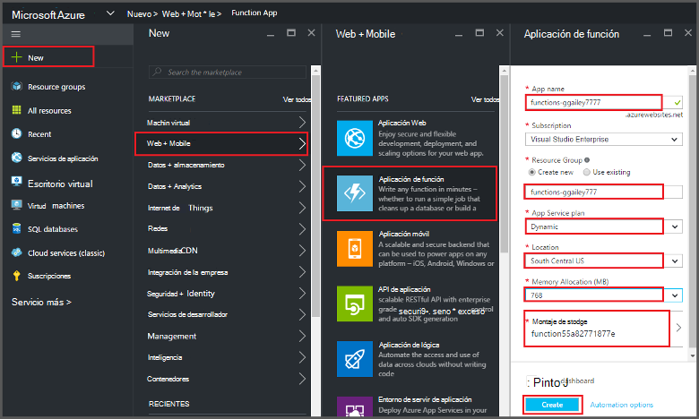
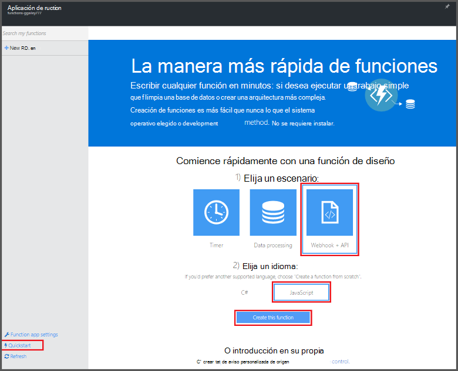
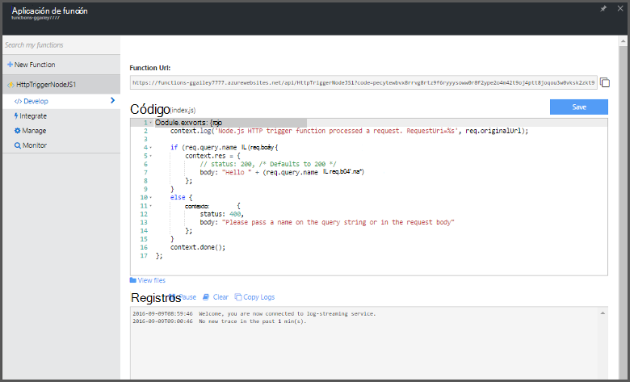

<properties
   pageTitle="Crear una función desde el Portal de Azure | Microsoft Azure"
   description="Crear su primera función Azure, una aplicación sin servidor, en menos de dos minutos."
   services="functions"
   documentationCenter="na"
   authors="ggailey777"
   manager="erikre"
   editor=""
   tags=""
/>

<tags
   ms.service="functions"
   ms.devlang="multiple"
   ms.topic="article"
   ms.tgt_pltfrm="multiple"
   ms.workload="na"
   ms.date="09/08/2016"
   ms.author="glenga"/>

#Crear una función desde el portal de Azure

##Información general
Funciones de Azure es una experiencia de cálculo a petición, condicionados por eventos que se extiende la plataforma de Azure aplicación existente con funciones para implementar código desencadenado por eventos que se producen en otros servicios de Azure, SaaS productos y sistemas locales. Con funciones de Azure, las aplicaciones escalar según demanda y pagar solo para los recursos que consume. Azure permite funciones crear programado o desencadenado unidades de código que ha implementado en diversos lenguajes de programación. Para obtener más información acerca de las funciones de Azure, vea la [Información general de las funciones de Azure](functions-overview.md).

Este tema muestra cómo usar el portal de Azure para crear un simple "Hola a todos" función de Azure Node.js que invoca un desencadenador de HTTP. Antes de poder crear una función en el portal de Azure, debe crear una aplicación de la función explícitamente en la aplicación de servicio de Azure. Para que la aplicación de la función crea automáticamente, consulte [el tutorial de rápido de funciones de Azure](functions-create-first-azure-function.md), que es una experiencia más sencilla de tutorial e incluye un vídeo.

##Crear una aplicación de función

Una aplicación de la función aloja la ejecución de las funciones de Azure. Siga estos pasos para crear una aplicación de la función en el portal de Azure.

Antes de crear la primera función, debe tener una cuenta de Azure active. Si todavía no tiene una cuenta de Azure, [están disponibles las cuentas gratuitas](https://azure.microsoft.com/free/).

1. Vaya al [portal de Azure](https://portal.azure.com) e iniciar sesión con su cuenta de Azure.

2. Haga clic en **+ nuevo** > **Web + Mobile** > **Aplicación de la función**, seleccione la **suscripción**, escriba un **nombre de aplicación** único que identifica la aplicación de la función, a continuación, especifique las siguientes opciones:

    + **[Grupo de recursos](../azure-portal/resource-group-portal.md/)**: seleccione **Crear nuevo** y escriba un nombre para el nuevo grupo de recursos. También puede elegir un grupo de recursos existente, pero no podrá crear un plan de servicio de aplicación dinámico para la aplicación de la función.
    + **[Plan de servicios de aplicación](../app-service/azure-web-sites-web-hosting-plans-in-depth-overview.md)**: elija *dinámicos* o *clásico*. 
        + **Dinámica**: el tipo de plan predeterminado para las funciones de Azure. Al elegir un plan dinámico, también debe elegir la **ubicación** y establecer la **Asignación de memoria** (en MB). Para obtener información acerca de cómo afecta la asignación de memoria costos, vea [funciones de Azure precios](https://azure.microsoft.com/pricing/details/functions/). 
        + **Clásica**: un plan de servicios de aplicación clásico requiere que cree un **plan o ubicación del servicio de aplicación** o seleccione uno existente. Estos valores determinan la [ubicación de las características, costo y recursos de cálculo](https://azure.microsoft.com/pricing/details/app-service/) asociado a la aplicación.  
    + **Cuenta de almacenamiento**: cada aplicación de la función requiere una cuenta de almacenamiento. Puede elegir una cuenta de almacenamiento existente o crear uno. 

    

3. Haga clic en **crear** para aprovisionar e implemente la nueva aplicación de la función.  

Ahora que se aprovisiona la aplicación de la función, puede crear su primera función.

## Crear una función

Estos pasos, crean una función desde el tutorial de funciones de Azure.

1. En la pestaña **Tutorial rápido** , haga clic en **WebHook + API** y **JavaScript**, haga clic en **crear una función**. Se crea una nueva función Node.js predefinida. 

    

2. (Opcional) En este momento en el tutorial, puede elegir una visita rápida de las características de las funciones de Azure en el portal.   Una vez que ha realizado u omitió el recorrido, puede probar la nueva función con el desencadenador de HTTP.

##La función de prueba

Puesto que los tutoriales de Azure funciones contienen código funcional, puede probar la nueva función inmediatamente.

1. En la pestaña **desarrollar** , revise la ventana de **código** y observe que este código Node.js espera una solicitud HTTP con un valor de *nombre* pasado en el cuerpo del mensaje o en una cadena de consulta. Cuando se ejecuta la función, se devuelve este valor en el mensaje de respuesta.

    

2. Desplácese hacia abajo hasta el cuadro de texto de **cuerpo de la solicitud** , cambie el valor de la propiedad *nombre de* su nombre y haga clic en **Ejecutar**. Verá que se activa la ejecución por una solicitud de HTTP de prueba, se escribe información en los registros de streaming y se muestra la respuesta "Hola" en el **resultado**. 

3. Para desencadenar la ejecución de la misma función desde otra ventana del explorador o pestaña, copie el valor de **Dirección URL de la función** de la pestaña **desarrollar** y péguela en una barra de direcciones del explorador, el valor de cadena de consulta de datos anexados `&name=yourname` y presione ENTRAR. Se escribe la misma información en los registros y el explorador mostrará la respuesta "Hola" como antes.

##Pasos siguientes

En este tutorial se muestra una ejecución muy simple de una función de HTTP desencadenadas básica. Consulte estos temas para obtener más información sobre el uso de la potencia de Azure funciones en las aplicaciones.

+ [Referencia del programador de Azure funciones](functions-reference.md)  
Referencia del programador para funciones de codificación y definir desencadenadores y enlaces.
+ [Probar funciones de Azure](functions-test-a-function.md)  
Describe diversas herramientas y técnicas para probar sus funciones.
+ [Cómo ampliar las funciones de Azure](functions-scale.md)  
Se tratan los planes de servicio disponibles con funciones de Azure, incluidos el plan de servicio dinámicos y cómo elegir el plan de la derecha. 
+ [¿Qué es el servicio de aplicación de Azure?](../app-service/app-service-value-prop-what-is.md)  
Funciones de Azure usa la plataforma de servicio de la aplicación de Azure funcionalidad principales como implementaciones, variables de entorno y diagnósticos. 

[AZURE.INCLUDE [Getting Started Note](../../includes/functions-get-help.md)]
