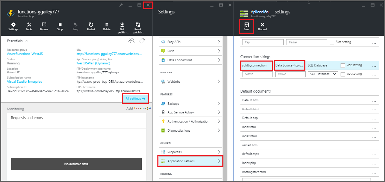
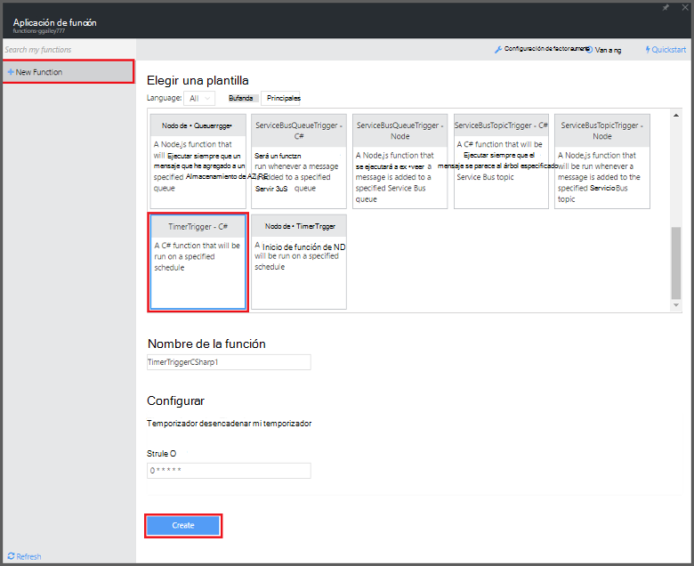

<properties
   pageTitle="Usar funciones de Azure para realizar una tarea programada de limpieza | Microsoft Azure"
   description="Use funciones de Azure crear una función de C# que se ejecuta de acuerdo con un temporizador de evento."
   services="functions"
   documentationCenter="na"
   authors="ggailey777"
   manager="erikre"
   editor=""
   tags=""
   />

<tags
   ms.service="functions"
   ms.devlang="multiple"
   ms.topic="article"
   ms.tgt_pltfrm="multiple"
   ms.workload="na"
   ms.date="09/26/2016"
   ms.author="glenga"/>
   
# Usar funciones de Azure para realizar una tarea programada de limpieza

Este tema muestra cómo usar funciones de Azure para crear una nueva función en C# que se ejecuta de acuerdo con un temporizador de evento para limpiar filas en una tabla de base de datos. La nueva función se crea basada en una plantilla predefinida en el portal de funciones de Azure. Para admitir este escenario, también debe establecer una cadena de conexión de base de datos como un servicio de aplicación de configuración de la aplicación de la función. 

## Requisitos previos 

Antes de crear una función, debe tener una cuenta de Azure active. Si todavía no tiene una cuenta de Azure, [están disponibles las cuentas gratuitas](https://azure.microsoft.com/free/).

En este tema se muestra un comando de Transact-SQL que se ejecuta una operación de limpieza masiva en la tabla denominada *TodoItems* en una base de datos de SQL. Esta misma tabla TodoItems se crea al completar el [tutorial rápido de aplicaciones de Azure aplicación de servicio móvil](../app-service-mobile/app-service-mobile-ios-get-started.md). También puede usar una base de datos de ejemplo si decide usar una tabla diferente, debe modificar el comando.

Puede obtener la cadena de conexión que se usa un servidor de la aplicación móvil en el portal en **todos los valores** > **configuración de la aplicación** > **cadenas de conexión** > **Mostrar valores de cadena de conexión** > **MS_TableConnectionString**. También puede obtener la cadena de conexión directa de una base de datos de SQL en el portal en **todos los valores** > **Propiedades** > **mostrar cadenas de conexión de base de datos** > **ADO.NET (autenticación SQL)**.

Este escenario utiliza una operación de forma masiva con la base de datos. Para que las operaciones de CRUD individuales de proceso de función en una tabla de aplicaciones móviles, debe usar en su lugar enlace de tabla de móvil.

## Establecer una cadena de conexión de base de datos SQL en la aplicación de la función

Una aplicación de la función aloja la ejecución de las funciones de Azure. Es recomendable almacenar cadenas de conexión y otra información confidencial en la configuración de aplicación de la función. Esto evita la revelación accidental cuando los extremos el código de la función en una repo en algún lugar. 

1. Vaya al [portal de funciones de Azure](https://functions.azure.com/signin) e iniciar sesión con su cuenta de Azure.

2. Si tiene una aplicación de la función existente para usar, selecciónela en **las aplicaciones de la función** , a continuación, haga clic en **Abrir**. Para crear una nueva aplicación de la función, escriba un **nombre** único para la nueva aplicación de función o acepte la generado una, seleccione su preferido **región**, haga clic en **crear + Introducción**. 

3. En la aplicación de la función, haga clic en **configuración de la aplicación de función** > **vaya a configuración del servicio de aplicación**. 

    

4. En la aplicación de la función, haga clic en **toda la configuración**, desplácese hacia abajo hasta la **configuración de la aplicación**, a continuación, en tipo de **cadenas de conexión** `sqldb_connection` **nombre**, pegue la cadena de conexión en **valor**, haga clic en **Guardar**y cerrar el módulo de aplicación de la función para devolver el portal de funciones.

    

Ahora, puede agregar el código de función C# que se conecta a la base de datos de SQL.

## Crear una función activa temporizador de la plantilla

1. En la aplicación de la función, haga clic en **+ nueva función** > **TimerTrigger - C#** > **crear**. Esto crea una función con un nombre predeterminado que se ejecute en la programación predeterminada de una vez cada minuto. 

    

2. En el panel de **código** en la pestaña **desarrollar** , agregue las siguientes referencias de ensamblado en la parte superior de la función existente:

        #r "System.Configuration"
        #r "System.Data"

3. Agregue las siguientes `using` instrucciones a la función:

        using System.Configuration;
        using System.Data.SqlClient;
        using System.Threading.Tasks; 

4. Reemplazar la función **Ejecutar** existente con el siguiente código:

        public static async Task Run(TimerInfo myTimer, TraceWriter log)
        {
            var str = ConfigurationManager.ConnectionStrings["sqldb_connection"].ConnectionString;
            using (SqlConnection conn = new SqlConnection(str))
            {
                conn.Open();
                var text = "DELETE from dbo.TodoItems WHERE Complete='True'";
                using (SqlCommand cmd = new SqlCommand(text, conn))
                {
                    // Execute the command and log the # rows deleted.
                    var rows = await cmd.ExecuteNonQueryAsync();
                    log.Info($"{rows} rows were deleted");
                }
            }
        }

5. Haga clic en **Guardar**, ver los **registros** de windows para la ejecución de la función siguiente, tenga en cuenta el número de filas eliminadas de la tabla TodoItems.

6. (Opcional) Uso de la [aplicación de tutorial rápido de aplicaciones móviles](../app-service-mobile/app-service-mobile-ios-get-started.md), marcar los elementos adicionales como "completado", a continuación, volver a la ventana de **registros** y ver el mismo número de filas se eliminan por la función durante la ejecución del siguiente. 

##Pasos siguientes

Consulte estos temas para obtener más información acerca de las funciones de Azure.

+ [Referencia del programador de Azure funciones](functions-reference.md)  
Referencia del programador para funciones de codificación y definir desencadenadores y enlaces.
+ [Probar funciones de Azure](functions-test-a-function.md)  
Describe diversas herramientas y técnicas para probar sus funciones.
+ [Cómo ampliar las funciones de Azure](functions-scale.md)  
Se tratan los planes de servicio disponibles con funciones de Azure, incluidos el plan de servicio dinámicos y cómo elegir el plan de la derecha.  

[AZURE.INCLUDE [Getting Started Note](../../includes/functions-get-help.md)]