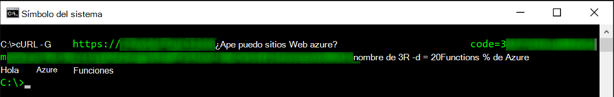
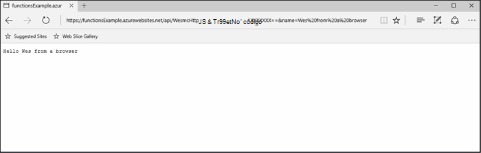
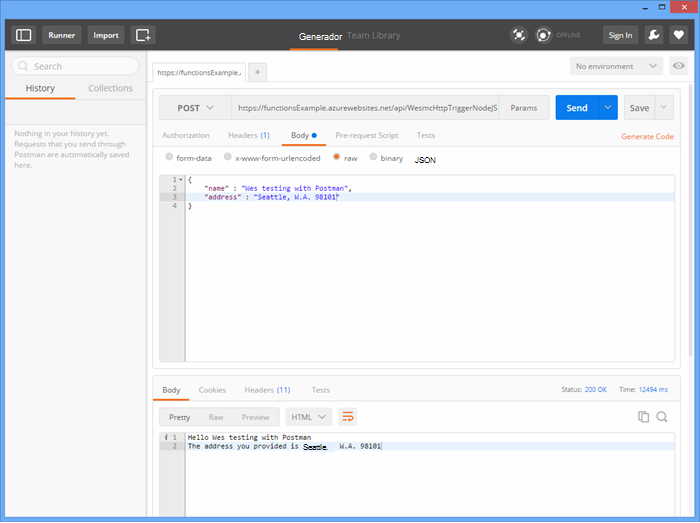
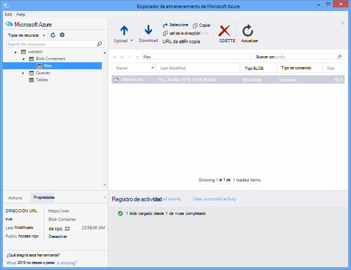

<properties
   pageTitle="Probar funciones Azure | Microsoft Azure"
   description="Pruebe las funciones de Azure mediante Postman, enrollar y Node.js."
   services="functions"
   documentationCenter="na"
   authors="wesmc7777"
   manager="erikre"
   editor=""
   tags=""
   keywords="Azure funciones, funciones, procesamiento de eventos, webhooks, cálculo dinámica, sin servidor arquitectura, pruebas"/>

<tags
   ms.service="functions"
   ms.devlang="multiple"
   ms.topic="article"
   ms.tgt_pltfrm="multiple"
   ms.workload="na"
   ms.date="08/19/2016"
   ms.author="wesmc"/>

# Probar funciones de Azure

## Información general

En este tutorial, guiaremos a través de los diferentes métodos para funciones de prueba. Se definirá una función de desencadenador de http que acepta la entrada a través de un parámetro de cadena de consulta o el cuerpo de la solicitud. El código de plantilla de **HttpTrigger Node.js función** predeterminado es compatible con un `name` parámetro de cadena de consulta. También agregaremos código para admitir dicho parámetro junto con `address` información para el usuario en el cuerpo de la solicitud.

## Crear una función para realizar pruebas

Para la mayoría de este tutorial, usamos una versión ligeramente modificada de la plantilla de **HttpTrigger Nodejs función** está disponible al crear una nueva función.  Puede revisar la [crear su primer tutorial de Azure función](functions-create-first-azure-function.md) si necesita ayuda para crear una nueva función.  Simplemente elija la plantilla de **HttpTrigger Nodejs función** al crear la función de prueba en el [Portal de Azure].

La plantilla de la función predeterminada básicamente es una función de llamadas internacionales de Hola a todos que vuelve el nombre del parámetro de cadena solicitud cuerpo o una consulta, `name=<your name>`.  Actualizaremos el código para también le permiten proporcionar el nombre y una dirección como contenido JSON en el cuerpo de la solicitud. A continuación, la función eco de nuevo al cliente cuando esté disponible.   

Actualizar la función con el siguiente código que usamos para realizar pruebas:

    module.exports = function(context, req) {
        context.log("Node.js HTTP trigger function processed a request. RequestUri=%s", req.originalUrl);
        context.log("Request Headers = " + JSON.stringify(req.headers));    
    
        if (req.query.name || (req.body && req.body.name)) {
            if (typeof req.query.name != "undefined") {
                context.log("Name was provided as a query string param..."); 
                ProcessNewUserInformation(context, req.query.name);
            }
            else {
                context.log("Processing user info from request body..."); 
                ProcessNewUserInformation(context, req.body.name, req.body.address);
            }
        }
        else {
            context.res = {
                status: 400,
                body: "Please pass a name on the query string or in the request body"
            };
        }
        context.done();
    };
    
    function ProcessNewUserInformation(context, name, address)
    {    
        context.log("Processing User Information...");            
        context.log("name = " + name);            
        echoString = "Hello " + name;
        
        if (typeof address != "undefined")
        {
            echoString += "\n" + "The address you provided is " + address;
            context.log("address = " + address);            
        }
        
        context.res = {
                // status: 200, /* Defaults to 200 */
                body: echoString
            };
    }

## Una función con herramientas de prueba

### Probar con rizo

A menudo al probar software, no es necesario buscar cualquiera más allá de la línea de comandos para ayudar a depurar la aplicación, esto no es diferente con funciones.

Para probar la función anterior, copie la **Dirección Url de la función** desde el portal. Tendrá el siguiente formato: 

    https://<Your Function App>.azurewebsites.net/api/<Your Function Name>?code=<your access code>
    
Esta es la dirección Url para la activación de la función, podemos probar esto mediante el comando de doblez en la línea de comandos para asegurarse de obtener (`-G` o `--get`) convocatoria de la función:

    curl -G https://<Your Function App>.azurewebsites.net/api/<Your Function Name>?code=<your access code>
    
En este ejemplo determinado anterior requiere un parámetro de cadena de consulta que se puede pasar como datos (`-d`) en el comando cURL:

    curl -G https://<Your Function App>.azurewebsites.net/api/<Your Function Name>?code=<your access code> -d name=<Enter a name here>
    
Presione ENTRAR y se muestra el resultado de la función en la línea de comandos.

En la ventana de **registros** portal, resultado similar al siguiente se registra al ejecutar la función:

    2016-04-05T21:55:09  Welcome, you are now connected to log-streaming service.
    2016-04-05T21:55:30.738 Function started (Id=ae6955da-29db-401a-b706-482fcd1b8f7a)
    2016-04-05T21:55:30.738 Node.js HTTP trigger function processed a request. RequestUri=https://functionsExample.azurewebsites.net/api/HttpTriggerNodeJS1?code=XXXXXXX&name=Azure Functions
    2016-04-05T21:55:30.738 Function completed (Success, Id=ae6955da-29db-401a-b706-482fcd1b8f7a)

### Pruebe con un explorador

Funciones que no requieren parámetros o solo necesita parámetros de cadena de consulta, se pueden probar con un explorador.

Para probar la función definido anteriormente, copie la **Dirección Url de la función** desde el portal. Tendrá el siguiente formato:

    https://<Your Function App>.azurewebsites.net/api/<Your Function Name>?code=<your access code>

Anexar la `name` parámetro de cadena de consulta siguiente, se usando un nombre real para la `<Enter a name here>` marcador de posición.

    https://<Your Function App>.azurewebsites.net/api/<Your Function Name>?code=<your access code>&name=<Enter a name here>

Pegue la dirección URL en el explorador y debe obtener una respuesta similar a la siguiente.

En la ventana de **registros** portal, resultado similar al siguiente se registra al ejecutar la función:

    2016-03-23T07:34:59  Welcome, you are now connected to log-streaming service.
    2016-03-23T07:35:09.195 Function started (Id=61a8c5a9-5e44-4da0-909d-91d293f20445)
    2016-03-23T07:35:10.338 Node.js HTTP trigger function processed a request. RequestUri=https://functionsExample.azurewebsites.net/api/WesmcHttpTriggerNodeJS1?code=XXXXXXXXXX==&name=Wes from a browser
    2016-03-23T07:35:10.338 Request Headers = {"cache-control":"max-age=0","connection":"Keep-Alive","accept":"text/html","accept-encoding":"gzip","accept-language":"en-US"}
    2016-03-23T07:35:10.338 Name was provided as a query string param.
    2016-03-23T07:35:10.338 Processing User Information...
    2016-03-23T07:35:10.369 Function completed (Success, Id=61a8c5a9-5e44-4da0-909d-91d293f20445)

### Pruebe con Postman

La herramienta recomendada para probar la mayoría de las funciones es Postman. Para instalar a Postman, consulte [Obtener Postman](https://www.getpostman.com/). Postman proporciona control sobre muchos más atributos de una solicitud HTTP.

> [AZURE.TIP] Utilice al cliente de resto en el que está familiarizado. Estas son algunas alternativas a Postman:  
> 
> * [Fiddler](http://www.telerik.com/fiddler)  
> * [PATA](https://luckymarmot.com/paw)  

Para probar la función con el cuerpo de la solicitud de Postman: 

1. Inicie a Postman desde el botón de **aplicaciones** en la esquina superior izquierda de la esquina de una ventana del explorador de Chrome.
2. Copie la **Dirección Url de la función** y pegarlo en Postman. Incluye el parámetro de cadena de consulta de código de acceso.
3. Cambiar el método HTTP **POST**.
4. Haga clic en el **cuerpo** > **sin formato** y agregar el cuerpo de la solicitud JSON similar al siguiente:

        {
            "name" : "Wes testing with Postman",
            "address" : "Seattle, W.A. 98101"
        }

5. Haga clic en **Enviar**.

La imagen siguiente muestra pruebas el ejemplo de la función eco simple en este tutorial. 

En la ventana de **registros** portal, resultado similar al siguiente se registra al ejecutar la función:

    2016-03-23T08:04:51  Welcome, you are now connected to log-streaming service.
    2016-03-23T08:04:57.107 Function started (Id=dc5db8b1-6f1c-4117-b5c4-f6b602d538f7)
    2016-03-23T08:04:57.763 Node.js HTTP trigger function processed a request. RequestUri=https://functions841def78.azurewebsites.net/api/WesmcHttpTriggerNodeJS1?code=XXXXXXXXXX==
    2016-03-23T08:04:57.763 Request Headers = {"cache-control":"no-cache","connection":"Keep-Alive","accept":"*/*","accept-encoding":"gzip","accept-language":"en-US"}
    2016-03-23T08:04:57.763 Processing user info from request body...
    2016-03-23T08:04:57.763 Processing User Information...
    2016-03-23T08:04:57.763 name = Wes testing with Postman
    2016-03-23T08:04:57.763 address = Seattle, W.A. 98101
    2016-03-23T08:04:57.795 Function completed (Success, Id=dc5db8b1-6f1c-4117-b5c4-f6b602d538f7)
    
### Probar un desencadenador de blobs con el Explorador de almacenamiento

Puede probar una función de desencadenador blob con [El Explorador de almacenamiento de Microsoft Azure](http://storageexplorer.com/).

1. En el [Portal de Azure] para la aplicación de funciones, cree una nueva función de desencadenador blob C#, F # o nodo. Establecer la ruta de acceso para supervisar el nombre de su contenedor de blob. Por ejemplo:

        files

2. Haga clic en el **+** botón para seleccionar o crear la cuenta de almacenamiento que desee usar. A continuación, haga clic en **crear**.

3. Crear un archivo de texto con el texto siguiente y guárdelo:

        A text file for blob trigger function testing.

4. Ejecutar el [Explorador de Microsoft Azure almacenamiento](http://storageexplorer.com/) y conéctese al contenedor blob en la cuenta de almacenamiento supervisado.

5. Haga clic en el botón **cargar** y cargue el archivo de texto.

    

    El código de función predeterminado blob desencadenador notificará el procesamiento de blobs de Windows en los registros:

        2016-03-24T11:30:10  Welcome, you are now connected to log-streaming service.
        2016-03-24T11:30:34.472 Function started (Id=739ebc07-ff9e-4ec4-a444-e479cec2e460)
        2016-03-24T11:30:34.472 C# Blob trigger function processed: A text file for blob trigger function testing.
        2016-03-24T11:30:34.472 Function completed (Success, Id=739ebc07-ff9e-4ec4-a444-e479cec2e460)

## Una función dentro de las funciones de prueba

### Pruebe con el portal de funciones botón ejecutar

El portal ofrece un botón **Ejecutar** que le permita hacer algunas pruebas limitado. Puede proporcionar un cuerpo de la solicitud con el botón de ejecución pero no puede proporcionar parámetros de cadena de consulta o actualizar los encabezados de la solicitud.

Probar la función de desencadenador HTTP que hemos creado anteriormente agregando una cadena JSON similar al siguiente en el campo **solicitud cuerpo** , a continuación, haga clic en el botón **Ejecutar** .

    {
        "name" : "Wes testing Run button",
        "address" : "USA"
    } 

En la ventana de **registros** portal, resultado similar al siguiente se registra al ejecutar la función:

    2016-03-23T08:03:12  Welcome, you are now connected to log-streaming service.
    2016-03-23T08:03:17.357 Function started (Id=753a01b0-45a8-4125-a030-3ad543a89409)
    2016-03-23T08:03:18.697 Node.js HTTP trigger function processed a request. RequestUri=https://functions841def78.azurewebsites.net/api/wesmchttptriggernodejs1
    2016-03-23T08:03:18.697 Request Headers = {"connection":"Keep-Alive","accept":"*/*","accept-encoding":"gzip","accept-language":"en-US"}
    2016-03-23T08:03:18.697 Processing user info from request body...
    2016-03-23T08:03:18.697 Processing User Information...
    2016-03-23T08:03:18.697 name = Wes testing Run button
    2016-03-23T08:03:18.697 address = USA
    2016-03-23T08:03:18.744 Function completed (Success, Id=753a01b0-45a8-4125-a030-3ad543a89409)

### Pruebe con un desencadenador de temporizador

Algunas funciones no se puede probar consiguen con las herramientas que se mencionó anteriormente. Por ejemplo, una cola desencadenador función que se ejecuta cuando se coloca un mensaje en [El almacenamiento de cola de Azure](../storage/storage-dotnet-how-to-use-queues.md). Siempre puede escribir código para colocar un mensaje en la cola y a continuación se ofrece un ejemplo de esto en un proyecto de consola. Sin embargo, hay otro método que puede usar para probar con funciones directamente.  

Puede utilizar un desencadenador de temporizador configurado con una cola de enlace de salida. Código desencadenador temporizador, a continuación, puede escribir los mensajes de prueba en la cola. Esta sección le guiará a través de un ejemplo. 

Para obtener información más detallada sobre el uso de enlaces con funciones de Azure, vea la [referencia del programador de funciones de Azure](functions-reference.md). 

#### Crear desencadenador de cola para realizar pruebas

Para demostrar este método, primero se creará una función de desencadenador de cola que se desea probar una cola denominada `queue-newusers`. Esta función procesará información de nombre y dirección de un usuario nuevo colocado en el almacenamiento de Azure cola. 

> [AZURE.NOTE] Si usa un nombre de cola diferente, asegúrese de que el nombre que usa se ajusta a las reglas de [nomenclatura colas y metadatos](https://msdn.microsoft.com/library/dd179349.aspx) .  En caso contrario, obtendrá un código de estado HTTP 400: solicitud incorrecta. 

1. En el [Portal de Azure] para la aplicación de funciones, haga clic en **Nueva función** > **QueueTrigger - C#**.
2. Escriba el nombre de cola para supervisar la función de cola 

        queue-newusers 

3. Haga clic en el **+** botón (Agregar) para seleccionar o crear la cuenta de almacenamiento que desee usar. A continuación, haga clic en **crear**.
4. Salir de esta ventana de explorador portal abierta para que puede supervisar las entradas del registro para el código de plantilla de función de cola predeterminada.

#### Crear un desencadenador de temporizador para colocar un mensaje en la cola

1. Abra el [Portal de Azure] en una nueva ventana del explorador y vaya a la aplicación de la función.
2. Haga clic en **nueva función** > **TimerTrigger - C#**. Escriba una expresión cron para establecer la frecuencia con que ejecutará el código del temporizador prueba la función de cola. A continuación, haga clic en **crear**. Si desea que la prueba se ejecute cada 30 segundos, puede usar la siguiente [expresión CRON](https://wikipedia.org/wiki/Cron#CRON_expression):

        */30 * * * * *

2. Haga clic en la pestaña **integrar** para el nuevo desencadenador de temporizador.
3. En **salida**, haga clic en el botón **+ nueva salida** . Haga clic en la **cola** y el botón **Seleccionar** .
4. Observe el nombre que usa para el **objeto de cola de mensajes** usan en el código de la función cronómetro.

        myQueue

4. Escriba el nombre de la cola donde se enviará el mensaje: 

        queue-newusers 

3. Haga clic en el **+** botón (Agregar) para seleccionar la cuenta de almacenamiento que ha usado previamente con el desencadenador de cola. A continuación, haga clic en **Guardar**.
4. Haga clic en la pestaña de **desarrollar** el desencadenador del temporizador.
5. Puede usar el siguiente código para la función de temporizador de C# mientras utiliza el mismo nombre de objeto de mensaje de cola mostrado arriba. A continuación, haga clic en **Guardar**

        using System;
        
        public static void Run(TimerInfo myTimer, out String myQueue, TraceWriter log)
        {
            String newUser = 
            "{\"name\":\"User testing from C# timer function\",\"address\":\"XYZ\"}";
        
            log.Verbose($"C# Timer trigger function executed at: {DateTime.Now}");   
            log.Verbose($"{newUser}");   
            
            myQueue = newUser;
        }

En este momento función timer de C# se ejecutará cada 30 segundos si utiliza la expresión de cron de ejemplo. Los registros de la función timer informará cada ejecución:

    2016-03-24T10:27:02  Welcome, you are now connected to log-streaming service.
    2016-03-24T10:27:30.004 Function started (Id=04061790-974f-4043-b851-48bd4ac424d1)
    2016-03-24T10:27:30.004 C# Timer trigger function executed at: 3/24/2016 10:27:30 AM
    2016-03-24T10:27:30.004 {"name":"User testing from C# timer function","address":"XYZ"}
    2016-03-24T10:27:30.004 Function completed (Success, Id=04061790-974f-4043-b851-48bd4ac424d1)

En la ventana del explorador para la función de cola, verá el cada mensaje que se está procesando:

    2016-03-24T10:27:06  Welcome, you are now connected to log-streaming service.
    2016-03-24T10:27:30.607 Function started (Id=e304450c-ff48-44dc-ba2e-1df7209a9d22)
    2016-03-24T10:27:30.607 C# Queue trigger function processed: {"name":"User testing from C# timer function","address":"XYZ"}
    2016-03-24T10:27:30.607 Function completed (Success, Id=e304450c-ff48-44dc-ba2e-1df7209a9d22)
    
## Una función con el código de prueba

### Probar una función de desencadenador HTTP con código: Node.js

Puede usar el código de Node.js para ejecutar una solicitud de http para probar la función de Azure. 

Asegúrese de configurar:

- La `host` en las opciones de solicitud para su host de la aplicación de función
- El nombre de función en la `path`.
- El código de acceso (`<your code>`) en la `path`.

Ejemplo de código:

    var http = require("http");
    
    var nameQueryString = "name=Wes%20Query%20String%20Test%20From%20Node.js";
    
    var nameBodyJSON = {
        name : "Wes testing with Node.JS code",
        address : "Dallas, T.X. 75201"
    };
    
    var bodyString = JSON.stringify(nameBodyJSON);
    
    var options = {
      host: "functions841def78.azurewebsites.net",
      //path: "/api/HttpTriggerNodeJS2?code=sc1wt62opn7k9buhrm8jpds4ikxvvj42m5ojdt0p91lz5jnhfr2c74ipoujyq26wab3wk5gkfbt9&" + nameQueryString,
      path: "/api/HttpTriggerNodeJS2?code=sc1wt62opn7k9buhrm8jpds4ikxvvj42m5ojdt0p91lz5jnhfr2c74ipoujyq26wab3wk5gkfbt9",
      method: "POST",
      headers : {
          "Content-Type":"application/json",
          "Content-Length": Buffer.byteLength(bodyString)
        }    
    };
    
    callback = function(response) {
      var str = ""
      response.on("data", function (chunk) {
        str += chunk;
      });
    
      response.on("end", function () {
        console.log(str);
      });
    }
    
    var req = http.request(options, callback);
    console.log("*** Sending name and address in body ***");
    console.log(bodyString);
    req.end(bodyString);

Resultado:

    C:\Users\Wesley\testing\Node.js>node testHttpTriggerExample.js
    *** Sending name and address in body ***
    {"name" : "Wes testing with Node.JS code","address" : "Dallas, T.X. 75201"}
    Hello Wes testing with Node.JS code
    The address you provided is Dallas, T.X. 75201
        
En la ventana de **registros** portal, resultado similar al siguiente se registra al ejecutar la función:

    2016-03-23T08:08:55  Welcome, you are now connected to log-streaming service.
    2016-03-23T08:08:59.736 Function started (Id=607b891c-08a1-427f-910c-af64ae4f7f9c)
    2016-03-23T08:09:01.153 Node.js HTTP trigger function processed a request. RequestUri=http://functionsExample.azurewebsites.net/api/WesmcHttpTriggerNodeJS1/?code=XXXXXXXXXX==
    2016-03-23T08:09:01.153 Request Headers = {"connection":"Keep-Alive","host":"functionsExample.azurewebsites.net"}
    2016-03-23T08:09:01.153 Name not provided as query string param. Checking body...
    2016-03-23T08:09:01.153 Request Body Type = object
    2016-03-23T08:09:01.153 Request Body = [object Object]
    2016-03-23T08:09:01.153 Processing User Information...
    2016-03-23T08:09:01.215 Function completed (Success, Id=607b891c-08a1-427f-910c-af64ae4f7f9c)
    

### Probar una función de desencadenador de cola con código: C# #

Ya se ha mencionado que puede probar un desencadenador de cola utilizando código para colocar un mensaje en la cola. El código de ejemplo siguiente se basa en el código de C# presentado en el tutorial [Introducción al almacenamiento en cola de Azure](../storage/storage-dotnet-how-to-use-queues.md) . Código de otros idiomas también está disponible desde dicho vínculo.

Para probar este código en una aplicación de consola que debe:

- [Configurar la cadena de conexión de almacenamiento en el archivo app.config](../storage/storage-dotnet-how-to-use-queues.md#setup-a-storage-connection-string).
- Este código acepta el nombre y dirección de un usuario nuevo como argumentos de línea de comandos en tiempo de ejecución. Pasar un `name` y `address` como parámetros a la aplicación. Por ejemplo,`C:\myQueueConsoleApp\test.exe "Wes testing queues" "in a console app"`

Código de ejemplo C#:

    static void Main(string[] args)
    {
        string name = null;
        string address = null;
        string queueName = "queue-newusers";
        string JSON = null;

        if (args.Length > 0)
        {
            name = args[0];
        }
        if (args.Length > 1)
        {
            address = args[1];
        }

        // Retrieve storage account from connection string
        CloudStorageAccount storageAccount = CloudStorageAccount.Parse(ConfigurationManager.AppSettings["StorageConnectionString"]);

        // Create the queue client
        CloudQueueClient queueClient = storageAccount.CreateCloudQueueClient();

        // Retrieve a reference to a queue
        CloudQueue queue = queueClient.GetQueueReference(queueName);

        // Create the queue if it doesn't already exist
        queue.CreateIfNotExists();

        // Create a message and add it to the queue.
        if (name != null)
        {
            if (address != null)
                JSON = String.Format("{{\"name\":\"{0}\",\"address\":\"{1}\"}}", name, address);
            else
                JSON = String.Format("{{\"name\":\"{0}\"}}", name);
        }

        Console.WriteLine("Adding message to " + queueName + "...");
        Console.WriteLine(JSON);

        CloudQueueMessage message = new CloudQueueMessage(JSON);
        queue.AddMessage(message);
    }

En la ventana del explorador para la función de cola, verá el cada mensaje que se está procesando:

    2016-03-24T10:27:06  Welcome, you are now connected to log-streaming service.
    2016-03-24T10:27:30.607 Function started (Id=e304450c-ff48-44dc-ba2e-1df7209a9d22)
    2016-03-24T10:27:30.607 C# Queue trigger function processed: {"name":"Wes testing queues","address":"in a console app"}
    2016-03-24T10:27:30.607 Function completed (Success, Id=e304450c-ff48-44dc-ba2e-1df7209a9d22)

<!-- URLs. -->

[Portal de Azure]: https://portal.azure.com
