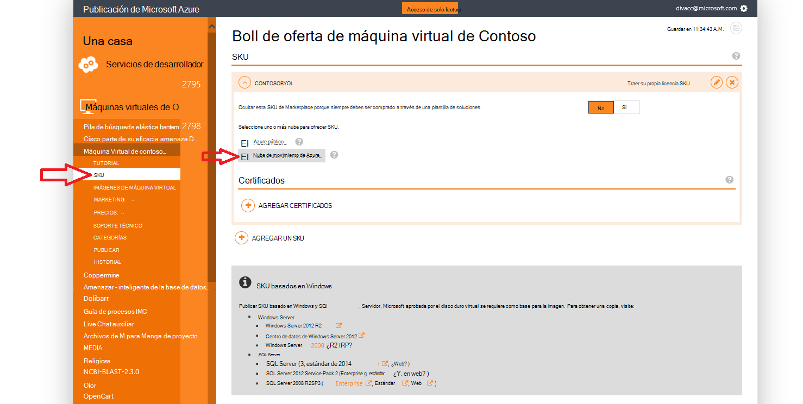
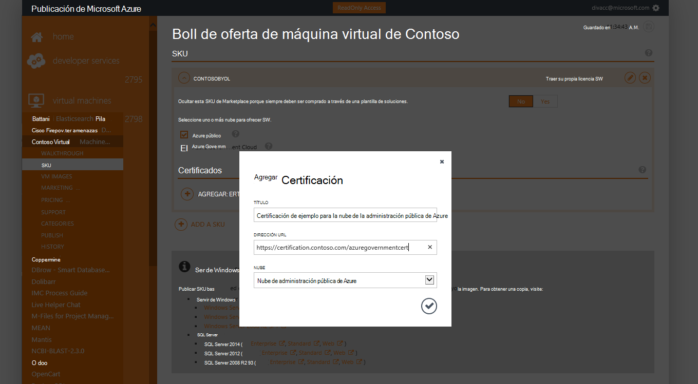
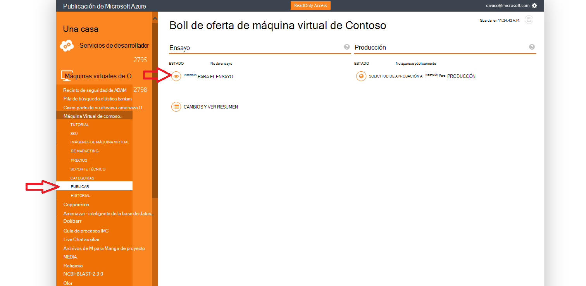
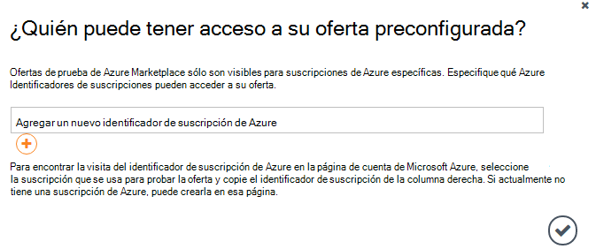
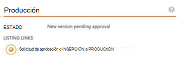

<properties
            pageTitle="Documentación de gobierno Azure | Microsoft Azure"
            description="Esto proporciona una comparación de características e instrucciones sobre cómo desarrollar aplicaciones para la administración pública de Azure."
            services="Azure-Government"
            cloud="gov"
            documentationCenter=""
            authors="tsingh"
            manager="asimm"
            editor=""/>
 
<tags    ms.service="multiple"
            ms.devlang="na"
            ms.topic="article"
            ms.tgt_pltfrm="na"
            ms.workload="azure-government"
            ms.date="10/20/2016"
            ms.author="zakramer;tsingh;divacc"/> 

# Administración pública de Azure Marketplace
Para socios interesados en sus ofertas a publicar en el catálogo de soluciones de Azure para administración pública, busque los detalles siguientes.

## Publicación
>[AZURE.NOTE] Si no es un asociado de Azure Marketplace certificado existente, realice los pasos [a continuación](../marketplace-publishing/marketplace-publishing-getting-started.md) antes de continuar.

### Paso 1  
Inicie sesión en [https://publish.windowsazure.com](https://publish.windowsazure.com)

### Paso 2
Haga clic en la oferta que desea publicar

### Paso 3
Haga clic en **SKU** y haga clic en el cuadro de la nube de la administración pública de Azure

>[AZURE.NOTE] Solo los SKU Traer su propia licencia (BYOL) son compatibles.  Esta opción no está disponible para SKU de pago por uso (PayG).

### Paso 4
Haga clic en el + vínculo de certificación de agregar para agregar vínculos a cualquier certificación para la oferta.

### Paso 5
Solicitud para una cuenta de prueba en la nube de Microsoft Azure gobierno para que pueda comprobar su imagen en el portal de publicación: [https://azuregov.microsoft.com/trial/azuregovtrial](https://azuregov.microsoft.com/trial/azuregovtrial)

Comprobar su elegibilidad como un asociado que sirve US federales, estadas, locales o tribales entidades y se proporcionará confirmación por correo electrónico.  Su cuenta de prueba estará disponible es de 3 a 5 días laborables.

### Paso 6
Haga clic en publicar y haga clic en inserción a en prueba. 

Se le pedirá introducir una suscripción en la lista blanca que tiene acceso a la preconfigurada ofrecen. Escriba el identificador de la suscripción de su cuenta de prueba de Azure gobierno recién adquirida.

### Paso 7
Una vez que la oferta provisionalmente, puede probar su imagen iniciando sesión en [https://portal.azure.us](https://portal.azure.us) con su cuenta de prueba de la administración pública de Azure.

### Paso 8
Una vez haya valida la imagen mediante la suscripción de prueba, puede hacer que la oferta disponible live haga clic en publicar y solicitar aprobación para ir a producción. 

## Pasos siguientes

Para obtener información adicional y actualizaciones, suscríbase a la [Administración pública Blog de Microsoft Azure](https://blogs.msdn.microsoft.com/azuregov/).
