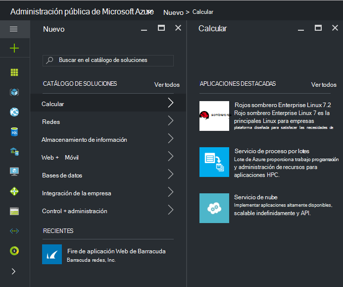
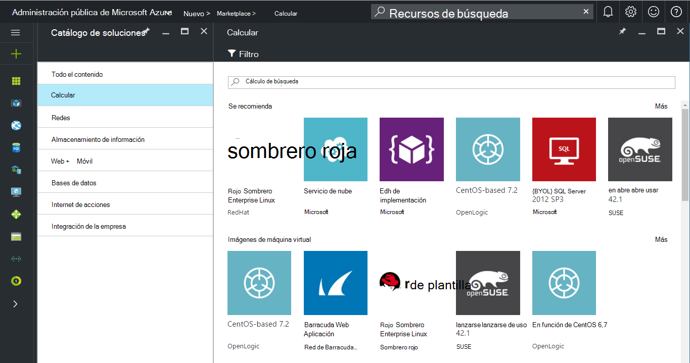
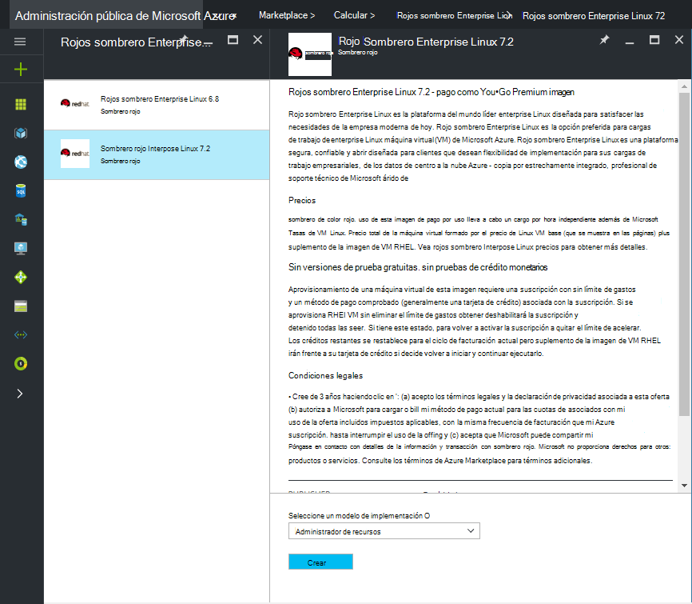
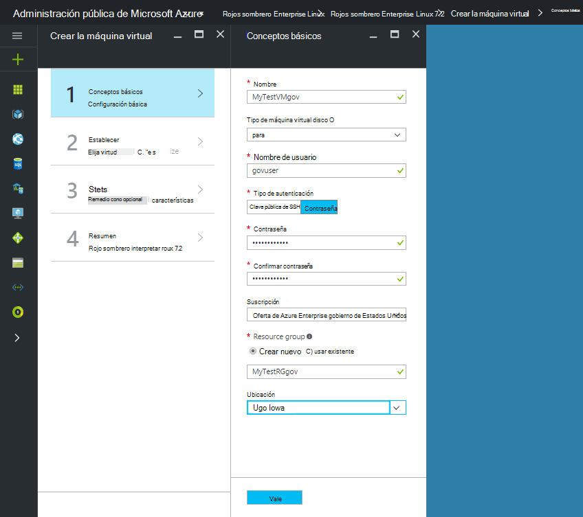
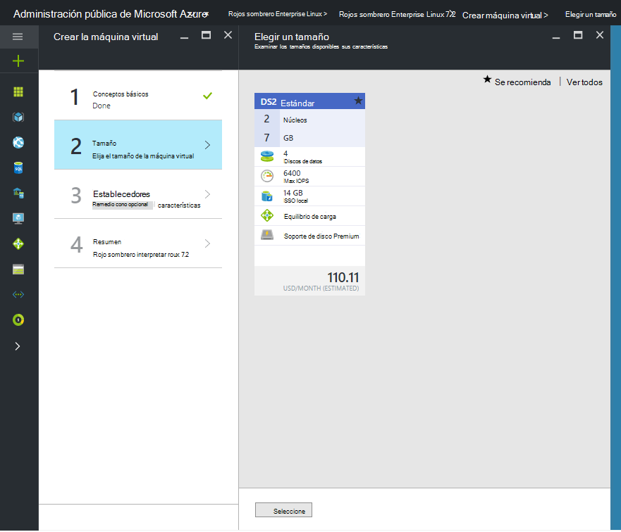

 <properties
    pageTitle="Documentación de gobierno Azure | Microsoft Azure"
    description="Esto proporciona una comparación de características e instrucciones sobre cómo desarrollar aplicaciones para la administración pública de Azure."
    services="Azure-Government"
    cloud="gov"
    documentationCenter=""
    authors="VybavaRamadoss"
    manager="asimm"
    editor=""/>

<tags   ms.service="multiple"
    ms.devlang="na"
    ms.topic="article"
    ms.tgt_pltfrm="na"
    ms.workload="azure-government"
    ms.date="10/20/2016"
    ms.author="zakramer;vybavar"/>

# Azure Marketplace para la administración pública
Azure Marketplace está disponible para la administración pública de Azure con una lista actualizada de imágenes de nuestros editores marketplace. 

## Variaciones
A continuación son algunas consideraciones al usar Azure Marketplace para la administración pública:

- Imágenes de Traer su propia licencia (BYOL) solo están disponibles. No puede acceder a las imágenes que requieren transacción de compra a través de Azure Marketplace
- Solo un subconjunto de imágenes está disponible actualmente en comparación con el catálogo de soluciones público. Puede encontrar la lista de imágenes disponibles [aquí](../azure-government-image-gallery.md) 
- Antes de hacer el aprovisionamiento de una imagen, el Administrador de la empresa debe habilitar compras de catálogo de soluciones para la suscripción de Azure
  - Inicie sesión en el Portal de administrador de la empresa
  - Vaya a *Administrar*
  - En *Detalles de inscripción* , haga clic en el icono de lápiz al lado del elemento de línea de *Azure Marketplace*
  - Activar o desactivar *Habilitado o deshabilitado* , según corresponda
  - Haga clic en *Guardar*

>[AZURE.NOTE] Si está interesado en efectúen las imágenes disponibles en la administración pública de Azure, consulte [directrices de partner integrado](documentation-government-manage-marketplace-partners.md) para obtener más información.

### Paso 1
Iniciar el catálogo de soluciones

  

### Paso 2
Desplácese por los distintos productos para localizar el adecuado.

El Editor de marketplace proporciona una lista de certificados como parte de la descripción de producto para ayudarle a tomar la decisión correcta. 

### Paso 3
Elija un product\image

### Paso 4
Iniciar el flujo de crear y escriba los parámetros requeridos para su implementación

>[AZURE.NOTE] En la lista desplegable de ubicación, están visibles solo las ubicaciones de administración pública de Azure

### Paso 5
Observar precios

### Paso 6
Completar todos los pasos y haga clic en Aceptar para iniciar el proceso de aprovisionamiento

## Pasos siguientes

Para obtener información adicional y actualizaciones, suscríbase a la [Administración pública Blog de Microsoft Azure](https://blogs.msdn.microsoft.com/azuregov/).
