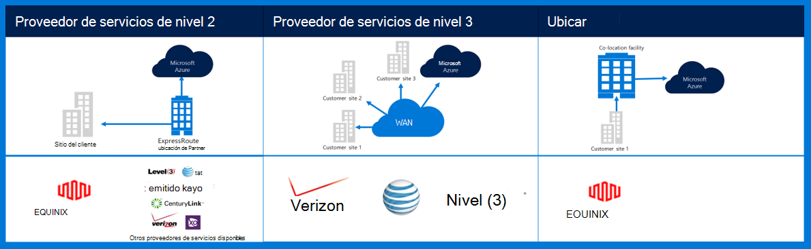
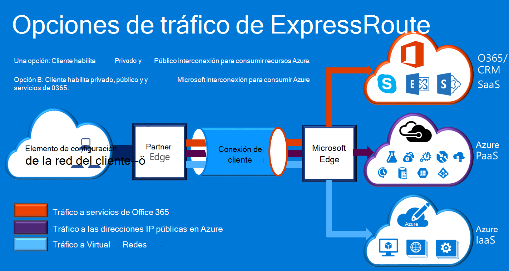

<properties
    pageTitle="Documentación de Azure Governmenmt | Microsoft Azure"
    description="Esto proporciona una comparación de características y pautas para conectividad privado a e administración pública"
    services="Azure-Government"
    cloud="gov" 
    documentationCenter=""
    authors="ryansoc"
    manager="zakramer"
    editor=""/>

<tags
    ms.service="multiple"
    ms.devlang="na"
    ms.topic="article"
    ms.tgt_pltfrm="na"
    ms.workload="azure-government"
    ms.date="09/28/2016"
    ms.author="ryansoc"/>

#  Redes de administración pública de Azure

##  ExpressRoute (conectividad privada)

ExpressRoute está disponible de forma general de administración pública de Azure. Para obtener más información (incluidos los asociados e interconexión ubicaciones), consulte la <a href="https://azure.microsoft.com/en-us/documentation/services/expressroute/">documentación de ExpressRoute público </a>.

###  Variaciones

ExpressRoute está disponible de forma general (GA) en la administración pública de Azure. 

- Los clientes de la administración pública conectan a una capacidad física aislada sobre una conexión dedicada de la administración pública de Azure (Gov) ExpressRoute (RE)

- Azure Gov proporciona mayor disponibilidad y duración aprovechando varios pares de región encuentra un mínimo de 500 millas de distancia 

- De forma predeterminada, toda la conectividad de Azure Gov RE está configurado-activo redundantes con soporte para separar y ofrece la capacidad de circuito de hasta 10 G (menor es 50MB)

- Ubicaciones de Azure Gov RE proporcionan rutas optimizadas (saltos más corta, latencia baja, de alto rendimiento, etc.) para los clientes y las regiones geo redundantes de Azure Gov

- No utiliza la conexión privada de Azure Gov RE, recorrer o dependen de Internet

- Azure infraestructura física y lógica de Gov física está dedicada y separada y acceso está limitado a las personas de Estados Unidos

- Microsoft posee y administra toda la infraestructura de fibra entre regiones de Gov de Azure y Azure Gov RE reunirse-Me ubicaciones

- Azure RE Gov proporciona conectividad con servicios de nube de Microsoft Azure, O365 y CRM

### Consideraciones

Hay dos servicios básicos que proporcionan conectividad de red privada en Azure gobierno: VPN (a sitios de una organización típica) y ExpressRoute.

Azure ExpressRoute se usa para crear conexiones privadas entre los centros de datos de Azure gobierno y su infraestructura local o en un entorno de ubicación cooperativa. Conexiones de ExpressRoute no vaya a través de Internet pública: ofrecen más confiabilidad, velocidades y latencias menores que típico conexiones a Internet. En algunos casos, utilizar conexiones ExpressRoute para transferir datos entre en los sistemas local y Azure rendimientos importantes ventajas de costo.   

Con ExpressRoute, establecer conexiones a Azure en una ubicación de ExpressRoute (por ejemplo, un servicio de proveedor de Exchange) o directamente conectarse a Azure desde la red WAN existente (como una multiprotocolo etiqueta cambio VPN (MPLS), proporcionado por un proveedor de servicios de red).

    

Servicios de red para admitir soluciones y aplicaciones de cliente de administración pública de Azure, se recomienda que se ha implementado para conectarse a la administración pública de Azure ExpressRoute (conectividad privada). Si se usan las conexiones VPN, deberá considerar lo siguiente:

- Los clientes deben ponerse en contacto con su autorización oficial o agencia para determinar si se requiere conectividad privada u otro mecanismo de conexión segura e identificar las restricciones adicionales para tener en cuenta.

- Los clientes deben decidir si desea exigir que la VPN de sitio a sitio se dirige a través de una zona de conectividad privado.

- Los clientes deben obtener un circuito MPLS o VPN con un proveedor de acceso de conectividad privada con licencia.

Todos los clientes que usen una arquitectura de conectividad privada deben validar que se establecido una implementación apropiada y se mantiene para la conexión de cliente a puerta de enlace de red e Internet (GN / puedo) punto de delimitación del enrutador de borde para la administración pública de Azure. Del mismo modo, la organización debe establecer la conectividad de red entre su entorno local y el punto de delimitación de enrutador de borde de puerta de enlace cliente/red (GN o C) para la administración pública de Azure.

## Pasos siguientes

Para información adicional y actualizaciones suscripción a la <a href="https://blogs.msdn.microsoft.com/azuregov/">Blog de Microsoft Azure gobierno.</a>
