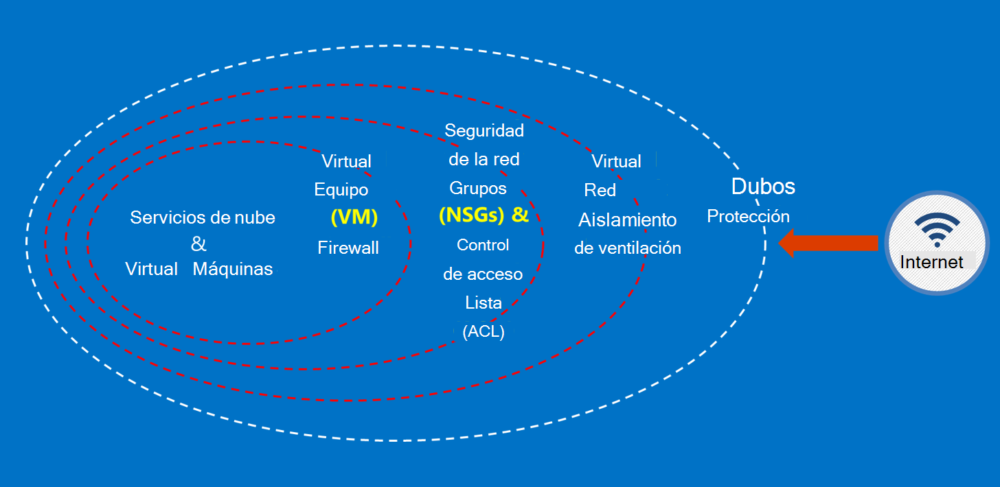

<properties
    pageTitle="Servicios de administración pública de Azure | Microsoft Azure"
    description="Proporciona información general sobre los servicios disponibles en la administración pública de Azure y"
    services="Azure-Government"
    cloud="gov"
    documentationCenter=""
    authors="zakramer"
    manager="liki"
    editor="" />

<tags
    ms.service="multiple"
    ms.devlang="na"
    ms.topic="article"
    ms.tgt_pltfrm="na"
    ms.workload="azure-government"
    ms.date="10/18/2016"
    ms.author="ryansoc" />

#  Seguridad

##  Principios para proteger los datos del cliente en la administración pública de Azure

Gobierno Azure proporciona una gama de características y servicios que puede usar para crear soluciones de nube para satisfacer sus necesidades de datos regulados de controlados. Una solución compatible con cliente es nada más que la implementación eficaz de las capacidades de administración pública de Azure del cuadro, junto con una práctica de seguridad sólidos de datos.

Cuando se hospeda una solución en la administración pública de Azure, Microsoft controla muchos de estos requisitos en el nivel de la infraestructura de nube.

En el diagrama siguiente muestra el modelo de defensa en profundidad Azure. Por ejemplo, Microsoft proporciona la infraestructura de nube básicas DDOS, junto con las capacidades de cliente, como los dispositivos de seguridad de aplicación específica del cliente que debe DDOS.

Esta página describe los principios básicos para proteger los servicios y aplicaciones, que proporciona instrucciones y recomendaciones sobre cómo aplicar estos principios; en otras palabras, cómo clientes deben hacer uso inteligente de administración pública de Azure para cumplir con las obligaciones y responsabilidades necesarios para una solución que controla información ITAR.

 Los principios general para proteger los datos del cliente son:

- Protección de datos mediante el cifrado
- Administración de información confidencial
- Aislamiento para restringir el acceso a datos

###  Proteger los datos del cliente con cifrado

Mitigar el riesgo y cumplimiento de reglamentaciones obligaciones va en coche el foco y la importancia de cifrado de datos creciente. Utilice una implementación de cifrado eficaces para mejorar las medidas de seguridad de red y las aplicaciones actuales y reducir el riesgo general de su entorno de nube.

#### Cifrado al resto
El cifrado de los datos almacenados se aplica a la protección de contenido del cliente de almacenamiento en disco. Hay varias maneras de que esto puede suceder:

#### Cifrado de servicio de almacenamiento

Cifrado de servicio de almacenamiento de Azure está habilitado en el nivel de cuenta de almacenamiento de blobs de bloque y se cifran automáticamente cuando escribe en Azure almacenamiento de blobs de página. Al leer los datos de almacenamiento de Azure, se descifra por el servicio de almacenamiento antes de que se devuelven. Use esta opción para proteger los datos sin tener que modificar o agregar código a todas las aplicaciones.

#### Cifrado de cliente
Cifrado de cliente integrado en Java y las bibliotecas de cliente de almacenamiento. NET, que pueden utilizar las API de depósito de clave de Azure, realizar este sencillo implementar. Use depósito de Azure clave para obtener acceso a la información confidencial en depósito de clave de Azure concretas con Azure Active Directory.

#### Cifrado en tránsito

El cifrado básico disponible para la conectividad de la administración pública de Azure es compatible con el protocolo de seguridad de nivel de transporte (TLS) 1.2 y certificados X.509. Federal procesamiento estándar información (FIPS) 140-2 algoritmos de cifrado de nivel 1 también se usan para conexiones de red de infraestructura entre los centros de datos de administración pública de Azure.  Windows 8-plus VM y recursos compartidos de archivos de Azure y Windows Server 2012 R2 puede usar SMB 3.0 para el cifrado entre la máquina virtual y el recurso compartido de archivos. Uso del cifrado del cliente para cifrar los datos antes de que se transfieran en almacenamiento en una aplicación de cliente y descifrar los datos después de se transfiere sin espacio de almacenamiento.

#### Prácticas recomendadas para el cifrado

- Máquinas virtuales de IaaS: Uso del cifrado de disco Azure. Activar el cifrado de servicio de almacenamiento para cifrar los archivos de disco duro virtual que se utilizan para realizar copias de seguridad de los discos de almacenamiento de Azure, pero sólo cifra los datos recién escritos. Esto significa que, si crea una máquina virtual y, a continuación, habilitar cifrado de servicio de almacenamiento en la cuenta de almacenamiento que contiene el archivo de disco duro virtual, se cifran únicamente los cambios, no el archivo original del disco duro virtual.
- Cifrado de cliente: Este es el método más seguro para cifrar los datos, ya que cifra antes de tránsito y cifra los datos en el resto. Sin embargo, es necesario agregar código a sus aplicaciones de almacenamiento, que no es recomendable hacer. En estos casos, puede usar HTTPs para sus datos en tránsito y cifrado de servicio de almacenamiento para cifrar los datos en el resto. Cifrado de cliente también implica más carga en el cliente, tendrá que tiene en cuenta en los planes de escalabilidad, especialmente si está cifrado y transferir una gran cantidad de datos.

###  Proteger los datos del cliente con la administración de información confidencial

Administración de claves segura es fundamental para proteger los datos en la nube. Los clientes procure simplificar la administración de claves y mantener el control de claves usado por aplicaciones de nube y servicios para cifrar datos.

#### Prácticas recomendadas para administrar la información confidencial

- Usar clave de cámara para minimizar los riesgos de información confidencial que se expone a través de los archivos de configuración modificable, secuencias de comandos, o en el código fuente. Depósito de Azure clave cifra teclas (por ejemplo, las claves de cifrado para el cifrado de disco de Azure) y la información confidencial (como contraseñas), almacenarlos en FIPS 140-2 nivel 2 validar módulos de seguridad de hardware (HSM). Para obtener seguridad adicional, puede importar o generar claves en estos HSM.
- Plantillas y código de la aplicación sólo deben contener referencias URI a la información confidencial (lo que significa que la información confidencial real no está en el código, configuración o código fuente repositorios). Esto evita ataques de suplantación de identidad clave en repos internas o externas, como la recopilación robots en GitHub.
- Utilizar controles RBAC fuerte en depósito de clave. Si un operador de confianza deja la empresa o las transferencias a un nuevo grupo dentro de la compañía, debe impedir que puedan tener acceso a la información confidencial.

Para obtener más información <a href="https://azure.microsoft.com/documentation/services/key-vault">documentación pública de Azure clave depósito.</a>

###  Aislamiento para restringir el acceso a datos

Aislamiento consiste en usar los límites, segmentación y contenedores para limitar el acceso de datos a solo los usuarios autorizados, servicios y aplicaciones. Por ejemplo, la separación entre los inquilinos es un mecanismo de seguridad esenciales para plataformas de nube multiempresa como Microsoft Azure. Aislamiento lógico ayuda a evitar que a un inquilino interferir con las operaciones de cualquier otro inquilino.

#### Aislamiento del entorno
El entorno de administración pública de Azure es una instancia física es independiente del resto de la red de Microsoft. Esto se logra a través de una serie de controles físicos y lógicos que incluyen las siguientes:

- Seguridad de obstáculos físicos con cámaras y dispositivos biométricos.
- Uso de credenciales específicas y la autenticación por personal de Microsoft que requieren acceso lógico al entorno de producción.
- Toda la infraestructura de servicio para la administración pública de Azure se encuentra en los Estados Unidos.

#### Aislamiento por cliente
Control de acceso de red de Azure implementa y separación a través de aislamiento de VLAN, ACL, cargan equilibradores y filtros IP

Los clientes pueden aislar aún más los recursos en suscripciones, grupos de recursos, redes virtuales y subredes.

## Filtrado

La recientemente anunciada alta FedRAMP y la autorización del departamento de defensa impacto en el nivel 4. Esto produce la barra de seguridad y cumplimiento en todo el entorno de administración pública de Azure.

Ahora estamos filtrado todos nuestros operadores en comprobar de agencia nacional con legislación y crédito (NACLC) según se define en la sección 5.6.2.2 de la DoD nube informática seguridad requisitos guía (SRG):

>[AZURE.NOTE] La investigación de fondo mínimos necesarios para personal CSP tengan acceso a nivel 4 y 5 información basada en un "no críticos sensible" (por ejemplo, de DoD ADP-2) es un nacionales Agencia póngase en contacto con la legislación y crédito (NACLC) (para los contratista "no críticos sensible") o una investigación de fondo de riesgo moderado (MBI) para una designación de posición de "moderado".

La siguiente tabla resume nuestro filtrado actual para los operadores de Azure gobierno:

Comprobaciones de fondo y proyecciones de Gov Azure | Descripción|
---|---|
Ciudadanía de Estados Unidos |Comprobación de ciudadanía de Estados Unidos.
Comprobación de fondo de nube de Microsoft (cada dos años)|Número de seguridad social buscar, verificación penales historial, la lista de Office de Control de activos extranjeros (OFAC), la lista de oficina de industria y seguridad (BIS), lista de Office de los controles de comercio defensa excluida personas.
Agencia nacional póngase en contacto con la legislación y crédito (NACLC) (cada cinco años) | Agrega huella fondo comprobación en bases de datos de FBI. Para obtener más información, vaya al<a href="https://www.opm.gov/investigations/background-investigations/federal-investigations-notices/1997/fin97-02/"> Sitio de administración de personal de Office</a>. | 
<a href="https://www.microsoft.com/en-us/TrustCenter/Compliance/CJIS">Servicios de información de Justicia penal (CJIS)</a> | CJIS es un estado, local y administración pública de FBI qué huella de procesos de filtrado registros y valida penales historiales de personal de operaciones que se podría proporcionar acceso a los datos críticos Justicia penal información (CJI).  Cada estado tiene su propio fondo verificación y posterior aprobación de todos los empleados con acceso potencial a CJI.|

Para el personal de operaciones de Azure, se aplican los siguientes principios de acceso:

- Tareas claramente definidas, con responsabilidades independientes para solicitar, aprobar e implementar los cambios.
- Access es a través de interfaces definidas que tienen funcionalidad específica.
- Access es just-in-time (JIT) y se concede únicamente en por incidente o de un evento de mantenimiento específicos y siempre durante un período limitado.
- Access está basado en regla, con funciones definidas que solo se asignan los permisos necesarios para solucionar este problema.

Estándares de filtrado incluyen la validación de ciudadanía de Estados Unidos de todos los docentes operativas y soporte técnico de Microsoft poder obtener acceso a sistemas hospedado administración pública de Azure. Personal de soporte técnico que necesitan transferir datos usar las capacidades seguras dentro de la administración pública de Azure. Transferencia de datos seguro requiere un conjunto diferente de credenciales de autenticación para tener acceso. Por ejemplo, para tener acceso a los metadatos del sistema, personal de operaciones utiliza herramientas de administración interna basada en web específicas, las API de solo lectura y JIT elevación.

## Pasos siguientes

Para información adicional y actualizaciones suscripción a la <a href="https://blogs.msdn.microsoft.com/azuregov/">Blog de Microsoft Azure gobierno.</a>
