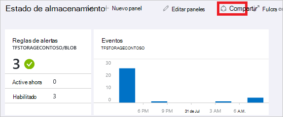
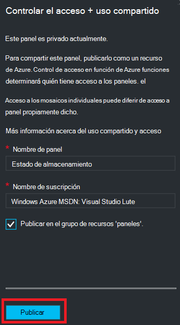
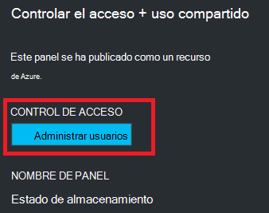
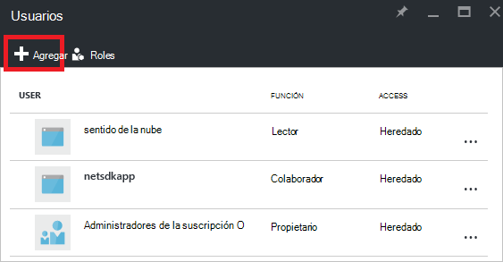
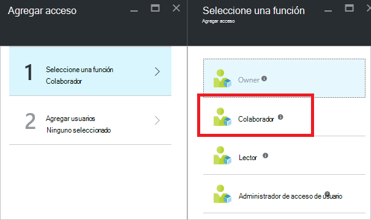
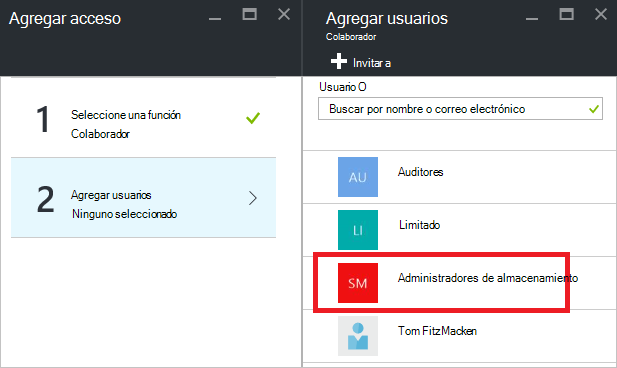
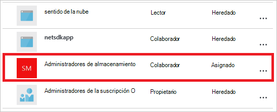

<properties
   pageTitle="Acceso a paneles portal Azure | Microsoft Azure"
   description="En este artículo se explica cómo compartir el acceso a un panel en el portal de Azure."
   services="azure-portal"
   documentationCenter=""
   authors="tfitzmac"
   manager="timlt"
   editor="tysonn"/>

<tags
   ms.service="multiple"
   ms.devlang="NA"
   ms.topic="article"
   ms.tgt_pltfrm="NA"
   ms.workload="na"
   ms.date="08/01/2016"
   ms.author="tomfitz"/>

# Uso compartido de paneles de Azure

Después de configurar un panel, puede publicar y compartir con otros usuarios de su organización. Permitir que otros usuarios puedan tener acceso a su escritorio mediante Azure [Rol de Control de acceso basado](../active-directory/role-based-access-control-configure.md). Asignar un usuario o grupo de usuarios a un rol, y ese rol define si los usuarios pueden ver o modificar el panel publicado. 

Todos los paneles publicados se implementan como recursos de Azure, lo que significa que existen como manejables elementos dentro de su suscripción y contenidos en un grupo de recursos.  Desde una perspectiva de control de acceso, los paneles son no difiere mucho de otros recursos, como una máquina virtual o una cuenta de almacenamiento.

> [AZURE.TIP] Mosaicos individuales en el panel exigir sus propios requisitos de control de acceso basadas en los recursos que se muestran.  Por lo tanto, puede diseñar un panel que se comparte con amplitud mientras sigue protege los datos en los mosaicos individuales.

## Control de acceso de la descripción de los paneles

Con control de acceso basado en roles, puede asignar a usuarios a roles en tres diferentes niveles de ámbito:

- suscripción
- grupo de recursos
- recursos

Los permisos asignados se heredan de suscripción hacia abajo hasta el recurso. El panel publicado es un recurso. Por lo tanto, tal vez ya posea usuarios asignados a roles de la suscripción que también funcionan para el panel publicado. 

Aquí tenemos un ejemplo.  Supongamos que tiene una suscripción de Azure y distintos miembros del equipo se han asignado los roles de **propietario**, **Colaborador**o **lector** para la suscripción. Los usuarios de propietarios o colaboradores son capaces de lista, ver, crear, modificar o eliminar paneles dentro de la suscripción.  Los usuarios de los lectores pueden paneles de lista y vista, pero no pueden modificar o eliminarlos.  Los usuarios con acceso de lectura son capaces de realizar cambios locales a un panel publicado (como por ejemplo, para solucionar un problema), pero no pueden publicar esos cambios en el servidor.  Tienen la opción de hacer una copia privada del panel por sí mismos

Sin embargo, también puede asignar permisos al grupo de recursos que contiene varios paneles o a un panel individual. Por ejemplo, puede decidir que debe tener limitados permisos a un grupo de usuarios a través de la suscripción, pero mayor acceso a un escritorio determinado. Asignar a los usuarios a una función para ese panel. 

## Publicar panel

Supongamos que haya terminado de configurar un panel que desea compartir con un grupo de usuarios de su suscripción. Los pasos siguientes describen un grupo personalizado denominado Administradores de almacenamiento, pero puede dar nombre a su grupo de cualquier cosa que le gustaría. Para obtener información sobre cómo crear un grupo de Active Directory y agregar usuarios a ese grupo, vea [Administrar grupos de Azure Active Directory](../active-directory/active-directory-accessmanagement-manage-groups.md).

1. En el panel, seleccione **Compartir**.

     

2. Antes de asignar acceso, debe publicar el panel. De forma predeterminada, el panel se publicará en un grupo de recursos con el nombre de **los paneles**. Seleccione **Publicar**.

     

Ahora se publica su panel. Si los permisos heredados de la suscripción están adecuados, no es necesario hacer nada más. Otros usuarios de su organización podrán obtener acceso y modificar el panel según su función de nivel de suscripción. Sin embargo, para este tutorial, vamos a asignar a un grupo de usuarios a una función para ese panel.

## Asignar el acceso a un panel

1. Después de publicar el panel, seleccione **Administrar usuarios**.

     

2. Verá una lista de los usuarios existentes que ya están asignados a una función para este panel. La lista de usuarios existentes será diferente de la imagen siguiente. Más probable es que las asignaciones se heredan de la suscripción. Para agregar un nuevo usuario o grupo, seleccione **Agregar**.

     

3. Seleccione el rol que representa los permisos que desea conceder. En este ejemplo, seleccione **Colaborador**.

     

4. Seleccione el usuario o grupo que desea asignar al rol. Si no ve el usuario o grupo que está buscando en la lista, use el cuadro de búsqueda. La lista de grupos disponibles dependen de los grupos que haya creado en Active Directory.

      

5. Cuando haya terminado de agregar usuarios o grupos, seleccione **Aceptar**. 

6. La nueva asignación se agrega a la lista de usuarios. Observe que el **acceso** se muestra como **asignadas** en lugar de **heredados**.

     

## Pasos siguientes

- Para obtener una lista de funciones, vea [RBAC: funciones integradas](../active-directory/role-based-access-built-in-roles.md).
- Para obtener información sobre la administración de recursos, vea [Administrar Azure recursos a través del portal](resource-group-portal.md).