<properties
   pageTitle="Paneles de portal Azure | Microsoft Azure"
   description="En este artículo se explica cómo crear y editar paneles en el portal de Azure."
   services="azure-portal"
   documentationCenter=""
   authors="sewatson"
   manager="timlt"
   editor="tysonn"/>

<tags
   ms.service="multiple"
   ms.devlang="NA"
   ms.topic="article"
   ms.tgt_pltfrm="NA"
   ms.workload="na"
   ms.date="09/06/2016"
   ms.author="sewatson"/>

# Crear y compartir paneles en el portal de Azure

Puede crear varios paneles y compartirlos con otros usuarios que tienen acceso a las suscripciones de Azure.  Esta entrada va a través de los conceptos básicos de la creación de edición, publicar y administrar el acceso a los paneles.

## Personalizar los paneles frente a aspas

Desde el inicio de paneles hace unos meses, se ha creado una disminución constante de personalizaciones de placa y un rápido aumento de las personalizaciones de paneles. Esta tendencia de uso seguro muestra que prefiera personalizar los paneles sobre módulos. Para admitir esa tendencia, se eliminará la capacidad de personalizar aspas y se dedicará nuestros esfuerzos para mejorar la funcionalidad de paneles. Si ha personalizado un módulo, pronto se quitará la personalización. Para conservar esa personalización, anclar los mosaicos personalizados a un panel. Simplemente haga clic en el mosaico y seleccione **Anclar al panel** , tal como se muestra en la siguiente imagen.

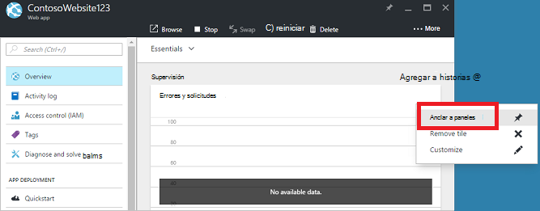

## Crear un panel

Para crear un panel, seleccione el botón de **nuevo panel** junto al nombre del panel actual.  

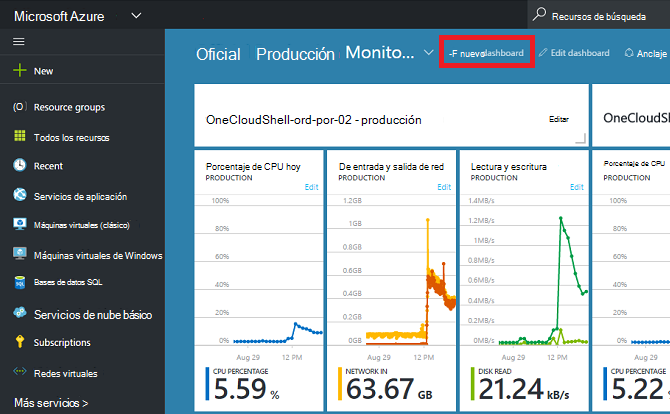

Esta acción crea un panel nuevo, vacío, privado y coloca en modo de personalización, donde puede asignar un nombre a su panel y agregar o reorganizar los mosaicos.  En este modo, la Galería de mosaico contraíble tiene sobre el menú de navegación izquierdo.  La Galería de mosaico le permite buscar mosaicos para los recursos de Azure de varias formas: puede examinar por [grupo de recursos](../azure-resource-manager/resource-group-overview.md#resource-groups), por tipo de recurso, por [etiqueta](../resource-group-using-tags.md)o mediante la búsqueda de los recursos por su nombre.  

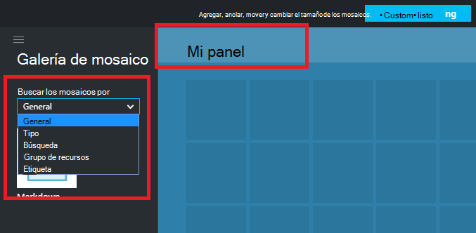

Agregar mosaicos si los arrastra y coloca en la superficie de panel donde desee.

Hay una nueva categoría denominada **General** de los mosaicos que no están asociados a un recurso determinado.  En este ejemplo, hemos anclar el mosaico de descuento.  Use este mosaico para agregar contenido personalizado a su escritorio.  El mosaico admite texto sin formato, [la sintaxis de descuento](https://daringfireball.net/projects/markdown/syntax)y un conjunto limitado de HTML.  (Por motivos de seguridad, no puede hacer cosas como insertar `<script>` etiquetas o use el elemento determinado estilo de CSS que puede interferir con el portal.) 

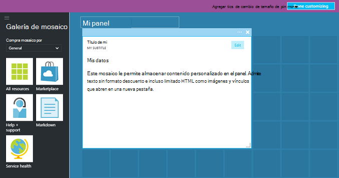

## Editar un panel

Después de crear el panel, puede anclar mosaicos de la Galería de mosaico o la representación de mosaico de módulos. Vamos a fijar la representación de nuestro grupo de recursos. Puede alguno pin al explorar el elemento, o desde el módulo de grupo de recursos. Ambos métodos resultado fijar la representación del mosaico del grupo de recursos.

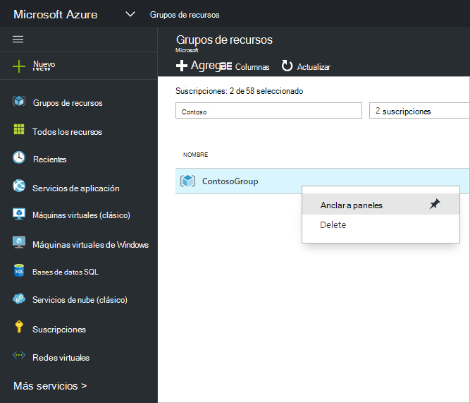

Después de fijar el elemento, aparece en el panel.

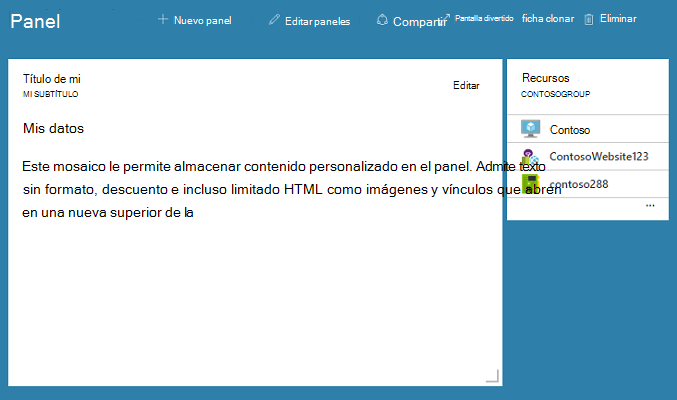

Ahora que tenemos un mosaico de descuento y un grupo de recursos anclados a los paneles, podemos cambiar el tamaño y reorganizar los mosaicos en un diseño adecuado.

Mantener el mouse y seleccionando "…" o haciendo doble clic en un mosaico puede ver todos los comandos contextuales de ese mosaico. De forma predeterminada, hay dos elementos:

1. **Desanclar del panel** : elimina el mosaico del panel
2.  **Personalizar** – entra en modo de personalizar

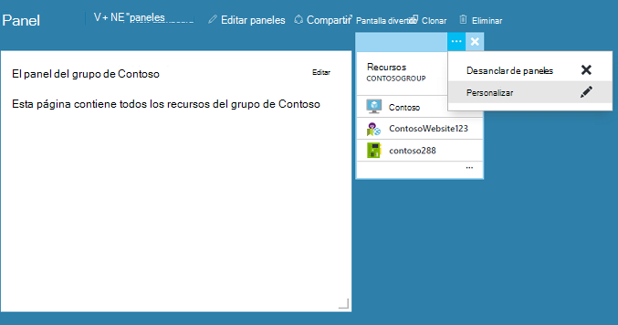

Al seleccionar Personalizar, puede cambiar el tamaño y reordenar mosaicos. Para cambiar el tamaño de un mosaico, seleccione el nuevo tamaño en el menú contextual, tal como se muestra en la siguiente imagen.

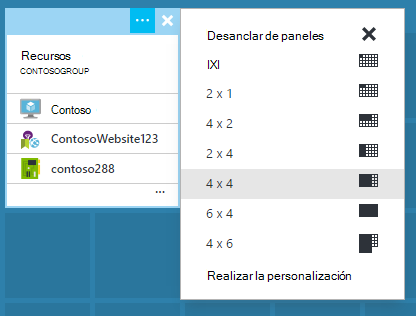

O bien, si el mosaico admite cualquier tamaño, puede arrastrar la esquina inferior derecha hasta el tamaño deseado.

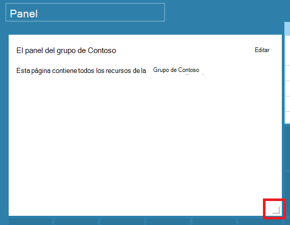

Después de cambiar el tamaño de los mosaicos, ver el panel.

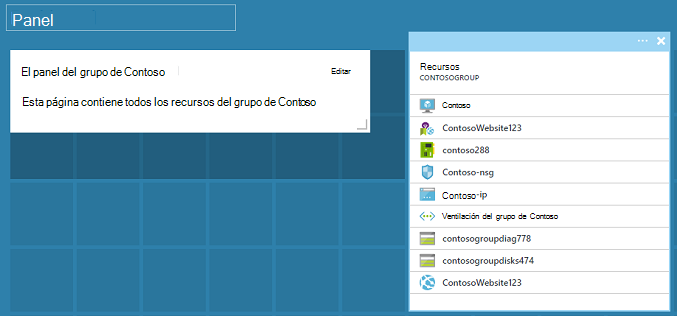

Una vez que haya terminado de personalizar un panel, simplemente seleccione el **hecho personalizar** salir de personalizar el modo o secundario y seleccione **terminado de personalizar** en el menú contextual.

## Publicar un panel y administrar el control de acceso

Cuando se crea un panel, es privado de forma predeterminada, lo que significa que es la única persona que pueda verlo.  Para que sea visible para otros usuarios, use el botón **Compartir** que aparece junto a los comandos del panel.

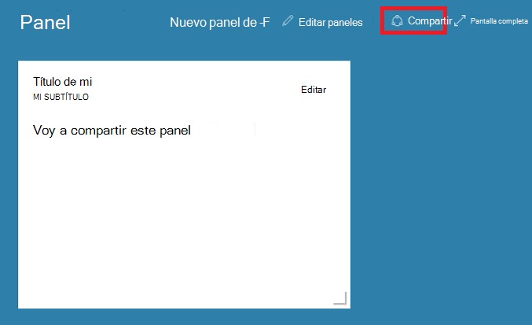

Se le pedirá que elija una suscripción y un grupo de recursos para el panel se publiquen en. Para integrar paneles en el ecosistema, hemos implementado escritorios compartidos como recursos de Azure (por lo que no puede compartir escribiendo una dirección de correo electrónico).  Acceso a la información mostrada por la mayoría de los mosaicos en el portal se rige por [Azure rol de Control de acceso](../active-directory/role-based-access-control-configure.md ). Desde una perspectiva de control de acceso, escritorios compartidos no son diferentes de una máquina virtual o una cuenta de almacenamiento.  

Supongamos que tiene una suscripción de Azure y miembros del equipo se han asignado los roles de **propietario**, **Colaborador**o **lector** de la suscripción.  Los usuarios de propietarios o colaboradores son capaces de lista, ver, crear, modificar o eliminar paneles dentro de la suscripción.  Los usuarios de los lectores pueden paneles de lista y vista, pero no pueden modificar o eliminarlos.  Los usuarios con acceso de lectura pueden realizar cambios locales a un escritorio compartido, pero no pueden publicar esos cambios en el servidor.  Sin embargo, puede hacer una copia privada de los paneles para su propio uso.  Como siempre, mosaicos individuales en el panel exigir en función de los recursos que se corresponden con sus propias reglas de control de acceso.  

Para su comodidad, experiencia de publicación del portal guiará hacia un modelo donde colocar paneles en un grupo de recursos denominado **paneles**.  

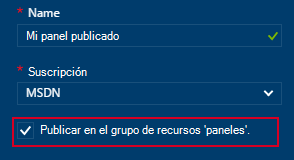

También puede publicar un panel a un grupo de recursos determinado.  El control de acceso para ese panel coincide con el control de acceso para el grupo de recursos.  Los usuarios que pueden administrar los recursos de ese grupo de recursos también tienen acceso a los paneles.

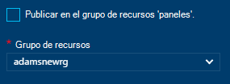

Después de publica el panel, el panel de control de **Compartir + access** se actualizar y mostrar información sobre el panel publicado, incluye un vínculo para administrar el acceso de usuario a los paneles.  Este vínculo inicia el módulo de Control de acceso en función de funciones estándar usado para administrar el acceso para los recursos de Azure.  Siempre puede obtener vuelva a esta vista, seleccione **Compartir**.

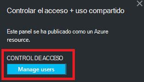

## Pasos siguientes

- Para administrar recursos, consulte [Administrar Azure recursos a través del portal](resource-group-portal.md).
- Para implementar los recursos, vea [implementar recursos a las plantillas de administrador de recursos y portal de Azure](../resource-group-template-deploy-portal.md).