<properties 
    pageTitle="Usar el portal de Azure para administrar recursos de Azure | Microsoft Azure" 
    description="Usar el portal de Azure y administrar recursos de Azure para administrar los recursos. Muestra cómo trabajar con los paneles para supervisar los recursos." 
    services="azure-resource-manager,azure-portal" 
    documentationCenter="" 
    authors="tfitzmac" 
    manager="timlt" 
    editor="tysonn"/>

<tags 
    ms.service="azure-resource-manager" 
    ms.workload="multiple" 
    ms.tgt_pltfrm="na" 
    ms.devlang="na" 
    ms.topic="article" 
    ms.date="09/12/2016" 
    ms.author="tomfitz"/>

# Administrar recursos Azure a través del portal

> [AZURE.SELECTOR]
- [Azure PowerShell](../powershell-azure-resource-manager.md)
- [CLI de Azure](../xplat-cli-azure-resource-manager.md)
- [Portal](resource-group-portal.md) 
- [API DE REST](../resource-manager-rest-api.md)

Este tema muestra cómo usar el [portal de Azure](https://portal.azure.com) con [El Administrador de recursos de Azure](../azure-resource-manager/resource-group-overview.md) para administrar los recursos de Azure. Para obtener información sobre cómo implementar los recursos a través del portal, vea [implementar recursos a las plantillas de administrador de recursos y portal de Azure](../resource-group-template-deploy-portal.md).

Actualmente, no todos los servicios es compatible con el portal o el Administrador de recursos. Para estos servicios, debe usar el [portal clásico](https://manage.windowsazure.com). Para el estado de cada servicio, consulte [el gráfico de disponibilidad de portal de Azure](https://azure.microsoft.com/features/azure-portal/availability/).

## Administrar grupos de recursos

1. Para ver todos los grupos de recursos de la suscripción, seleccione **grupos de recursos**.

    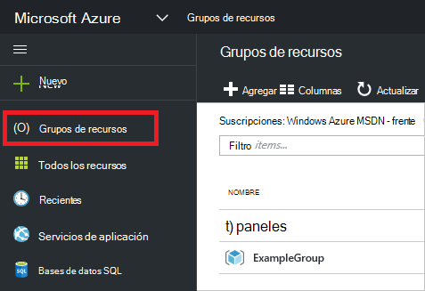

1. Para crear un grupo de recursos vacío, seleccione **Agregar**.

    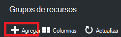

1. Proporcione un nombre y una ubicación para el nuevo grupo de recursos. Seleccione **crear**.

    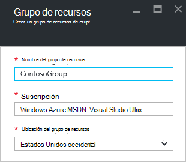

1. Debe seleccionar **Actualizar** para ver el grupo de recursos creado recientemente.

    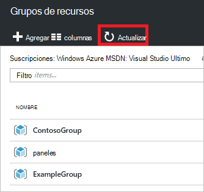

1. Para personalizar la información que se muestran para los grupos de recursos, seleccione **las columnas**.

    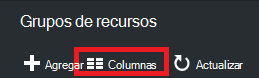

1. Seleccione las columnas que desea agregar y, a continuación, seleccione **Actualizar**.

    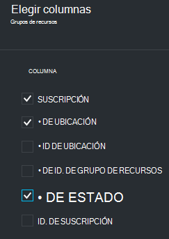

1. Para obtener información sobre cómo implementar los recursos a su nuevo grupo de recursos, vea [implementar recursos a las plantillas de administrador de recursos y portal de Azure](../resource-group-template-deploy-portal.md).

1. Para obtener acceso rápido a un grupo de recursos, puede anclar el módulo al escritorio.

    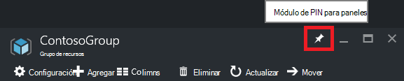

1. El panel muestra el grupo de recursos y sus recursos. Puede seleccionar los grupos de recursos o cualquiera de sus recursos para navegar hasta el elemento.

    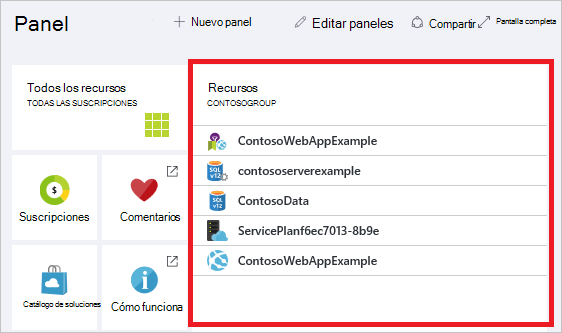

## Recursos de etiqueta

Puede aplicar etiquetas a los grupos de recursos y recursos para organizar lógicamente los activos. Para obtener información sobre cómo trabajar con etiquetas, vea [usar etiquetas para organizar los recursos de Azure](../resource-group-using-tags.md).

[AZURE.INCLUDE [resource-manager-tag-resource](../../includes/resource-manager-tag-resources.md)]

## Recursos de Monitor

Al seleccionar un recurso, la hoja de recursos ofrece gráficos de forma predeterminada y tablas para la supervisión de ese tipo de recurso.

1. Seleccione el recurso y observe la sección **supervisión** . Incluye gráficos que son relevantes para el tipo de recurso. La imagen siguiente muestra la supervisión de datos para una cuenta de almacenamiento predeterminada.

    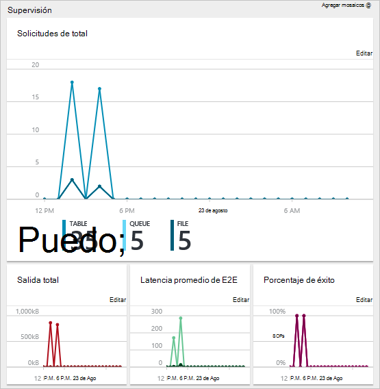

1. Puede anclar una sección del módulo en el panel seleccionando los puntos suspensivos (...) encima de la sección. También puede personalizar el tamaño de la sección en el módulo o eliminarlo por completo. La imagen siguiente muestra cómo anclar, personalizar o quitar la sección de CPU y de memoria.

    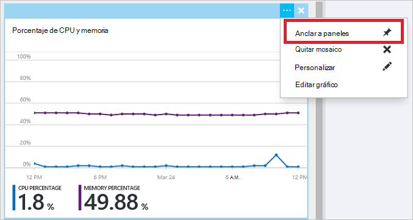

1. Después de fijar la sección al escritorio, verá el resumen en el panel. Y selecciónela inmediatamente le lleva a más información acerca de los datos.

    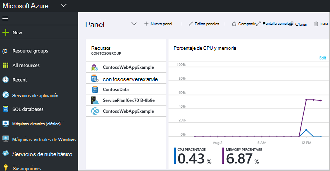

1. Para personalizar por completo los datos que supervisar a través del portal, desplácese hasta el panel predeterminado y seleccione **nuevo panel**.

    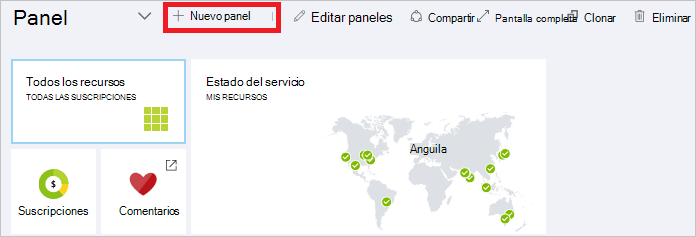

1. Escriba un nombre para el nuevo panel y arrastre mosaicos del panel. Diferentes opciones filtra los mosaicos.

    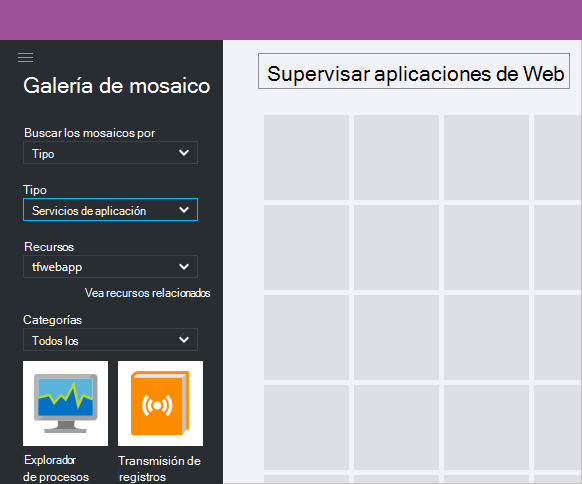

     Para obtener información sobre cómo trabajar con paneles, vea [crear y compartir paneles en el portal de Azure](azure-portal-dashboards.md).

## Administrar recursos

En el módulo de un recurso, verá las opciones para administrar el recurso. El portal ofrece opciones de administración para ese tipo de recurso determinado. Vea los comandos de administración en la parte superior de la hoja de recursos y, en el lado izquierdo.

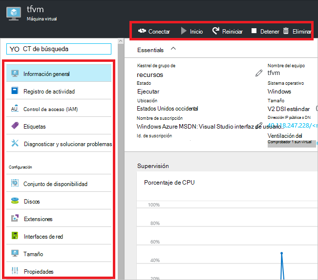

Entre estas opciones, puede realizar operaciones como iniciar y detener una máquina virtual o volver a configurar las propiedades de la máquina virtual.

## Mover los recursos

Si necesita mover recursos a otro grupo de recursos u otra suscripción, vea [mover recursos al nuevo grupo de recursos o suscripción](../resource-group-move-resources.md).

## Recursos de bloqueo

Puede bloquear una suscripción, grupo de recursos o recursos para evitar que otros usuarios de su organización, eliminar o modificar recursos críticos accidentalmente. Para obtener más información, consulte [los recursos de bloqueo con el Administrador de recursos de Azure](../resource-group-lock-resources.md).

[AZURE.INCLUDE [resource-manager-lock-resources](../../includes/resource-manager-lock-resources.md)]

## Ver la suscripción y los costos

Puede ver información acerca de la suscripción y los costos acumulados de todos los recursos. Seleccione **las suscripciones** y la suscripción que desea ver. Solo es posible que tenga una suscripción para seleccionar.

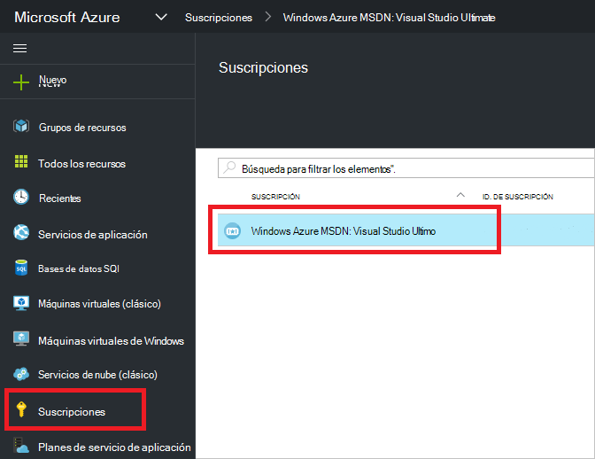

En el módulo de suscripción, vea una velocidad de grabación.

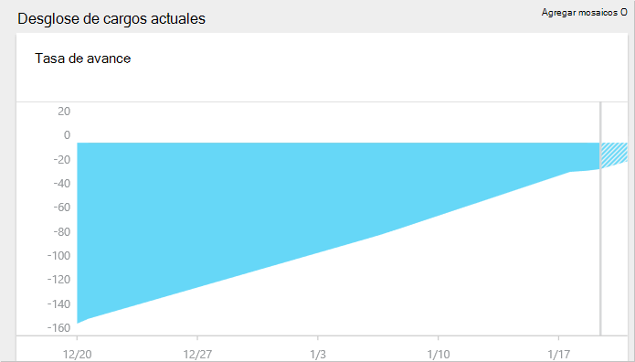

Y un desglose de costos por tipo de recurso.

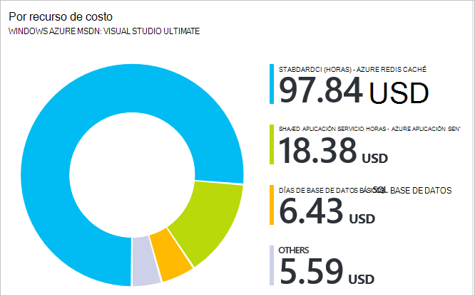

## Plantilla de exportación

Después de configurar el grupo de recursos, desea ver la plantilla de administrador de recursos del grupo de recursos. Exportar la plantilla ofrece dos ventajas:

1. Puede automatizar fácilmente las futuras implementaciones de la solución porque la plantilla contiene toda la infraestructura completa.

2. Puede familiarizarse con la sintaxis de la plantilla mirando en JavaScript Object Notation (JSON) que representa la solución.

Para obtener información detallada, vea [plantilla de administrador de recursos de Azure de exportación de los recursos existentes](../resource-manager-export-template.md).

## Eliminar grupo de recursos o recursos

Eliminar un grupo de recursos, elimina todos los recursos dentro del mismo. También puede eliminar recursos individuales dentro de un grupo de recursos. Desea tenga cuidado al eliminar un grupo de recursos, porque puede haber recursos en otros grupos de recursos que están vinculados. Administrador de recursos no se eliminan los recursos vinculados, pero no pueden funcionar correctamente sin los recursos esperados.

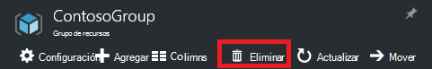

## Pasos siguientes

- Para ver los registros de auditoría, consulte [con el Administrador de recursos de operaciones de auditoría](../resource-group-audit.md).
- Para solucionar errores de implementación, vea [implementaciones de grupo de recursos de solución de problemas con el portal de Azure](../resource-manager-troubleshoot-deployments-portal.md).
- Para implementar los recursos a través del portal, vea [implementar recursos a las plantillas de administrador de recursos y portal de Azure](../resource-group-template-deploy-portal.md).
- Para administrar el acceso a los recursos, vea [las asignaciones de roles de uso para administrar el acceso a los recursos de suscripción de Azure](../active-directory/role-based-access-control-configure.md).

