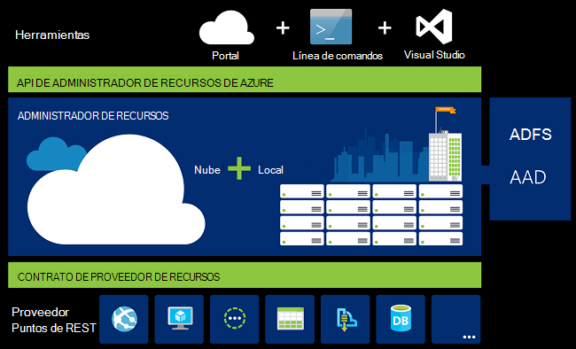
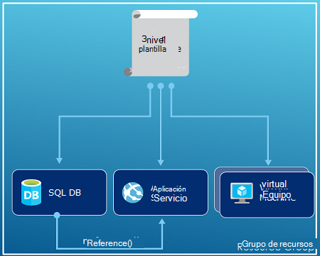
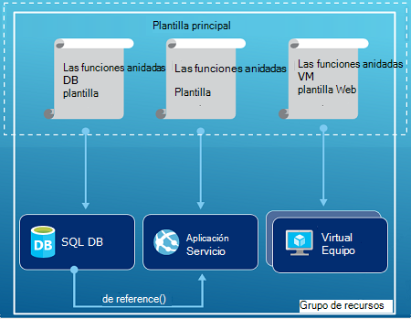
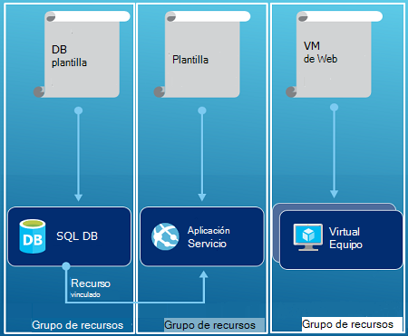

<properties
   pageTitle="Introducción al administrador de recursos Azure | Microsoft Azure"
   description="Describe cómo usar el Administrador de recursos de Azure para implementación, administración y tener acceso a control de los recursos en Azure."
   services="azure-resource-manager"
   documentationCenter="na"
   authors="tfitzmac"
   manager="timlt"
   editor="tysonn"/>

<tags
   ms.service="azure-resource-manager"
   ms.devlang="na"
   ms.topic="get-started-article"
   ms.tgt_pltfrm="na"
   ms.workload="na"
   ms.date="10/21/2016"
   ms.author="tomfitz"/>

# Introducción al administrador de recursos Azure

La infraestructura de la aplicación normalmente se compone de varios componentes: quizás una máquina virtual, cuenta de almacenamiento y una red virtual, o una aplicación web, base de datos, servidor de base de datos y servicios de terceros 3ª. No puede ver estos componentes como entidades independientes, en su lugar verlos como relacionados e interdependientes partes de una sola entidad. Desea implementar, administrar y supervisar el como un grupo. Administrador de recursos de Azure le permite trabajar con los recursos de la solución como un grupo. Puede implementar, actualizar o eliminar todos los recursos para la solución en una única operación coordinada. Usar una plantilla para su implementación y esa plantilla puede trabajar para distintos entornos como pruebas, ensayo y producción. Administrador de recursos proporciona seguridad, auditoría y funciones para ayudarle a administrar los recursos después de la implementación de etiquetado. 

## Terminología

Si es nuevo en el Administrador de recursos de Azure, hay algunos términos que podría no estar familiarizado con.

- **recursos** - un elemento manejable que está disponible a través de Azure. Algunos recursos comunes son una máquina virtual, cuenta de almacenamiento, aplicación web, base de datos y una red virtual, pero hay muchos más.
- **grupo de recursos** : un contenedor que contiene recursos relacionados para una solución de Azure. El grupo de recursos puede incluir todos los recursos para la solución o sólo aquellos recursos que quiere administrar como un grupo. Decida cómo desea asignar recursos a grupos de recursos basándose en lo que más sentido tenga para su organización. Vea [los grupos de recursos](#resource-groups).
- **proveedor de recursos** : un servicio que proporciona los recursos que puede implementar y administrar mediante el Administrador de recursos. Cada proveedor de recursos ofrece operaciones para trabajar con los recursos que se implementan. Algunos proveedores de recursos comunes son Microsoft.Compute, que proporciona el recurso de máquina virtual, Microsoft.Storage, que proporciona el recurso de la cuenta de almacenamiento, y Microsoft.Web, que proporciona recursos relacionados con las aplicaciones web. Consulte [proveedores de recursos](#resource-providers).
- **Plantilla de administrador de recursos** - archivo A JavaScript Object Notation (JSON) que define uno o más recursos para implementar un grupo de recursos. También define las dependencias entre los recursos implementadas. La plantilla se puede utilizar para implementar los recursos de forma coherente y varias veces. Vea [implementación de la plantilla](#template-deployment).
- **sintaxis declarativos** - sintaxis que permite que el estado "Aquí es lo que va a crear" sin tener que escribir la secuencia de programación comandos crearlo. La plantilla de administrador de recursos es un ejemplo de sintaxis declarativos. En el archivo, defina las propiedades de la infraestructura implementar Azure. 

## Las ventajas de usar el Administrador de recursos

Administrador de recursos proporciona varias ventajas:

- Puede implementar, administrar y supervisar todos los recursos para la solución como un grupo, en lugar de controlar estos recursos de forma individual.
- Varias veces, puede implementar la solución durante el ciclo de desarrollo y tener confianza que se implementan los recursos en un estado coherente.
- Puede administrar su infraestructura a través de plantillas descriptiva en lugar de secuencias de comandos.
- Puede definir las dependencias entre los recursos para que se implementen en el orden correcto.
- Puede aplicar el control de acceso a todos los servicios en el grupo de recursos porque el Control de acceso basado en roles (RBAC) nativa está integrado en la plataforma de administración.
- Puede aplicar etiquetas a los recursos para organizar lógicamente todos los recursos de la suscripción.
- Para aclarar la facturación de la organización mediante la visualización de costos para un grupo de recursos de uso compartido de la misma etiqueta.  

Administrador de recursos proporciona una nueva forma de implementar y administrar sus soluciones. Si utiliza el modelo de implementación anteriores y para obtener información sobre los cambios, vea [Descripción de administrador de recursos e implementación clásico](../resource-manager-deployment-model.md).

## Capa de administración coherente

Administrador de recursos proporciona una capa de administración coherentes para las tareas que se realizan a través de PowerShell de Azure, CLI de Azure, portal de Azure, API de REST y herramientas de desarrollo. Todas las herramientas de usan un conjunto común de operaciones. Use las herramientas que funcionan mejor para usted y a continuación, pueden utilizar de manera intercambiable sin confusión. 

La siguiente imagen se muestra cómo interactúan todas las herramientas con la misma API de administrador de recursos de Azure. La API pasa las solicitudes para el servicio Administrador de recursos, que autentica y autoriza las solicitudes. Administrador de recursos enruta las solicitudes a los proveedores de recursos adecuado.

## Orientación

Las siguientes sugerencias ayudan a aprovechar al máximo del Administrador de recursos cuando se trabaja con las soluciones.

1. Definir e implementar la infraestructura mediante la sintaxis declarativa en las plantillas de administrador de recursos, en lugar de comandos imprescindible.
2. Defina todos los pasos de implementación y configuración de la plantilla. No debe tener pasos manuales para configurar la solución.
3. Ejecute los comandos fundamental para administrar los recursos, como iniciar o detener una aplicación o el equipo.
4. Organice los recursos con el mismo ciclo de vida de un grupo de recursos. Usar etiquetas para todos los demás organizar de recursos.

Para obtener más recomendaciones, vea [procedimientos recomendados para crear plantillas de administrador de recursos de Azure](../resource-manager-template-best-practices.md).

## Grupos de recursos

Hay algunos factores importantes a tener en cuenta al definir el grupo de recursos:

1. Todos los recursos en su grupo deben compartir el mismo ciclo de vida. Implementar, actualizar y eliminarlos juntos. Si un recurso, como un servidor de base de datos, debe existir en un ciclo de implementación diferentes debería en otro grupo de recursos.
2. Cada recurso sólo puede existir en un grupo de recursos.
3. Puede agregar o quitar un recurso a un grupo de recursos en cualquier momento.
4. Puede mover un recurso de un grupo de recursos a otro grupo. Para obtener más información, vea [mover recursos al nuevo grupo de recursos o suscripción](../resource-group-move-resources.md).
4. Un grupo de recursos puede contener recursos que se encuentran en distintas regiones.
5. Un grupo de recursos puede usarse para definir el ámbito de control de acceso para acciones administrativas.
6. Un recurso puede interactuar con los recursos en otros grupos de recursos. Esta interacción es común cuando los dos recursos están relacionados, pero no comparten el mismo ciclo de vida (por ejemplo, aplicaciones web de conectarse a una base de datos).

Al crear un grupo de recursos, debe proporcionar una ubicación para dicho grupo de recursos. Puede que se pregunte, "¿por qué un grupo de recursos necesita una ubicación? Y, si los recursos pueden tener diferentes ubicaciones que el grupo de recursos, ¿por qué la ubicación del grupo de recursos importa en absoluto?" El grupo de recursos almacena metadatos acerca de los recursos. Por lo tanto, al especificar una ubicación para el grupo de recursos, se especifica donde se almacenan los metadatos. Por motivos de cumplimiento, debe asegurarse de que los datos se almacenan en una región determinada.

## Proveedores de recursos

Cada proveedor de recursos ofrece un conjunto de recursos y operaciones para trabajar con un servicio de Azure. Por ejemplo, si desea almacenar claves e información confidencial, trabajar con el proveedor de recursos de **Microsoft.KeyVault** . Este proveedor de recursos ofrece un tipo de recurso denominado **depósitos** para crear el depósito clave y un tipo de recurso denominado **depósitos/información confidencial** para crear un secreto en depósito de clave. 

Antes de comenzar con la implementación de los recursos, debe tener una descripción de los proveedores de recursos disponibles. Conocer los nombres de los proveedores de recursos y recursos le ayuda a definir los recursos que desee implementar en Azure.

Recuperar todos los proveedores de recursos con el siguiente cmdlet de PowerShell:

    Get-AzureRmResourceProvider -ListAvailable

O bien, con Azure CLI, recuperar todos los proveedores de recursos con el siguiente comando:

    azure provider list

Puede buscar por la lista devuelta para los proveedores de recursos que se debe usar.

Para obtener detalles acerca de un proveedor de recursos, agregue el espacio de nombres de proveedor con el comando. El comando devuelve los tipos de recursos admitidos para el proveedor de recursos y las versiones de API para cada tipo de recurso y de ubicaciones compatibles. El siguiente cmdlet de PowerShell obtiene los detalles sobre Microsoft.Compute:

    (Get-AzureRmResourceProvider -ProviderNamespace Microsoft.Compute).ResourceTypes

O bien, con Azure CLI, recuperar los tipos de recursos admitidos, ubicaciones y las versiones API para Microsoft.Compute, con el siguiente comando:

    azure provider show Microsoft.Compute --json > c:\Azure\compute.json

Para obtener más información, vea [proveedores del Administrador de recursos, regiones, versiones API y los esquemas](../resource-manager-supported-services.md).

## Implementación de plantilla

Con el Administrador de recursos, puede crear una plantilla (en formato JSON) que define la infraestructura y la configuración de su solución de Azure. Varias veces mediante una plantilla, puede implementar la solución a lo largo de su ciclo de vida y tiene confianza que se implementan los recursos en un estado coherente. Cuando se crea una solución desde el portal, la solución incluye automáticamente una plantilla de implementación. No es necesario que crear la plantilla desde cero, ya puede empezar con la plantilla para la solución y personalizarlo para satisfacer sus necesidades específicas. Puede recuperar una plantilla para un grupo de recursos existente, exportar el estado actual del grupo de recursos o ver la plantilla utilizada para una implementación concreta. Visualización de la [plantilla de exportación](../resource-manager-export-template.md) es una manera útil para obtener información sobre la sintaxis de la plantilla.

Para obtener más información sobre el formato de la plantilla y cómo crear, vea [Crear plantillas de administrador de recursos de Azure](../resource-group-authoring-templates.md) y [Tutorial de plantilla de administrador de recursos](../resource-manager-template-walkthrough.md).

Administrador de recursos procesa la plantilla como cualquier otra solicitud (vea la imagen de [capa de administración coherente](#consistent-management-layer)). Analiza la plantilla y convierte su sintaxis en operaciones de API de REST para los proveedores de recursos adecuado. Por ejemplo, cuando el Administrador de recursos recibe una plantilla con la definición de recursos siguientes:

    "resources": [
      {
        "apiVersion": "2016-01-01",
        "type": "Microsoft.Storage/storageAccounts",
        "name": "mystorageaccount",
        "location": "westus",
        "sku": {
          "name": "Standard_LRS"
        },
        "kind": "Storage",
        "properties": {
        }
      }
      ]

Convierte la definición de la operación de API de REST siguientes, que se envía al proveedor de recursos de Microsoft.Storage:

    PUT
    https://management.azure.com/subscriptions/{subscriptionId}/resourceGroups/{resourceGroupName}/providers/Microsoft.Storage/storageAccounts/mystorageaccount?api-version=2016-01-01
    REQUEST BODY
    {
      "location": "westus",
      "properties": {
      }
      "sku": {
        "name": "Standard_LRS"
      },   
      "kind": "Storage"
    }

Cómo definir grupos de recursos y plantillas está totalmente hasta y cómo desea administrar su solución. Por ejemplo, puede implementar su aplicación de tres niveles a través de una sola plantilla en un único grupo de recursos.

Pero no tiene definir toda su infraestructura en una sola plantilla. A menudo, tiene sentido dividir los requisitos de implementación en un conjunto de plantillas destinadas, finalidad específica. Puede reutilizar fácilmente estas plantillas de soluciones diferentes. Para implementar una solución determinada, crear una plantilla maestra que lleve todas las plantillas necesarias. La imagen siguiente muestra cómo implementar una solución de tres niveles a través de una plantilla primaria que incluye tres plantillas anidadas.

Si espere los niveles que tiene ciclos independiente, puede implementar los tres niveles para separar los grupos de recursos. Observe que los recursos aún se pueden vincular a los recursos en otros grupos de recursos.

Para obtener más sugerencias sobre cómo diseñar las plantillas, vea [modelos para diseñar plantillas de administrador de recursos de Azure](../best-practices-resource-manager-design-templates.md). Para obtener información acerca de las plantillas anidadas, consulte [uso de plantillas vinculadas con el Administrador de recursos de Azure](../resource-group-linked-templates.md).

Administrador de recursos de Azure analiza dependencias para asegurarse de que los recursos se crean en el orden correcto. Si un recurso se basa en un valor desde otro recurso (por ejemplo, una máquina virtual que necesitan una cuenta de almacenamiento para discos), debe establecer una dependencia. Para obtener más información, vea [definir dependencias en las plantillas de administrador de recursos de Azure](../resource-group-define-dependencies.md).

También puede usar la plantilla para actualizaciones de la infraestructura. Por ejemplo, puede agregar un recurso a la solución y agregar reglas de configuración de los recursos que ya se han implementado. Si la plantilla especifica la creación de un recurso pero ese recurso ya existe, Administrador de recursos de Azure realiza una actualización en lugar de crear un nuevo activo. Administrador de recursos de Azure actualiza el activo existente con el mismo estado como sería como nuevo.  

Administrador de recursos proporciona extensiones para escenarios cuando necesite operaciones adicionales como instalar software en particular que no está incluido en el programa de instalación. Si ya está usando un servicio de administración de configuración, como DSC, Chef o posición libre, puede seguir trabajando con ese servicio mediante extensiones. Para obtener información acerca de las extensiones de máquina virtual, consulte [acerca de las características y extensiones de máquina virtual](../virtual-machines/virtual-machines-windows-extensions-features.md). 

Por último, la plantilla se convierte en parte del código fuente de la aplicación. Puede proteger en el repositorio de código fuente y actualizar la aplicación evoluciona. Puede editar la plantilla a través de Visual Studio.

Después de definir la plantilla, está listo para implementar los recursos de Azure. Para que los comandos implementar los recursos, consulte:

- [Implementar recursos a las plantillas de administrador de recursos y PowerShell de Azure](../resource-group-template-deploy.md)
- [Implementar recursos a las plantillas de administrador de recursos y CLI de Azure](../resource-group-template-deploy-cli.md)
- [Implementar recursos a las plantillas de administrador de recursos y portal de Azure](../resource-group-template-deploy-portal.md)
- [Implementar recursos a las plantillas de administrador de recursos y REST API de administrador de recursos](../resource-group-template-deploy-rest.md)

## Etiquetas

Administrador de recursos proporciona una característica de etiquetado que le permite clasificar los recursos de acuerdo con los requisitos para administrar o de facturación. Usar etiquetas cuando se dispone de una colección de grupos de recursos y recursos compleja y necesita visualizar los activos de la manera que más sentido tenga para usted. Por ejemplo, puede etiquetar recursos que tienen una función similar en su organización o que pertenecen al mismo departamento. Sin etiquetas, los usuarios de su organización pueden crear varios recursos que pueden resultar difíciles identificar más adelante y administrar. Por ejemplo, puede eliminar todos los recursos de un proyecto en particular. Si no están etiquetados los recursos del proyecto, debe buscarlas manualmente. Etiquetado puede ser una forma importante de reducir los costos innecesarios en su suscripción. 

No es necesario que los recursos residen en el mismo grupo de recursos para compartir una etiqueta. Puede crear su propio taxonomía etiqueta para asegurarse de que todos los usuarios de su organización utilizan etiquetas comunes en lugar de los usuarios sin darse cuenta aplicar etiquetas ligeramente diferentes (como "departamento" en lugar de "departamento").

En el ejemplo siguiente se muestra una etiqueta que se aplica a una máquina virtual.

    "resources": [    
      {
        "type": "Microsoft.Compute/virtualMachines",
        "apiVersion": "2015-06-15",
        "name": "SimpleWindowsVM",
        "location": "[resourceGroup().location]",
        "tags": {
            "costCenter": "Finance"
        },
        ...
      }
    ]

Para recuperar todos los recursos con un valor de etiqueta, utilice el siguiente cmdlet de PowerShell:

    Find-AzureRmResource -TagName costCenter -TagValue Finance

O bien, el siguiente comando CLI de Azure:

    azure resource list -t costCenter=Finance --json

También puede ver recursos etiquetados a través del portal de Azure.

El [informe de uso](../billing/billing-understand-your-bill.md) de la suscripción incluye los nombres de etiquetas y valores, lo que permite dividir los costos por etiquetas. Para obtener más información acerca de las etiquetas, vea [usar etiquetas para organizar los recursos de Azure](../resource-group-using-tags.md).

## Control de acceso

Administrador de recursos le permite controlar quién tiene acceso a acciones específicas de su organización. Forma nativa integra control de acceso basado en roles (RBAC) en la plataforma de administración y se aplica a dicho control de acceso a todos los servicios en el grupo de recursos. 

Hay dos conceptos principales entender cuando se trabaja con control de acceso basado en roles:

- Definiciones de función - describen un conjunto de permisos y puede usarse en muchas de las asignaciones.
- Asignación de rol - asociar una definición de una identidad (usuario o grupo) para un ámbito particular (suscripción, grupo de recursos o recursos). Ámbitos inferiores heredan la asignación.

Puede agregar usuarios a plataforma predefinido y funciones específicas de recursos. Por ejemplo, puede aprovechar las ventajas de la función predefinida llamada lector que permite a los usuarios ver los recursos, pero no modificarlos. Agregar usuarios de su organización que necesita este tipo de acceso a la función Lector y aplicar el rol a la suscripción, el grupo de recursos o el recurso.

Azure proporciona las siguientes funciones de cuatro plataforma:

1.  Puede administrar propietario - todo, incluido el acceso
2.  Colaborador - puede administrar todos los elementos excepto access
3.  Lector - puede ver todo el contenido, pero no puede realizar cambios
4.  Administrador de acceso de usuario: puede administrar el acceso de usuario a recursos de Azure

Azure también proporciona varias funciones específicas de recursos. Algunos de los más comunes son:

1.  Máquina virtual colaborador - puede administrar máquinas virtuales pero no permita el acceso a ellas y no puede administrar la cuenta de red o almacenamiento virtual al que están conectados
2.  Colaborador de red - puede administrar todos los recursos de red, pero no conceder acceso a ellos
3.  Colaborador de la cuenta de almacenamiento - puede administrar cuentas de almacenamiento, pero no conceder acceso a ellos
4. SQL Server colaborador - pueden administrar servidores SQL Server y bases de datos, pero no sus directivas relacionadas con la seguridad
5. Sitio Web colaborador - puede administrar sitios Web, pero no los planes de web al que están conectados

Para obtener la lista completa de los roles y acciones permitidas, vea [RBAC: integrado en funciones](../active-directory/role-based-access-built-in-roles.md). Para obtener más información acerca de control de acceso basado en roles, vea [Control de acceso basado en roles de Azure](../active-directory/role-based-access-control-configure.md). 

En algunos casos, que desea ejecutar el código o script que tiene acceso a los recursos, pero no desea que se ejecute en las credenciales de usuario. En su lugar, desea crear una identidad denominada servicio principal para la aplicación y asignar el rol correspondiente al servicio principal. Administrador de recursos le permite crear credenciales para la aplicación y autenticar mediante programación de la aplicación. Para obtener información sobre cómo crear principales de servicio, consulte uno de los siguientes temas:

- [Usar PowerShell de Azure para crear una entidad de seguridad de servicio acceso a los recursos](../resource-group-authenticate-service-principal.md)
- [Usar Azure CLI para crear una entidad de seguridad de servicio acceso a los recursos](../resource-group-authenticate-service-principal-cli.md)
- [Usar el portal para crear la aplicación de Active Directory y principales de servicio que pueden tener acceso a los recursos](../resource-group-create-service-principal-portal.md)

Puede bloquear explícitamente recursos críticos para evitar que los usuarios eliminen o modificarlos. Para obtener más información, consulte [los recursos de bloqueo con el Administrador de recursos de Azure](../resource-group-lock-resources.md).

## Registros de actividad

Administrador de recursos registra todas las operaciones que crear, modificación o eliminar un recurso. Puede usar los registros de actividad para encontrar un error cuando la solución de problemas o supervisar cómo un usuario de su organización modifica un recurso. Para ver los registros, seleccione los **registros de actividad** en el módulo de **configuración** para un grupo de recursos. Puede filtrar los registros por muchos valores diferentes, incluido el usuario que inició la operación. Para obtener información sobre cómo trabajar con los registros de actividad, consulte [con el Administrador de recursos de operaciones de auditoría](../resource-group-audit.md).

## Directivas personalizadas

Administrador de recursos le permite crear directivas personalizadas para administrar los recursos. Los tipos de directivas que crea pueden incluir diversos escenarios. Puede aplicar una convención de nomenclatura de recursos, limitar qué tipos e instancias de recursos se puede implementar o limitar qué áreas pueden hospedar un tipo de recurso. Puede requerir un valor de etiqueta de recursos para organizar facturación por departamentos. Crear directivas para ayudar a reducir los costos y mantener la coherencia de la suscripción. 

Definir directivas con JSON y, a continuación, aplicar estas directivas a través de la suscripción o dentro de un grupo de recursos. Las directivas son diferentes de control de acceso basado en roles porque se aplican a los tipos de recursos.

En el ejemplo siguiente se muestra una directiva que garantiza la coherencia de etiqueta especificando que todos los recursos incluyen una etiqueta costCenter.

    {
      "if": {
        "not" : {
          "field" : "tags",
          "containsKey" : "costCenter"
        }
      },
      "then" : {
        "effect" : "deny"
      }
    }

Hay muchos más tipos de directivas que puede crear. Para obtener más información, vea [Utilizar una directiva para administrar los recursos y controlar el acceso](../resource-manager-policy.md).

## SDK

Azure SDK están disponibles para varios idiomas y plataformas.
Cada una de estas implementaciones de idioma está disponible a través del Administrador de paquetes de ecosistema y GitHub.

Se genera el código en cada uno de estos SDK de especificaciones de la API de REST de Azure.
Estas especificaciones son Abrir origen y basan en la especificación de Swagger 2.0.
El código del SDK se genera a través de un proyecto de código abierto denominado AutoRest.
AutoRest transforma estas especificaciones de la API de REST en bibliotecas de cliente en varios idiomas.
Si desea mejorar los aspectos del código generado en el SDK, todo el conjunto de herramientas para crear los SDK son abrir, disponible de forma gratuita y basándose en un formato de especificación de la API extendido.

Estas son nuestros repositorios SDK de origen abierto. Estamos comentarios, problemas, le damos la bienvenida y extraer solicitudes.

[.NET](https://github.com/Azure/azure-sdk-for-net) | [Java](https://github.com/Azure/azure-sdk-for-java) | [Node.js](https://github.com/Azure/azure-sdk-for-node) | [PHP](https://github.com/Azure/azure-sdk-for-php) | [Python](https://github.com/Azure/azure-sdk-for-python) | [Ruby](https://github.com/Azure/azure-sdk-ruby)

> [AZURE.NOTE]Si el SDK no proporciona la funcionalidad necesaria, puede también llamar a la [API de REST de Azure](https://msdn.microsoft.com/library/azure/dn790568.aspx) directamente.

## Ejemplos

### .NET

- [Administrar grupos de recursos y recursos de Azure](https://azure.microsoft.com/documentation/samples/resource-manager-dotnet-resources-and-groups/)
- [Implementar un SSH habilitado VM con una plantilla](https://azure.microsoft.com/documentation/samples/resource-manager-dotnet-template-deployment/)

### Java

- [Administrar recursos de Azure](https://azure.microsoft.com/documentation/samples/resources-java-manage-resource/)
- [Administrar grupos de recursos de Azure](https://azure.microsoft.com/documentation/samples/resources-java-manage-resource-group/)
- [Implementar un SSH habilitado VM con una plantilla](https://azure.microsoft.com/documentation/samples/resources-java-deploy-using-arm-template/)

### Node.js

- [Administrar grupos de recursos y recursos de Azure](https://azure.microsoft.com/documentation/samples/resource-manager-node-resources-and-groups/)
- [Implementar un SSH habilitado VM con una plantilla](https://azure.microsoft.com/documentation/samples/resource-manager-node-template-deployment/)

### Python

- [Administrar grupos de recursos y recursos de Azure](https://azure.microsoft.com/documentation/samples/resource-manager-python-resources-and-groups/)
- [Implementar un SSH habilitado VM con una plantilla](https://azure.microsoft.com/documentation/samples/resource-manager-python-template-deployment/)

### Ruby

- [Administrar grupos de recursos y recursos de Azure](https://azure.microsoft.com/documentation/samples/resource-manager-ruby-resources-and-groups/)
- [Implementar un SSH habilitado VM con una plantilla](https://azure.microsoft.com/documentation/samples/resource-manager-ruby-template-deployment/)

Además de estos ejemplos, puede buscar a través de los ejemplos de la galería.

[.NET](https://azure.microsoft.com/documentation/samples/?service=azure-resource-manager&platform=dotnet) | [Java](https://azure.microsoft.com/documentation/samples/?service=azure-resource-manager&platform=java) | [Node.js](https://azure.microsoft.com/documentation/samples/?service=azure-resource-manager&platform=nodejs) | [Python](https://azure.microsoft.com/documentation/samples/?service=azure-resource-manager&platform=python) | [Ruby](https://azure.microsoft.com/documentation/samples/?service=azure-resource-manager&platform=ruby)

## Pasos siguientes

- Para obtener una introducción simple para trabajar con plantillas, vea [exportar una plantilla de Azure Administrador de recursos de los recursos existentes](../resource-manager-export-template.md).
- Para obtener un tutorial más profundo de la creación de una plantilla, consulte el [Tutorial de la plantilla de administrador de recursos](../resource-manager-template-walkthrough.md).
- Para conocer las funciones que puede usar en una plantilla, vea [funciones de plantilla](../resource-group-template-functions.md)
- Para obtener información sobre el uso de Visual Studio con el Administrador de recursos, vea [crear e implementar grupos de recursos de Azure a través de Visual Studio](../vs-azure-tools-resource-groups-deployment-projects-create-deploy.md).
- Para obtener información sobre el uso de código VS con el Administrador de recursos, vea [trabajar con plantillas de administrador de recursos de Azure en código de Visual Studio](../resource-manager-vs-code.md).

Esto es una demostración en vídeo de esta información general:

[AZURE.VIDEO azure-resource-manager-overview]

[powershellref]: https://msdn.microsoft.com/library/azure/dn757692(v=azure.200).aspx
