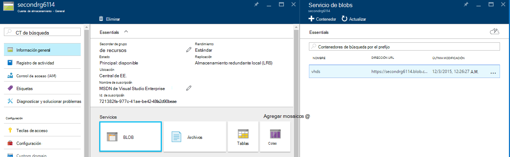
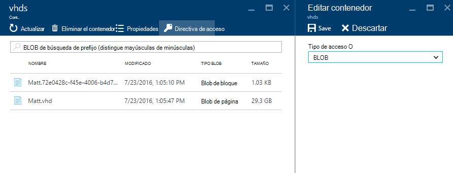
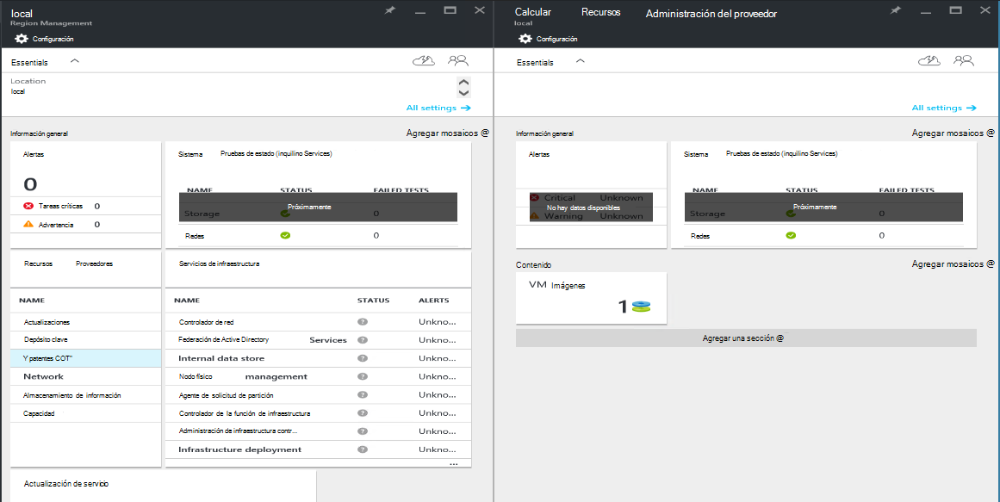
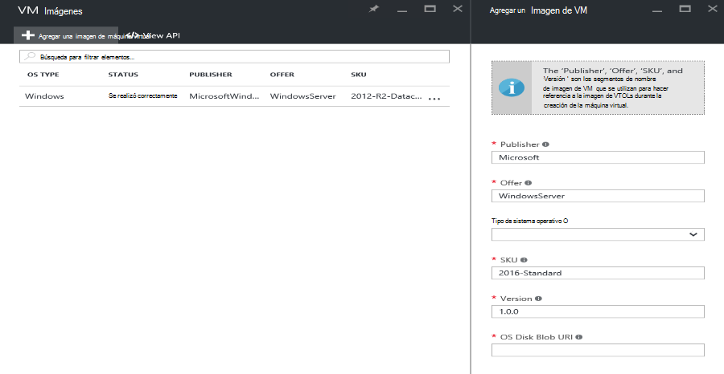

<properties
    pageTitle="Agregar una imagen de máquina virtual a la pila de Azure | Microsoft Azure"
    description="Agregar los imagen personalizada de Windows o Linux VM de su organización para los inquilinos usar"
    services="azure-stack"
    documentationCenter=""
    authors="mattmcg"
    manager="darmour"
    editor=""/>

<tags
    ms.service="azure-stack"
    ms.workload="na"
    ms.tgt_pltfrm="na"
    ms.devlang="na"
    ms.topic="get-started-article"
    ms.date="09/26/2016"
    ms.author="mattmcg"/>

# <a name="make-a-custom-virtual-machine-image-available-in-azure-stack"></a>Hacer que una imagen personalizada máquina virtual esté disponible en la pila de Azure


Pila de Azure permite a los administradores disponer de imágenes de máquina virtual, como de disco duro virtual personalizado de la organización, los inquilinos. Imágenes pueden hacer referencia a las plantillas de administrador de recursos de Azure o agregar a la interfaz de usuario de Azure Marketplace con la creación de un elemento del catálogo de soluciones. Una imagen de Windows Server 2012 R2 se incluye de forma predeterminada en la pila de Azure Technical Preview.

> [AZURE.NOTE] Imágenes de máquina virtual con los elementos del catálogo de soluciones se pueden implementar seleccionando **nuevo** en la interfaz de usuario y, a continuación, seleccione la categoría de **máquinas virtuales de Windows** . Se muestran los elementos de imagen de la máquina virtual.


## <a name="add-a-vm-image-to-marketplace-with-powershell"></a>Agregar una imagen de máquina virtual al catálogo de soluciones con PowerShell

Si la imagen de VM disco duro virtual está disponible localmente en la consola de VM (u otro dispositivo conectado externamente), realice los siguientes pasos:

1. Preparar una imagen de disco duro virtual de sistema operativo Windows o Linux en formato de disco duro virtual (no VHDX).
    -   Para las imágenes de Windows, el artículo [cargar una imagen de máquina virtual de Windows Azure para implementaciones del Administrador de recursos](virtual-machines-windows-upload-image.md) contiene instrucciones de preparación de imagen de la sección **Preparar el disco duro virtual de carga** .
    -   Para las imágenes de Linux, siga los pasos para preparar la imagen o usar una imagen de Azure pila Linux existente, como se describe en el artículo [máquinas virtuales de implementar Linux en pila de Azure](azure-stack-linux.md).

2. Clonar del [repositorio de herramientas de la pila de Azure](https://aka.ms/azurestackaddvmimage)y, a continuación, importar el módulo de **ComputeAdmin**

    ```powershell
    Import-Module .\ComputeAdmin\AzureStack.ComputeAdmin.psm1
    ```

3. Agregar la imagen de VM llamando el cmdlet Add-VMImage.
    -  Incluir el publisher, la oferta, la SKU y la versión para la imagen de la máquina virtual. Las plantillas de administrador de recursos de Azure que hacen referencia a la imagen de VM utilizan estos parámetros.
    -  Especificar osType como Windows o Linux.
    -  Incluir el identificador del inquilino de Azure Active Directory en el formulario * &lt;myaadtenant&gt;*. onmicrosoft.com.
    - A continuación se muestra una llamada de ejemplo de la secuencia de comandos:

    ```powershell
       Add-VMImage -publisher "Canonical" -offer "UbuntuServer" -sku "14.04.3-LTS" -version "1.0.0" -osType Linux -osDiskLocalPath 'C:\Users\AzureStackAdmin\Desktop\UbuntuServer.vhd' -tenantID <myaadtenant>.onmicrosoft.com
    ```

    > [AZURE.NOTE] El cmdlet solicita las credenciales para agregar la imagen de la máquina virtual. Proporcione el Administrador de credenciales de Azure Active Directory, como por ejemplo serviceadmin@ * &lt;myaadtenant&gt;*. onmicrosoft.com a la pregunta.  

El comando hace lo siguiente:
- Se autentica en el entorno de pila de Azure
- Cargas el disco duro virtual local a una cuenta de almacenamiento temporal recién creado
- Agrega la imagen de VM en el repositorio de la imagen VM
- Crea un elemento del catálogo de soluciones

Para comprobar que el comando se ejecutó correctamente, ir a Marketplace en el portal y, a continuación, compruebe que la imagen de VM está disponible en la categoría de **máquinas virtuales de Windows** .

> 

A continuación se muestra una descripción de los parámetros de comando.


| Parámetro | Descripción |
|----------| ------------ |
|**tenantID** | El identificador del inquilino de Azure Active Directory en el formulario * &lt;AADTenantID*. onmicrosoft.com&gt;. |
|**Publisher** | Publisher nombre segmento de la imagen de VM que inquilinos usar al implementar la imagen. Un ejemplo es 'Microsoft'. No incluya un espacio u otros caracteres especiales en este campo.|
|**oferta** | Oferta nombre segmento de la imagen de VM que inquilinos usar al implementar la imagen de la máquina virtual. Un ejemplo es 'Windows Server'. No incluya un espacio u otros caracteres especiales en este campo. |
| **SKU** | El segmento de nombre SKU de la imagen de VM que inquilinos usar al implementar la imagen de la máquina virtual. Un ejemplo es 'Datacenter2016'. No incluya un espacio u otros caracteres especiales en este campo. |
|**Versión** | La versión de la imagen de VM que inquilinos usar al implementar la imagen de la máquina virtual. Esta versión tiene el formato * \#.\#. \#*. Un ejemplo es '1.0.0'. No incluya un espacio u otros caracteres especiales en este campo.|
| **osType** | La osType de la imagen debe ser 'Windows' o 'Linux'. |
|**osDiskLocalPath** | Ruta de acceso local en el disco duro virtual que se está cargando como una imagen de máquina virtual a Azure pila de disco OS. |
|**dataDiskLocalPaths**| Matriz opcional de las rutas de acceso locales para los discos de datos que se pueden cargar como parte de la imagen de la máquina virtual.|
|**CreateGalleryItem**| Indicador booleano que determina si se crea un elemento en el catálogo de soluciones. El valor predeterminado se establece en true.|
|**título**| Nombre para mostrar del elemento del catálogo de soluciones. El valor predeterminado se establece como el Sku de la imagen de VM oferta de Publisher.|
|**Descripción**| Descripción del elemento de catálogo de soluciones. |
|**osDiskBlobURI**| Opcionalmente, esta secuencia de comandos también acepta un URI de almacenamiento de blobs para osDisk.|
|**dataDiskBlobURIs**| Opcionalmente, esta secuencia de comandos también acepta una matriz de almacenamiento de blobs de URI para agregar discos de datos a la imagen.|


## <a name="add-a-vm-image-through-the-portal"></a>Agregar una imagen de máquina virtual a través del portal

> [AZURE.NOTE] Este método requiere la creación del elemento del catálogo de soluciones por separado.

Un requisito de imágenes es que puede hacer referencia un URI de almacenamiento de blobs de Windows. Preparar una imagen de disco duro virtual de sistema operativo Windows o Linux en formato de disco duro virtual (no VHDX) y, a continuación, cargar la imagen a una cuenta de almacenamiento en Azure o en la pila de Azure. Si la imagen está cargada al almacenamiento de blobs de Azure o pila de Azure, puede omitir este paso.

Siga los pasos del artículo [cargar una imagen de máquina virtual de Windows Azure para implementaciones del Administrador de recursos](https://azure.microsoft.com/documentation/articles/virtual-machines-windows-upload-image/) a través del paso **cargar la imagen de VM a su cuenta de almacenamiento**. Tenga en cuenta lo siguiente:

-   Para obtener una imagen de Linux, siga las instrucciones para preparar la imagen o usar una imagen de Azure pila Linux existente como se describe en el artículo [máquinas virtuales de implementar Linux en pila de Azure](azure-stack-linux.md).

- Es más eficaz cargar una imagen con el almacenamiento de blobs de Windows Azure pila que con el almacenamiento de blobs de Windows Azure porque se tarda menos tiempo para insertar la imagen de VM en el repositorio de imágenes de la pila de Azure. Mientras siguiendo las instrucciones de carga, asegúrese de sustituir el paso de [PowerShell autenticar con Microsoft Azure pila](azure-stack-deploy-template-powershell.md) para el paso de 'Inicio de sesión en Azure'.

- Anote el almacenamiento de blobs de URI en la que cargar la imagen. Tiene el siguiente formato: * &lt;storageAccount&gt;/&lt;blobContainer&gt;/&lt;targetVHDName&gt;*.vhd

2.  Para hacer que el blob accesible de forma anónima, vaya al contenedor de blobs de cuenta de almacenamiento donde se ha cargado la imagen de VM disco duro virtual para **blobs** y, a continuación, seleccione **La directiva de acceso**. Si lo desea, puede generar una firma de acceso compartido para el contenedor e incluirlo como parte del objeto URI binario.





1.  Inicie sesión como administrador en pila de Azure. Vaya a **administración de región**. A continuación, en **RPs**, seleccione **Calcular el proveedor de recursos** > **VM imágenes** > **Agregar.**

    

2.  En el módulo siguiente, escriba la publisher, la oferta, la SKU y la versión de la imagen de VM. Estos segmentos de nombre hacen referencia a la imagen de VM en las plantillas de administrador de recursos de Azure. Asegúrese de seleccionar la **osType** correctamente. Para **osDiskBlobURI**, escriba el URI donde se ha cargado la imagen en el paso 1. Haga clic en **crear** para empezar a crear la imagen de la máquina virtual.

    

3.  El estado de la imagen de VM cambia a 'Correcto' cuando la imagen se agrega correctamente.

4.  Los inquilinos pueden implementar la imagen de VM especificando la publisher, la oferta, la SKU y la versión de la imagen de VM en una plantilla de administrador de recursos de Azure. Para hacer que la imagen de VM más disponible para su consumo inquilino en la interfaz de usuario, es mejor para [crear un elemento del catálogo de soluciones](azure-stack-create-and-publish-marketplace-item.md).
